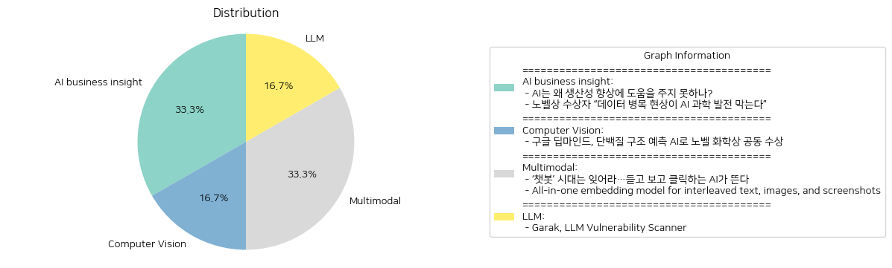

# Daily Artificial Intelligence Insights : News

## 🎈 AI business insight

**요약:**

1. **주요 주제**:
   두 기사 모두 인공지능(AI)에 대한 논의에서 생산성의 저하와 과학 발전에 있어 데이터의 중요성을 강조합니다. 공통적으로 AI 기술의 발전을 위해 해결해야 할 장애물로 데이터의 질과 관련된 문제를 지목하고 있습니다.

2. **주요 사건**:
   첫 번째 기사에서는 AI가 생산성을 향상시키지 못하는 원인으로 중대한 개선 사항이 필요하다고 언급합니다. 두 번째 기사에서는 데이터의 품질이 AI를 통한 과학적 발전의 걸림돌이 되고 있으며, 이로 인해 AI가 과학적 발견의 유용한 도구로 온전히 활용되지 못한다고 합니다.

3. **영향 분석**:
   - **경제**: 높은 생산성을 위해 AI의 잠재력을 최대한 활용하기 위해서는 최적화된 데이터 활용과 기술 개선이 필수적입니다. 이는 경제 전반에 걸쳐 생산성 증대에 기여할 수 있습니다.
   - **과학과 기술**: AI의 과학적 잠재력을 발현하기 위해 데이터 품질이 관건입니다. 이는 AI 연구 개발 속도를 증가시킬 수 있으며 더 나은 과학적 발견과 혁신을 촉진할 수 있습니다.
   - **사회**: AI를 통한 생산성 개선과 과학 발전은 사회 전반에 걸쳐 긍정적인 영향을 미칠 수 있지만, 이를 위해서는 데이터 관리 및 기술적 발전이 수반되어야 합니다.

4. **최종 요약**:
   결국, 인공지능의 생산성 향상과 과학적 발견을 최대로 활용하기 위해서는 데이터의 품질 향상과 몇 가지 기술적인 개선이 필요합니다. 미래에는 AI 기술의 발전을 위한 고품질 데이터 확보와 이를 지원하는 정책적 뒷받침이 중요해질 것입니다. 이러한 발전은 관련된 경제, 과학 기술 및 사회 전반에 긍정적인 영향을 미칠 수 있으며, 특히 데이터 관리와 인공지능 기술의 협업이 중요해질 것입니다. 데이터 인프라 강화와 AI 기술의 최적화가 중요한 과제로 다가올 것입니다.

**출처:**

 - AI는 왜 생산성 향상에 도움을 주지 못하나? (https://www.technologyreview.kr/ai%eb%8a%94-%ec%99%9c-%ec%83%9d%ec%82%b0%ec%84%b1-%ed%96%a5%ec%83%81%ec%97%90-%eb%8f%84%ec%9b%80%ec%9d%84-%ec%a3%bc%ec%a7%80-%eb%aa%bb%ed%95%98%eb%82%98/)
 - 노벨상 수상자 “데이터 병목 현상이 AI 과학 발전 막는다” (https://www.technologyreview.kr/%eb%85%b8%eb%b2%a8%ec%83%81-%ec%88%98%ec%83%81%ec%9e%90-%eb%8d%b0%ec%9d%b4%ed%84%b0-%eb%b3%91%eb%aa%a9-%ed%98%84%ec%83%81%ec%9d%b4-ai-%ea%b3%bc%ed%95%99-%eb%b0%9c%ec%a0%84-%eb%a7%89%eb%8a%94/)

## 🤩 Computer Vision

**요약:**

1. **주요 테마**:
   - AI와 과학의 융합: 구글 딥마인드의 AI를 통한 과학적 발견.
   - 노벨상: 노벨 화학상 수상으로 연구의 중요성 강조.
   - 생명과학: 단백질 구조 예측과 새로운 단백질 생성.

2. **주요 사건**:
   - 구글 딥마인드의 데미스 허사비스와 존 점퍼가 AI를 사용한 단백질 구조 예측으로 노벨 화학상을 공동 수상하였습니다. 이들은 분자 생물학에서 풀기 어려운 문제인 단백질 접힘을 예측하는 기술을 개발하였습니다.
   - 데이비드 베이커는 새로운 단백질을 창조해 이러한 연구의 다른 반쪽을 완성하며 노벨상을 공동으로 받았습니다.

3. **영향 분석**:
   - **경제**: AI 기술의 발전은 생명공학 산업에 큰 획기적인 기회를 제공하며, 제약 및 의료 산업에 막대한 파급 효과를 미칠 수 있습니다.
   - **사회**: 이러한 발견은 생명과학 연구에 대한 대중의 관심과 투자 증가를 유도할 가능성이 있으며, 질병 치료 및 생명 연장에 대한 희망을 제공할 수 있습니다.
   - **정치**: AI 기술의 적용 사례로서, 각국 정부는 AI 연구 및 생명과학에 대한 지원 및 규제를 재평가할 필요가 있습니다.

4. **최종 요약**:
   - 구글 딥마인드와 관련된 AI 기술의 발전은 노벨 화학상을 통해 그 중요성을 국제적으로 인정받았습니다. 이는 AI가 과학 연구에 미칠 수 있는 긍정적인 영향의 사례를 보여주며, 생명공학 및 의료 분야에서의 혁신을 기대하게 합니다. 앞으로 AI 기술과 생명과학의 융합이 어떻게 발전해 나갈지 주목해야 할 것입니다. 이러한 연구는 글로벌 건강 문제 해결에 큰 공헌을 할 가능성이 있고, 이에 따른 산업적 및 사회적 변화가 예상됩니다.

**출처:**

 - 구글 딥마인드, 단백질 구조 예측 AI로 노벨 화학상 공동 수상 (https://www.technologyreview.kr/%ea%b5%ac%ea%b8%80-%eb%94%a5%eb%a7%88%ec%9d%b8%eb%93%9c-%eb%8b%a8%eb%b0%b1%ec%a7%88-%ea%b5%ac%ec%a1%b0-%ec%98%88%ec%b8%a1-ai%eb%a1%9c-%eb%85%b8%eb%b2%a8-%ed%99%94%ed%95%99%ec%83%81-%ea%b3%b5%eb%8f%99/)

## ⭐ Multimodal

**요약:**

1. **주요 테마**:
   두 기사 모두 인공지능(AI)의 진화와 다중 모달(multimodal) 기술의 발전에 초점을 맞추고 있습니다. 특히, AI가 텍스트에서 음성 및 영상 처리로 발전하고 있으며, AI 모델이 텍스트와 이미지를 동시에 처리하여 정보 검색 정확성을 높이는 방향으로 나아가고 있다는 것이 공통적인 주제입니다.

2. **주요 사건**:
   - 첫 번째 기사에서는 "챗봇"으로 알려진 텍스트 기반 AI 시대가 지나가고, 음성과 영상 기능을 보유한 AI 시대가 새롭게 시작되었다고 강조하고 있습니다.
   - 두 번째 기사에서는 "Voyage-multimodal-3"라는 최첨단 다중 모달 임베딩 모델이 소개되었습니다. 이 모델은 텍스트와 이미지를 섞어서 벡터화해, 기존 모델에 비해 검색 정확도가 19.63% 향상되었습니다.

3. **영향 분석**:
   - **경제**: 새로운 AI 기술의 출현은 정보 검색과 데이터 처리의 효율성을 높여 산업 전반의 생산성을 향상시킬 수 있습니다. 특히, 업무 자동화 및 빅데이터 분석에 기여할 가능성이 큽니다.
   - **사회 및 문화**: 음성과 영상 기능을 갖춘 AI는 사용자 경험을 혁신적으로 변화시킬 수 있습니다. 교육, 미디어, 엔터테인먼트 분야에서 사용자 참여를 촉진할 것으로 예상됩니다.
   - **기술 발전**: AI의 가능성이 확장됨에 따라 다양한 분야에서 새로운 어플리케이션 개발이 기대됩니다. 특히, 멀티미디어 콘텐츠 처리 및 검색에 중요한 역할을 하게 될 것입니다.

4. **최종 요약**:
   최근 AI의 진화는 차원을 넘어 또 다른 형태의 인터페이스로 이동하고 있습니다. 음성과 영상 기능을 통합한 AI의 확장은 새로운 산업 기회를 창출할 것이며, 다중 모달 임베딩 모델의 발전은 데이터 처리의 새로운 기준을 세우고 있습니다. 이런 기술 발전을 통해 더 효과적이고 직관적인 사용자 경험 제공이 가능해질 것이며, 앞으로도 이러한 발전이 어떠한 사회적 및 경제적 변화를 가져올지 주목할 필요가 있습니다. 새로운 다중 모달 AI 응용 프로그램과 기술이 계속 등장할 것이므로, 이 분야의 발전을 지속적으로 주시할 필요가 있습니다.

**출처:**

 - ‘챗봇’ 시대는 잊어라…듣고 보고 클릭하는 AI가 뜬다 (https://www.technologyreview.kr/%ec%b1%97%eb%b4%87-%ec%8b%9c%eb%8c%80%eb%8a%94-%ec%9e%8a%ec%96%b4%eb%9d%bc-%eb%93%a3%ea%b3%a0-%eb%b3%b4%ea%b3%a0-%ed%81%b4%eb%a6%ad%ed%95%98%eb%8a%94-ai%ea%b0%80-%eb%9c%ac%eb%8b%a4/)
 - All-in-one embedding model for interleaved text, images, and screenshots (https://blog.voyageai.com/2024/11/12/voyage-multimodal-3/)

## ❄️ LLM

**요약:**

1. **주요 주제**:
   - 인공지능 언어 모델(LLM)의 취약점 및 보안 이슈
   - LLM의 오작동 및 안전성 문제 (환각, 데이터 유출, 독성 생성)
   - 보안 도구 개발 및 사용 (Garak 도구의 역할과 기능)

2. **주요 사건**:
   - Garak라는 도구는 언어 모델의 취약점을 식별하고 평가하는 데 사용되며, 주로 환각, 데이터 유출, 독성 생성과 같은 인공지능 모델의 잠재적 문제를 탐지합니다.
   - 이 도구는 특정 모델에 대해 검사 프로세스를 실행하며 진행 사항과 결과를 시각적으로 표시합니다. 그 과정에서 실패 원인을 표시하고 실패율을 제공하여 모델의 약점을 파악하도록 돕습니다.

3. **영향 분석**:
   - **경제적 영향**: 인공지능 기술의 발전은 기업과 연구소에 새로운 도구 사용의 필요성을 가져와 관련 산업의 성장을 촉진시킬 수 있습니다. 보안 소프트웨어의 개발과 사용이 증가하면서 관련 분야에 투자와 고용 기회가 확대될 수 있습니다.
   - **정치적 영향**: 정부와 규제 기관은 인공지능 기술의 발전에 따른 보안 문제에 대해 정책과 규제를 강화할 필요가 있습니다. Garak 같은 도구들은 이러한 규제 이행에 유용한 기준점이 될 수 있습니다.
   - **사회적 영향**: LLM의 부정확한 정보 제공 및 독성 생성 문제가 해결되지 않으면 사회 전반에 잘못된 정보가 퍼질 가능성이 있습니다. 따라서 Garak과 같은 도구를 통해 언어 모델의 신뢰성을 높이는 것이 필수적입니다.

4. **최종 요약**:
   - Garak 도구는 인공지능 언어 모델의 안정성과 신뢰성을 높이기 위한 중요한 수단으로 작용하고 있습니다. LLM의 취약점을 효과적으로 탐지하여 개발자들이 문제를 인식하고 개선할 수 있게 함으로써, 인공지능 기술의 발전과 신뢰성 향상을 도울 것으로 기대됩니다. 향후 이러한 보안 도구의 발전과 표준화가 진행되면서, 다양한 영역에서의 인공지능 활용이 더 안정적으로 이뤄질 가능성이 큽니다. 또한, 이에 따른 정책적 대응과 사회적 수용이 중요하게 작용할 전망입니다.

**출처:**

 - Garak, LLM Vulnerability Scanner (https://github.com/NVIDIA/garak)

