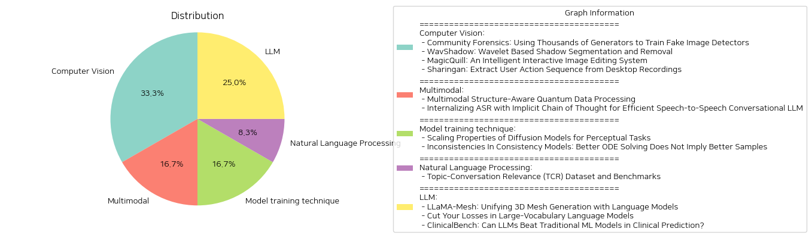

# Daily Artificial Intelligence Insights : Papers

## 💚 Computer Vision

**요약:**

보고서 요약:

1. 주요 주제와 테마:
   - 'Community Forensics'에서는 AI 생성 이미지 탐지의 도전과 데이터 다양성 증가를 통해 이를 개선하려는 시도를 논의합니다.
   - 'WavShadow'는 그림자 제거와 분할을 위한 새로운 방법론을 제시하며, MAE 선행 정보와 Haar 웨이블릿 특성을 도입하여 성능을 개선했습니다.
   - 'MagicQuill'은 사용자가 직관적으로 이미지를 편집할 수 있는 시스템에 대해 설명하며, 멀티모달 대형 언어 모델(MLLM)을 활용하여 편집 의도를 실시간으로 예측합니다.
   - 'Sharingan'은 데스크탑 녹화 비디오에서 사용자 행동을 추출하는 방법을 탐구합니다. VLM을 사용하여 새로운 방법과 벤치마크를 제안합니다.

2. 공통 키워드와 트렌드:
   - AI 및 기계 학습 기술의 활용: 모든 논문에서 AI 기술이 핵심적으로 적용되었습니다.
   - 데이터 다양성 및 훈련 세트의 중요성: 특히 'Community Forensics'와 'WavShadow'에서 강조되었습니다.
   - 컴퓨터 비전 기법과 Multimodal 기술의 결합: 'MagicQuill'과 'Sharingan'에서 중요한 요소로 나타났습니다.

3. 주요 사건 및 정보 요약:
   - 'Community Forensics'는 새로운 데이터세트를 구축하여 다양한 생성 모델로부터 이미지를 수집하고, 이러한 데이터를 통해 가짜 이미지 탐지를 연구합니다.
   - 'WavShadow'는 그림자 제거와 분할의 효율성을 높이는 새로운 기술을 제안하며, DESOBA 데이터셋에서의 성능을 검증했습니다.
   - 'MagicQuill'은 사용자의 창의성을 빠르게 실현할 수 있는 편집 시스템을 소개하며, 실험적으로 높은 품질의 이미지를 편집할 수 있는 능력을 입증했습니다.
   - 'Sharingan'은 VLM을 처음으로 사용자 행동 추출에 활용하여 정확도 70~80%의 결과를 기록했습니다.

4. 이러한 사건이 여러 분야에 미친 영향:
   - AI와 데이터 과학 분야의 발전 및 이미지 및 비디오 분석 분야에서의 실질적 개선이 기대됩니다.
   - 사용자 인터페이스 설계 및 자동화 분야에서도 혁신적인 기술 적용의 가능성을 제공하고 있습니다.

5. 결론 및 향후 발전 방향:
   - AI 기법과 데이터 다양성의 조화는 이미지 및 비디오 분석에서 지속적인 발전을 이끌 것입니다.
   - 사용자 친화적인 편집 시스템 및 행동 추출 기술은 다양한 상업적 및 연구적 응용 분야에서 가치가 있을 것으로 예상됩니다.
   - 향후 연구에서는 더욱 정교한 AI 모델과 더욱 다양한 데이터셋을 활용하여 기술의 정밀성을 높이는 방향으로 발전할 가능성이 큽니다.

**출처:**

 - Community Forensics: Using Thousands of Generators to Train Fake Image Detectors (https://deeplearn.org/arxiv/546034/community-forensics:-using-thousands-of-generators-to-train-fake-image-detectors)
 - WavShadow: Wavelet Based Shadow Segmentation and Removal (https://deeplearn.org/arxiv/546999/wavshadow:-wavelet-based-shadow-segmentation-and-removal)
 - MagicQuill: An Intelligent Interactive Image Editing System (http://arxiv.org/abs/2411.09703v1)
 - Sharingan: Extract User Action Sequence from Desktop Recordings (http://arxiv.org/abs/2411.08768v1)

## 🌞 Multimodal

**요약:**

제목: 'Multimodal Structure-Aware Quantum Data Processing' 및 'Internalizing ASR with Implicit Chain of Thought for Efficient Speech-to-Speech Conversational LLM'

요약 보고서:

1. 주요 주제 및 테마 추출:
   - 자연어 처리(NLP) 분야에서 대형 언어 모델(LLM) 발전
   - "블랙 박스" 특성의 이해 및 설명 가능성 문제
   - 양자 컴퓨팅의 활용을 통한 구조화된 접근 방식 제안
   - 멀티모달 데이터 처리 프레임워크(MultiQ-NLP) 개발
   - 다국어 텍스트 및 이미지 데이터에서 구조 인식 처리
   - 음성 기반 LLM의 효율적인 대화 능력 강화

2. 공통 키워드, 트렌드 및 패턴 식별:
   - 음성 인식(ASR) 및 텍스트 변환(TTS) 체인
   - 양자 컴퓨터를 통한 데이터 처리
   - 새로운 아키텍처 및 타입 호모모르피즘 개발
   - 음성 기반 LLM의 지연 감소 및 음성 이해 능력 개선
   - 대규모 합성 대화 데이터 세트 배포

3. 각 논문에서의 주요 사건 및 중요한 정보 요약:
   - MultiQ-NLP 연구는 고차원 텐서를 이용해 언어적 관계를 모델링하며, 이를 변형 양자 회로로 번역하여 훈련
   - ASR 및 TTS 체인을 내재화한 방법을 통해 음성-음성 대화의 지연을 줄이고, 음성 이해능력을 향상

4. 이러한 사건이 다양한 분야에 미치는 영향 분석:
   - NLP 및 AI 분야에서 양자 컴퓨팅의 역할 증대
   - 음성 인식 분야에서 자연스럽고 실시간 상호작용 가능성 증가
   - 멀티모달 데이터 처리의 효율성 향상
   - 차세대 대화형 AI 시스템 개발 촉진

5. 종합 결론 및 잠재적 미래 발전:
   - 양자 컴퓨팅과 LLM의 융합은 NLP와 음성 대화 시스템에 새로운 길을 제시하고 있음
   - 더 효율적이고 자연스러운 상호작용을 지원하는 기술로서의 가능성
   - 다가오는 AI 응용 프로그램에서 멀티모달 데이터 처리의 중요성 증가 예상
   - 연구 및 개발 투자의 촉발로 인한 장기적 혁신 가능성 있음

이러한 연구들은 향후 NLP 및 음성 처리에서 미래의 발전과 발전 방향을 제시하며, 양자 컴퓨팅 및 AI의 향후 발전을 위한 중요한 이정표가 될 것으로 기대됩니다.

**출처:**

 - Multimodal Structure-Aware Quantum Data Processing (https://deeplearn.org/arxiv/547000/multimodal-structure-aware-quantum-data-processing)
 - Internalizing ASR with Implicit Chain of Thought for Efficient Speech-to-Speech Conversational LLM (https://deeplearn.org/arxiv/544674/internalizing-asr-with-implicit-chain-of-thought-for-efficient-speech-to-speech-conversational-llm)

## 🍋 Model training technique

**요약:**

**요약 보고서: 좁혀지는 확산 모델의 효율성 및 일관성의 도전**

1. **주요 주제 및 테마 추출:**
   - 확산 모델의 확장성 및 그 적용 범위
   - 일관성 모델(CMs)의 오류 및 샘플 품질
   - 시각적 인식 과업을 위한 모델의 최적화

2. **공통 키워드, 경향 및 패턴:**
   - 확산 모델의 계산 절차
   - 샘플 생성의 질적 향상
   - 오차 최소화를 통한 성능 개선

3. **각 논문의 주요 사건 및 중요한 정보 요약:**
   - 'Scaling Properties of Diffusion Models for Perceptual Tasks':
     확산 모델은 단순한 생성 작업을 넘어서 깊이 추정, 광학 흐름, 무모달 세분화 등의 시각적 인식 작업에서도 강력한 성과를 보입니다. 이 논문에서는 이러한 작업을 이미지-이미지 번역이라는 틀 안에서 통합하고, 효율적인 훈련 및 추론 방법을 제시하며 적은 데이터와 더 적은 계산으로 경쟁력 있는 성과를 이루었습니다.
   
   - 'Inconsistencies In Consistency Models: Better ODE Solving Does Not Imply Better Samples':
     일관성 모델(CM)이 낮은 계산 비용으로 고품질 샘플을 생성하려는 시도를 탐구하며, 오차를 직접 줄이는 Direct CMs이 일반 CMs보다 낮은 품질의 샘플을 초래한다는 점을 발견합니다. 이 연구는 CMs이 왜 효과적인지에 대한 새로운 질문을 제기합니다.

4. **이 사건들이 다양한 분야에 미친 영향 분석:**
   - 시각적 인식 기술의 발전: 확산 모델은 다양한 시각적 인식 과제에 적용되면서, 기존의 방법보다 적은 자원으로도 높은 성과를 보입니다.
   - 컴퓨터 비전 및 인공지능 분야: Direct CMs 연구는 ODE 해결 과정에 의문을 제기하면서, 모델의 혼합된 성과를 이해하는 데 중요한 기여를 할 수 있습니다.
   - 계산 및 자원 효율성: 적은 데이터와 계산 능력으로 성과를 내기 위한 모델링 접근 방식이 강조됩니다.

5. **최종 통합 요약 및 잠재적인 미래 개발:**
   이 보고서는 확산 모델을 시각적 인식 작업에 효과적으로 확장함으로써 컴퓨터 비전 개선의 가능성을 제시합니다. 동시에, 일관성 모델의 솔루션은 샘플링의 질적 영향을 고려하면서 더 나은 ODE 해결을 위한 연구 필요성을 제안합니다. 향후 이러한 연구는 더욱 최적화된 모델을 개발하고, 계산 효율성을 높이며, 더 정확한 샘플을 생성하는 방향으로 발전할 것으로 기대됩니다.

**출처:**

 - Scaling Properties of Diffusion Models for Perceptual Tasks (https://deeplearn.org/arxiv/548172/scaling-properties-of-diffusion-models-for-perceptual-tasks)
 - Inconsistencies In Consistency Models: Better ODE Solving Does Not Imply Better Samples (http://arxiv.org/abs/2411.08954v1)

## ✈️ Natural Language Processing

**요약:**

제목: '주제-대화 관련성(TCR) 데이터세트와 벤치마크'

1. 주요 주제 및 테마 추출:
   - 주제 관련성
   - 대화의 효율성
   - 조직 협업
   - 데이터세트 생성과 벤치마크

2. 공통 키워드, 트렌드, 패턴:
   - 비효율적인 회의 문제 해결
   - 다양한 도메인과 회의 스타일 포괄
   - 음성 중단 회의(SIM) 데이터 사용
   - 텍스트와 스크립트를 통한 데이터 다양성 향상

3. 주요 사건 및 핵심 정보 요약:
   - TCR 데이터세트는 총 1,500개의 고유 회의, 2,200만개의 단어를 포함한 필기록, 15,000개의 회의 주제를 담고 있다.
   - 데이터는 신규 수집된 SIM 데이터와 기존 공공 데이터세트에서 수집되었다.
   - 다양한 소스에서 벤치마크가 생성되어 GPT-4를 활용하여 필기록-주제 관련성 이해 정확도를 평가한다.

4. 이러한 사건이 다양한 분야에 미치는 영향 분석:
   - 조직 회의의 비효율성 문제를 데이터 기반으로 분석 가능
   - 회의 관련 데이터를 통해 다양한 협업 도구와 솔루션 개발 가능성 향상
   - 인공지능을 활용한 회의 내용 분석 및 효율성 향상 방안 제공

5. 최종 통합 요약 및 결론:
   TCR 데이터세트와 관련 벤치마크는 회의의 주제 관련성을 이해하고 평가하는 데 중점을 둔다. 이 데이터세트는 다양한 회의 스타일과 도메인을 포괄하여 조직 회의의 비효율성을 감소시키는 데 기여할 수 있다. 앞으로 회의 데이터 분석을 통해 새로운 협업 도구와 인공지능 활용 방안이 제시될 것으로 예상된다. 이러한 발전은 조직의 생산성을 높이고 협업의 질을 향상시키는 데 기여할 것이다.

**출처:**

 - Topic-Conversation Relevance (TCR) Dataset and Benchmarks (https://deeplearn.org/arxiv/544745/topic-conversation-relevance-(tcr)-dataset-and-benchmarks)

## 🎉 LLM

**요약:**

**종합 요약 보고서**

1. **주요 주제 및 테마 추출**
   - 첫 번째 논문에서는 대형 언어 모델(LLM)과 3D 매쉬 생성의 통합(유니파잉)에 관한 연구를 다루고 있습니다. LLM을 통해 텍스트 기반으로 3D 매쉬를 생성하고 이해할 수 있는 방법론을 제안합니다.
   - 두 번째 논문은 대형 어휘 언어 모델의 교차 엔트로피 손실 계산을 효율적으로 수행하여 메모리 사용량을 크게 줄이는 새로운 방법(Cut Cross-Entropy, CCE)을 제시합니다.
   - 세 번째 논문은 임상 예측에서 대형 언어 모델(LLMs)이 전통적인 기계 학습 모델(SVM, XGBoost 등)보다 나은 성과를 낼 수 있는지를 탐구하는 ClinicalBench 벤치마크를 소개합니다.

2. **공통 키워드 및 경향**
   - 세 논문 모두 대형 언어 모델(LLMs)과 관련된 연구이며, LLMs의 적용 및 최적화와 관련된 다양한 방법론을 제안하고 있습니다. 
   - 메모리 효율성 향상(특히 고용량 데이터 핸들링)과 성능 비교, 실용성 검증과 같은 주제가 공통적으로 나타납니다.

3. **주요 사건 및 중요 정보**
   - 'LLaMA-Mesh' 논문에서는 LLM이 3D 매쉬를 텍스트 기반으로 생성하고 이해할 수 있는 첫 번째 사례를 제시하며, 이를 통해 3D와 텍스트 모달리티를 통합합니다.
   - 'Cut Your Losses in Large-Vocabulary Language Models' 논문에서는 새로운 CCE 방법을 통해 메모리 사용량을 극적으로 줄이며, 특히 Gemma 2 모델의 경우 메모리 사용량을 28GB에서 1GB로 줄였습니다.
   - 'ClinicalBench' 논문에서는 LLM들이 임상 예측에서 현재의 전통적 모델보다 나은 성과를 보이지 못한다는 결론을 내리며 이러한 모델의 임상적 적용에 주의가 필요함을 강조합니다.

4. **이벤트의 부문별 영향 분석**
   - 3D 그래픽스: LLM을 통해 3D 매시 데이터의 텍스트 표현 및 이해를 가능하게 하여 새로운 차원의 3D 콘텐츠 제작 가능성을 제시합니다.
   - 컴퓨팅 & 데이터 처리: CCE 방법을 통해 고용량 언어 모델의 메모리 사용을 극적으로 줄여 데이터 처리의 효율성을 크게 향상할 수 있습니다.
   - 의료 & 임상 데이터 분석: LLM과 전통적 모델 간의 성능 비교 연구를 통해 LLM의 임상 도입 시의 장단점과 고려사항을 제시하고 실용적 활용 방안을 모색합니다.

5. **종합 결론 및 향후 개발 전망**
   - LLM의 다양한 응용 가능성은 무궁무진하나, 실제 적용 시에는 각 도메인 특성을 고려한 전략이 필요합니다.
   - 향후 연구는 LLM을 활용한 도메인 특화 솔루션 개발 및 실사용 검증을 중심으로 진행될 가능성이 있습니다.
   - CCE와 같은 메모리 효율화 기술은 고용량 데이터 처리 분야에서 핵심 기술로 자리잡을 전망입니다. 
   - 의료 분야에서는 LLM의 성능 향상뿐 아니라 임상적 필요 및 실용성이라는 다면적 접근이 요구됩니다.

**출처:**

 - LLaMA-Mesh: Unifying 3D Mesh Generation with Language Models (http://arxiv.org/abs/2411.09595v1)
 - Cut Your Losses in Large-Vocabulary Language Models (http://arxiv.org/abs/2411.09009v1)
 - ClinicalBench: Can LLMs Beat Traditional ML Models in Clinical Prediction? (http://arxiv.org/abs/2411.06469v1)

