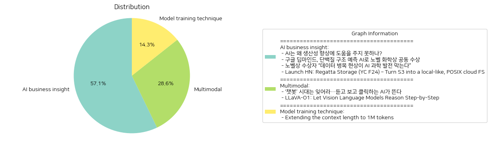

# Daily Artificial Intelligence Insights : News

## 🪐 AI business insight

**요약:**

**주요 주제**:
각 뉴스 기사에서 반복되는 주제는 인공지능(AI) 관련 기술의 발전과 활용입니다. AI의 생산성 향상에의 기여, 노벨 화학상에서의 AI 응용, 그리고 데이터 품질의 중요성이 특히 두드러집니다. 또한, 클라우드 파일 시스템의 효율성 개선도 중요한 주제로 다뤄졌습니다.

**주요 이벤트**:
1. **AI와 생산성**: AI가 경제 발전의 중요한 기술로 기대되면서도, 아직 생산성 면에서의 유의미한 성과에 도달하지 못하고 있으며, 이는 몇 가지 개선이 필요함을 시사합니다.
2. **구글 딥마인드의 성과**: 구글 딥마인드의 데미스 허사비스와 존 점퍼가 AI를 활용한 단백질 구조 예측으로 노벨 화학상을 공동 수상하였습니다. 데이비드 베이커는 새로운 단백질을 만듦으로써 절반의 상을 수상했습니다.
3. **데이터의 중요성**: 노벨상 수상자가 AI 발전에 있어 데이터의 품질이 중요하다고 강조하며, 데이터 병목 현상이 과학적 발전을 저해할 수 있음을 경고했습니다.
4. **Regatta Storage의 혁신**: Regatta Storage는 기존 클라우드 파일 시스템을 더욱 효율적으로 바꾸어주는 솔루션을 소개했습니다. 이는 용량의 무제한, 지역 파일 시스템과 같은 성능, 자동 S3 동기화를 제공합니다.

**영향 분석**:
- **경제적 영향**: AI 기술이 여전히 생산성에 직접 기여하기 위해서는 개선이 필요하지만, 구글 딥마인드의 성과는 과학기술 분야에서 AI의 잠재력을 증명했습니다. 클라우드 저장소의 혁신은 기업의 비용 절감을 지원하며 경제 전반의 효율성을 높일 수 있습니다.
- **사회적 영향**: AI 기술의 발달과 상업적 응용은 사회의 기술 수준을 상향시키고, 과학 분야에서의 새로운 발견을 통해 삶의 질 향상에 기여할 수 있습니다.
- **정치적/법적 영향**: AI와 데이터를 둘러싼 윤리적 및 법적 문제는 지속적인 논의가 필요할 것입니다.

**최종 요약**:
최근 뉴스는 AI가 여러 분야에서 커다란 변화를 이끌고 있는 상황을 묘사하고 있으며, 특히 과학 분야에서의 성공이 두드러집니다. 효율성과 생산성 향상을 위한 AI 기술의 발전은 향후 연구와 투자를 필요로 하며, 데이터 품질의 중요성은 더욱 강조될 것으로 보입니다. 클라우드 파일 시스템의 혁신은 비용 절감과 효율성 개선 측면에서 기업들에게 실질적인 기여를 할 가능성이 큽니다. AI 산업의 지속적인 진화와 발전은 경제, 사회 여러 분야에 걸쳐 상당한 영향을 미칠 것이며, 이에 따른 규제 및 윤리적 이슈는 지속적으로 논의되어야 합니다. 앞으로 AI와 데이터 기술 발전을 주의 깊게 모니터링해야 할 것입니다.

**출처:**

 - AI는 왜 생산성 향상에 도움을 주지 못하나? (https://www.technologyreview.kr/ai%eb%8a%94-%ec%99%9c-%ec%83%9d%ec%82%b0%ec%84%b1-%ed%96%a5%ec%83%81%ec%97%90-%eb%8f%84%ec%9b%80%ec%9d%84-%ec%a3%bc%ec%a7%80-%eb%aa%bb%ed%95%98%eb%82%98/)
 - 구글 딥마인드, 단백질 구조 예측 AI로 노벨 화학상 공동 수상 (https://www.technologyreview.kr/%ea%b5%ac%ea%b8%80-%eb%94%a5%eb%a7%88%ec%9d%b8%eb%93%9c-%eb%8b%a8%eb%b0%b1%ec%a7%88-%ea%b5%ac%ec%a1%b0-%ec%98%88%ec%b8%a1-ai%eb%a1%9c-%eb%85%b8%eb%b2%a8-%ed%99%94%ed%95%99%ec%83%81-%ea%b3%b5%eb%8f%99/)
 - 노벨상 수상자 “데이터 병목 현상이 AI 과학 발전 막는다” (https://www.technologyreview.kr/%eb%85%b8%eb%b2%a8%ec%83%81-%ec%88%98%ec%83%81%ec%9e%90-%eb%8d%b0%ec%9d%b4%ed%84%b0-%eb%b3%91%eb%aa%a9-%ed%98%84%ec%83%81%ec%9d%b4-ai-%ea%b3%bc%ed%95%99-%eb%b0%9c%ec%a0%84-%eb%a7%89%eb%8a%94/)
 - Launch HN: Regatta Storage (YC F24) – Turn S3 into a local-like, POSIX cloud FS (https://news.ycombinator.com/item?id=42174204)

## 🪐 Multimodal

**요약:**

1. **주요 테마**:
   두 기사 모두 인공지능(AI) 분야의 혁신과 발전을 다루고 있습니다. 첫 번째 기사는 텍스트 기반 AI 챗봇에서 음성 및 영상 생성 기능을 갖춘 AI로의 변화에 중점을 두고 있으며, 두 번째 기사는 시각-언어 모델을 통한 단계적 추론의 향상을 설명합니다. 공통적으로 AI 기술의 진화와 새로운 기능이 강조되고 있습니다.

2. **주요 사건**:
   - 첫 번째 기사: 텍스트 기반 AI 챗봇의 시대가 저물고, 음성과 영상 생성 기능을 갖춘 더욱 발전된 AI 시대로의 전환이 이루어지고 있습니다.
   - 두 번째 기사: 연구자들이 LLaVA-o1이라는 새로운 시각-언어 모델을 소개했습니다. 이는 자율적인 다단계 추론을 가능하게 하며, 간단한 추론 시간 확장 방법으로 다중 모드 추론 벤치마크에서 뛰어난 성능을 보입니다.

3. **영향 분석**:
   - 경제: AI 기술의 발전은 다양한 산업에 걸쳐 혁신을 촉진할 수 있으며, 생산성 향상 및 새로운 비즈니스 모델 창출에 기여할 가능성이 있습니다.
   - 사회: AI의 기존 챗봇 기능이 증대됨에 따라 사람들은 더 직관적이고 몰입감 있는 상호작용을 경험할 수 있습니다. 또한, AI 기술이 일상생활에 더욱 깊숙이 침투하면서 이에 대한 사회적 인식과 규범이 변화할 수 있습니다.

4. **최종 요약**:
   최근 AI 기술은 텍스트를 넘어 음성 및 영상 생성과 같은 고급 기능을 통해 진화하고 있습니다. 이러한 변화는 AI의 사용자 경험을 한층 향상시키고자 하는 노력의 일환으로 보이며, 새로운 시각-언어 모델과 같은 기술 발전은 자율적이고 다단계의 추론 능력을 극대화하고 있습니다. 앞으로의 AI 발전은 다양한 산업 및 사회 전반에 큰 영향을 미칠 것이며, 이러한 기술을 활용한 새로운 응용 분야와 윤리적 과제들에 주목할 필요가 있습니다. AI가 점점 더 많은 정보를 처리하고 더 복잡한 결정을 내리게 됨에 따라, 그 효과와 이용 사례는 더욱 다양해질 것입니다.

**출처:**

 - ‘챗봇’ 시대는 잊어라…듣고 보고 클릭하는 AI가 뜬다 (https://www.technologyreview.kr/%ec%b1%97%eb%b4%87-%ec%8b%9c%eb%8c%80%eb%8a%94-%ec%9e%8a%ec%96%b4%eb%9d%bc-%eb%93%a3%ea%b3%a0-%eb%b3%b4%ea%b3%a0-%ed%81%b4%eb%a6%ad%ed%95%98%eb%8a%94-ai%ea%b0%80-%eb%9c%ac%eb%8b%a4/)
 - LLaVA-O1: Let Vision Language Models Reason Step-by-Step (https://arxiv.org/abs/2411.10440)

## 🍊 Model training technique

**요약:**

### 종합 보고서

1. **주요 테마**:
   - 인공지능 기술의 발전: Qwen2.5-Turbo 모델의 출시와 같은 인공지능 기술의 향상 및 발전은 꾸준히 주목받는 주제입니다. 이번 출시에서 특히 강조되는 것은 대화 모델의 문맥 길이를 백만 토큰으로 확장한 점과 모델의 추론 속도가 빨라진 점입니다.
   - 인공지능의 성능 지표: Passkey Retrieval에서 100% 정확도를 달성하고, RULER 벤치마크에서 GPT-4를 능가하는 성과가 인공지능의 성능과 효율성을 평가하는 새로운 기준으로 자리잡고 있습니다.

2. **주요 사건**:
   - Qwen2.5-Turbo의 출시: 이 모델은 문맥 지원이 1M 토큰으로 확장되고 추론 속도가 향상되어 성능면에서 큰 업그레이드를 이루었습니다.
   - 성능 비교: Qwen2.5-Turbo는 Passkey Retrieval에서 100% 정확도를 달성했으며, GPT-4보다 RULER 벤치마크에서 더 나은 결과를 보였습니다.

3. **영향 분석**:
   - 경제적 영향: 이러한 인공지능 기술의 발전은 관련 산업 전반에 걸쳐 효율성을 높이고, 기업의 데이터 처리 및 분석 능력을 강화시켜 줄 것입니다. 이는 향후 인공지능 기반 서비스와 제품 개발에 긍정적인 영향을 미칠 것으로 예상됩니다.
   - 사회적 영향: 인공지능 모델의 정확성과 속도가 강화되면서, 다양한 분야에서 인공지능 활용이 가속화될 것입니다. 이는 사람들의 생활 방식에 변화와 함께 일부 직업의 자동화를 촉진할 가능성이 있습니다.
   - 기술적 영향: 새로운 기술의 등장으로 인해 연구와 개발의 방향성이 변화할 수 있으며, 경쟁력 있는 인공지능 솔루션 개발을 위한 기술 혁신이 가속화될 것입니다.

4. **최종 요약**:
   Qwen2.5-Turbo의 출시는 인공지능 기술의 또 다른 획기적인 발전을 의미합니다. 문맥 길이의 확장과 모델 성능의 향상을 통해 인공지능의 유용성이 더욱 강화될 것으로 기대됩니다. 이는 경제적, 사회적, 기술적 측면에서 많은 변화를 가져올 수 있습니다. 특히, 더욱 강력한 인공지능 솔루션으로서 다양한 산업 분야에서 채택이 가속화될 것입니다. 향후, 이러한 기술이 실생활의 개선을 넘어 윤리적, 규제적 이슈까지 어떻게 해결해 나갈지 지켜볼 필요가 있습니다.

**출처:**

 - Extending the context length to 1M tokens (https://qwenlm.github.io/blog/qwen2.5-turbo/)

