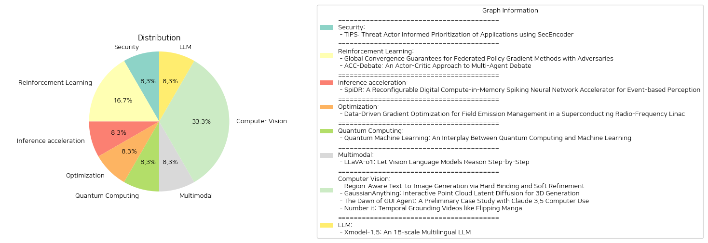

# Daily Artificial Intelligence Insights : Papers

## 🌞 Security

**요약:**

제목: '응용 프로그램의 위협 행위자 정보 기반 우선 순위화: SecEncoder를 활용한 TIPS'

이 논문은 'TIPS: SecEncoder를 활용한 위협 행위자 정보 기반 응용 프로그램 우선 순위화'를 소개합니다. 이는 보안 분야를 위한 특화된 언어 모델을 활용한 연구로, TIPS는 인코더와 디코더 언어 모델의 장점을 결합하여 손상된 응용 프로그램을 감지하고 우선 순위를 매길 수 있습니다. 특히, 위협 행위자 인텔리전스를 통합함으로써 TIPS는 감지의 정확성과 관련성을 크게 향상시킵니다. 실제 세계의 벤치마크 데이터셋으로 수행된 광범위한 실험에서는 TIPS가 악의적인 응용 프로그램을 식별하는 데 있어 F-1 점수 0.90을 달성하는 높은 효율성을 보여주었습니다. 더불어, 실제 시나리오에서 TIPS는 보안 분석가들의 조사 백로그를 87%로 대폭 감소시켜 위협 대응 프로세스를 간소화하고 전반적인 보안 태세를 개선합니다.

핵심 주제:
- 위협 행위자 정보 기반 응용 프로그램 우선 순위화
- 보안 언어 모델인 SecEncoder의 활용
- 위협 행위자 인텔리전스 통합을 통한 탐지 향상

트렌드 및 패턴:
- 인코더와 디코더 모델의 결합을 통한 보안 감지 강화
- 악의적인 응용 프로그램 식별의 높은 효율성
- 보안 분석가의 업무 간소화 및 보안 프로세스 개선

주요 사건 및 정보:
- TIPS는 F-1 점수 0.90을 기록하며 높은 탐지 효율성을 자랑
- 조사 백로그를 87% 감소시켜 보안 대응 신속화

영향 분석:
- 보안 분석가의 업무 효율성 증대
- 보안 판단과 대응 프로세스의 구조화 및 속도 향상
- 전반적인 보안 태세 강화

최종 요약 및 결론:
TIPS는 SecEncoder를 활용하여 위협 인텔리전스를 통합한 고도화된 보안 모델로서, 특히 응용 프로그램의 위협 행위자 기반 우선 순위화에 탁월한 성능을 보입니다. 이 연구는 실질적으로 보안 분석가의 업무 효율성을 높이며, 보안 대응 과정을 크게 간소화할 수 있는 가능성을 제시합니다. 앞으로 위협 행위자 정보의 활용 범위가 더욱 확장되고, 이러한 기술이 다양한 보안 영역으로 확대 적용될 가능성이 큽니다.

**출처:**

 - TIPS: Threat Actor Informed Prioritization of Applications using SecEncoder (https://deeplearn.org/arxiv/548075/tips:-threat-actor-informed-prioritization-of-applications-using-secencoder)

## ✈️ Reinforcement Learning

**요약:**

보고서 요약:

1. 주요 주제 및 테마 추출:
   - '연합 강화 학습'(Federated Reinforcement Learning, FRL)과 '정책 경사법'(Policy Gradient) 방법의 사용.
   - '멀티 에이전트 시스템'(Multi-Agent Systems) 및 '멀티 에이전트 토론'(Multi-Agent Debate, MAD).
   - '대규모 언어 모델'(Large Language Models, LLMs)의 성능 최적화와 그 애플리케이션.

2. 공통 키워드 및 트렌드:
   - 업데이트된 학습 알고리즘이 다양한 영역 및 모델에 미치는 영향.
   - '적대적 에이전트'(Adversarial Agents)에 대한 내성 및 회복력 강화.
   - 협업 훈련 및 성능 강화 기술의 부각.

3. 주요 이벤트 및 중요 정보 요약:
   - 첫 번째 논문은 적대적 에이전트의 존재에도 불구하고 연합 강화 학습(FRL)에서 글로벌 수렴 보장을 제시하는 새로운 정책 경사법 접근 방식을 소개했습니다. 이 방법은 일반적인 매개변수 설정 아래 최적의 샘플 복잡성을 달성함으로써 적대적 공격에 대한 회복력을 강조합니다.
   - 두 번째 논문은 멀티 에이전트 토론(MAD)에서 개선된 모델 효율성을 위한 ACC-Debate라는 새로운 배우-비평가(Actor-Critic) 학습 프레임워크를 제안합니다. 이 접근법은 기존의 토론 기법을 능가하며 협업 훈련의 중요성을 강조하고 있습니다.

4. 이러한 이벤트의 다양한 부문에 미치는 영향 분석:
   - 연합 강화 학습의 글로벌 수렴 보장은 분산된 환경에서 의사결정 시스템의 신뢰성을 강화할 수 있습니다.
   - ACC-Debate와 같은 새롭고 특화된 토론 기술은 자연어 처리(NLP) 및 커뮤니케이션 기반 애플리케이션의 발전에 기여할 수 있습니다.

5. 종합 요약 및 결론:
   - 두 논문 모두 멀티 에이전트 시스템 및 협업의 중요성을 강조하며, 각각이 강력한 성능 향상 및 적대적 환경에서의 내성을 제공합니다.
   - 향후 연구에서는 적대적 환경에서도 더 나은 협업 모델을 교육하는 기술 개발 및 자연어 처리에서의 응용 확대에 중점을 둬 발전 가능성을 탐색할 가치가 있습니다.

**출처:**

 - Global Convergence Guarantees for Federated Policy Gradient Methods with Adversaries (https://deeplearn.org/arxiv/545735/global-convergence-guarantees-for-federated-policy-gradient-methods-with-adversaries)
 - ACC-Debate: An Actor-Critic Approach to Multi-Agent Debate (https://deeplearn.org/arxiv/544490/acc-debate:-an-actor-critic-approach-to-multi-agent-debate)

## 🍊 Inference acceleration

**요약:**

**종합 요약 보고서**

1. **주요 주제 및 테마 추출:**
   - 스파이킹 뉴런 네트워크(SNN) 및 이벤트 기반 인식
   - 디지털 컴퓨트 인 메모리(CIM) 가속기
   - 동적 비전 센서(DVS) 데이터 처리
   - 재구성 가능성, 다중 비트 정밀도, 희소 최적화

2. **공통 키워드, 트렌드 및 패턴 식별:**
   - 비동기적인 시간적 데이터 처리
   - 메모리 내 연산과 데이터 이동 최소화
   - 희소성 활용을 통한 에너지 효율성 향상
   - 다양한 작업 부하와 적용 요구에 대한 적응성

3. **주요 사건 및 중요한 정보 요약:**
   - SpiDR는 다양한 뉴런 모델, 비트 정밀도, 네트워크 크기에 적응성이 부족했던 기존 SNN 가속기의 한계를 극복하고자 함.
   - 메모리 내 연산 방식과 재구성 가능한 작동 방식을 사용하여 데이터 이동을 최소화하고, 적응성을 높임.
   - 다중 비트 정밀도를 지원하여 정확도와 에너지 효율성 간의 균형을 맞추고, 응용 요구에 더욱 잘 적응.
   - 스파이크 희소성을 활용하여 입력 희소성이 95%일 때 최대 5TOPS/W의 에너지 효율성을 달성.
   - 65nm TSMC 저전력 기술에서 제작되었으며, 다른 디지털 SNN 가속기와 비교해 경쟁력 있는 성능 제공.

4. **사건이 다양한 부문에 미친 영향 분석:**
   - 인공지능 및 신경망 연구: SNN 가속기의 기술 발전은 인공지능 분야의 효율성과 적응성을 크게 향상시킬 것으로 보임.
   - 에너지 효율성: 데이터 처리의 희소성 활용은 에너지 소모를 크게 줄일 수 있어, 친환경적인 기술 발전을 도모함.
   - 반도체 제조업: 새로운 저전력 반도체 기술의 적용은 반도체 산업의 혁신을 촉진할 가능성이 있음.

5. **최종 종합 요약 및 미래 발전 방향:**
   - SpiDR는 재구성 가능한 CIM SNN 가속기의 새로운 기준을 제시하며, 기존의 기술적 한계를 넘어선 성능과 효율성을 보여주고 있음.
   - 향후, 다중 정밀도 지원과 희소성 활용 기술이 다른 분야에서도 더욱 널리 적용될 것으로 예상됨.
   - 차세대 스마트 센서 및 저전력 인공지능 응용 분야에 대한 연구 및 개발의 촉진 가능성 높음.

**출처:**

 - SpiDR: A Reconfigurable Digital Compute-in-Memory Spiking Neural Network Accelerator for Event-based Perception (https://deeplearn.org/arxiv/545756/spidr:-a-reconfigurable-digital-compute-in-memory-spiking-neural-network-accelerator-for-event-based-perception)

## 🎉 Optimization

**요약:**

제목: '초전도 라디오 주파수 선형 가속기의 필드 방출 관리를 위한 데이터 기반 그라디언트 최적화'

요약: 필드 방출은 초전도 라디오 주파수 선형 가속기(linacs)에서 중요한 문제를 야기할 수 있습니다. 캐비티 그라디언트가 높아질 때 linacs 내부의 방사선 수준이 기하급수적으로 상승하여 인근 시스템의 성능 저하를 초래할 수 있습니다. 이 연구는 불확실성 계량을 통한 기계 학습을 활용하여 linacs 전체에 걸친 여러 위치에서 방사선 수준을 예측하고 궁극적으로 캐비티 그라디언트를 최적화하여 필드 방출로 인한 방사선을 줄이는 동시에 실험 물리 프로그램에 필요한 총 linac 에너지 게인을 유지하는 것을 목표로 하고 있습니다. 최적화된 솔루션은 표준 운영 설정과 비교하여 중성자 및 감마 방사선 모두에서 40% 이상의 감소를 보여줍니다.

주요 주제 및 테마:
- 필드 방출 문제 관리
- 초전도 라디오 주파수 선형 가속기에서의 방사선 수준 예측
- 기계 학습 및 불확실성 계량 활용
- 캐비티 그라디언트 최적화
- 방사선 감소 및 에너지 게인 유지

주요 키워드, 트렌드 및 패턴:
- 필드 방출, 초전도 라디오 주파수, 선형 가속기, 방사선 수준, 기계 학습, 불확실성 계량, 최적화, 중성자 및 감마 방사선 감소, 에너지 게인

주요 이벤트 및 중요 정보 요약:
- 필드 방출로 인한 방사선 문제가 초전도 라디오 주파수 선형 가속기에서 발생할 수 있음
- 기계 학습 기법 적용을 통해 방사선 수준 예측 및 최적화 시도
- 최적화된 솔루션으로 방사선 수준이 크게 감소

이 사건들의 영향 분석:
- 가속기 인근 시스템들의 성능 저하 방지
- 실험 물리 프로그램의 권장 에너지 게인 유지
- 방사선 안전 기준 개선 및 운영 비용 절감

최종 요약 및 결론:
이 연구는 초전도 라디오 주파수 선형 가속기 내 필드 방출로 인한 방사선 문제를 해결하기 위한 기계 학습 기반의 최적화 전략을 제시합니다. 방사선 수준을 40% 이상 줄이고 효과적인 에너지 게인을 유지함으로써, 이 연구는 가속기 운영의 안전성과 효율성을 동시에 개선할 수 있는 가능성을 보여줍니다. 향후 추가적인 연구 및 개발을 통해 다양한 물리 실험의 요구 사항에 맞춘 더욱 정교한 최적화가 가능할 것입니다.

**출처:**

 - Data-Driven Gradient Optimization for Field Emission Management in a Superconducting Radio-Frequency Linac (https://deeplearn.org/arxiv/547416/data-driven-gradient-optimization-for-field-emission-management-in-a-superconducting-radio-frequency-linac)

## ☀️ Quantum Computing

**요약:**

1. **주요 주제 및 동향 추출**:
    - 양자 컴퓨팅과 기계 학습의 융합.
    - 양자 기계 학습(QML)의 성장을 통한 기계 학습의 혁신.
    - 변이 양자 회로(VQC)와 소음 중간 규모 양자(NISQ) 장치를 사용한 QML 구조 개발.
    - 양자 컴퓨팅에 기계 학습 기술 적용.
    - QML의 이론적, 실증적 발견과 산업적 영향.

2. **주요 키워드 및 패턴 식별**:
    - 양자 컴퓨팅, 기계 학습, QML, VQC, NISQ, 산업적 영향.

3. **주요 사건 및 중요한 정보 요약**:
    - QML은 양자의 고유한 능력을 활용하여 기계 학습을 혁신하려는 시도로 양자 컴퓨팅과 기계 학습을 결합하는 분야이다.
    - 변이 양자 회로를 활용하여 소음 중간 규모 양자 장치에서 QML 아키텍처를 개발하는 접근법을 소개했다.
    - 기계 학습 기술이 양자 컴퓨팅 연구를 진전 시키고 있으며, 이론적, 실증적 발견들이 소개되었다.
    - 미래에는 QML 연구가 다양한 산업 분야에 미치는 영향에 대한 탐색이 중요하다.

4. **이벤트의 영향 분석**:
    - **기술 분야**: QML은 양자 컴퓨팅 연구를 가속화하고, 기존의 기계 학습 접근법을 혁신할 가능성을 지니고 있다.
    - **산업 분야**: QML의 발전은 산업적 문제 해결에 적용될 수 있으며, 데이터 처리 속도와 효율성을 증가시켜 다양한 산업에 긍정적인 영향을 미칠 수 있다.

5. **종합 요약 및 결론**:
    - 양자 기계 학습은 양자 컴퓨팅과 기계 학습의 결합으로 새로운 연구 분야를 형성하며, 과학 기술 전반에 걸쳐 혁신의 가능성을 열고 있다.
    - 변이 양자 회로 및 NISQ 장치를 활용한 연구가 QML의 산업적 적용 가능성을 확장시키고 있으며, 이러한 변화가 경제 및 기술 산업에 미칠 영향은 주목할 만하다.
    - 미래에는 QML의 발전 속도와 신기술의 실용성이 산업 전반에 걸쳐 양자 도약을 가져올 것이다. 연구 개발 및 상업적 응용에 대한 지속적인 연구가 기대된다.

**출처:**

 - Quantum Machine Learning: An Interplay Between Quantum Computing and Machine Learning (https://deeplearn.org/arxiv/548667/quantum-machine-learning:-an-interplay-between-quantum-computing-and-machine-learning)

## 🤩 Multimodal

**요약:**

1. 주요 주제 및 테마 추출:
   - LLaVA-o1: 비전 언어 모델에서 단계별 추론 수행
   - 대규모 언어 모델의 추론 능력 향상
   - 비전-언어 모델(VLM)의 체계적 추론 능력 문제
   - 시각적 질문 응답 작업에서의 LLaVA-o1의 자동 다단계 추론

2. 공통 키워드, 트렌드 및 패턴 식별:
   - 체계적이고 구조화된 추론 접근법
   - 요약, 시각적 해석, 논리적 추론, 결론 생성 등의 순차적 단계
   - 추론 집약적 작업에서의 정밀도 개선
   - 다양한 시각적 질문 응답 출처에서 샘플을 결합한 LLaVA-o1-100k 데이터셋
   - 추론 시 단계별 빔 서치 방법

3. 주요 이벤트 및 중요 정보 요약:
   - LLaVA-o1은 체계적이고 구조화된 추론을 수행하는 신형 VLM
   - 구조화된 접근 방식을 통해 추론 집약적 작업에서의 정확성에서 향상
   - 100k 훈련 샘플 및 단순한 추론 시간 스케일링 방법으로 뛰어난 성능을 발휘
   - 예시로, 베이스 모델보다 8.9% 더 향상된 성과를 보이며, 더 큰 크기 및 폐쇄형 모델보다 우수한 성능을 나타냄

4. 이러한 이벤트가 다양한 부문에 미치는 영향 분석:
   - 시각적 질문 응답 분야에서의 문제 해결 능력 향상
   - 기존보다 적은 데이터셋으로도 높은 성능 모델 구현 가능성 제시
   - 비전 언어 모델 개발에서 구조화된 추론의 중요성 강조
   - 보다 작은 체적 모델의 효율적 활용 가능성 강화

5. 최종 종합 요약 및 결론, 향후 주목할 발전:
   - LLaVA-o1은 단계별 추론 접근을 통해 VLM의 성능을 크게 향상시켰으며, 이는 작은 데이터셋과 비교적 단순한 방법으로도 높은 성과를 내는 사례가 되었음.
   - 앞으로 비전 언어 모델에서 체계적이고 단계적인 접근을 통해 더욱 정교한 추론능력을 개발하는 방향이 주요 발전 경로가 될 가능성이 있음.
   - 향후 VLM 개발에서는 더 작은 크기의 모델로도 높은 성능을 이끌어내는 효율적 방법론이 중요해질 것으로 예상됨.

**출처:**

 - LLaVA-o1: Let Vision Language Models Reason Step-by-Step (http://arxiv.org/abs/2411.10440v1)

## 🎈 Computer Vision

**요약:**

### 종합 요약 보고서

1. **논문의 주제 및 테마 추출**
   - **Region-Aware Text-to-Image Generation**: RAG라는 지역 인식의 텍스트-이미지 생성 방법을 제안하며, 지역 묘사에 따른 정확한 레이아웃 구성을 다룬다.
   - **Interactive Point Cloud Latent Diffusion**: 3D 생성의 한계를 극복하기 위한 상호작용 가능한 포인트 클라우드 구조의 잠재 공간을 활용한 프레임워크.
   - **GUI Agent with Claude 3.5**: 최초의 GUI 에이전트 모델인 Claude 3.5를 통해 컴퓨터 사용 자동화 가능성을 탐색.
   - **Temporal Grounding Videos**: Vid-LLMs의 영상 시간적 근거 찾기 성능을 개선하기 위한 NumPro 방법 제안.

2. **공통 키워드 및 트렌드 식별**
   - **정확한 제어 및 생성**: 모든 논문은 주어진 입력 또는 조건을 통해 더욱 정밀하고 통제된 출력을 생성하는 방법론에 중점을 두고 있다.
   - **기술의 상호작용 및 응용 가능성**: GUI 자동화 및 3D 편집 가능성과 같은 상호작용적인 기술 및 다재다능한 적용 가능성을 모색한다.
   - **혁신적인 데이터 처리 및 활용**: 비디오나 3D 모델과 같은 복잡한 데이터를 처리하기 위한 새로운 잠재 공간 또는 식별자 활용.

3. **주요 사건 및 핵심 정보 요약**
   - **RAG**: 개별 지역의 생성 및 세부 사항의 정제 작업을 결합하여 보다 실용적이고 정확한 텍스트-이미지 매핑을 제공.
   - **GaussianAnything**: 엔드 투 엔드 3D 모델 생성의 질을 높이며 다중 모달 3D 생성 조건을 지원.
   - **Claude 3.5**: GUI 기반의 자동화 에이전트로서의 가능성을 시험하며, 향후 개선을 위한 계획 및 행동이 필요.
   - **NumPro**: 비디오의 시간적 정보와 시각적 콘텐츠 간 연결성을 강화함으로써 비디오 분석의 새로운 기준을 제시.

4. **이벤트의 다양한 부문에 대한 영향 분석**
   - **RAG** 및 **GaussianAnything**는 그래픽 및 디자인 업계에서 창의성과 정확성을 향상시킬 가능성이 있다.
   - **Claude 3.5**는 사무실 자동화 및 생산력 향상 분야에 잠재적 변화를 가져올 것으로 보인다.
   - **NumPro**의 방법론은 영상 분석 등 AI 기반의 영상 처리 기술 발전에 기여할 수 있다.

5. **최종 요약 및 결론**
   최근 연구들은 시각적, 3D, 비디오 콘텐츠를 처리하고 제어하는 새로운 방법론에 대한 발전을 보여주고 있다. 특히 각 연구는 데이터의 복잡성과 다양성에 대응하여 상호작용성과 정밀성을 높이고 있다. 이러한 연구들은 다양한 산업에서 창의적인 응용을 가능하게 하며, 미래의 AI 및 자동화 기술의 중대한 발전을 촉진할 전망이다. 추가적으로, 세부적으로 향후 연구와 개발에서 필요한 개선 사항을 명확히 하면서 각 분야에 대한 구체적인 활용 가능성을 제시하고 있다.

**출처:**

 - Region-Aware Text-to-Image Generation via Hard Binding and Soft Refinement (http://arxiv.org/abs/2411.06558v1)
 - GaussianAnything: Interactive Point Cloud Latent Diffusion for 3D Generation (http://arxiv.org/abs/2411.08033v1)
 - The Dawn of GUI Agent: A Preliminary Case Study with Claude 3.5 Computer Use (http://arxiv.org/abs/2411.10323v1)
 - Number it: Temporal Grounding Videos like Flipping Manga (http://arxiv.org/abs/2411.10332v1)

## 🎈 LLM

**요약:**

보고서 요약:

1. 주요 주제 및 테마:
   - 새로운 다국어 대형 언어 모델(Xmodel-1.5)의 개발과 성능
   - 모델의 학습 데이터: 약 2조 개의 토큰
   - 다양한 언어에서의 성능: 특히 태국어, 아랍어, 프랑스어, 중국어, 영어에서 두드러진 성과
   - 태국 평가 데이터셋 공개 및 연구 기여
   - 멀티링구얼 AI 연구 향상을 위한 노력

2. 공통 키워드, 경향 및 패턴:
   - 다국어 학습 모델
   - 대규모 모델(1B 매개변수)
   - 자연어 처리(NLP) 기술 및 교차 언어 이해

3. 주요 이벤트 및 중요 정보 요약:
   - Xmodel-1.5은 다양한 언어에 대한 강력한 성능을 보여줌.
   - 특히 태국어, 아랍어, 프랑스어에서의 효과적인 결과
   - 태국 평가 데이터셋은 촐라롱꼰대학교 통합 혁신 학교의 학생들이 주석을 달았으며, 공개됨.
   - Github을 통해 모델과 코드를 공개하여 연구자들이 접근 가능

4. 이러한 사건의 여러 분야에 미치는 영향 분석:
   - 다국어 AI, 특히 자연어 처리 기술의 발전에 기여
   - 연구 커뮤니티에 새로운 데이터셋과 연구 자료 제공
   - 다양한 언어에서의 인공지능 성능 개선 가능성

5. 결론 및 향후 주시할 수 있는 개발:
   - Xmodel-1.5은 다국어 AI 연구에 새로운 방향성을 제시하며 교차 언어 이해를 촉진할 수 있음.
   - 현재 결과는 유망하지만 더 많은 향상을 위해 지속적인 연구와 발전이 필요할 것임.
   - 다국어 처리를 위한 새로운 방법론과 기술적 발전을 지속적으로 추진할 필요성이 있음. 

이번 연구는 다양한 언어에서의 자연어 처리 가능성을 높이고, 앞으로의 AI와 데이터 과학 분야에서 더욱 광범위한 적용에 기여할 것으로 기대됩니다.

**출처:**

 - Xmodel-1.5: An 1B-scale Multilingual LLM (http://arxiv.org/abs/2411.10083v1)

