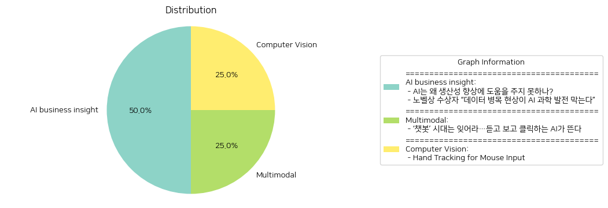

# Daily Artificial Intelligence Insights : News

## 🪄 AI business insight

**요약:**

**주요 주제**:  
두 뉴스 기사 모두 인공지능(AI)에 대한 주제로, 첫 번째 기사에서는 AI가 현재 생산성 향상에 얼마나 기여하고 있는지를 다루고 있으며, 두 번째 기사에서는 고품질 데이터의 중요성을 강조하면서 AI 과학 발전의 걸림돌로 데이터 병목 현상을 언급하고 있다. 공통된 주제는 AI 기술의 실제적인 발전과 장애 요인에 관한 것이다.

**주요 사건**: 
첫 번째 기사에서는 AI가 미래의 경제 발전에 대한 잠재력을 가지고 있음에도 불구하고 생산성 개선에 미치지 못하고 있는 이유를 분석하고 있다. 이는 AI가 실질적인 성과를 내기 위해 몇 가지 중대한 개선을 필요로 한다는 내용을 포함한다.  
두 번째 기사에서는 노벨상 수상자가 AI 발전을 과학적 발견의 도구로 사용하기 위해선 고품질 데이터가 필요하다는 견해를 제시하며, 데이터 병목 현상이 이를 저해하고 있다고 설명한다.

**영향 분석**:
AI가 생산성 개선에 미미한 영향을 미치고 있다는 첫 번째 기사는 경제 분야에 대한 시사점을 내포하고 있다. AI가 그 잠재력을 충분히 발휘하지 못함으로 인해 기업과 산업 전반의 효율성과 경제성장이 부진할 수 있다.  
두 번째 기사의 내용은 데이터 관리 및 품질 향상이 AI 발전을 가로막는 문제로 작용하고 있어, 과학기술 분야 및 연구 개발에 영향을 미치고 있음을 암시한다. 이러한 데이터 관련 문제는 전반적인 혁신 속도에 지연을 초래할 수 있다.

**최종 요약**:  
이 뉴스 모음에서 제공된 정보는 AI가 기대만큼의 생산성 향상을 아직 이루지 못한 이유와 과학적 발전을 가로막는 데이터 문제를 확인해준다. 이로 인해 AI 기술은 경제적, 과학적 이점 및 잠재력을 충분히 발휘하지 못하고 있다. 향후 발전을 위해서는 데이터 품질 개선 및 AI 기술에 대한 중대한 개선이 필수적이다. 이를 통해 산업 전반에 걸쳐 실질적인 생산성과 경제적 성장이 촉진될 것으로 기대된다. AI와 데이터 관리의 개선이 지속적으로 주목 받을 것이며, 기업과 연구 기관이 해결해야 할 주요 과제가 될 것으로 예측된다.

**출처:**

 - AI는 왜 생산성 향상에 도움을 주지 못하나? (https://www.technologyreview.kr/ai%eb%8a%94-%ec%99%9c-%ec%83%9d%ec%82%b0%ec%84%b1-%ed%96%a5%ec%83%81%ec%97%90-%eb%8f%84%ec%9b%80%ec%9d%84-%ec%a3%bc%ec%a7%80-%eb%aa%bb%ed%95%98%eb%82%98/)
 - 노벨상 수상자 “데이터 병목 현상이 AI 과학 발전 막는다” (https://www.technologyreview.kr/%eb%85%b8%eb%b2%a8%ec%83%81-%ec%88%98%ec%83%81%ec%9e%90-%eb%8d%b0%ec%9d%b4%ed%84%b0-%eb%b3%91%eb%aa%a9-%ed%98%84%ec%83%81%ec%9d%b4-ai-%ea%b3%bc%ed%95%99-%eb%b0%9c%ec%a0%84-%eb%a7%89%eb%8a%94/)

## 🚀 Multimodal

**요약:**

**1. 주요 주제:**

- **AI 기술 진화**: 텍스트 기반 AI 챗봇에서 음성과 영상을 생성하는 고도화된 AI로 기술이 진화하고 있다는 주제가 주목받고 있습니다.

**2. 주요 이벤트:**

- **AI 기술의 전환**: 기존 텍스트 기반 AI 챗봇이 인기를 잃고 이제 듣고 보고 클릭할 수 있는 고급 기능을 갖춘 AI가 부상하고 있습니다. 이는 AI 기술의 발전과 더불어 사용자 경험의 변화를 반영합니다.

**3. 영향 분석:**

- **경제**: 새로운 AI 기술의 발전은 산업 전반에 걸쳐 효율성을 높이고, 새로운 시장의 열림으로 인해 경제 성장에 긍정적인 영향을 미칠 것으로 예상됩니다. 특히, 음성 및 영상 기반 AI는 마케팅, 고객 서비스, 엔터테인먼트 등의 분야에서 새로운 기회를 제공할 것입니다.

- **사회·문화**: AI의 인간적 기능 강화는 일상생활 전반에 걸쳐 사회적 변화를 가져올 것으로 보입니다. 이는 사람들에게 보다 인간적인 인터페이스 경험을 제공함으로써 기술 수용성을 높일 것입니다. 하지만, 프라이버시 및 윤리적 문제를 둘러싼 논란이 증가할 것으로 예상됩니다.

**4. 최종 요약:**

최근 뉴스에서는 AI 기술이 텍스트 중심에서 벗어나 음성과 영상 생성의 수준으로 발전하고 있음을 강조하고 있습니다. 이러한 기술 진화는 경제와 사회에 다양한 변화를 가져올 것이며, 특히 사용자와의 상호작용을 보다 직관적이고 자연스럽게 만들 것입니다. 미래에는 이러한 AI 기술의 발전이 전 세계적으로 어떤 새로운 트렌드를 만들어낼지 주목해야 할 필요가 있습니다. AI 기술의 지속적인 발전은 경제 성장 뿐만 아니라, 사회적, 윤리적 도전과제를 수반할 것이기 때문에 균형 잡힌 접근이 요구됩니다.

**출처:**

 - ‘챗봇’ 시대는 잊어라…듣고 보고 클릭하는 AI가 뜬다 (https://www.technologyreview.kr/%ec%b1%97%eb%b4%87-%ec%8b%9c%eb%8c%80%eb%8a%94-%ec%9e%8a%ec%96%b4%eb%9d%bc-%eb%93%a3%ea%b3%a0-%eb%b3%b4%ea%b3%a0-%ed%81%b4%eb%a6%ad%ed%95%98%eb%8a%94-ai%ea%b0%80-%eb%9c%ac%eb%8b%a4/)

## 🪄 Computer Vision

**요약:**

**주요 주제**:
- 기술 개발 및 혁신
- 사용자 경험 개선
- 소프트웨어 최적화
- 웹 기술 및 상호작용 개선

**주요 사건**:
- 미디어파이프(MediaPipe)와 OpenCV를 활용한 손 추적 마우스 입력 시스템 개발.
- 초기 단계에서 지연 문제 발생, 이를 웹 버전의 미디어파이프와 Python 백엔드와의 WebSocket 통신을 통해 해결.
- 정면 모드 추가, One Euro Filter 및 임계값 설정 등의 기능으로 시스템 업그레이드.
- 입력 흔들림 등의 일부 문제 여전히 지속됨.

**영향 분석**:
- **경제**: 이러한 기술 개발은 앞으로 사용자 인터페이스와 기술 혁신을 도모하여 경제적인 기회를 창출할 가능성이 있음.
- **사회**: 손 추적 기술 발전은 특히 몸이 불편한 사용자를 위한 접근성을 높일 것으로 예상됨.
- **기술**: 지속적인 개선 및 최적화를 통해 더 나은 사용자 경험을 제공하며, 인공지능 및 컴퓨터 비전 분야의 발전에 기여할 가능성이 큼.

**최종 요약**:
손 추적 마우스 입력 시스템은 미디어파이프와 OpenCV를 활용하여 개발되었으며, 초기 지연 문제를 효과적으로 해결한 후 지속적인 기능 개선이 이루어졌다. 이러한 기술적 진보는 사용자 경험을 향상시키고, 특히 접근성을 필요로 하는 분야에서 큰 가치를 제공할 것으로 기대된다. 추가 개선이 필요하며, 향후 손 떨림 문제 해결과 같은 기술적 진보가 주목된다. 이러한 기술은 경제 및 사회적 측면에서 새로운 기회를 창출하고, 계속해서 모니터링이 필요한 분야로 자리잡을 것이다.

**출처:**

 - Hand Tracking for Mouse Input (https://chernando.com/blog/2023/07/23/hand-tracking-for-mouse-input.html)

