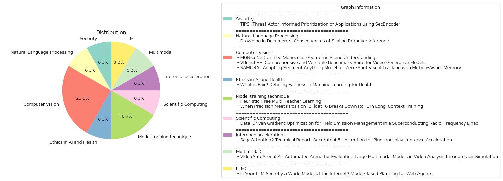

# Daily Artificial Intelligence Insights : Papers

## ✈️ Security

**요약:**

보고서 요약:

1. 주요 주제:
   - TIPS 모델의 역할: 보안 위협 행위자 정보를 활용한 애플리케이션 우선순위화.
   - SecEncoder의 활용: 보안 관련 언어 모델의 통합 사용.
   - 효율성 증대: 탐지 정확도 및 대응 속도 개선.

2. 일반적인 키워드 및 트렌드:
   - 위협 행위자 정보
   - 우선순위화
   - SecEncoder
   - 보안 향상
   - F-1 점수
   - 백로그 감소

3. 주요 사건 및 정보 요약:
   - TIPS는 위협 행위자 정보를 활용하여 손상된 애플리케이션을 효과적으로 탐지하고 우선순위화하기 위한 전문 언어 모델이다.
   - 이 모델은 인코더와 디코더 언어 모델의 강점을 결합하여 탐지의 정확성과 관련성을 높인다.
   - 실제 벤치마크 데이터 세트를 통한 실험 결과, TIPS는 악성 애플리케이션 식별에서 F-1 점수 0.90을 기록하며 높은 효율성을 입증했다.
   - 또한 TIPS는 보안 분석가들의 조사 백로그를 87% 감소시켜 위협 대응 프로세스를 간소화하고 보안 태세를 개선한다.

4. 이러한 사건의 다양한 분야에 대한 영향 분석:
   - 보안 분야: 보안 분석가들의 업무 효율성을 증대시킴과 동시에 사이버 위협 대응력을 강화.
   - IT 및 기업 운영: 더 빠르고 정확한 탐지 및 대응으로 기업 전체의 보안 강화에 기여.

5. 결론 및 미래의 발전 가능성:
   - TIPS 모델의 도입은 사이버 보안 분야에서 엔터프라이즈 애플리케이션 보호를 혁신적으로 변화시킬 수 있다.
   - 향후 더 많은 실제 데이터 기반 실험과 다양한 환경에서의 적용을 통해 모델의 성능과 효율성을 지속적으로 개선할 가능성이 크다.
   - 또한 AI와 머신러닝 기술의 발전에 따라, 더 복잡한 위협 행위자 패턴 분석이 가능해질 것이며, 이에 따른 보안 강화를 기대할 수 있다.

**출처:**

 - TIPS: Threat Actor Informed Prioritization of Applications using SecEncoder (https://deeplearn.org/arxiv/548075/tips:-threat-actor-informed-prioritization-of-applications-using-secencoder)

## 🍊 Natural Language Processing

**요약:**

보고서 요약:

1. 주요 주제 및 테마 추출:
   - 재검색(Reranking) 시스템의 역할과 성능.
   - 초기 정보 검색 시스템(Initial IR Systems)과의 관계.
   - 재검색기의 스케일링과 성능 저하 문제.

2. 공통 키워드, 트렌드 및 패턴 식별:
   - '재검색(Reranking)', '초기 정보 검색(Initial IR)', '성능 저하', '문서 스코어링'.
   - 문서 수가 많아질수록 장점이 감소한다는 패턴.
   - 쿼리와 동떨어진 문서에 높은 점수를 부여하는 문제.

3. 주요 사건 및 중요한 정보 요약:
   - 재검색기의 주용도는 더 저렴한 초기 정보 검색 시스템이 검색한 문서의 점수를 다시 매기는 것.
   - 기존 신념과 달리, 재검색기의 성능은 문서가 많아질수록 감소하며 심지어 일정 한계를 넘어가면 품질 악화.
   - 재검색기가 문의 맥락과 동떨어진 문서에 높은 점수를 부여하는 경향이 발견됨.

4. 이러한 사건의 다양한 분야에 미치는 영향 분석:
   - 정보 검색 및 검색 엔진 최적화 분야: 연구와 혁신의 방향 전환 필요.
   - 데이터 처리 및 관리: 대량 데이터 처리의 효율성과 관련된 전략 재검토.
   - 인공지능 및 자연어 처리 연구: 재검색기 성능 개선을 위한 새로운 접근법 개발 필요.

5. 결론 및 향후 개발 예상:
   - 재검색기의 성능과 품질을 개선하기 위한 연구와 개발이 필요함.
   - 새로운 알고리즘 개발 또는 기존 알고리즘 개선을 통해 스케일링 문제 해결 가능성.
   - 정보 검색 분야에서 대량 처리가 요구될 때의 효율성을 높이기 위한 방법론 모색.

이 연구는 재검색기의 스케일링이 성능에 미치는 부정적인 영향을 강조하며, 향후 연구 개발의 새로운 방향을 제시하고 있다. 꾸준한 연구와 실험을 통해 효율적이고 정확한 정보 검색 방법론이 지속적으로 발전할 필요가 있다.

**출처:**

 - Drowning in Documents: Consequences of Scaling Reranker Inference (https://deeplearn.org/arxiv/549218/drowning-in-documents:-consequences-of-scaling-reranker-inference)

## ❄️ Computer Vision

**요약:**

종합 요약 보고서:

1. **MGNiceNet: 통합 단일 카메라 기하학적 장면 이해**
   - **주요 주제**: 단일 카메라 기반의 기하학적 장면 이해, 실시간 응용, 자율 주행 차량에서의 적용.
   - **내용 요약**: MGNiceNet은 단일 카메라의 파노픽 세분화 및 자체 지도 깊이 추정법을 통합한 접근법을 제안하며, RT-K-Net을 기반으로 하여 파노픽 세분화와 깊이 추정을 동시에 달성할 수 있도록 확장하였습니다. 특히, 파노픽 경로의 정보를 사용하여 깊이 예측을 수행하고, 비디오 주석 없이도 정확한 깊이 추정을 위한 파노픽 유도 움직임 마스킹 방법을 도입했습니다. Cityscapes와 KITTI 데이터셋에서 평가한 결과, MGNiceNet은 최신 실시간 방법들과 비교해 우수한 성능을 보여주며 계산적으로 더욱 까다로운 방법들과의 격차를 줄였습니다.
   - **영향**: 자율 주행과 관련된 기술 발전에 기여하며, 실시간 기하학적 이해를 통해 자율 주행 시스템의 안전성과 효율성을 높이는 데 기여할 수 있습니다.

2. **VBench++: 비디오 생성 모델을 위한 종합적 벤치마크**
   - **주요 주제**: 비디오 생성 모델의 평가, 인간 지각과의 정렬, 비디오 생성 품질을 평가하는 계층적 차원.
   - **내용 요약**: VBench++는 비디오 생성의 여러 차원을 계층적으로 분석하며, 각 차원에 맞는 평가 방법을 제공하여 비디오 생성 품질을 정밀하게 평가하는 벤치마크입니다. 세부적인 평가를 통해 모델의 강점과 약점을 파악할 수 있으며, 특히 인간의 선호 데이터를 통해 인간 지각과의 정렬을 검증합니다. 또한, 텍스트-비디오 및 이미지-비디오 생성 평가를 지원하며, 다양한 콘텐츠 유형에서의 모델 능력을 조사합니다.
   - **영향**: 비디오 생성 기술의 평가 및 발전에 기여하고, 신뢰성 있는 비디오 생성 모델의 개발을 촉진할 수 있습니다.

3. **SAMURAI: 제로샷 비주얼 트래킹을 위한 고급 세그먼트 모델 적응**
   - **주요 주제**: 비주얼 오브젝트 트래킹, 자체 지도 학습, 움직임 감지.
   - **내용 요약**: SAMURAI는 SAM 2의 강화된 적응형으로, 시각적 객체 추적에서의 성능을 개선하도록 설계되었습니다. 제안된 움직임 인식 메모리 선택 메커니즘을 통해 객체의 움직임을 효과적으로 예측하고 마스크 선택을 정밀히 하며, 복잡한 트래킹 상황에서도 강력한 제로샷 성능을 보여줍니다. LaSOT와 GOT-10k와 같은 다양한 벤치마크에서 성공적으로 평가되었습니다.
   - **영향**: 복잡한 환경에서 실질적인 적용 가능성을 증대시키며, 동적 환경에서의 객체 추적 및 인식의 정확성과 믿음성을 향상시킬 수 있습니다.

종합 결론: 이 연구들은 단일 카메라 기하학적 이해, 비디오 생성 평가, 시각적 추적 분야에서의 기술 발전을 모두 보여주고 있습니다. 각 연구는 해당 분야에서 성능 향상과 실질적인 응용 가능성을 확대하는 데 중점을 두고 있으며, 이러한 기술들이 다양한 산업과 응용 분야에서 널리 활용될 가능성을 보여줍니다. 앞으로의 기술 발전은 인간 지각과의 정렬, 실시간 응용 가능성, 복잡한 환경에서의 신뢰성 등을 중심으로 진행될 것으로 예상됩니다.

**출처:**

 - MGNiceNet: Unified Monocular Geometric Scene Understanding (https://deeplearn.org/arxiv/549352/mgnicenet:-unified-monocular-geometric-scene-understanding)
 - VBench++: Comprehensive and Versatile Benchmark Suite for Video Generative Models (http://arxiv.org/abs/2411.13503v1)
 - SAMURAI: Adapting Segment Anything Model for Zero-Shot Visual Tracking with Motion-Aware Memory (http://arxiv.org/abs/2411.11922v1)

## ⭐ Ethics in AI and Health

**요약:**

보고서 요약:

1. 주요 주제 및 테마 추출:
   - 공정성
   - 기계 학습 (ML) 모델의 안전성 및 효과성
   - 환자 그룹 전반에 걸친 형평성
   - 건강 격차 방지

2. 공통 키워드, 트렌드, 패턴 식별:
   - 공정성 정의
   - 기계 학습 응용 건강 분야
   - 불공정성의 원인
   - 공정성 측정 지표
   - 전자 건강 기록 (EHR) 데이터셋 사례 연구
   - 미래 연구 전망

3. 각 논문의 주요 사건 및 중요 정보 요약:
   - 왜 기계 학습 모델이 불공정할 수 있는지에 대한 고찰.
   - 다양한 실제 사례 분석을 통해 공정성 측정 방법 탐구.
   - 일반적으로 사용되는 공정성 메트릭스에 대한 개요 제공.
   - 전자 건강 기록(EHR) 데이터셋을 활용한 사례 연구로 논의 보완.
   - 건강 분야에서의 공정성 정의에 관한 현재의 도전과 미래의 기회 강조.

4. 이러한 사건들이 다양한 부문에 미치는 영향 분석:
   - 공정성 강화는 임상 결정과 건강 불평등의 악화를 방지하는데 중요한 역할.
   - ML 모델의 공정성 부족은 특정 환자 그룹에 대한 불공평한 의료 서비스를 초래할 수 있음.
   - 공정성에 대한 새로운 이해는 향후 ML 모델의 개발과 적용에 영향을 미칠 수 있음.

5. 결론 및 주목할 만한 잠재적 미래 개발 사항 제시:
   - ML 모델의 공정성을 보장하기 위한 지속적인 연구와 개선이 필요.
   - 공정성 측정에 대한 표준화된 지표 개발과 실질적 적용을 통한 공정한 ML 시스템 구축.
   - 다양한 환자 그룹의 요구를 충족시킬 수 있는 포괄적이며 형평성 있는 데이터셋의 활용 증대.
   - 향후 연구에서는 현재의 도전 과제를 해결하고 기회를 최대한 활용하는 데 중점을 두어야 함.

**출처:**

 - What is Fair? Defining Fairness in Machine Learning for Health (https://deeplearn.org/arxiv/550073/what-is-fair?-defining-fairness-in-machine-learning-for-health)

## ☀️ Model training technique

**요약:**

요약 보고서:

1. 주요 주제 및 테마 추출:
   - 'Heuristic-Free Multi-Teacher Learning': 다중 교사 학습에서 수동 집계 휴리스틱의 필요성을 제거하는 새로운 프레임워크 Teacher2Task가 소개됩니다. 기존의 방법은 여러 교사로부터의 예측을 결합할 때 휴리스틱에 의존하여 종종 최적이 아닌 결합 레이블과 집계 오류의 전파를 초래했습니다. Teacher2Task는 교사별 입력 토큰을 도입하고 학습 프로세스를 재구성하여 이러한 한계를 해결합니다.
   
   - 'When Precision Meets Position: BFloat16 Breaks Down RoPE in Long-Context Training': 긴 문맥 훈련에서 Rotary Positional Embedding (RoPE)와 BFloat16 포맷을 사용할 때 발생하는 수치적 문제가 논의됩니다. 이러한 문제는 문맥 길이가 길어질수록 BFloat16의 제한된 정밀도 때문에 발생하며, 이를 해결하기 위해 AnchorAttention이라는 주의 메소드가 개발되었습니다.

2. 공통 키워드, 트렌드 및 패턴:
   - 다중 학습 및 파라다임에서의 혁신적 접근 방식.
   - 수치적 문제 해결을 위한 새로운 메커니즘과 그 효율성 증대.

3. 주요 사건 및 중요 정보 요약:
   - 'Teacher2Task'는 다중 교사 학습에서의 집계 오류를 줄이기 위한 새로운 학습 구조를 제안하며, 교사별로 입력 토큰을 도입하여 N+1개의 분리된 작업을 생성합니다.
   - 'AnchorAttention'은 긴 문맥 훈련에서 BFloat16 사용으로 인한 수치적 문제를 해결하여 주의 계산을 줄이고 훈련 속도를 개선합니다.

4. 이벤트의 다양한 부문에 미치는 영향 분석:
   - 다중 교사 학습에서의 Teacher2Task는 교육 및 학습 알고리즘의 정확성과 효율성을 크게 향상시킬 수 있는 잠재력을 가지고 있습니다.
   - AnchorAttention은 대형 언어 모델의 긴 문맥 처리 능력을 개선하고, 훈련 시간을 절반 이상 절감하여 더욱 빠르고 효율적인 데이터 처리 및 모델 학습을 가능하게 합니다.

5. 결론 및 향후 발전 가능성:
   - Teacher2Task 프레임워크는 다양한 학습 패러다임의 원칙을 바탕으로 하여, 다중 교사 학습의 효율성과 정확성을 더욱 높일 수 있는 방안을 제시합니다.
   - AnchorAttention은 긴 문맥 처리의 효율성을 크게 향상시키는 잠재력을 가지며, 이는 대형 언어 모델의 훈련 효율성과 성능을 혁신적으로 개선할 수 있음으로, 향후 다양한 분야에서 널리 적용될 가능성이 있습니다.

**출처:**

 - Heuristic-Free Multi-Teacher Learning (https://deeplearn.org/arxiv/550099/heuristic-free-multi-teacher-learning)
 - When Precision Meets Position: BFloat16 Breaks Down RoPE in Long-Context Training (http://arxiv.org/abs/2411.13476v1)

## 🌞 Scientific Computing

**요약:**

보고서 요약:

1. 주요 주제 및 테마 추출:
   - 논문은 '데이터 기반 그래디언트 최적화'를 중점으로 하고 있으며, '초전도 라디오 주파수 선형 가속기'(linac)에서의 '필드 방출 관리'를 다루고 있다.
   
2. 공통 키워드 및 트렌드 식별:
   - '필드 방출', '방사선 수치', '선형 가속기', '기계 학습', '최적화', '에너지 이득', '불확실성 정량화', '감소' 등의 키워드가 빈번히 등장.
   - 기계 학습과 불확실성 정량화를 활용한 방사의 예측 및 최적화가 주요 탐색 주제.

3. 주요 사건 및 핵심 정보 요약:
   - 초전도 라디오 주파수 선형 가속기 내 필드 방출로 인해 발생하는 방사선 문제를 해결하기 위한 기계 학습 접근법 개발.
   - 다중 위치에서의 방사선 수치를 예측함으로써, 필드 방출에 유발된 방사선을 줄이는 동시에 실험 물리학 프로그램에 필요한 총 에너지 이득을 유지.
   - 최적화된 솔루션 도입으로, 표준 운영 설정 대비 중성자 및 감마 방사선이 40% 이상 감소.

4. 이 사건들이 다양한 분야에 미친 영향 분석:
   - 연구가 성공적으로 적용될 경우, 초전도 선형 가속기를 운영하는 물리학 환경에서의 방사 안전성 향상 가능.
   - 방사선 수치 감소로 인해 인근 시스템의 열화가 방지되며, 장기간의 실험 물리학 프로그램 지속 가능성 증대.

5. 최종 통합 요약 및 주의할 잠재적 향후 발전:
   - 이 연구는 기계 학습을 통한 최적화 기법이 실제 물리학 실험 환경에서 필드 방출 관리에 큰 긍정적 영향을 미칠 수 있음을 시사.
   - 향후 기계 학습 알고리즘의 발전은 방사선 관리에 더 정밀한 예측과 최적화를 가능하게 하여, 실험 물리학의 안전성과 효율성을 지속적으로 향상시킬 것으로 기대.

**출처:**

 - Data-Driven Gradient Optimization for Field Emission Management in a Superconducting Radio-Frequency Linac (https://deeplearn.org/arxiv/547416/data-driven-gradient-optimization-for-field-emission-management-in-a-superconducting-radio-frequency-linac)

## 🐱 Inference acceleration

**요약:**

**종합 요약 보고서: SageAttention2 기술 보고서**

1. **핵심 주제 및 테마 추출:**
   - 주제: 주의력(Attention) 과정의 가속화
   - 테마: 양자화와 고정밀도 방식, 성능 향상

2. **공통 키워드, 트렌드 및 패턴:**
   - 양자화 기술의 적용
   - 매트릭스 곱셈(Matrix Multiplication)의 효율성
   - 주의력 정확도 유지와 연산 속도의 향상

3. **주요 사건 및 중요 정보 요약:**
   - SageAttention2는 기존 FlashAttention2에 비해 정확한 4비트 매트릭스 곱셈을 통해 2배의 속도 향상을 구현.
   - 매트릭스를 INT4와 FP8로 양자화하여 정확성을 향상시키는 방법을 제안.
   - 단계별 및 계층별 양자화 정확성 분석을 통해 적응형 양자화 방법 제안.
   - RTX4090에서 FlashAttention2와 xformers보다 각각 약 3배, 5배 더 높은 연산 성능을 기록.

4. **이벤트가 다양한 부문에 미치는 영향 분석:**
   - 대규모 언어 처리, 이미지 생성, 비디오 생성 등의 모델에 적용, 엔드 투 엔드 성능 손실이 거의 없음을 확인.
   - 계산 속도를 크게 증가시키면서도 정밀도를 그대로 유지할 수 있는 잠재력 확인.

5. **최종 요약과 향후 개발 동향:**
   - SageAttention2는 주의력 모듈의 효율성을 크게 향상시켜, 다양한 대규모 모델에 활용 가능성을 높이는 방향으로 발전할 것임.
   - 본 연구 결과는 고성능 컴퓨팅 분야에서 다루어야 할 주요 패러다임 전환을 제시하며, 이러한 발전이 미래의 인공지능 모델에 영향력을 미칠 것으로 예상됨.
   - 향후 개발 방향은 테스트 스펙트럼의 확장과 다양한 컴퓨팅 아키텍처에서의 테스트일 수 있음. 

이 기술은 강력한 하드웨어 가속을 통해 복잡한 작업에 대한 해결책을 제공하고 있으며, 연구자는 추가적인 최적화 기술과 정확도 강화를 위한 노력을 계속 이어갈 필요가 있습니다.

**출처:**

 - SageAttention2 Technical Report: Accurate 4 Bit Attention for Plug-and-play Inference Acceleration (http://arxiv.org/abs/2411.10958v1)

## 🪐 Multimodal

**요약:**

보고서 요약:

1. 주요 주제 및 테마: 
   - 논문은 대규모 다중모달 모델(LMMs)이 비디오 분석 분야에서 주목받고 있음을 강조한다.
   - 기존의 평가 방법인 전통적인 다지선다형 질문은 현실 세계의 복잡한 요구를 충족시키지 못한다는 한계를 지적한다.
   - VideoAutoArena는 이러한 한계를 극복하기 위한 자동화된 평가 시스템으로, 사용자 시뮬레이션을 통해 LMMs의 비디오 이해 능력을 철저히 평가한다.

2. 공통 키워드, 트렌드 및 패턴:
   - LMMs의 비디오 분석 능력, 자동화 평가, 사용자 시뮬레이션, 동적 질문 생성, 공정한 비교, 스케일러블 평가, ELO 레이팅 시스템.

3. 주요 이벤트 및 중요한 정보:
   - VideoAutoArena는 LMSYS Chatbot Arena의 프레임워크에 영감을 받아 제작되었으며, LMMs의 비디오 분석 능력을 자동으로 평가한다.
   - 평가 시스템은 수정된 ELO 레이팅 시스템을 사용하여 여러 LMMs 간의 공정하고 지속적인 비교가 가능하다.
   - 자동 평가 시스템의 유효성을 검증하기 위해 인간 주석의 일부를 '금 본위'로 활용하여 인간 판단과 자동 평거 결과간의 강한 연관성을 입증했다.

4. 이러한 사건이 다양한 분야에 미치는 영향 분석:
   - VideoAutoArena는 대규모 다중모달 모델의 발전 방향과 개선 영역을 파악하는 데 있어 효과적이고 비용 효율적인 평가를 제공하여 비디오 분석 기술의 발전을 촉진할 수 있다.
   - 이를 통해 비디오 분석 능력을 기반으로 한 다양한 응용 분야에서 LMMs의 채택과 효용성을 증가시킬 수 있다.

5. 최종 요약 및 향후 주목할 발전:
   - VideoAutoArena와 VideoAutoBench는 사용자가 중심이 되는 비디오 분석에서 LMMs를 평가하기 위한 비용 효율적이고 확장 가능한 프레임워크를 제공한다.
   - 미래에는 비디오 분석 시나리오의 복잡성을 단계적으로 증가시키는 전략을 통해 모델의 강점을 더욱 강화하고 새로운 도전과제를 해결하는 발전이 이루어질 것으로 기대된다.

**출처:**

 - VideoAutoArena: An Automated Arena for Evaluating Large Multimodal Models in Video Analysis through User Simulation (http://arxiv.org/abs/2411.13281v1)

## ☀️ LLM

**요약:**

1. 주요 주제 및 테마 추출:
   - 웹 기반 작업에서의 언어 에이전트(LLM) 사용
   - 모델 기반 계획 및 트리 탐색 방법
   - 안전성과 실용적 제약
   - LLMs을 웹 모델로 사용
   - WebDreamer 방법론

2. 공통 키워드, 트렌드, 패턴:
   - 언어 에이전트의 자동화
   - 트리 탐색 및 계획 알고리즘
   - 웹 환경 내 LLMs 사용
   - 상상된 결과와 최적 행동 결정
   - 향후 연구 방향

3. 주요 사건 및 중요 정보 요약:
   이 논문은 웹 기반 작업에서 언어 에이전트의 성능을 향상시키기 위한 새로운 패러다임을 제시한다. 연구팀은 현재의 반응적 접근 방법이 인간에 비해 성능이 부족하다고 보고, LLMs을 사용하여 웹 환경에서 모델 기반 계획을 수행하는 WebDreamer를 개발했다. WebDreamer는 대규모 언어 모델을 사용해 각 후보 행동의 결과를 시뮬레이션하고 이를 평가하여 최적의 행동을 결정한다. 이는 VisualWebArena와 Mind2Web-live라는 온라인 상호작용 벤치마크에서 기존의 반응형 방법보다 큰 성능 향상을 보여줬다.

4. 이러한 사건이 각 부문에 미친 영향 분석:
   - 웹 에이전트 자동화에 있어서 비약적인 발전을 이룰 가능성
   - 웹 서비스 안전성과 실용성 문제 해결의 새로운 접근
   - 웹환경에 대한 LLM의 활용도 및 효율성 입증
   - 복잡하고 역동적인 환경에서 LLM 최적화 및 추측 계획의 필요성 강조

5. 최종 종합 요약 및 결론, 잠재적 미래 발전:
   WebDreamer는 언어 모델이 웹 환경에서 모델 기반 계획을 수행할 수 있음을 보여준 혁신적인 방법론이다. LLM을 웹 모델로 사용함으로써 기존보다 향상된 성능을 입증했으며, 이는 자동화된 웹 상호작용의 패러다임 전환을 예고하고 있다. 이러한 연구는 LLM의 최적화 및 모델 기반 계획 분야에서 추가 연구의 가능성을 제시하면서, 향후 웹 에이전트의 안전하고 효율적인 실행을 위한 새로운 접근 방식을 기대하게 한다.

**출처:**

 - Is Your LLM Secretly a World Model of the Internet? Model-Based Planning for Web Agents (http://arxiv.org/abs/2411.06559v1)

