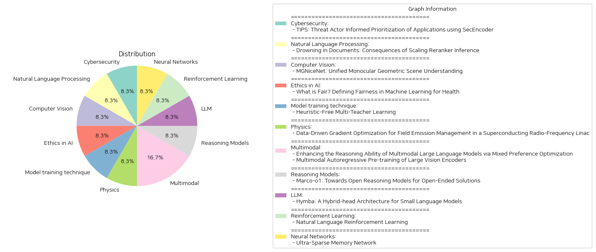

# Daily Artificial Intelligence Insights : Papers

## ⭐ Cybersecurity

**요약:**

제목: 'TIPS: SecEncoder를 활용한 위협 행위자 정보를 바탕으로 한 애플리케이션 우선순위화'

논문 요약: 이 논문은 TIPS: SecEncoder를 이용한 위협 행위자 정보를 바탕으로 한 애플리케이션 우선순위화 도구를 소개합니다. TIPS는 인코더와 디코더 언어 모델의 강점을 결합하여 손상된 애플리케이션을 감지하고 우선순위를 정합니다. TIPS는 위협 행위자 인텔리전스를 통합하여 탐지의 정확성과 관련성을 강화합니다. 실제 애플리케이션 벤치마크 데이터 세트를 사용한 광범위한 실험을 통해 TIPS는 악성 애플리케이션을 식별할 때 F-1 점수 0.90의 높은 효율성을 달성했습니다. 또한 실제 시나리오에서 TIPS는 보안 분석가의 조사 작업 부담을 87% 줄여 위협 대응 프로세스를 간소화하고 전체적인 보안 상태를 개선합니다.

종합 요약 및 결론: 이번 연구를 통해 배포된 TIPS 도구는 사이버 보안 분야에서 위협 탐지 및 대응의 효율성을 크게 향상시킬 수 있는 가능성을 보여주었습니다. 특히, 위협 행위자 인텔리전스 통합을 통해 더 정확하고 관련성 높은 탐지를 가능하게 하였으며, 이는 보안 분석가의 업무를 획기적으로 줄이고 전체적인 보안 상태를 강화하는 것을 확인하였습니다. 향후 개발에서는 TIPS의 언어 모델을 더욱 정교하게 발전시키거나 새로운 위협 인텔리전스 데이터를 활용하는 방향으로 나아가야 할 것으로 기대됩니다. Cybersecurity에 대한 이러한 접근 방식은 다양한 보안 애플리케이션 부문의 효율성을 높이고 적시에 위협에 대응하는 데 기여할 수 있을 것입니다.

**출처:**

 - TIPS: Threat Actor Informed Prioritization of Applications using SecEncoder (https://deeplearn.org/arxiv/548075/tips:-threat-actor-informed-prioritization-of-applications-using-secencoder)

## 🪐 Natural Language Processing

**요약:**

보고서 요약:

1. 주요 주제 및 테마 추출:
   - 리랭커: 다양한 문서를 다시 점수화하는 시스템.
   - 크로스 인코더: 일반적으로 사용되는 리랭커의 한 형태.
   - 문서 분석: 처음 검색된 문서들을 다시 점수화함.
   - 효율성과 비용: 리랭커는 비용이 높아지지만 더 효과적이라고 여김.

2. 공통 키워드, 트렌드, 패턴:
   - 리랭커 성능: 문서를 점수화하는 과정에서 성능이 감소할 수 있음.
   - 제한 및 한계: 리랭커가 많은 문서를 점수화하면 품질이 떨어질 수 있음.
   - 의미적 겹침: 쿼리와 문서 간의 의미적 유사성이 부족할 수 있음.

3. 주요 사건과 정보 요약:
   - 기존의 리랭커가 더 많은 문서를 점수화할수록 성능이 저하되는 경향이 발견됨.
   - 일부 경우에는 쿼리와 전혀 관계없는 문서가 높은 점수를 받을 수 있음.
   - 이러한 발견을 통해 재랭킹 기법을 개선하기 위한 미래 연구가 필요하다는 점이 강조됨.

4. 이러한 사건들이 다양한 부문에 미치는 영향:
   - 정보 검색 시스템: 리랭커의 한계가 정보 분석 및 검색 품질에 영향을 미칠 수 있음.
   - 검색 정확성: 쿼리와의 연관성이 적은 문서가 필터링되지 않을 위험 존재.
   - 비용 대비 효율성: 리랭커의 높은 비용이 반드시 높은 품질 결과로 이어지지 않을 수 있음.

5. 최종 결론 및 미래 전망:
   - 리랭커는 대규모 문서 점수화 시 성능이 저하될 위험이 있다.
   - 이러한 문제점을 해결하기 위해 새로운 리랭킹 알고리즘 개발이 필요하다.
   - 정보 검색 분야에서 비용 효율성을 보장하면서도 정확성을 높이는 방향으로 연구가 지속되어야 한다.

**출처:**

 - Drowning in Documents: Consequences of Scaling Reranker Inference (https://deeplearn.org/arxiv/549218/drowning-in-documents:-consequences-of-scaling-reranker-inference)

## 🫧 Computer Vision

**요약:**

제목: MGNiceNet: 통합된 단안 기하학적 장면 이해

논문 요약: "MGNiceNet"은 단안 기하학적 장면 이해 분야에서 팬옵틱 세분화와 자가 감독 깊이 추정을 결합하며, 자율 주행 차량의 실시간 적용에 중점을 두고 개발되었습니다. 이 통합 접근법은 RT-K-Net이라는 최신 실시간 팬옵틱 세분화 방법을 기반으로 하여 구조를 확장, 팬옵틱 세분화와 단안 깊이 추정을 동시에 가능하게 합니다. 자가 감독 깊이 추정기의 도입으로 팬옵틱 경로에서 얻은 정보를 깊이 예측에 명시적으로 활용하며, 비디오 팬옵틱 세분화 주석 없이도 깊이 추정을 향상시키는 팬옵틱 기반 움직임 마스킹 방법을 소개합니다. 이 방법은 자율 주행 데이터셋인 Cityscapes와 KITTI에서 평가되었으며, 다른 실시간 방법들과 비교해 최신 결과를 보여주며 계산 비용이 높은 방법들과의 차이를 좁혔습니다. 소스코드와 학습된 모델은 GitHub에 공개되어 있습니다.

핵심 주제 및 테마: 자율 주행, 팬옵틱 세분화, 자가 감독 깊이 추정, MGNiceNet, RT-K-Net, 실시간 장면 이해

주요 이벤트와 정보: MGNiceNet의 개발과 평가, 팬옵틱 세분화와 자가 감독 방법론의 통합, 새로운 움직임 마스킹 방법 도입

영향 분석: 이 연구는 자율 주행 차량에서 실시간 장면 이해를 향상시키며, 팬옵틱 세분화와 깊이 추정을 통합함으로써 실시간 성능에서의 효율성을 증대시킵니다. 이는 특히 자율 주행 분야에서 더 나은 성능과 적은 계산 자원을 요구하는 방법 개발에 기여할 가능성이 있습니다.

최종 요약 및 결론: MGNiceNet은 통합적 접근 방식을 통해 자율 주행의 실시간 장면 이해에서 혁신적인 성과를 보여주며, 팬옵틱 세분화와 깊이 추정을 효율적으로 결합하였습니다. 미래에는 더욱 다양한 데이터셋 및 환경에서의 검증과 함께, 자율 주행 시스템에서의 실질적 적용이 확산될 가능성이 높습니다. MGNiceNet의 공개된 자원은 관련 분야 연구의 발전에 기여할 수 있습니다.

**출처:**

 - MGNiceNet: Unified Monocular Geometric Scene Understanding (https://deeplearn.org/arxiv/549352/mgnicenet:-unified-monocular-geometric-scene-understanding)

## 💚 Ethics in AI

**요약:**

1. 주요 주제 및 테마 추출:
   - 의료 분야의 머신 러닝에서의 공정성 정의
   - 기계 학습 모델의 안전성, 효과성, 공평성
   - 기존 건강 격차의 재강화 방지
   - 공정성 개념 및 계량화
   - 전자 건강 기록(EHR) 데이터셋 활용
   - 미래 연구의 전망 및 도전 과제

2. 공통 키워드, 트렌드, 패턴 식별:
   - 공정성(Fairness)
   - 임상 의사결정(Clinical Decision-Making)
   - 전자 건강 기록(EHR)
   - 건강 불평등(Health Disparities)
   - 머신 러닝(Machine Learning)

3. 주요 사건 및 중요 정보 요약:
   - 머신 러닝 모델의 공정성이 임상 의사결정과 건강 불평등 방지에 필수적임.
   - 실제 사례로 전자 건강 기록 데이터셋을 이용한 공정성 계량화 및 연구 방법 제시.
   - 공정성 측정을 위한 일반적인 지표들을 검토하고, 이를 적용한 사례 연구를 소개.
   - 현재의 도전 및 기회와 함께 미래 연구의 방향성을 논의.

4. 이러한 사건의 여러 분야에 미치는 영향 분석:
   - 의료 분야에서의 머신 러닝 적용 증가로 인해 공정한 알고리즘 개발의 중요성이 대두.
   - 모델이 특정 환자 그룹에 불공평한 결정을 내리지 않도록 노력 필요.
   - 전자 건강 기록 사용 확대는 데이터 기반의 공정성 연구를 촉진.
   - 정확한 공정성 측정 개발의 필요성이 기계 학습 연구 커뮤니티의 핵심 요구로 부상.

5. 최종 요약 및 결론, 향후 주목할 발전:
   - 머신 러닝을 통한 공정한 건강 관리 서비스 제공은 미래 의료 시스템의 필수 요소로 부각.
   - 데이터 사용의 투명성과 책임성이 중요, 연구 커뮤니티에서의 지속적인 노력이 필요.
   - 공정성을 정의하고 측정하는 혁신적인 방법 필요, 지속적인 기술 발전을 통해 해결 가능성.
   - 다양한 환자 그룹의 형평성을 확보하는 알고리즘 설계 연구가 지속적으로 요구됨.

**출처:**

 - What is Fair? Defining Fairness in Machine Learning for Health (https://deeplearn.org/arxiv/550073/what-is-fair?-defining-fairness-in-machine-learning-for-health)

## 🤩 Model training technique

**요약:**

제목: '휴리스틱 없이 다중 교사 학습'
요약: 이 연구는 다중 교사 학습에서 수작업으로 종합하는 휴리스틱의 필요성을 제거하는 Teacher2Task라는 새로운 프레임워크를 소개합니다. 기존의 다중 교사 방법은 여러 교사로부터의 예측을 결합하기 위해 종종 이러한 휴리스틱에 의존하였으며, 결과적으로 최적 이하의 집계된 레이블과 집계 오류가 발생하곤 했습니다. Teacher2Task는 교사별 입력 토큰을 도입하고 훈련 과정을 재구성함으로써 이러한 한계를 해결합니다. 집계된 레이블에 의존하는 대신, 이 프레임워크는 실제 레이블과 N명의 교사로부터의 주석을 포함한 훈련 데이터를 N+1개의 개별 작업으로 변환합니다: N개의 보조 작업은 각 교사의 레이블링 스타일을 예측하고, 하나의 주요 작업은 실제 레이블에 초점을 맞춥니다. 다양한 학습 패러다임 원칙을 활용한 이 접근 방식은 다양한 아키텍처, 모달리티 및 작업에 걸쳐 강력한 경험적 결과를 보여줍니다.

### 종합 요약 보고서:

1. **핵심 주제 및 테마 추출**:
   - 기존의 다중 교사 학습의 한계를 극복하려는 시도
   - 수작업 휴리스틱의 필요성 제거
   - 교사별 입력 토큰을 통한 새로운 훈련 프로세스

2. **공통 키워드, 트렌드 및 패턴**:
   - 휴리스틱 제거
   - 교사별 학습 다중화
   - 보조 및 주요 작업 차별화
   - 다중 학습 패러다임 적용

3. **주요 사건 및 비판적 정보 요약**:
   - Teacher2Task 프레임워크 개발
   - 기존 방식을 개선하여 최적의 레이블링 성과 달성

4. **이 이벤트가 다양한 부문에 미친 영향 분석**:
   - 교육과 기계 학습 모델링 분야에서 데이터 라벨링의 새로운 장을 열 가능성
   - 기계 학습 모델의 정확성과 효율성 향상에 기여
   - 복합 데이터 작업 시 교사 다양성을 효과적으로 활용할 수 있는 길 제시

5. **최종 통합 요약 및 추후 주시해야 할 개발 사항**:
   - Teacher2Task는 다중 교사 학습의 새로운 경로를 제시하며, 앞으로 다양한 기계 학습 영역에 걸쳐 더 높은 정확성과 효율성을 달성하기 위한 혁신적인 방법이 될 가능성이 큼
   - 추가 연구는 Teacher2Task의 실제 적용 사례를 통해 다양한 기술적 관점에서 프레임워크의 성능 개선 가능성을 탐색하는 방향으로 전개될 것임.

**출처:**

 - Heuristic-Free Multi-Teacher Learning (https://deeplearn.org/arxiv/550099/heuristic-free-multi-teacher-learning)

## 🍊 Physics

**요약:**

1. 주요 주제 및 테마 추출:
   - 데이터 기반 기울기 최적화
   - 초전도 전파 주파수 선형 가속기 내 방출 관리
   - 방출로 인한 방사선 문제 해결
   - 기계 학습 및 불확실성 정량화 사용

2. 공통 키워드, 트렌드 및 패턴 식별:
   - 데이터 활용
   - 방사선 수준 예측
   - 기계 학습 적용
   - 40% 이상의 방사선 감소

3. 각 논문에서의 주요 사건 및 중요한 정보 요약:
   - 초전도 전파 주파수 선형 가속기(다음에서 'linac')에서 방출 문제.
   - 상자 기울기가 높아지면 방사선 수준이 기하급수적으로 증가하여 인근 시스템이 손상됨.
   - 기계 학습과 불확실성 정량화를 사용하여 linac 내 다양한 위치의 방사선 수준 예측.
   - 실험 물리학 프로그램을 위해 필요한 에너지 이득을 유지하면서 방출에 의해 유도된 방사선을 최소화하기 위한 공동체 기울기 최적화.
   - 표준 운영 설정 대비 중성자 및 감마 방사선의 40% 이상 감소된 최적 해결책.

4. 이 사건이 다양한 분야에 미치는 영향 분석:
   - 과학적 연구 및 실험의 효율성 향상: 방사선 수준 감소는 선형 가속기의 더 긴 수명과 관련 시스템의 안정성을 높임.
   - 비용 절감: 방사선에 의한 손상 최소화로 복구와 유지보수 비용 감소.

5. 결론 및 미래 개발 전망:
   - 기계 학습과 불확실성 정량화를 통한 방사선 관리와 최적화는 가속기 기술 발전에 있어 중요한 발전을 의미함.
   - 실험 물리학 프로그램의 성능 향상을 통해 연구 결과의 신뢰성과 정확성을 높일 것으로 기대됨.
   - 이러한 최적화 기술은 향후 다른 분야에서도 다양한 방사선 문제 해결에 도입될 가능성이 큼.

**출처:**

 - Data-Driven Gradient Optimization for Field Emission Management in a Superconducting Radio-Frequency Linac (https://deeplearn.org/arxiv/547416/data-driven-gradient-optimization-for-field-emission-management-in-a-superconducting-radio-frequency-linac)

## 💚 Multimodal

**요약:**

보고서 요약:

1. 주요 주제 및 테마:
   - 첫 번째 논문은 대규모 다중모달 언어 모델(MLLM)의 추론 능력을 향상시키기 위한 혼합 선호 최적화(MPO)의 사용을 탐구합니다.
   - 두 번째 논문은 대규모 비전 인코더의 다중모달 자가 회귀 사전 훈련 방식을 소개하며, 이미지와 텍스트를 결합한 환경에서의 활용을 강조합니다.

2. 공통 키워드, 경향 및 패턴:
   - 다중모달(Multimodal), 사전 훈련(Pre-training), 인코더(Encoder), 모델 성능 향상, 자동화된 데이터 구축 및 추론 능력.

3. 각 논문의 주요 이벤트 및 핵심 정보 요약:
   - 첫 번째 논문은 대규모 다중모달 언어 모델의 강화된 추론 능력을 이끌어내기 위한 혼합 선호 최적화(MPO) 방법을 제안하고, 새로운 대규모 다중모달 추론 선호 데이터셋 MMPR를 구축했습니다. 이로 인해, MLLM의 CoT(Chain-of-Thought) 성능이 향상되었으며, MathVista에서 67.0의 정확도를 달성하였습니다.
   - 두 번째 논문은 AIMV2라는 대규모 비전 인코더 패밀리를 제안하며, 자가 회귀 방식으로 이미지를 패치화하고 텍스트 토큰을 생성하는 새로운 비전 디코더와의 결합을 통해 향상된 성능을 발휘합니다. AIMV2-3B 모델은 ImageNet-1k에서 89.5%의 정확도를 달성했으며, 다양한 설정에서 기존 최신 모델(예: CLIP, SigLIP)을 능가합니다.

4. 이러한 이벤트가 다양한 부문에 미치는 영향 분석:
   - 인공지능 분야에서 MLLM의 성능 향상과 데이터 처리 방법의 발전은 다양한 다중모달 응용 프로그램에 적용 가능성을 넓히며, 특히 복합적인 추론을 요하는 작업에서의 개선을 기대할 수 있습니다.
   - 대규모 비전 인코더의 발전은 이미지 처리 및 해석 작업에서의 성능을 강화하며, 다양한 산업 분야에서의 이미지 및 텍스트 데이터 융합 분석 능력을 향상시킵니다.

5. 최종 요약 및 결론:
   - 두 논문 모두 다중모달 환경에서의 언어 및 비전 모델의 성능을 극대화하는 데 중점을 두고 있으며, 새로운 데이터 구축 방법 및 모델링 기법을 통해 기존 모델의 한계를 극복하고 있습니다.
   - 향후 개발 방향으로, 이러한 모델을 활용해 보다 복잡한 다중모달 문제 해결능력을 상용화하는 데 집중될 것으로 보이며, 추가적인 데이터 및 인프라 구축이 필요할 것입니다. 다중모달 처리 기술은 앞으로 더욱 중요해질 것이며, 관련 연구의 지속적인 발전이 예상됩니다.

**출처:**

 - Enhancing the Reasoning Ability of Multimodal Large Language Models via Mixed Preference Optimization (http://arxiv.org/abs/2411.10442v1)
 - Multimodal Autoregressive Pre-training of Large Vision Encoders (http://arxiv.org/abs/2411.14402v1)

## 🪄 Reasoning Models

**요약:**

**Summary Report in Korean**

1. **주요 주제 및 테마 추출:**

- 대규모 추론 모델 (Large Reasoning Models, LRM)
- 강화 학습 (Reinforcement Learning, RL)
- 체인 오브 사고 (Chain-of-Thought, CoT) 미세 조정
- 몬테카를로 트리 탐색 (Monte Carlo Tree Search, MCTS)
- 반영 메커니즘 및 혁신적 추론 전략

2. **공통 키워드 및 트렌드, 패턴 식별:**

- 큰 추론 모델의 발전과 그 근본에 관한 연구가 증가하고 있음.
- 전통적 학문 분야와 더불어, 표준적인 답이 없는 개방형 문제 해결에 대한 관심이 증대되고 있음.
- 복잡한 현실 문제 해결을 위한 모델의 일반화 가능성 탐구.

3. **주요 사건 및 핵심 정보 요약:**

- Marco-o1 모델은 큰 추론 모델의 발전을 바탕으로 개방형 해답을 위한 해결책을 모색함.
- 모델은 수학, 물리학, 코딩과 같은 표준 답이 있는 분야와 함께 RL을 활용하여 연마됨.
- CoT, MCTS, 그리고 혁신적 추론 전략을 통해 보다 복잡한 문제 해결을 목표로 함.

4. **이벤트가 다양한 부문에 미치는 영향 분석:**

- 교육 부문: Marco-o1 모델의 발전은 교육 분야에서 개인 맞춤형 학습 및 평가에 활용될 가능성이 있음.
- 기술 부문: 복잡한 문제 해결을 위한 도구로서 기술 개발과 다학제 연구에 기여할 가능성이 있음.
- 경제 부문: 표준화된 답이 없는 문제들, 예를 들어 금융 모델링 및 경제 예측 분야에서 활용이 가능함.

5. **최종 요약 및 결론, 미래 발전 가능성:**

Marco-o1은 개방형 문제 해결의 새로운 길을 열면서 다양한 학문 분야에 큰 영향을 미칠 것으로 기대됨. 표준화된 답을 넘어서는 일반화 가능성을 높인 이러한 모델은 앞으로 더욱 다양하고 복잡한 현실 세계의 문제들을 해결함에 있어 중요한 도구가 될 전망이다. 향후 발전 방향으로는 다양한 분야에서 모델의 효율성을 검증하고, 개방형 문제에 대한 해답을 적용하는 연구가 중요할 것이다.

**출처:**

 - Marco-o1: Towards Open Reasoning Models for Open-Ended Solutions (http://arxiv.org/abs/2411.14405v1)

## 🍊 LLM

**요약:**

요약 보고서:

1. 주요 주제 및 테마 추출:
   - 소형 언어 모델
   - 하이브리드 헤드 병렬 아키텍처
   - 트랜스포머 주의 메커니즘과 상태 공간 모델(SSM)
   - 효율성 향상
   - 메타 토큰 및 프롬프트
   - 크로스-레이어 키-값(KV) 공유
   - 슬라이딩 윈도우 주의
   - 아키텍처 성능 비교

2. 공통 키워드, 트렌드 및 패턴 식별:
   - 하이브리드 기술의 활용
   - 메모리 및 응답 속도 개선
   - 소형 모델에서의 성능 최적화
   - 트랜스포머와 SSM의 통합

3. 주요 사건 및 중요한 정보 요약:
   - Hymba는 소형 언어 모델을 위한 새로운 하이브리드 헤드 아키텍처를 도입하였다.
   - 트랜스포머의 주의 메커니즘과 상태 공간 모델을 결합하여 고해상도 회상과 효율적인 컨텍스트 요약이 가능하다.
   - 학습 가능한 메타 토큰은 중요한 정보를 저장하고 주의 메커니즘의 부담을 경감한다.
   - 크로스-레이어 키-값 공유 및 부분 슬라이딩 윈도우 주의를 통해 캐시 크기가 작아진다.
   - 다양한 아키텍처와 비교했을 때 Hymba 아키텍처의 우수성을 확인하였다.
   - Hymba-1.5B-Base 모델은 2B 이하의 모든 공개 모델 보다 뛰어난 성능을 보였으며, 캐시 크기 11.67배 감소 및 처리량 3.49배 증가를 제시하였다.

4. 이러한 사건들이 다양한 분야에 미치는 영향 분석:
   - 소형 언어 모델 개발의 발전으로 데이터 처리 및 분석의 효율성이 향상될 전망이다.
   - 하드웨어 자원 절감과 관련 분석 업무의 신속한 수행 가능성을 기대할 수 있다.
   - 인공지능 기술 분야 전반에서 알고리즘 최적화 경향이 강화될 것이다.

5. 결론 및 미래 개발 전망:
   - Hymba 아키텍처는 소형 언어 모델 분야 내에서 성능 향상을 위한 주요 발전을 이루었다.
   - 하이브리드 접근법은 미래의 언어 모델 설계에 있어 중요한 역할을 할 것으로 보인다.
   - 앞으로 캐시 및 처리량 최적화 기술이 더욱 주목받을 것이며, 이는 언어 모델의 배포와 확장성에 긍정적인 영향을 미칠 가능성이 높다.

**출처:**

 - Hymba: A Hybrid-head Architecture for Small Language Models (http://arxiv.org/abs/2411.13676v1)

## ⭐ Reinforcement Learning

**요약:**

제목: '자연어 강화 학습'

주요 내용: 강화 학습(RL)은 결정-making을 수학적으로 마코프 결정 프로세스(MDP)로 공식화합니다. MDP를 통해 연구자들은 게임, 로봇 공학, 언어 모델 등 여러 분야에서 놀라운 성과를 달성했습니다. 이 논문은 전통적인 MDP를 자연어 기반 표현 공간으로 확장하여 자연어 강화 학습(NLRL)의 새로운 가능성을 모색합니다. 특히, NLRL은 언어에 맞춰 RL 원칙, 즉 작업 목표, 정책, 가치 함수, 벨만 방정식 및 정책 반복을 혁신적으로 재정의합니다. 최근의 대형 언어 모델(LLM)의 발전으로, NLRL은 순수 프롬팅이나 기울기 기반 훈련을 통해 RL과 유사한 정책 및 가치 개선을 실질적으로 구현할 수 있습니다. 미로, 브레이크스루, 삼목 게임에 대한 실험은 다양한 사용 사례에서 NLRL 프레임워크의 효과, 효율성 및 해석 가능성을 입증합니다. 코드가 https://github.com/waterhorse1/Natural-language-RL 에서 공개될 예정입니다.

결론: 본 연구는 전통적인 강화 학습의 이론적 틀을 자연어 처리에 적용하여 새로운 학습 패러다임을 제안합니다. 이는 특히 대형 언어 모델과 결합하여 새로운 정책 및 가치 개선을 가능하게 함으로써 다양한 분야에 광범위한 활용 가능성을 시사합니다. 증가하는 대형 언어 모델의 발전과 이에 따른 NLRL의 구현은 언어 처리 및 강화 학습의 미래 발전 방향에 중대한 영향을 미칠 것입니다. 앞으로 이러한 발전이 실제 분야에 어떻게 영향을 미칠지 주목할 필요가 있습니다.

**출처:**

 - Natural Language Reinforcement Learning (http://arxiv.org/abs/2411.14251v1)

## 🐱 Neural Networks

**요약:**

**종합 보고서**

1. **핵심 주제 및 테마**
   - 본 논문은 초대형 모델의 성능과 계산 복잡성 간의 관계를 탐구하며, 특히 Transformer 모델에 초점을 맞추고 있습니다.
   - "Mixture of Experts (MoE)"와 같은 접근법의 한계를 극복하기 위해 'Ultra-Sparse Memory Network'라는 새로운 메모리 계층 구조인 UltraMem을 제안합니다.

2. **공통 키워드, 트렌드 및 패턴**
   - 초대형 메모리 슬롯, 메모리 접근 비용, 추론 지연 감소, 모델 성능 유지.
   - 모델 스케일링 법칙 및 초대형 메모리 계층의 도입으로 인한 성능 향상.
   - 주어진 컴퓨팅 자원 내에서의 최고 성능 및 추론 속도를 목표로 하는 경향.

3. **주요 이벤트 및 중요한 정보 요약**
   - 초대형, 극도로 희소한 메모리 계층을 도입하여 Transformer 모델의 성능 병목 현상 해소.
   - 최대 2천만 개의 메모리 슬롯을 포함한 네트워크를 훈련하는 데 성공.
   - 기존 모델 대비 추론 속도를 높이면서도 성능을 유지하는 데 성공.

4. **이벤트의 영향 분석**
   - 인공지능 및 머신러닝 분야에서의 모델 구조 혁신을 통해 계산 자원의 효율적 사용 가능성을 제시합니다.
   - 대규모 데이터 처리 및 실시간 애플리케이션에서의 성능 향상에 직접적인 기여가 예상됩니다.
   - 메모리에 따른 추론 비용 문제를 해결함으로써, 다양한 산업에서 AI 적용 사례가 확대될 가능성이 커졌습니다.

5. **최종 요약 및 미래 발전 가능성**
   - 초대형 메모리 계층의 도입을 통한 추론 효율성 증대는 AI 모델 개발 및 운영에 새로운 표준을 제시합니다.
   - Ultra-Sparse Memory Network는 향후 초대형 AI 모델의 발전 방향에 중대한 영향을 미칠 것으로 예상됩니다.
   - 향후 연구는 다양한 산업에서 UltraMem의 실제 적용 사례를 통해 성능 및 효율성을 검증하고, 그 가능성을 확장하는 방향으로 나아갈 것입니다. 

이러한 혁신적인 모델 구조의 발전은 AI 연구와 산업 전반에 걸쳐 심도 깊은 변화를 가져올 것으로 예상되며, 지속적인 연구가 필요합니다.

**출처:**

 - Ultra-Sparse Memory Network (http://arxiv.org/abs/2411.12364v1)

