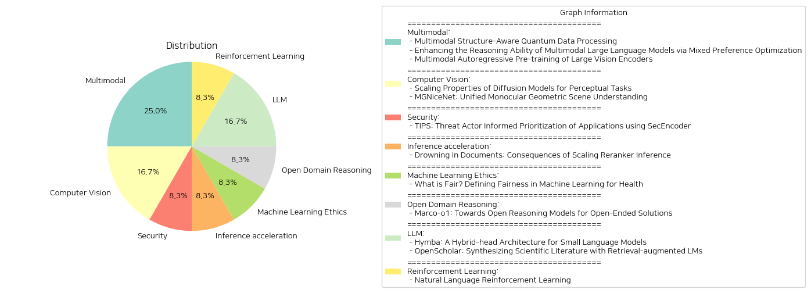

# Daily Artificial Intelligence Insights : Papers

## 👽 Multimodal

**요약:**

1. **논문의 핵심 주제 및 테마 추출**
   - 'Multimodal Structure-Aware Quantum Data Processing': 자연어 처리에서의 양자 데이터 처리, 다중모드 구조 인식을 통한 데이터 처리
   - 'Enhancing the Reasoning Ability of Multimodal Large Language Models via Mixed Preference Optimization': 다중모드 대형 언어 모델의 추론 능력 향상, 혼합 선호 최적화
   - 'Multimodal Autoregressive Pre-training of Large Vision Encoders': 대규모 비전 인코더의 다중모드 자기회귀 사전 훈련

2. **공통 키워드, 트렌드, 패턴 식별**
   - '다중모드': 모든 논문에서 다중모드 데이터 사용 및 처리 강조
   - '모델 퍼포먼스 향상': 데이터 처리 및 학습 방법 최적화를 통한 모델 성능 개선
   - '구조 인식 및 자기회귀 방법론': 구조적 데이터 처리 및 자기회귀 프레임워크 강조

3. **주요 사건 및 중요한 정보 요약**
   - 첫 번째 논문에서는 양자 컴퓨팅을 활용하여 다중모드 데이터의 구조를 인식 및 처리하는 새로운 방법론 MultiQ-NLP를 개발하여 이미지 분류 과제에서 성능을 보여준다.
   - 두 번째 논문에서는 다중모드 대형 언어 모델의 추론 성능을 개선하기 위해 Mixed Preference Optimization을 도입하여, 여러벤치마크에서 성공적인 성능 향상을 기록했다. 
   - 세 번째 논문에서는 대규모 비전 인코더의 성능을 개선하기 위한 다중모드 자기회귀 사전 훈련 방법 AIMV2를 소개하고, 다양한 비전 및 다중모드 태스크에서 우수한 성능을 보였다.

4. **이벤트가 다양한 부문에 미친 영향 분석**
   - 양자 컴퓨팅을 활용한 자연어 처리: 데이터의 자연스러운 구조 인식 가능성 및 고성능 구현을 통하여 자연어 처리 분야의 혁신 가능성을 제시.
   - 다중모드 대형 언어 모델 최적화: 선호 최적화 기술 개발로 다중모드 추론 능력 향상, 인공지능 언어 모델의 적용 범위 및 활용성 확대.
   - 비전 인코더의 성능 향상: 비전 및 다중모드 데이터 처리의 효율성을 높여 다양한 산업 분야에서의 자동화 및 인공지능 응용 확대.

5. **최종 종합 요약 및 미래 발전 가능성**
   이들 연구들은 다중모드 데이터를 활용한 모델 성능 향상 방법론을 제시하여, 양자 컴퓨팅, 선호 최적화, 자기회귀 사전 훈련 등을 통해 다방면에서 가능성을 탐색했다. 특히, 다중모드 데이터와 인공지능 기술의 결합은 미래의 다양한 분야와 응용에서 중요한 역할을 할 것으로 기대된다. 꾸준한 연구와 개발이 계속된다면 산업 전반에 걸쳐 혁신적 발전을 이룰 수 있을 것으로 보인다.

**출처:**

 - Multimodal Structure-Aware Quantum Data Processing (https://deeplearn.org/arxiv/547000/multimodal-structure-aware-quantum-data-processing)
 - Enhancing the Reasoning Ability of Multimodal Large Language Models via Mixed Preference Optimization (http://arxiv.org/abs/2411.10442v1)
 - Multimodal Autoregressive Pre-training of Large Vision Encoders (http://arxiv.org/abs/2411.14402v1)

## 🥳 Computer Vision

**요약:**

요약 보고서:

1. 주요 주제 및 테마 추출:
   - 'Scaling Properties of Diffusion Models for Perceptual Tasks' 논문은 디퓨전 모델을 기반으로 깊이 추정, 광학 흐름, 비가시적 분할 등 시각적 인식 과제를 다루는 것에 중점을 두고 있습니다. 이미지 변환을 통한 여러 인식 작업을 하나의 체계로 통합하며, 확장성 있는 훈련과 테스트 컴퓨팅을 분석하여 최적의 성능을 추구합니다.
   - 'MGNiceNet: Unified Monocular Geometric Scene Understanding' 논문은 단일 이미지로부터의 기하학적 장면 이해를 중심으로, 자율주행차에 실시간 적용 가능한 패노픽 세분화와 자기 지도 깊이 추정을 연계해 다루고 있습니다. 최신 기법 RT-K-Net의 확장성과 자기 지도 깊이 추정 모델을 제안하며, 두 방법론을 효과적으로 결합합니다.

2. 공통 키워드, 트렌드 및 패턴 식별:
   - 두 논문 모두 시각적 인식 및 이해를 위한 모델 제안이라는 공동의 관심사를 지니고 있으며, 이미지 기반 분석과 자기 지도 학습 기법을 이용하고 있습니다. 실시간 처리, 자율주행, 확장 가능한 모델, 데이터와 컴퓨팅 자원 최적화 등이 주요 키워드로 등장합니다.

3. 각 논문의 주요 사건 및 중요 정보 요약:
   - 'Scaling Properties of Diffusion Models for Perceptual Tasks'에서는 디퓨전 모델이 적은 데이터와 컴퓨팅 자원으로도 최첨단 성과를 달성할 수 있음을 시사하며, 컴퓨팅 자원 사용의 최적화 방법을 제안합니다.
   - 'MGNiceNet'에서는 패노픽 세분화와 자기 지도 깊이 추정을 결합해 실시간 처리 효율성을 증대시키는 방법을 제안하며, 주요 자율주행 데이터셋을 통해 검증합니다.

4. 이러한 사건의 다양한 부문에 대한 영향 분석:
   - 시각적 인식을 위한 디퓨전 모델의 확장 가능성 및 최적화는 컴퓨터 비전 영역에서의 응용 가능성을 넓히게 하며, 특히 자율주행차와 같은 실시간 분석이 요구되는 분야에 긍정적인 영향을 미칠 수 있습니다.
   - MGNiceNet의 실시간 패노픽 세분화 및 깊이 추정 개선은 자율주행차의 안전성과 효율성을 증대시켜 산업 전반에 중요한 영향을 미칠 수 있습니다.

5. 결론 및 미래 가능성:
   - 두 연구는 컴퓨터 비전 및 자율주행 분야의 기술 발전에 중요한 기여를 할 것으로 보이며, 특히 실시간 성능 향상과 자원 최적화 부분에서 주목할 만한 발전을 이룰 것입니다. 향후 더욱 발전된 방법론들이 추가적인 데이터셋 및 시나리오에서 검증되고, 산업계로의 실질적인 도입을 촉진할 가능성이 높습니다.

**출처:**

 - Scaling Properties of Diffusion Models for Perceptual Tasks (https://deeplearn.org/arxiv/548172/scaling-properties-of-diffusion-models-for-perceptual-tasks)
 - MGNiceNet: Unified Monocular Geometric Scene Understanding (https://deeplearn.org/arxiv/549352/mgnicenet:-unified-monocular-geometric-scene-understanding)

## ☀️ Security

**요약:**

1. 주요 주제 및 테마 추출:
   - 위협 행위자 정보 기반 애플리케이션 우선순위화
   - SecEncoder를 활용한 보안에 특화된 언어 모델
   - 인코더와 디코더 언어 모델의 결합
   - 위협 행위자 정보 통합을 통한 탐지의 정확성 및 연관성 향상
   - 현실 세계의 벤치마크 데이터셋을 활용한 높은 효율성 증명

2. 공통 키워드, 트렌드 및 패턴 식별:
   - 위협 행위자 정보
   - 언어 모델의 결합 (인코더 및 디코더)
   - 보안 탐지 및 우선순위화
   - 현실 적용을 통한 보안 기능 개선

3. 주요 이벤트 및 중요한 정보 요약:
   - TIPS는 위협 행위자 정보를 통합하여 애플리케이션 탐지 및 우선순위화의 정확성과 관련성을 크게 향상시킴.
   - SecEncoder 기반의 언어 모델은 인코더와 디코더의 장점을 결합하여 악성 애플리케이션 탐지에서 F-1 점수 0.90을 달성.
   - 실제 상황에서 TIPS 사용 시 보안 분석가의 조사가 87%까지 줄어들어 위협 대응 과정이 간소화되고 보안 태세가 개선됨.

4. 이러한 이벤트가 다양한 부문에 미친 영향 분석:
   - 보안 기술 분야: TIPS의 도입은 보안 탐지 기능을 강화하여, 보안 인력의 업무 효율성을 개선하고, 문제 해결 속도를 가속화함.
   - 기업 IT 보안: 대규모 데이터 환경에서 위협을 보다 신속하게 식별하고 대응할 수 있는 역량을 강화하여 전반적인 보안 수준을 높임.
   - 연구 및 개발 분야: 위협 행위자 정보를 활용한 새로운 모델 개발 가능성에 대한 실증적 근거 제공.

5. 최종 통합 요약 및 향후 주목할 개발 사항:
   - TIPS는 위협 정보를 통합한 혁신적인 보안 솔루션으로, 초점화된 탐지와 효율적인 자원 관리에 기여함으로써 보안 관행을 변화시킴.
   - 앞으로 위협 행위자 정보를 활용한 보안 솔루션의 발전 가능성이 있으며, 인공지능과 머신러닝 기술의 협업을 통한 보안 모델의 더욱 정교한 개발이 기대됨.

**출처:**

 - TIPS: Threat Actor Informed Prioritization of Applications using SecEncoder (https://deeplearn.org/arxiv/548075/tips:-threat-actor-informed-prioritization-of-applications-using-secencoder)

## 🫧 Inference acceleration

**요약:**

제목: '서류의 홍수: 스케일링 재배치 추론의 결과'

이 논문에서는 크로스 인코더(Cross-Encoder)를 사용한 재배치기가 초기 정보 검색(IR) 시스템에서 검색된 문서의 점수를 다시 매기는 데 사용되며, 이는 비용이 많이 들지만 더 효과적일 것으로 가정되기 때문임을 설명합니다. 그러나 저자는 이러한 가정을 도전하며, 첫 번째 검색 단계 재점수화가 아닌 전체 검색을 위한 재배치 성능을 측정합니다. 실험 결과는 흥미로운 트렌드를 드러냅니다: 기존의 최고의 재배치기는 점수를 매기는 문서 수가 많아질수록 수익이 감소하고, 일정 한계를 넘어서면 품질이 저하된다는 것입니다. 사실, 이와 같은 설정에서는 재배치기가 쿼리와 어휘적 또는 의미적 중복이 없는 문서에 높은 점수를 부여하기도 합니다. 이 연구는 향후 재배치 개선에 대한 연구를 촉진하는 데 기여할 수 있기를 기대합니다.

논문에서 강조한 주요 주제와 경향은 다음과 같습니다:

1. **효율성과 비용의 문제:** 재배치기는 비용이 많이 드는데 비해 검색 성능이 임계점을 넘으면 품질이 저하될 수 있습니다.
   
2. **점수 감소의 문제점:** 기존의 재배치기들이 특정 문서 수를 넘어서면 점수의 수익이 감소하고, 오히려 품질을 저하시킨다는 점이 밝혀졌습니다.
   
3. **어휘적 및 의미적 관련 없음:** 재배치기가 쿼리와 관련 없는 문서에 높은 점수를 부여할 가능성이 큽니다.

이러한 발견은 정보 검색 시스템의 설계 및 구현에 영향을 미치며, 특히 대규모 데이터 세트에서의 검색 최적화 전략을 다시 고민하게 합니다. 향후 연구 방향으로는, 재배치기의 효율성을 높이고 불필요한 문서에 대한 높은 점수를 방지하기 위한 새로운 방법론 개발이 주목받을 수 있을 것입니다. 이는 정보 검색, 데이터 분석 및 자연어 처리 분야에 주요한 기여를 할 수 있는 여지가 있습니다.

**출처:**

 - Drowning in Documents: Consequences of Scaling Reranker Inference (https://deeplearn.org/arxiv/549218/drowning-in-documents:-consequences-of-scaling-reranker-inference)

## ✈️ Machine Learning Ethics

**요약:**

1. 주요 주제 및 테마:
   - 머신러닝(ML)에서의 공정성 정의
   - 건강 분야에서의 ML 모델의 안전성, 효과성, 형평성 확보 중요성
   - 기존 건강 불평등의 강화 방지
   - 공정성의 개념과 계량화

2. 공통적인 키워드, 트렌드 및 패턴:
   - 공정성
   - 건강 불평등
   - ML 모델
   - 임상적 의사 결정

3. 주요 사건 및 주요 정보 요약:
   - ML 모델이 공정하지 않게 작용할 수 있는 이유를 검토
   - 현실 세계 사례에서 공정성이 어떻게 계량화되었는지 분석
   - 자주 사용되는 공정성 메트릭의 개요 제공
   - 공개된 전자 건강 기록(EHR) 데이터세트의 사례 연구 포함 
   - 공정성을 정의하는 현재 연구의 도전과 기회 논의

4. 이러한 사건의 다양한 부문에 대한 영향 분석:
   - 건강 부문에서 ML 모델의 적용시 공정성이 미칠 수 있는 영향 분석
   - 공정성 부족으로 인한 건강 불균형 및 불평등 심화 방지 필요
   - 모델의 신뢰성 및 임상적 수용성 증대

5. 최종 통합 요약 및 결론:
   - 건강 분야에서 ML 모델의 공정성은 필수적이며, 이를 위한 명확한 정의와 지표 개발이 중요함.
   - 기존 건강 불평등을 악화시키지 않으려면 모델의 공정성 강화 필요.
   - 사례 연구를 통해 현실적인 문제를 파악하고, 공정성 측면에서 모델 평가에 대한 통찰력 제공.
   - 미래 연구 방향으로는 공정성을 더 깊이 이해하고, 이를 현실에 적용 가능한 수준으로 끌어올리는 것이 중요한 과제로 제시됨. 
   - 지속적으로 존재하는 도전 과제와 연구 기회를 통해 더 발전된 공정성 기준이 필요함. 

향후 발전 가능성:
- 건강 분야에서의 ML 공정성 연구 발전
- EHR과 같은 실질적인 데이터 기반 연구 강화
- 공정성 계량화 및 평가 메트릭 개선
- 다양한 환자 그룹에 대한 공정성 개선 및 연구 확대.

**출처:**

 - What is Fair? Defining Fairness in Machine Learning for Health (https://deeplearn.org/arxiv/550073/what-is-fair?-defining-fairness-in-machine-learning-for-health)

## 🪄 Open Domain Reasoning

**요약:**

제목: 'Marco-o1: 개방형 해결책을 위한 개방형 추론 모델의 발전'

요약 보고서:

1. 주요 주제 및 테마 추출:
   - 큰 추론 모델(LRM)에 대한 연구 관심 증가
   - 표준 답을 가진 학문(수학, 물리학, 코딩)뿐만 아니라 개방형 해결책에 대한 중점 강조
   - 모델의 일반화 능력 및 보상 체계의 어려움 논의

2. 공통 키워드, 트렌드 및 패턴 식별:
   - 개방형 추론 모델
   - 강화 학습(RL)과의 연결
   - Chain-of-Thought (CoT)와 Monte Carlo Tree Search (MCTS)의 활용
   - 반사 메커니즘 및 혁신적 추론 전략 사용

3. 주요 이벤트 및 중요 정보 요약:
   - OpenAI o1을 기반으로 한 큰 추론 모델 연구의 관심 증가
   - Marco-o1의 개방형 문제 해결 능력 강조
   - 체계적인 튜닝과 다양한 혁신 전략 적용

4. 이러한 이벤트의 영향 분석:
   - 다양한 분야에서 기준이 불명확한 곳에 대한 효과적인 대응 가능성
   - 복잡한 실제 문제 해결 시의 활용 가능성 증대
   - 강화 학습과 추론 전략의 융합을 통한 모델 성능 향상

5. 결론 및 미래 발전 방향 제안:
   - Marco-o1은 개방형 해결책을 위한 매우 효과적인 도구로 자리잡을 가능성이 크다.
   - 다양한 도메인 및 복잡한 문제에서 표준화되지 않은 보상 체계를 극복할 필수 솔루션으로서의 역할 기대
   - 미래에는 이러한 개방형 추론 모델에 대한 연구가 다양한 분야에서 더욱 활발히 전개될 것으로 예상됨. 

이 보고서는 Marco-o1의 개방형 추론 모델이 어떻게 다양한 분야에서 복잡한 문제를 효과적으로 해결할 수 있는지를 보여주며 향후 이 모델의 활용이 어떻게 발전할지에 대한 통찰을 제공합니다.

**출처:**

 - Marco-o1: Towards Open Reasoning Models for Open-Ended Solutions (http://arxiv.org/abs/2411.14405v1)

## 🤩 LLM

**요약:**

보고서 요약:

1. 주요 주제 및 테마:
    - 'Hymba' 논문에서는 하이브리드 헤드 아키텍처 기반의 소형 언어 모델를 소개하며, 트랜스포머 주의 메커니즘과 상태 공간 모델(SSMs)을 결합하여 효율성을 향상시킵니다. 
    - 'OpenScholar' 논문은 retrieval-augmented LMs를 활용하여 과학적 문헌을 합성하는 방법을 제안하고, 과학적 질문에 답하기 위해 4천 5백만 개의 오픈 액세스 논문에서 관련 구절을 식별하여 인용 기반 응답을 생성합니다.

2. 공통 키워드, 트렌드 및 패턴:
    - 두 논문 모두 소형 언어 모델의 효율성을 개선하는 데 중점을 두고 있으며, 각각의 접근법을 통해 언어 모델의 정확도와 성능을 향상시키고자 합니다.
    - 각 모델은 상당한 성능 향상을 보여주며, 소형 모델의 능력을 대형 모델과 비교할 수 있는 수준으로 끌어올리고 있습니다.

3. 주요 사건 및 중요한 정보 요약:
    - 'Hymba' 모델은 학습 가능한 메타 토큰 및 교차 계층 키-값(KV) 공유와 부분 슬라이딩 윈도우 주의를 통해 캐시 크기를 줄이고 성능을 최적화하였습니다. Hymba-1.5B-Base 모델은 작은 LMs 중 최첨단 결과를 달성하였습니다.
    - 'OpenScholar'에서는 ScholarQABench를 구축하여 다양한 과학 분야에서 학문적 질문을 해결하는 능력을 평가하였습니다. OpenScholar-8B는 다른 대형 모델보다 높은 정확성을 보여주었으며, 인용 정확도가 인간 전문가 수준에서 달성되었음을 강조합니다.

4. 이러한 사건이 다양한 부문에 미치는 영향 분석:
    - 'Hymba' 모델의 발전은 소형 언어 모델의 활용도를 높여, 다양한 산업에서 더 효율적이고 비용 효과적인 자연어 처리 솔루션을 가능하게 할 수 있습니다.
    - 'OpenScholar'의 발전은 연구자들이 방대한 과학 문헌을 효율적으로 탐색하고 분석하여 발전에 기여하게끔 도와줄 것입니다.

5. 최종 요약과 추후 주목해야 할 발전:
    - 두 논문은 소형 언어 모델의 효율성 및 정확성을 극대화하기 위한 혁신적인 접근법을 제시하고 있습니다. 이는 자연어 처리 산업 및 과학 연구 분야에 큰 변화를 가져올 수 있습니다.
    - 향후, 이러한 기술이 더 다양한 분야에 적용되어 실질적인 통찰을 제공하고, 연구 및 산업의 경계를 확장할 가능성이 주목됩니다. 또한, 공공을 위한 오픈 소스 제공이 강조되며, 연구의 확장성과 접근성도 제공할 것으로 기대됩니다.

**출처:**

 - Hymba: A Hybrid-head Architecture for Small Language Models (http://arxiv.org/abs/2411.13676v1)
 - OpenScholar: Synthesizing Scientific Literature with Retrieval-augmented LMs (http://arxiv.org/abs/2411.14199v1)

## 🍊 Reinforcement Learning

**요약:**

보고서 요약:

1. 주요 주제 및 테마 추출:
   - 자연어 강화 학습(NLRL)
   - 마르코프 결정 과정(MDP)과 전통적인 강화 학습의 확장
   - 자연어 기반 표현 공간의 활용
   - 정책 목표, 정책, 가치 함수, 벨만 방정식, 정책 반복의 언어적 재정립
   - 대규모 언어 모델(LLM)의 발전

2. 공통 키워드, 트렌드, 패턴 식별:
   - 강화 학습(RL)과 자연어 처리(NLP)의 융합
   - 언어 모델의 정책 및 가치 개선
   - 다양한 게임 도메인(미로, 브레이크스루, 틱택토)에서의 적용

3. 각 논문의 주요 사건 및 중요한 정보 요약:
   - 연구는 MDP를 자연어로 확장하여 새로운 강화 학습 방법론인 NLRL을 제안
   - 대규모 언어 모델의 발전을 통해 NLRL이 현실적으로 구현 가능
   - 게임 실험을 통해 NLRL의 효과성, 효율성, 해석 가능성을 입증

4. 이러한 사건의 다양한 부문에 미치는 영향 분석:
   - 게임: 복잡한 의사 결정 문제의 효율적 해결을 위한 새로운 접근방식 제공
   - 로봇공학: 자연어 기반 명령 해석 및 실행의 가능성
   - 언어 모델: 강화 학습의 원리를 적용한 정책 및 가치 향상

5. 최종 통합 요약 및 향후 발전 가능성:
   - NLRL은 자연어 처리를 강화 학습에 통합하여 다양한 응용과 문제 해결 능력을 강화하는 데 기여할 것으로 예상됨
   - 정책 및 가치 함수의 언어적 재정립은 더욱 직관적이고 해석 가능한 모델을 제공할 수 있음
   - 대규모 언어 모델의 지속적인 발전은 더욱 다양한 분야로의 NLRL 확장을 가능하게 할 것
   - 연구 코드는 깃허브를 통해 공개되어 향후 연구 및 발전에 기여할 가능성
   - 향후 대규모 언어 모델과 NLRL의 결합을 통한 혁신적인 응용 시나리오 주목 필요

이 보고서는 논문에서 다룬 자연어 강화 학습의 혁신적인 접근과 그 가능성을 조망하며, 향후 기술 발전과 응용에 중요하다는 결론을 제시합니다.

**출처:**

 - Natural Language Reinforcement Learning (http://arxiv.org/abs/2411.14251v1)

