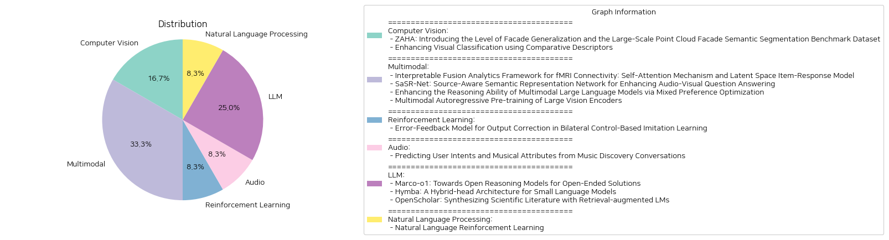

# Daily Artificial Intelligence Insights : Papers

## 🌞 Computer Vision

**요약:**

### 요약 보고서

최근 논문들은 이미지 처리와 컴퓨터 비전 분야에서 중요한 진보를 이루었습니다. 각 논문에서 다루는 주요 주제와 트렌드를 분석하여 요약하면 다음과 같습니다.

#### 1. 주요 주제 및 테마

- **ZAHA 프로젝트:**
  - 주제: 파사드(건물 외관) 일반화 수준과 대규모 포인트 클라우드 파사드 의미 분할 데이터셋
  - 핵심: 파사드 의미 분할의 도전 과제로서, 국제 도시 모델링 표준을 기반으로 계층적 파사드 클래스를 소개. 3D 파사드 분할을 위한 큰 규모의 데이터셋 제공.

- **시각 분류 향상법:**
  - 주제: 비교적 설명자를 이용한 시각 분류의 향상
  - 핵심: VLMs와 LLMs를 활용하여 기존 분류 모델의 성능 향상, 특히 미세한 클래스 차이를 구별하는 데 집중.

#### 2. 공통 키워드, 트렌드 및 패턴

- **시맨틱 세그멘테이션**: 정확한 표현을 위해 다양한 데이터와 클래스를 사용하는 경향.
- **대규모 데이터셋**: 큰 규모의 데이터셋을 활용하여 '도시 디지털 트윈'을 실현.
- **비교적 설명자**: 시각 분류에서 클래스 간 미세한 차이를 구별하는 데 도움을 주는 혁신적 접근 방식.

#### 3. 각 논문의 주요 사건 및 중요 정보 요약

- **ZAHA 데이터셋**:
  - 국제 표준과 일치하는 새로운 계층적 파사드 클래스를 도입하고, 601백만 개의 주석이 달린 포인트를 제공하는 대규모 의미 3D 파사드 분할 데이터셋을 소개.
  - 기존의 분할 방법론에 대한 비교 평가와 분석.

- **비교적 설명자를 통한 시각 분류 개선**:
  - 기존의 방식보다 고급 개념을 포함한 설명자가 높은 정확도를 보이는 것을 확인.
  - 비슷한 클래스 간의 미세한 차이를 강조하여 분류를 개선.
  - CLIP 공간 내 설명자 필터링 과정을 통해 이미지 임베딩과의 근접성을 높여 성능 향상.

#### 4. 이러한 사건들의 영향을 분석

- **도시 디지털 트윈 개발**: 3D 의미 분할 발전을 통한 스마트 시티 및 도시 계획에 혁신적 기여.
- **시각 분류 정확도 향상**: 다양한 산업에서 시변 분류의 사용을 증가시키고, 특히 자동화 및 인공지능 응용 분야에서의 활용도 증대.

#### 5. 결론 및 미래 발전 방향

- ZAHA 프로젝트는 파사드 분할의 표준을 세우고, 도시 계획과 건축 디자인 부문에 상당한 영향을 미칠 것으로 예상됩니다.
- 비교적 설명자를 통한 시각 분류 향상은 자동화, 물체 인식, AI 기반 산업 분야에서 더 많은 응용 가능성을 열어주며, 향후 연구를 통해 더 개선된 정확도를 기대할 수 있습니다.

이 두 연구는 각 분야에서 차세대 기술 발전을 주도하며, 다양한 응용 분야에서의 실용성을 제고할 것입니다.

**출처:**

 - ZAHA: Introducing the Level of Facade Generalization and the Large-Scale Point Cloud Facade Semantic Segmentation Benchmark Dataset (https://deeplearn.org/arxiv/547106/zaha:-introducing-the-level-of-facade-generalization-and-the-large-scale-point-cloud-facade-semantic-segmentation-benchmark-dataset)
 - Enhancing Visual Classification using Comparative Descriptors (https://deeplearn.org/arxiv/547117/enhancing-visual-classification-using-comparative-descriptors)

## 🎉 Multimodal

**요약:**

보고서 요약:

1. 키 주제 및 테마 추출:
   - 첫 번째 연구는 fMRI 신경망 분석을 개선하기 위한 자가 주의 메커니즘과 잠재 공간 항목 반응 모델에 대해 다루고 있습니다.
   - 두 번째 연구는 오디오-비주얼 질문 응답을 향상시키기 위한 소스 인식 의미 표현 네트워크(SaSR-Net)를 제안하고 있습니다.
   - 세 번째 연구는 혼합 선호 최적화(MPO)를 통해 멀티모달 대형 언어 모델의 추론 능력을 강화하는 방법에 대해 설명합니다.
   - 네 번째 연구는 대형 비전 인코더의 멀티모달 자회귀 사전 학습 방법을 제시합니다.

2. 공통 키워드, 트렌드 및 패턴 식별:
   - 멀티모달 분석: 여러 논문에서 멀티모달 데이터를 다루며, 오디오 및 비주얼 정보의 통합, 텍스트 및 이미지의 결합 등 다양한 데이터를 통합하려는 노력이 보입니다.
   - 인공지능 및 머신러닝의 고도화: 딥러닝과 대형 언어 모델의 성능 및 해석 가능성을 개선하는 방향으로 연구가 진행되고 있습니다.

3. 주요 사건 및 정보 요약:
   - fMRI 연결 분석은 자가 주의 메커니즘을 활용하여 해석 가능성을 향상시키고 특정 인지 장애의 지정학적 기능을 식별합니다.
   - SaSR-Net은 질문에 적합하게 오디오 및 비주얼 정보를 다루며, 복잡한 멀티모달 장면을 효과적으로 분석할 수 있습니다.
   - 멀티모달 대형 언어 모델은 혼합 선호 최적화를 통해 멀티모달 추론 성능이 향상되었습니다.
   - AIMV2는 이미지와 텍스트에서 우수한 성능을 보이며, 자회귀 사전 학습으로 다양한 설정에서 뛰어난 성능을 보여줍니다.

4. 이벤트의 영향 분석:
   - 의료 분야에서는 fMRI 기반의 인지 장애 진단의 정확성과 해석 가능성을 높이는 새로운 분석 프레임워크가 개발되어 임상적 영향이 기대됩니다.
   - 멀티미디어 애플리케이션에서는 SaSR-Net을 통해 향상된 사용자 경험 제공과 더불어 복잡한 정보를 처리하는 기능이 강화될 수 있습니다.
   - 인공지능 및 자연어 처리 분야에서는 대형 언어 모델의 성능 향상을 통해 보다 정교한 텍스트 및 멀티모달 데이터 처리가 가능해져 다양한 산업에 긍정적인 파급 효과를 미칠 것입니다.

5. 결론 및 향후 주목해야 할 개발:
   - 이러한 연구들은 인공지능의 해석력 및 성능을 높이는 방향으로 나아가고 있으며, 특히 멀티모달 분석에 있어 중요한 기초를 제공합니다.
   - 향후에는 멀티모달 데이터를 보다 효율적으로 처리할 수 있는 새로운 알고리즘과 모델들이 발표될 가능성이 높습니다.
   - 각 분야에서 이러한 기술들이 실제 응용에 활용되고, 실세계 문제 해결의 실질적인 도구로 자리잡기 위해 추가 연구와 개발이 필요할 것입니다.

**출처:**

 - Interpretable Fusion Analytics Framework for fMRI Connectivity: Self-Attention Mechanism and Latent Space Item-Response Model (https://deeplearn.org/arxiv/550240/interpretable-fusion-analytics-framework-for-fmri-connectivity:-self-attention-mechanism-and-latent-space-item-response-model)
 - SaSR-Net: Source-Aware Semantic Representation Network for Enhancing Audio-Visual Question Answering (https://deeplearn.org/arxiv/547139/sasr-net:-source-aware-semantic-representation-network-for-enhancing-audio-visual-question-answering)
 - Enhancing the Reasoning Ability of Multimodal Large Language Models via Mixed Preference Optimization (http://arxiv.org/abs/2411.10442v1)
 - Multimodal Autoregressive Pre-training of Large Vision Encoders (http://arxiv.org/abs/2411.14402v1)

## 🌞 Reinforcement Learning

**요약:**

보고서 요약:

이번 연구의 주요 주제는 '이중 제어 기반 모방 학습에서 출력 오차 수정을 위한 오차-피드백 모델'입니다. 최근 신경망을 사용한 모방 학습이 로봇이 유연한 작업을 수행할 수 있도록 했지만, 신경망은 피드포워드 구조로 작동하여 출력 오차를 보정하는 메커니즘을 가지고 있지 않다는 한계가 존재했습니다. 이 문제를 해결하기 위해 신경망에 피드백 메커니즘을 도입하여 오류를 수정하는 방식을 개발하였습니다. 

연구에서는 신경망을 하부와 상부 계층으로 구성된 계층적 구조로 사용하였으며, 하부 계층은 상부 계층을 따라가도록 제어되었습니다. 그리고 하부 계층에 내부 상태가 없는 다층 퍼셉트론을 사용하여 오류 피드백을 강화하였습니다. 문자쓰기 작업에서 이 모델은 이전에 훈련되지 않은 문자를 쓰는 데 있어 향상된 정확성을 보여주었습니다. 자동 제어와 오류 피드백을 통해 하부 계층이 상부 계층의 출력을 효과적으로 추적할 수 있음을 확인했습니다. 

이 연구는 신경망과 제어 이론을 통합하는 데 있어 유망한 발전을 나타냅니다. 이번 연구가 로봇 제어 분야와 인공지능 학습에 미치는 영향은 크며, 이를 통해 향후 다른 복잡한 작업을 수행할 수 있는 기회를 열 수 있습니다. 앞으로는 이러한 피드백 메커니즘을 활용한 신경망 모델이 다양한 산업 분야에서 채택될 가능성을 주목할 필요가 있습니다.

**출처:**

 - Error-Feedback Model for Output Correction in Bilateral Control-Based Imitation Learning (https://deeplearn.org/arxiv/550311/error-feedback-model-for-output-correction-in-bilateral-control-based-imitation-learning)

## 🎇 Audio

**요약:**

1. 주요 주제 및 테마 추출:
   - 사용자 의도 및 음악 속성 예측
   - 음악 발견 대화를 위한 의도 분류
   - 사전학습된 언어 모델을 활용한 의도 및 속성 분류
   - 대화 맥락 이해를 위한 이전 대화 기록 병합 방법 제안

2. 공통 키워드, 트렌드 및 패턴:
   - 사전 학습된 언어 모델
   - 의도 분류 및 속성 분류
   - 음악 도메인의 대화형 의도 및 필요
   - 대화 맥락 이해 강화

3. 주요 사건 및 중요 정보 요약:
   - 기존에는 다양한 도메인에서는 의도 분류가 많이 연구되었지만 음악 분야에서는 상대적으로 적은 연구가 있었다.
   - 연구에서는 음악 발견 대화를 위한 의도 분류 모델을 개발하여, 사용자 의도 뿐만 아니라 음악 속성에 대한 분류도 함께 수행한다.
   - 이전 대화 기록을 사용하여 대화의 전반적인 맥락을 이해하게 하여 모델 성능을 향상시켜, 특히 F1 점수 향상에 기여했다.
   - 제안된 모델은 pretrained Llama 3 모델의 zero-shot 및 few-shot 성능을 초과한다.

4. 이 사건들의 여러 분야에 대한 영향 분석:
   - 음악 산업에서의 사용자 경험 향상: 사용자의 의도 및 음악적 필요를 정확히 파악함으로써 음악 추천 시스템의 개인화 및 사용자 만족도가 증가할 수 있다.
   - 대화형 AI 및 학습 모델 발전: 사전 학습된 모델과 대화 기록 병합 방법을 통해 대화형 AI 시스템의 성능을 대폭 향상시킬 수 있는 가능성을 보여준다.

5. 최종 요약 및 미래의 발전 가능성:
   이 연구는 음악 도메인에서 의도 및 속성 분류의 중요성을 강조하고 있으며, 제안된 모델은 대화 맥락을 이해하여 높은 성능을 발휘한다. 음악 추천 시스템이나 대화형 인공지능에서 사용자 맞춤화가 강화될 것으로 기대되며, 향후 이러한 기술의 발전은 다양한 도메인에서 사용자 요구를 더욱 잘 반영할 수 있도록 기여할 것이다. 추가 연구는 다양한 음악적 맥락과 사용자 유형에 대한 분석을 통해 모델의 일반화 능력을 높이는 방향으로 진행될 수 있다.

**출처:**

 - Predicting User Intents and Musical Attributes from Music Discovery Conversations (https://deeplearn.org/arxiv/550312/predicting-user-intents-and-musical-attributes-from-music-discovery-conversations)

## ⭐ LLM

**요약:**

**요약 보고서:**

1. **주요 주제 및 테마 추출**:
   - 'Marco-o1': 대규모 추론 모델(LRM) 연구, 개방형 해결책에 대한 중점, 표준 없는 영역에서의 일반화 가능성.
   - 'Hymba': 소형 언어 모델 효율성 개선, 하이브리드-헤드 평행 구조, 효율적 컨텍스트 요약.
   - 'OpenScholar': 과학 문헌 합성, 회수 증강 LMs, 인용 정확도, 과학적 질문에 대한 답변 제공.

2. **공통 키워드, 트렌드 및 패턴 식별**:
   - 모든 논문은 언어 모델(LM)을 개선하여 특정 문제를 해결하려고 함.
   - 강화 학습, 추론 전략, 하이브리드 건축 모형 등 새로운 기술 통합에 초점.
   - 효과적인 데이터 및 리소스 사용을 통한 모델의 효율성 및 정확도 강조.

3. **주요 사건 및 주요 정보 요약**:
   - **'Marco-o1'**: CoT 세부 튜닝, MCTS, 반사 메커니즘 등을 활용하여 개방형 문제 해결에 적합한 모델 개발.
   - **'Hymba'**: 효율성을 위한 하이브리드 헤드 구조 및 최적화 기술 활용, SOTA 성능 기록.
   - **'OpenScholar'**: 과학 질문에 대해 정확한 응답을 제공하는 회수 증강 LM, 인용 정확도 향상, ScholarQABench 벤치마크를 통한 성능 평가.

4. **이 사건들이 다양한 분야에 미치는 영향 분석**:
   - 과학 연구 및 문헌 검색 효율성 증가: OpenScholar와 같은 모델은 연구자들이 광범위한 문헌을 보다 효과적으로 탐색하고 분석할 수 있게 하여 과학적 발견 속도를 증가시킬 수 있음.
   - 기술 발전 촉진: 'Marco-o1'의 개방형 문제 해결 접근 방식과 'Hymba'의 효율성 향상 덕분에 더 광범위한 분야에 걸쳐 응용 프로그램이 가능해질 수 있음.
   - 언어 모델 개발의 새로운 방향 설정: 새로운 구조와 전략들이 언어 모델의 성능을 향상시키며, 이는 다양한 산업 분야에 긍정적인 영향을 미칠 수 있음.

5. **최종 종합 요약 및 향후 개발 추세**:
   - 대규모 언어 모델의 발전과 혁신의 즉각적인 결과로 이 모델들이 언어 처리, 과학 연구 및 데이터 관리의 다양한 영역에서 중요해질 가능성이 큼.
   - 향후, 개방형 해법 및 회수 증강 기법을 중심으로 하는 연구가 증가할 것이며, 이는 모델이 더 복잡한 실제 문제를 해결하는 데 성공적으로 적용될 가능성을 높임.
   - 이들의 발전은 정보 기술, 데이터 과학, 및 인공지능 분야의 향후 진화를 촉진할 전망임.

**출처:**

 - Marco-o1: Towards Open Reasoning Models for Open-Ended Solutions (http://arxiv.org/abs/2411.14405v1)
 - Hymba: A Hybrid-head Architecture for Small Language Models (http://arxiv.org/abs/2411.13676v1)
 - OpenScholar: Synthesizing Scientific Literature with Retrieval-augmented LMs (http://arxiv.org/abs/2411.14199v1)

## 🧸 Natural Language Processing

**요약:**

1. 주요 주제 및 테마 추출:
   - 자연어 강화 학습 (NLRL)
   - 마코프 결정 과정 (MDP)
   - 강화 학습 (RL)의 새로운 적용
   - 큰 언어 모델 (LLM)의 발전

2. 공통 키워드, 트렌드 및 패턴:
   - 자연어 처리(Prompting)와 기울기 기반 훈련
   - 게임, 로봇 공학, 언어 모델 분야에서의 적용과 성과
   - 효과성, 효율성 및 해석 가능성 강조

3. 각 논문에서 주요 사건 및 중요한 정보 요약:
   - 이 논문은 전통적인 RL의 원칙을 자연어 기반으로 재정의하는 NLRL을 소개한다.
   - NLRL은 RL의 과제 목표, 정책, 가치 함수, 벨만 방정식, 정책 반복을 언어에 맞게 새롭게 정의한다.
   - Maze, Breakthrough, Tic-Tac-Toe와 같은 게임에서 실험을 통해 NLRL의 우수성이 입증되었다.
   - 코드와 연구 결과는 기여자와 연구자들이 접근할 수 있도록 깃허브에 공개 예정이다.

4. 이러한 사건들이 다양한 부문에 미친 영향 분석:
   - NLRL은 언어 이해와 의사결정을 통합하여 새로운 인공지능 응용 분야를 가능하게 한다.
   - 언어 모델을 활용한 RL 원리의 적용은 게임 및 로봇 공학 분야의 혁신을 가속화하고 있다.
   - 자연어 처리와 인공지능 연구의 경계를 넓히며, 새로운 기술 개발의 가능성을 열었다.

5. 최종 종합 요약 및 향후 지켜볼 발전 사항:
   - NLRL은 강화 학습의 원리를 자연어 환경으로 확장하여 더 넓은 응용 영역에서 활용될 수 있는 잠재력을 가지고 있다.
   - LLM의 발전과 함께 NLRL의 실용화 및 성능 향상이 기대된다.
   - 향후 연구에서는 NLRL의 규모 확장, 다양한 현실 문제에의 적용, 그리고 다른 대화형 인공지능 시스템과의 통합 가능성을 주목할 필요가 있다.

**출처:**

 - Natural Language Reinforcement Learning (http://arxiv.org/abs/2411.14251v1)

