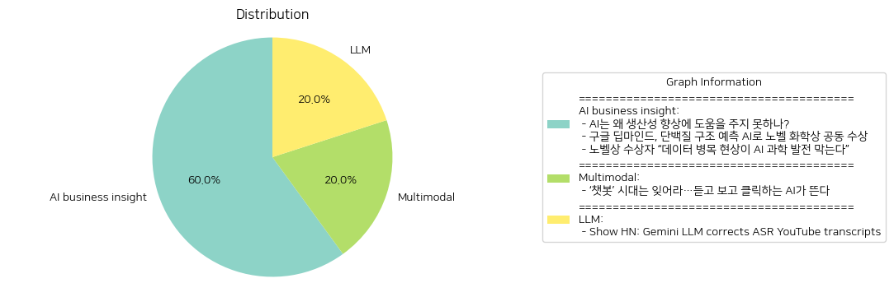

# Daily Artificial Intelligence Insights : News

## 🌿 AI business insight

**요약:**

**주요 주제**:
세 개의 기사에서 공통적으로 나타나는 주요 주제는 인공지능(AI)의 발전과 그에 따른 영향입니다. 특히 AI가 과학 및 경제 분야에서의 잠재력과 한계를 드러냅니다. AI의 과학적 활용 가능성, 기술적 발전, 데이터의 중요성이 강조됩니다.

**주요 사건**:
1. 'AI는 왜 생산성 향상에 도움을 주지 못하나?': AI 기술이 경제 발전에 큰 기대를 받으나, 실제로 생산성 개선에 있어서는 몇 가지 중요한 개선이 필요하다는 점을 지적합니다.
2. '구글 딥마인드, 단백질 구조 예측 AI로 노벨 화학상 공동 수상': 구글 딥마인드의 AI가 단백질 구조 예측 문제를 해결해 노벨 화학상을 공동 수상했다는 성과를 발표합니다.
3. '노벨상 수상자 “데이터 병목 현상이 AI 과학 발전 막는다”': AI를 과학적 발견 도구로 활용하는 데 있어 고품질 데이터의 부족이 걸림돌이 된다는 점이 언급됩니다.

**영향 분석**:
- **경제**: AI의 생산성 향상에는 추가적인 개선이 필요하며, 이러한 기술이 경제 전반에 기여하려면 구체적인 전략이 필요합니다.
- **과학·기술**: AI의 과학적 발견 활용은 데이터 품질에 크게 의존하는 것으로 보이며, 데이터 병목 현상을 극복해야 합니다. 구글 딥마인드의 단백질 구조 예측은 생명과학 분야에 큰 혁신을 가져올 수 있습니다.
- **사회**: AI의 발전은 연구 확장과 새로운 발견의 가능성을 넓히면서 사회 전반에 새로운 기회를 제공할 수 있습니다.

**종합 요약**:
전반적으로 AI가 여러 분야에 미치는 영향과 그 잠재력이 확인되고 있습니다. AI 기술의 진전으로 인한 경제 및 과학적 영향은 탁월하지만, 이를 최대한 활용하려면 데이터 품질 향상과 기술적 개선이 필요합니다. 구글 딥마인드의 성과는 미래 AI 기술의 방향성을 보여주며, 과학적 연구에 혁신적인 방법론을 제시합니다. AI 발전에 따른 경제적·사회적 기회와 도전 과제가 계속되면서, 고품질 데이터 확보와 AI 연구의 보급이 중요한 이슈로 남을 것입니다.

**출처:**

 - AI는 왜 생산성 향상에 도움을 주지 못하나? (https://www.technologyreview.kr/ai%eb%8a%94-%ec%99%9c-%ec%83%9d%ec%82%b0%ec%84%b1-%ed%96%a5%ec%83%81%ec%97%90-%eb%8f%84%ec%9b%80%ec%9d%84-%ec%a3%bc%ec%a7%80-%eb%aa%bb%ed%95%98%eb%82%98/)
 - 구글 딥마인드, 단백질 구조 예측 AI로 노벨 화학상 공동 수상 (https://www.technologyreview.kr/%ea%b5%ac%ea%b8%80-%eb%94%a5%eb%a7%88%ec%9d%b8%eb%93%9c-%eb%8b%a8%eb%b0%b1%ec%a7%88-%ea%b5%ac%ec%a1%b0-%ec%98%88%ec%b8%a1-ai%eb%a1%9c-%eb%85%b8%eb%b2%a8-%ed%99%94%ed%95%99%ec%83%81-%ea%b3%b5%eb%8f%99/)
 - 노벨상 수상자 “데이터 병목 현상이 AI 과학 발전 막는다” (https://www.technologyreview.kr/%eb%85%b8%eb%b2%a8%ec%83%81-%ec%88%98%ec%83%81%ec%9e%90-%eb%8d%b0%ec%9d%b4%ed%84%b0-%eb%b3%91%eb%aa%a9-%ed%98%84%ec%83%81%ec%9d%b4-ai-%ea%b3%bc%ed%95%99-%eb%b0%9c%ec%a0%84-%eb%a7%89%eb%8a%94/)

## 🎇 Multimodal

**요약:**

## 종합 요약 보고서

### 1. **주요 주제**
모든 뉴스 기사에서 공통적으로 나타나는 주제를 파악한 결과, 주요한 주제는 인공지능(AI) 기술의 발전과 그에 따른 응용 분야의 변화입니다. 특히, 기존 텍스트 기반 챗봇에서 더 발전된 형태의 음성과 영상을 생성할 수 있는 AI가 부상하고 있다는 점이 주목받고 있습니다.

### 2. **주요 사건**
- **음성 및 영상 기반 AI의 부상**:
  텍스트 기반 AI 기술에서 진화하여 음성과 영상을 생성할 수 있는 AI 기술이 새로운 트렌드로 각광받고 있습니다. 이는 기존의 챗봇에 비해 더 강력한 상호작용과 사용자 경험을 제공할 수 있을 것으로 기대됩니다.

### 3. **영향 분석**
- **경제적 측면**:
  새로운 AI 기술의 발전은 IT 산업의 혁신을 가져오며, 관련 산업의 성장을 촉진할 수 있습니다. 특히, 음성 및 영상 생성 AI는 미디어, 광고, 콘텐츠 산업 등 다양한 분야에서 새로운 비즈니스 모델을 창출할 수 있을 것입니다.
  
- **사회적 측면**:
  사용자와의 상호작용에서 더욱 자연스러운 경험을 제공함에 따라, 교육 및 학습 방법과 일상생활에서의 정보 접근 방식이 변화할 수 있습니다. 또한, 개인화된 서비스가 더욱 발전함으로써 사용자 경험이 향상될 것으로 예상됩니다.

### 4. **최종 요약**
AI 기술의 발전이 텍스트 기반에서 음성 및 영상 기반으로 급속히 전환되고 있습니다. 이는 사용자의 경험을 강화하고 다양한 산업에서 혁신을 이끌어낼 잠재력이 큽니다. 앞서 언급된 기술들이 IT 산업뿐만 아니라 더 넓은 경제 및 사회적 분야에 파급효과를 미칠 것으로 보입니다. 앞으로 이러한 기술 발전이 어떤 식으로 구체화될 것인지, 새로운 윤리적 문제는 없는지 지속적인 모니터링이 필요할 것입니다. AI 기술의 진화는 빠르게 진행되고 있으며, 이러한 흐름 속에서 새로운 시장 기회를 포착할 수 있는 기업과 개인이 승자가 될 수 있는 시대가 도래할 것입니다.

**출처:**

 - ‘챗봇’ 시대는 잊어라…듣고 보고 클릭하는 AI가 뜬다 (https://www.technologyreview.kr/%ec%b1%97%eb%b4%87-%ec%8b%9c%eb%8c%80%eb%8a%94-%ec%9e%8a%ec%96%b4%eb%9d%bc-%eb%93%a3%ea%b3%a0-%eb%b3%b4%ea%b3%a0-%ed%81%b4%eb%a6%ad%ed%95%98%eb%8a%94-ai%ea%b0%80-%eb%9c%ac%eb%8b%a4/)

## 🌞 LLM

**요약:**

1. **주요 주제**:
   'Show HN: Gemini LLM이 ASR YouTube 기록을 수정한다'는 기사에서 주된 주제는 인공지능 기술의 발전과 그 실질 적용 사례입니다. 특히, LLM(대형 언어 모델)이 ASR(자동 음성 인식) 기술을 통해 유튜브의 녹취록을 정확히 수정할 수 있게 된 점을 강조하고 있습니다. 이러한 기술은 자연어 처리(NLP)와 AI 발전의 일환으로 주목받고 있습니다.

2. **주요 사건**:
   해당 기사에서는 대형 언어 모델인 Gemini LLM이 원래의 자동 음성 인식 기술로 생성된 유튜브 녹취록을 더 정확하게 수정하는 과정을 설명하고 있습니다. 이는 기존의 ASR 기술이 종종 부정확한 결과를 초래한다는 단점 개선을 목표로 하고 있음을 알려줍니다.

3. **영향 분석**:
   이와 같은 기술 발전은 여러 분야에 큰 영향을 미칠 수 있습니다.
   - **사회적 영향**: 정보의 정확성과 접근성을 높여 주체간의 의사소통을 개선하고, 교육 및 학습 자료의 품질을 향상시킬 수 있습니다.
   - **경제적 영향**: 콘텐츠 제작자들은 더 정확한 자막과 녹취록 제공을 통해 시청자 경험을 개선하고, 잠재적인 수익 창출 기회를 확대할 수 있습니다.
   - **기술적 발전**: 이는 AI와 NLP 연구의 발전에 있어 중요한 이정표가 될 수 있으며, 다른 음성 기반 서비스와 애플리케이션에도 파급 효과를 가져올 수 있습니다.

4. **최종 요약**:
   본 기사에서는 Gemini LLM이 ASR 기술을 보다 효율적으로 보완하여 유튜브 녹취록의 정확성을 크게 향상할 수 있다는 점을 다루고 있습니다. 이는 인공지능 기술이 실생활에 적용되어 실질적인 혜택을 제공할 수 있다는 것을 입증하며, 앞으로 더욱 발전할 가능성을 시사합니다. 이러한 기술은 디지털 정보 접근성과 품질을 높이는 계기가 될 것이며, AI 기반 음성 인식 및 처리 기술이 다양한 분야에서 어떻게 활용되고 발전할지를 주목할 만합니다.

**출처:**

 - Show HN: Gemini LLM corrects ASR YouTube transcripts (https://ldenoue.github.io/readabletranscripts/)

