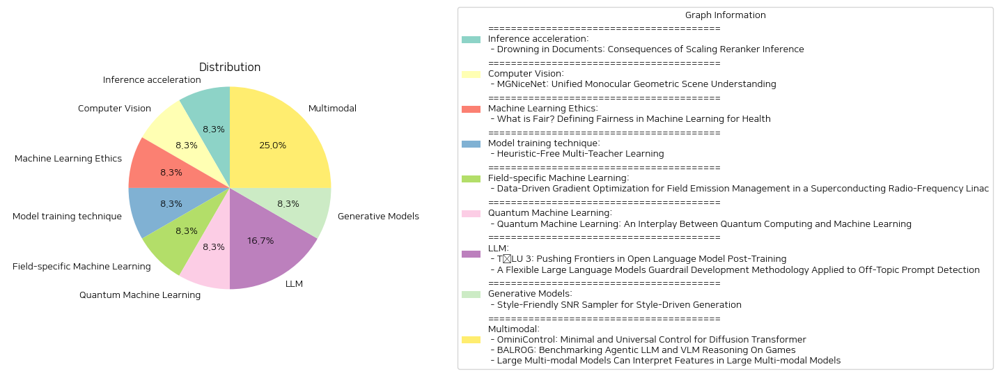

# Daily Artificial Intelligence Insights : Papers

## 🌞 Inference acceleration

**요약:**

### 종합 요약 보고서

#### 주요 주제 및 테마
- **문서 재정렬(reranking) 시스템의 확장에 따른 결과**: 문서의 초기 검색 이후 재정렬을 수행하여 정확성을 높이고자 하는 시도에 대한 내용.
- **교차 인코더**: 고비용의 모델로, 초기 정보 검색(IR) 시스템에 의해 검색된 문서들의 점수를 다시 매기는 데 사용됨.
- **기대 성능과 현실의 괴리**: 초기 생각과 달리, 문서를 재정렬하는 것이 항상 원하는 효과를 내지 않음.

#### 공통 키워드 및 경향
- **렉시컬(Lexical), 의미(Semantic) 중복성 부족**: 높은 점수를 얻는 문서들이 실제 쿼리와의 언어적, 의미적 유사성이 적을 수 있음.
- **감소하는 수익**: 문서 점수를 점진적으로 더 많이 매김에 따라, 재정렬의 효율성이 떨어지고 변질될 수 있음.

#### 주요 사건 및 정보
- **재정렬기의 성능 측정**: 연구는 단순한 재정렬 점수 부여를 넘어, 검색 시스템의 전체적인 효율성을 평가하고자 함.
- **재정렬기의 한계**: 연구 결과, 가장 성능이 뛰어난 재정렬기도 일정 점수를 넘어서면 검색 결과의 질을 떨어뜨릴 수 있음.

#### 이러한 사건들의 영향
- **정보 검색과 데이터 관리**: 문서 처리의 효율성에 대한 새로운 관점을 제공하여 검색 시스템 전반의 설계 및 최적화에 도움이 될 가능성.
- **연구 방향성**: 이러한 문제 해결을 위한 연구 촉진을 기대, 정보 검색 분야에서의 혁신을 추구.

#### 결론 및 향후 개발
- **기존 가설 도전**: 재정렬 시스템의 이상적 효과에 의문을 제기함으로써 새로운 연구 과제 제공.
- **미래 전망**: 고성능 재정렬기의 실제 검색 효율성을 높이는 연구 촉진 기대, 특히 쿼리와 문서 간 중복성 검토와 개선 방향 연구 강조.

이 보고서는 정보 검색 원리에 대한 기초를 재검토하고, 정보 시스템에서의 문서 재정렬기 기법의 효율성을 보다 심도 있게 분석할 필요성을 강조합니다. 이러한 결과는 미래의 검색 시스템 발전에 중요한 영향을 미칠 것입니다.

**출처:**

 - Drowning in Documents: Consequences of Scaling Reranker Inference (https://deeplearn.org/arxiv/549218/drowning-in-documents:-consequences-of-scaling-reranker-inference)

## ⭐ Computer Vision

**요약:**

보고서 요약:

1. 주요 주제 및 테마:
   - 논문은 단일 카메라를 기반으로 한 기하학적 장면 이해를 다루며, 팬옵틱 분할과 자기 지도 학습 기반의 깊이 추정을 통합하는 방법론을 소개합니다. 특히, 자율 주행차에서 실시간 응용에 중점을 두고 있습니다.

2. 공통 키워드, 트렌드 및 패턴:
   - 팬옵틱 분할, 자기 지도 학습, 깊이 추정, 자율 주행, 실시간, RT-K-Net, Cityscapes, KITTI.
   - 두 가지 주요 기술 (팬옵틱 분할과 깊이 추정)의 결합과 실시간 구현.

3. 주요 이벤트 및 핵심 정보 요약:
   - 새로운 접근 방식인 MGNiceNet 소개: 팬옵틱 분할과 자기 지도 학습 기반 깊이 추정을 통합하여 자율 주행차에서의 응용을 위해 설계된 통합적인 접근 방식.
   - RT-K-Net 기반의 실시간 팬옵틱 분할 방법을 확장하여 깊이 예측도 가능하게 함.
   - 팬옵틱 경로에서 정보를 활용하여 깊이 예측 정확도 향상.
   - 비디오 팬옵틱 분할 주석 없이 깊이 추정을 개선하는 팬옵틱-유도 모션 마스킹 방법 도입.
   - Cityscapes와 KITTI 데이터셋 평가에서 최첨단 결과를 보여줌.

4. 이러한 이벤트가 다양한 분야에 미치는 영향 분석:
   - 자율 주행 분야에서는 실시간으로 구동 가능한 고성능 기하학적 장면 이해 기술 제공으로 차량의 안전성과 성능 강화.
   - 종합적인 기하학적 씬 이해 방법론 발전에 기여, 다른 분야에서도 단일 카메라 기반의 환경 이해 기술 활성화 가능성.

5. 최종 종합 요약 및 향후 발전 전망:
   - MGNiceNet은 자율 주행 응용에서 최첨단 성능을 제공하며, 실시간 처리와 통합적인 기하학적 씬 이해를 강화하는 중요한 발전.
   - 미래에는 더욱 다양한 데이터셋과 조건에서도 강건한 결과를 보이는 방법론의 발전을 기대할 수 있음.
   - 향후 연구에서는 더욱 발전된 자기 지도 학습 방법과 다양한 감지 기술과의 통합 연구가 핵심이 될 가능성.

**출처:**

 - MGNiceNet: Unified Monocular Geometric Scene Understanding (https://deeplearn.org/arxiv/549352/mgnicenet:-unified-monocular-geometric-scene-understanding)

## 🍊 Machine Learning Ethics

**요약:**

1. 주요 주제 및 테마 추출:
   - 기계 학습(ML) 모델의 공정성
   - 의료 분야에서의 공정성 정의 및 중요성
   - 기존 건강 불균형의 방지
   - 공정성 측정 지표 및 실제 사례 연구
   - 향후 연구 전망 및 도전 과제

2. 공통 키워드, 트렌드 및 패턴 식별:
   - 공정성(fairness)
   - 기계 학습(ML) 모델
   - 의료 분야
   - 건강 불균형
   - 전자 건강 기록(EHR)

3. 주요 사건 및 정보 요약:
   - 기계 학습 모델이 모든 환자 그룹에 대해 안전하고 효과적이며 공정하게 작동하는 것이 중요하다는 것을 강조합니다.
   - 기존 건강 불균형을 강화하는 것을 방지하기 위해, 의료에서 사용되는 ML 모델의 공정성 개념을 검토했습니다.
   - 다양한 실제 사례를 통해 ML의 불공정성 이유와 공정성이 어떻게 정량화되는지를 설명하고 있습니다.
   - 일반적으로 사용되는 공정성 측정 지표에 대한 개요를 제공하고, EHR 데이터셋을 활용한 사례 연구를 추가하였습니다.
   - 또한, 공정성 정의와 관련된 현재의 도전 과제와 기회를 강조하면서 향후 연구 전망을 논의했습니다.

4. 이러한 사건의 다양한 분야에 대한 영향 분석:
   - 의료 분야에서의 ML 모델의 공정성 정의는 임상 의사 결정에 큰 영향을 미치며, 궁극적으로 모든 환자 그룹에 대해 보다 공평한 의료 서비스 제공에 기여할 수 있습니다.
   - 이 연구는 학계와 산업계에서 건강 불균형을 해결하려는 노력에 중요한 기여를 하며, 공정성 마련을 통해 의료 기술의 공평한 개발을 촉진합니다.

5. 종합 요약 및 결론, 향후 주시할 개발:
   - 이 논문은 ML의 공정성을 정의하고 이해하는 것이 현재와 미래의 의료 기술 발전에 필수적이라는 것을 확인합니다.
   - 현재의 공정성 관련 도전 과제를 해결함으로써, 의학 및 기술 분야에서 보다 다양한 환자 데이터를 효과적으로 활용할 수 있는 방안을 모색할 필요가 있습니다.
   - 향후 연구에서는 보다 심층적인 사례 연구와 보완적인 측정 지표의 개발이 중요하며, 이는 건강 관리의 공평성 향상에 기여할 것입니다.

**출처:**

 - What is Fair? Defining Fairness in Machine Learning for Health (https://deeplearn.org/arxiv/550073/what-is-fair?-defining-fairness-in-machine-learning-for-health)

## 🎇 Model training technique

**요약:**

제목: '휴리스틱-프리 멀티-티처 러닝'

논문 요약: 이 논문에서는 수작업으로 집계 휴리스틱을 필요로 하지 않는 새로운 멀티-티처 학습 프레임워크인 Teacher2Task를 소개합니다. 기존의 멀티-티처 방법들은 여러 교사의 예측을 결합하기 위해 이러한 휴리스틱에 의존하는 경우가 많으며, 이는 종종 최적이 아닌 집계된 레이블과 집계 오류의 확산을 초래합니다. Teacher2Task는 교사별 입력 토큰을 소개하고 훈련 과정을 재구성하여 이러한 제한점을 해결합니다. 집계된 레이블에 의존하는 대신, 이 프레임워크는 N명의 교사로부터 얻은 실제 레이블과 주석으로 구성된 훈련 데이터를 N+1개의 별개의 과업으로 변환합니다. 즉, N명의 개별 교사의 레이블링 스타일을 예측하는 N개의 보조 과업과 실제 레이블에 중점을 둔 하나의 주요 과업으로 구성됩니다. 여러 학습 패러다임의 원리를 활용한 이 접근법은 다양한 아키텍처, 모달리티, 과업에 걸쳐 강력한 경험적 결과를 보여줍니다.

결론: Teacher2Task는 멀티-티처 학습에서 기존의 문제를 해결하기 위한 혁신적인 방법을 제시하며, 다양한 조합 상황에서도 우수한 성능을 발휘할 수 있는 잠재력을 가지고 있습니다. 이 접근법은 향후 멀티-티처 교육 프레임워크를 최적화하는 데 중요한 역할을 할 가능성이 있으며, 관련 분야에서의 발전을 보다 촉진할 수 있습니다. 향후 이 방식의 확장성과 다른 패러다임과의 융합 가능성에도 주목할 필요가 있습니다.

**출처:**

 - Heuristic-Free Multi-Teacher Learning (https://deeplearn.org/arxiv/550099/heuristic-free-multi-teacher-learning)

## 🎠 Field-specific Machine Learning

**요약:**

보고서 요약:

이 연구는 "초전도 라디오 주파수 선형 가속기(Superconducting Radio-Frequency Linac)"의 필드 방출 관리를 위한 데이터 기반의 그래디언트 최적화를 다루고 있습니다. 초전도 라디오 주파수 선형 가속기 내에서 필드 방출은 중대한 문제를 야기할 수 있으며, 캐비티 그래디언트가 높아질수록 내부 방사선 수준이 기하급수적으로 상승하여 주변 시스템의 성능 저하를 초래합니다. 이러한 문제를 해결하기 위해 이 연구는 불확실성 정량화를 포함한 기계 학습을 활용하여 다양한 위치에서의 방사선 수준을 예측하고, 필드 방출로 인한 방사선을 줄이면서도 실험 물리학 프로그램에 필요한 총 선형 가속기 에너지 이득을 유지하는 방식으로 캐비티 그래디언트를 최적화하는 것을 목표로 하고 있습니다.

1. 주요 주제 및 테마: 
   - 초전도 라디오 주파수 선형 가속기(SRF linac)에서의 필드 방출 문제
   - 기계 학습과 불확실성 정량화 활용
   - 방사선 예측 및 캐비티 그래디언트 최적화

2. 공통 키워드 및 패턴:
   - 필드 방출, 방사선 수준 예측, 최적화, 기계 학습

3. 주요 이벤트 및 중요 정보 요약:
   - 필드 방출 문제의 발생 및 영향
   - 기계 학습을 통한 방사선 위험 예측
   - 캐비티 그래디언트 조정을 통한 방사선 감소 최적화(40% 이상의 중성자 및 감마 방사선 감소)

4. 다양한 부문에 미치는 영향 분석:
   - 주변 시스템의 성능 유지 및 방사선 위험 감소
   - 물리 실험 프로그램의 지속적인 에너지 이득 확보

5. 결론 및 향후 발전 방향:
   - 기계 학습 기반의 최적화 기법의 실질적인 효용성 확인
   - 방사선 관리 분야에서 데이터 기반 접근법의 확대 가능성을 시사
   - 필드 방출 및 방사선 문제 해결을 위한 지속적인 연구 필요성

본 연구는 초전도 라디오 주파수 선형 가속기 내의 방사선 문제 해결에 기계 학습을 효과적으로 활용한 사례로서 의미가 있으며, 다양한 실험 및 산업 분야에 데이터 기반 최적화 접근법의 확대 가능성을 제공합니다.

**출처:**

 - Data-Driven Gradient Optimization for Field Emission Management in a Superconducting Radio-Frequency Linac (https://deeplearn.org/arxiv/547416/data-driven-gradient-optimization-for-field-emission-management-in-a-superconducting-radio-frequency-linac)

## 💙 Quantum Machine Learning

**요약:**

보고서: 양자 기계 학습 (Quantum Machine Learning)의 연구 동향 및 산업적 파급 효과

1. 주요 주제 및 테마 추출:
   - 양자 기계 학습(QML)
   - 양자 컴퓨팅과 전통적 기계 학습의 결합
   - 변분 양자 회로(VQC)와 소음이 있는 중간 규모의 양자(NISQ) 기기
   - QML의 이론적 및 경험적 연구 결과
   - QML 연구의 산업적 영향

2. 공통된 키워드 및 경향 식별:
   - 양자 컴퓨팅
   - 변분 양자 회로 및 NISQ 기기
   - 기계 학습
   - 산업 파급 효과

3. 주요 이벤트 및 중요한 정보 요약:
   - QML은 양자 컴퓨팅의 독특한 능력을 활용하여 기계 학습을 혁신하려는 분야로 빠르게 성장하고 있음.
   - 연구는 VQC를 사용하여 QML 구조를 개발하고, 소음이 있는 NISQ 기기에서 구현하는 방법을 논의함.
   - 최근의 이론적 및 경험적 연구 결과를 통해 양자 컴퓨팅을 위한 기계 학습 패러다임을 조명함.

4. 이러한 이벤트가 다양한 부문에 미치는 영향 분석:
   - QML은 양자 컴퓨팅 기술의 발전을 가속화할 수 있는 잠재력을 보유.
   - 산업 분야에서는 QML 연구를 통해 새로운 기술 개발 및 효율성 개선을 기대할 수 있음.

5. 최종 요약 및 향후 개발 방향:
   이번 연구는 QML이 양자 컴퓨팅과 기계 학습의 융합을 통해 얼마나 혁신적인 변화를 가져올 수 있는지를 잘 보여주며, 특히 NISQ 기기를 활용하여 실질적인 응용 가능성을 확대하려는 방향성이 두드러짐. 향후 QML의 연구가 지속적으로 발전하면서, 이는 기술 산업 전반에 걸쳐 신기술 채택과 효율성 향상을 주도할 것으로 기대됨. 추후 VQC의 최적화 및 상용화가 주목할만한 관전 포인트로 전망됨.

**출처:**

 - Quantum Machine Learning: An Interplay Between Quantum Computing and Machine Learning (https://deeplearn.org/arxiv/548667/quantum-machine-learning:-an-interplay-between-quantum-computing-and-machine-learning)

## 🌞 LLM

**요약:**

**종합 요약 보고서**

1. **주요 주제 및 테마 추출:**
   - 언어 모델의 후속 학습 및 개선 (TÜLU 3 모델)
   - 대형 언어 모델의 안전성과 보호 장치 개발 방법론
   - 다양한 분야에서의 오픈 소스 데이터 및 코드 공개
   - 학습 알고리즘의 발전 및 검증
   - 비정형 데이터 및 오프 토픽 프롬프트 탐지

2. **공통 키워드, 트렌드 및 패턴 식별:**
   - 학습 후속 과정의 투명성과 개방성
   - 언어 모델 보호 장치의 유연성과 데이터 필요성 감소
   - 학습 성능 개선을 위한 알고리즘의 혁신
   - 오픈 소스 자료의 공헌과 공동 개발

3. **각 논문의 주요 이벤트 및 중요한 정보 요약:**
   - **TÜLU 3**: TÜLU 3 모델은 Llama 3.1, Qwen 2.5 등 여러 기존 모델들을 능가하는 성능을 보였습니다. 이는 주요 학습 알고리즘인 SFT, DPO, 그리고 RLVR를 통해 가능했으며, 데이터셋 정화와 표준 평가 방법을 도입했습니다. TÜLU 3 모델은 다양한 도메인에서의 후속 적용 가능성을 위한 완전한 학습 레시피를 공개했습니다.
   
   - **대형 언어 모델 보호 장치**: 데이터 없이도 프롬프트 오탐지 및 모델 오용 가능성을 줄이기 위한 새로운 개발 방법론이 제시되었습니다. 다양한 시스템 프롬프트에 대한 유연한 대응이 가능하며 이는 기존의 휴리스틱 방식보다 더 낮은 오탐률과 높은 확장성을 가집니다. 또한 오프 토픽 보호 장치 모델과 합성 데이터셋을 오픈 소스로 제공하여 이 분야의 연구 및 개발을 지원하고 있습니다.

4. **이벤트가 다양한 분야에 미친 영향 분석:**
   - **기술 발전**: 글로벌 언어 모델의 발전과 연구 방향을 제시하며, 실질적으로 이전 모델보다 뚜렷한 성능 향상을 입증하고 있습니다.
   - **교육과 훈련**: 다양한 도메인에 쉽게 적용할 수 있는 오픈 소스 코드와 데이터셋은 교육 및 훈련 커리큘럼의 혁신을 불러올 수 있습니다.
   - **안전성**: 보호 장치의 발전은 모델 안전성을 더 높이고 잠재적인 오용을 방지하는 데 기여합니다.

5. **최종 종합 요약 및 결론, 미래 발전 가능성:**
   - 두 논문에서 제시된 혁신과 오픈 소스 공유는 언어 모델의 발전과 안전성 향상에 중요한 기여를 하고 있습니다. TÜLU 3의 학습 방법론은 새로운 분야와 도메인에 적용될 수 있는 잠재력을 가지고 있으며, 대형 언어 모델의 유연한 보호 장치는 사용자의 안전한 상호작용을 보장합니다. 향후 연구는 이 모델들이 실제 응용에서 어떤 성과를 낼지 모니터링할 필요가 있으며, 글로벌 커뮤니티와의 협업을 통해 지속적인 발전이 기대됩니다.

**출처:**

 - TÜLU 3: Pushing Frontiers in Open Language Model Post-Training (http://arxiv.org/abs/2411.15124v1)
 - A Flexible Large Language Models Guardrail Development Methodology Applied to Off-Topic Prompt Detection (http://arxiv.org/abs/2411.12946v1)

## 🎇 Generative Models

**요약:**

보고서 요약:

1. 주요 주제 및 테마 추출:
   - 대규모 확산 모델과 이미지 생성
   - 개인화된 예술적 스타일 학습의 어려움
   - 스타일 정렬을 위한 미세 조정 방법
   - 신호 대 잡음 비율(SNR) 조절을 통한 스타일 적응

2. 공통 키워드, 트렌드 및 패턴:
   - 스타일 정렬(style alignment)
   - 노이즈 수준 조절(noise level distribution)
   - 스타일 템플릿(style templates) 생성
   - 개인화된 콘텐츠(creativity) 강화

3. 주요 이벤트 및 핵심 정보 요약:
   - 대규모 확산 모델이 고품질 이미지를 생성하지만 개별 스타일 학습에 제약이 있음을 언급
   - 참조 이미지를 통한 미세 조정이 효과적이나, 기존 목적과 노이즈 분포의 맹목적인 이용이 문제
   - 스타일 친화적인 SNR 샘플러를 제안하여 미세 조정 시 스타일적 특징이 드러나는 노이즈 수준에 집중
   - 이를 통해 모델이 독특한 스타일을 포착하고 더 나은 스타일 정렬과 새로운 스타일 템플릿 학습 및 공유를 가능하게 함
   - 개인화된 수채화, 최소 평면 만화, 3D 렌더링, 멀티 패널 이미지, 텍스트 포함 밈 등 다양한 스타일 생성을 시연

4. 이러한 이벤트가 다양한 부문에 미치는 영향:
   - 예술 및 디자인 분야에서 창의성과 개인화를 촉진
   - 스타일 생성 기술을 활용한 다양한 창작물의 가능성을 확대
   - 대중 문화 및 콘텐츠 산업에서의 혁신적 변화를 기대할 수 있음

5. 최종 요약과 미래 발전:
   - 스타일 친화적인 SNR 샘플러의 도입은 스타일 정렬 문제의 효과적인 해결책으로 자리잡음
   - 독특한 예술적 스타일에 대한 학습 및 공유는 개인화된 콘텐츠 창출에 있어 중요한 전환점을 제공
   - 향후 스타일 주도 생성 기술의 발전은 기존의 창작 경계를 확장하며, 여러 창작 및 산업 부문에서 변화와 혁신을 가져올 가능성이 큼
   - 지속 가능한 발전을 위해 보완적인 기술 연구와 새로운 응용 사례 개발이 필요함

**출처:**

 - Style-Friendly SNR Sampler for Style-Driven Generation (http://arxiv.org/abs/2411.14793v1)

## 👽 Multimodal

**요약:**

요약 보고서:

1. **핵심 주제 및 테마 추출**:
   - 첫 번째 논문 'OminiControl'에서는 이미지 조건을 사전에 학습된 Diffusion Transformer(DiT) 모델에 통합하는 효율적인 프레임워크를 소개합니다. 이는 매우 적은 추가 매개변수로 다양한 이미지 조건화 작업을 통합합니다.
   - 두 번째 논문 'BALROG'는 LLM(대형 언어 모델) 및 VLM(비전 언어 모델)의 에이전트적 능력을 게임을 통해 평가하는 벤치마크를 제시하여, 복잡하고 동적 환경에서의 성과를 평가합니다.
   - 세 번째 논문 'Large Multi-modal Models Can Interpret Features in Large Multi-modal Models'는 LMM(대형 멀티모달 모델)의 내부 신경 표현을 이해하기 위해 해석 가능한 프레임워크를 제안합니다.

2. **공통 키워드, 트렌드 및 패턴 식별**:
   - '효율성', '모델의 내부 이해', '에이전트 능력 평가'와 같은 키워드가 반복적으로 등장합니다.
   - 각각의 연구는 모델의 성능을 개선하고 이해하기 위한 새로운 방법론을 제안하며, 이는 AI 모델의 발전을 도모하는 흐름을 보여줍니다.

3. **주요 이벤트 및 중요한 정보 요약**:
   - OminiControl은 DiT 모델에 이미지 조건을 효과적으로 통합하여 여러 조건화 작업을 수행합니다.
   - BALROG는 게임을 통해 LLM과 VLM의 에이전트적 능력을 평가하며, 특히 비전 기반 의사 결정에서의 한계를 강조합니다.
   - Large Multi-modal Model 연구는 LMM의 내부 메커니즘을 이해할 수 있는 프레임워크를 개발하여 모델의 정확성 및 오류 분석을 가능하게 합니다.

4. **이벤트가 다양한 분야에 미치는 영향 분석**:
   - OminiControl은 이미지 생성 및 편집 분야에 혁신적인 접근을 제공하여 그 응용 범위를 확장할 수 있습니다.
   - BALROG는 AI 모델의 현실적 응용 가능성을 테스트하는 데 중요한 역할을 하며, 특히 게임 기반 환경에서의 성능 향상을 목표로 합니다.
   - Large Multi-modal Model에 대한 연구는 AI 모델이 인간 두뇌와 어떻게 유사한 방식으로 작동할 수 있는지를 이해하여 보다 인간적인 인터페이스를 개발하는 데 기여할 수 있습니다.

5. **최종 요약 및 미래 개발 예측**:
   - 이 보고서에서 다룬 연구들은 AI 모델의 효율성을 극대화하고, 그 내부 메커니즘을 이해하며, 복잡한 환경에서의 성능을 평가하는 데 중점을 두고 있습니다. 앞으로, 이러한 연구는 AI 모델의 더 나은 해석 가능성 및 응용성을 향상시킬 것이며, 특히 인간과의 상호작용을 강화하는 방향으로 발전할 것으로 예측됩니다. 연구 개발이 지속됨에 따라 AI의 능력이 더욱 확장될 것이며 다양한 분야에 걸쳐 혁신적인 솔루션을 제공할 것으로 기대됩니다.

**출처:**

 - OminiControl: Minimal and Universal Control for Diffusion Transformer (http://arxiv.org/abs/2411.15098v1)
 - BALROG: Benchmarking Agentic LLM and VLM Reasoning On Games (http://arxiv.org/abs/2411.13543v1)
 - Large Multi-modal Models Can Interpret Features in Large Multi-modal Models (http://arxiv.org/abs/2411.14982v1)

