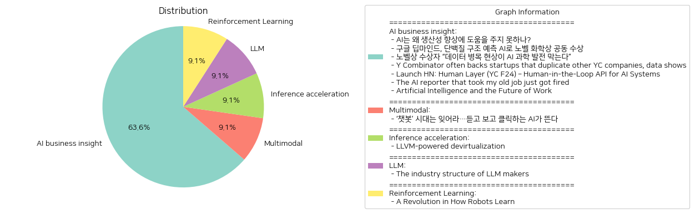

# Daily Artificial Intelligence Insights : News

## 🎠 AI business insight

**요약:**

**주요 테마**:
- 인공지능(AI)의 잠재적 영향 및 개선 필요성: AI가 경제와 생산성에 미칠 수 있는 영향, 특히 개선이 필요한 부분에 관한 논의가 중심이 된다.
- AI의 과학적 기여와 수상 사례: 구글 딥마인드의 단백질 구조 예측 성공과 노벨 화학상 수상이 AI의 과학적 기여를 강조한다.
- 데이터의 중요성: 데이터 병목 현상이 AI 발전을 저해하고 있음을 지적하며, 고품질 데이터의 중요성을 논의한다.
- 창업 및 비즈니스 전략: YC의 스타트업 투자 방식과 유사 제품의 다중 지원을 통한 창업자 육성 전략이 주목된다.
- AI 인간-중심 인터페이스: AI 시스템의 안전한 배치와 인간의 검토를 돕는 API 개발의 중요성이 언급된다.
- AI의 사회적 수용: AI 뉴스봇의 해고 사례를 통해 AI가 대중에게 어떻게 수용되는지를 분석한다.
- AI와 미래 직업 환경: AI가 직업 환경에 미칠 수 있는 변화와 이에 대한 대응 방법을 제시한다.

**주요 사건**:
1. AI가 생산성 향상에 유의미한 성과를 내지 못하고 있음.
2. 구글 딥마인드의 단백질 구조 예측 성공으로 노벨 화학상 수상.
3. AI 발전의 장애물로서 데이터 병목 현상 지적.
4. YC Venture의 중복적 스타트업 지원 전략.
5. Human-in-the-Loop API 개발로 AI 시스템 운영의 안전성 강화.
6. AI 뉴스봇의 실패 사례 및 대중의 부정적 반응.
7. 직업 환경 변화와 AI 적응 필요성 강조.

**영향 분석**:
- **경제**: AI 기술의 발전과 관련된 경제적 성과는 아직 미미하지만, 장기적으로 경제 발전에 기여할 가능성이 있음. 데이터 및 인프라 개선이 필요하다.
- **과학 및 기술 발전**: 구글 딥마인드 사례는 AI의 과학적 가능성을 입증하며, 과학의 새로운 시대를 여는 데 기여할 수 있음을 시사한다.
- **사회**: AI의 사회적 수용은 다양한 반응을 유발하고 있으며, 인간과 AI의 상호작용 강화가 필요하다. 교육 시스템 및 직업 환경의 변화에 대한 대비도 필요하다.
- **정치 및 정책**: AI 활용과 관련된 정책 마련이 필요하며, 데이터와 인적 자원의 관리, 의사결정 시스템에 대한 정치적 관점에서의 접근이 요구된다.

**최종 요약**:
AI는 여전히 개선의 여지가 크며, 특히 데이터의 질적 향상과 사회적 수용 측면에서 과제가 산적해 있다. 구글 딥마인드의 노벨상 수상 사례는 AI가 과학적 진보에 기여할 수 있음을 보여주었으며, 이는 AI 관련 정책 및 과학 연구에 영향을 미칠 가능성이 높다. 또한, 변화하는 직업 요구에 대응하기 위해 시민과 정책입안자들은 AI와 함께 일할 수 있도록 기술과 환경을 준비해야 한다. 이러한 흐름을 통해 AI가 어떻게 사회에 통합되고 유의미한 성과를 낼 수 있을지 관심을 가지고 지켜보아야 한다.

**출처:**

 - AI는 왜 생산성 향상에 도움을 주지 못하나? (https://www.technologyreview.kr/ai%eb%8a%94-%ec%99%9c-%ec%83%9d%ec%82%b0%ec%84%b1-%ed%96%a5%ec%83%81%ec%97%90-%eb%8f%84%ec%9b%80%ec%9d%84-%ec%a3%bc%ec%a7%80-%eb%aa%bb%ed%95%98%eb%82%98/)
 - 구글 딥마인드, 단백질 구조 예측 AI로 노벨 화학상 공동 수상 (https://www.technologyreview.kr/%ea%b5%ac%ea%b8%80-%eb%94%a5%eb%a7%88%ec%9d%b8%eb%93%9c-%eb%8b%a8%eb%b0%b1%ec%a7%88-%ea%b5%ac%ec%a1%b0-%ec%98%88%ec%b8%a1-ai%eb%a1%9c-%eb%85%b8%eb%b2%a8-%ed%99%94%ed%95%99%ec%83%81-%ea%b3%b5%eb%8f%99/)
 - 노벨상 수상자 “데이터 병목 현상이 AI 과학 발전 막는다” (https://www.technologyreview.kr/%eb%85%b8%eb%b2%a8%ec%83%81-%ec%88%98%ec%83%81%ec%9e%90-%eb%8d%b0%ec%9d%b4%ed%84%b0-%eb%b3%91%eb%aa%a9-%ed%98%84%ec%83%81%ec%9d%b4-ai-%ea%b3%bc%ed%95%99-%eb%b0%9c%ec%a0%84-%eb%a7%89%eb%8a%94/)
 - Y Combinator often backs startups that duplicate other YC companies, data shows (https://techcrunch.com/2024/11/22/y-combinator-often-backs-startups-that-duplicate-other-yc-companies-data-shows-its-not-just-ai-code-editors/)
 - Launch HN: Human Layer (YC F24) – Human-in-the-Loop API for AI Systems (https://news.ycombinator.com/item?id=42247368)
 - The AI reporter that took my old job just got fired (https://www.wired.com/story/the-ai-reporter-who-took-my-old-job-just-got-fired/)
 - Artificial Intelligence and the Future of Work (https://nap.nationalacademies.org/resource/27644/interactive/)

## 🩵 Multimodal

**요약:**

1. **주요 테마**:
   이번 뉴스 기사는 AI 기술의 진화에 관한 것으로, 특히 텍스트 기반의 챗봇에서 벗어나 음성과 영상 생성 기능을 갖춘 새로운 AI 기술의 부상을 강조하고 있습니다. 기술 발전이 빠르게 이루어지고 있으며, 이는 다양한 산업에 걸쳐 큰 변화를 예고하고 있습니다.

2. **주요 사건**:
   - AI 기술이 텍스트 기반 챗봇의 시대를 넘어 새로운 음성 및 영상 생성 기능을 갖춘 형태로 진화하고 있다는 사실이 강조되었습니다.
   - 이는 AI의 활용 범위가 더 넓어지며, 보다 개인화된 경험을 제공할 수 있게 될 것을 의미합니다.

3. **영향 분석**:
   - **경제**: AI의 진화는 다양한 산업에서의 기술 혁신을 촉진하며, 생산성 향상과 비용 절감에 기여할 것으로 보입니다. 특히 미디어, 광고, 교육 및 고객 서비스 분야에서의 효율성이 증대될 것으로 예상됩니다.
   - **사회**: AI의 발전은 사용자 경험을 더욱 개인화하고 향상시키며, 정보 접근성을 높이는 데 기여할 것입니다. 그러나 반대로 개인 정보 보호 및 윤리적 문제에 대한 논의가 필요할 것입니다.
   - **정치 및 규제**: AI 기술의 급속한 발전은 새로운 규제 및 정책 필요성을 제기할 수 있습니다. 특히 데이터 활용과 개인 정보 보호에 관련된 법률적 틀의 재정비가 요구될 수 있습니다.

4. **최종 요약**:
   이번 뉴스는 AI 기술의 주요한 진화 추세를 조명하며, 특히 음성 및 영상 기술의 통합과 활용에 중점을 두고 있습니다. 이러한 기술 발전은 경제 전반에 걸쳐 많은 긍정적인 변화를 예고하지만, 동시에 새로운 사회적 및 윤리적 질문을 던집니다. AI의 발전과 활용에 대한 논의는 글로벌 기술 경쟁 속에서 중요한 요소가 되며, 향후 기술 발전 및 사회적 맥락에서의 대응책 마련이 필수적입니다. 앞으로 정책 결정자들과 기업들은 이러한 혁신에 대한 준비와 대응 방안을 마련해야 할 것입니다.

**출처:**

 - ‘챗봇’ 시대는 잊어라…듣고 보고 클릭하는 AI가 뜬다 (https://www.technologyreview.kr/%ec%b1%97%eb%b4%87-%ec%8b%9c%eb%8c%80%eb%8a%94-%ec%9e%8a%ec%96%b4%eb%9d%bc-%eb%93%a3%ea%b3%a0-%eb%b3%b4%ea%b3%a0-%ed%81%b4%eb%a6%ad%ed%95%98%eb%8a%94-ai%ea%b0%80-%eb%9c%ac%eb%8b%a4/)

## 🎉 Inference acceleration

**요약:**

**1. 주요 테마**:
- 'LLVM 기반 디버추얼화'에 대한 주요 테마는 디오비스케이션(deobfuscation) 기술의 발전입니다. 여기에 포함된 핵심 주제는 가상화된 바이너리를 해독하기 위한 디버추얼화 접근법 개발입니다. 이 방법은 동적 오염 분석과 컴파일러 최적화를 활용하며 LLVM IR을 사용하여 구현되었습니다.

**2. 주요 이벤트**:
- 기사는 LLVM IR을 사용한 디버추얼화 접근법이 Tigress 오비스케이터로 오비스케이트된 바이너리를 부분적으로 해독하는 데 성공했다는 것을 강조합니다. 특히, 속도와 모듈성 측면에서 유망한 결과를 얻었다고 합니다.

**3. 영향 분석**:
- 기술적 혁신: 디버추얼화 기술의 발전은 소프트웨어 보안 및 역공학 분야에서 중대한 기술적 진전을 의미합니다. 이는 오비스케이션 기법을 사용하여 소프트웨어의 무단 사용을 방지하는 보호 메커니즘을 개선함으로써, 소프트웨어 보안 강화에 기여할 수 있습니다.
- 산업적 영향: 이 혁신은 특히 소프트웨어 보호 및 라이선스 관리 분야에서 새로운 기회를 제공할 가능성이 높습니다. 보안 연구자와 개발자들은 이러한 기술을 활용하여 소프트웨어 보호의 효율성을 개선할 수 있습니다.

**4. 최종 요약**:
- 결론적으로, LLVM 기반 디버추얼화 기술의 발전은 소프트웨어 보안의 새로운 지평을 열고 있으며, 향후 소프트웨어 보호 및 역공학 분야에서의 응용 가능성을 더욱 넓힐 것으로 보입니다. 앞으로도 이와 같은 기술 혁신이 지속적으로 이루어질 가능성이 크며, 이를 통해 보다 발전된 보안 메커니즘이 개발될 것으로 기대됩니다. 미래에는 이러한 기술들이 어떻게 상용화되고, 다른 영역에 응용될 수 있는지에 대한 추세를 주시할 필요가 있습니다.

**출처:**

 - LLVM-powered devirtualization (https://blog.thalium.re/posts/llvm-powered-devirtualization/)

## 🪄 LLM

**요약:**

**1. 주요 주제:**
   이 기사에서는 대규모 언어 모델(LLM)의 산업 구조가 주요 테마로 다루어지고 있습니다. Chat-GPT와 Claude.ai와 같은 대규모 언어 모델이 미래의 핵심 기술이 될 가능성이 있지만, 이러한 모델을 구축하는 사업이 산업 구조상 수익성이 낮을 수 있다는 우려를 제기합니다. 특히, NVIDIA와 같은 공급업체는 강력한 가격 책정 권한을 가지고 있고, 구매자는 LLM 토큰 가격에 대한 높은 권한을 가지고 있다는 것이 산업 구조의 중요한 면모로 지적됩니다.

**2. 주요 사건:**
   - Chat-GPT 및 Claude.ai와 같은 대규모 언어 모델이 화두로 떠오르고 있음.
   - NVIDIA는 가격 결정에서 강력한 위치를 차지하며 LLM 산업에 큰 영향을 미칠 것으로 보임.
   - 구매자들 또한 LLM 토큰 가격에 대해 상당한 권한을 가지고 있음.

**3. 영향 분석:**
   - **경제적 측면**: NVIDIA 같은 기술 공급업체가 강력한 가격 책정 능력을 가짐으로써, LLM 산업의 수익성에 직접적인 영향을 미치고 있습니다. 이는 LLM 개발사들에 대한 재정적 부담을 가중시킬 수 있으며, 결과적으로 산업 내 경쟁이 제한될 수 있습니다.
   - **사회적 측면**: 대규모 언어 모델이 계속 발전함에 따라, 기술에 대한 사회적 의존도가 증가할 가능성이 있습니다. 하지만 이러한 모델을 유지하는 비용이 비싸다면, 대중에게 제공되는 서비스의 범위나 가격에 영향을 미칠 수 있습니다.

**4. 최종 요약:**
   현재 대규모 언어 모델은 기술 발전의 중요한 측면으로 부상하고 있으나, 산업 내의 구조적 문제로 인해 경제적으로 수익을 내기 어려운 상황입니다. 주요 공급업체인 NVIDIA의 강력한 가격 정책과 구매자들의 가격 협상력은 LLM 기업들이 직면한 주요 도전 과제로 남아있습니다. 향후 이러한 구조적 문제에 대한 해결책이 제시되지 않는다면, LLM 산업의 성장이 저해될 가능성이 있으며, 이는 기술 혁신의 속도와 사회적 이행에 큰 영향을 미칠 수 있습니다. 향후 LLM 시장의 구조적 변화를 주의 깊게 살펴볼 필요성이 있으며, 이러한 변화가 산업 및 사회에 미칠 잠재적 영향을 모니터링해야 합니다.

**출처:**

 - The industry structure of LLM makers (https://calpaterson.com/porter.html)

## ⭐ Reinforcement Learning

**요약:**

1. **핵심 주제**:
   최근 모든 뉴스 기사에서 발견된 주요 주제는 인공지능(AI) 및 로봇 공학의 발전입니다. 특히, 로봇의 학습과 적응 능력에 중점을 두고 있으며, 이는 인간처럼 배우고 적응할 수 있는 로봇 개발이라는 트렌드를 반영합니다. 이러한 발전은 모방 학습과 강화 학습 등의 기술을 통해 이루어지고 있으며, 로봇의 정교함과 복잡한 작업 수행 능력이 강조되고 있습니다.

2. **주요 사건**:
   주요 기사에서는 로봇이 인간과 유사한 방법으로 학습하고 적응할 수 있다는 연구의 진행 상황이 소개되었습니다. 연구자들은 로봇이 신발끈을 묶거나 셔츠를 접는 등의 복잡한 작업을 높은 정확도로 수행할 수 있도록 발전시키고 있으며, 이는 모방 학습과 강화 학습 기술을 통해 달성되고 있다는 점이 언급되고 있습니다.

3. **영향 분석**:
   이러한 발전은 여러 분야에 다양한 영향을 미치고 있습니다. 
   - 경제적 측면에서는 자동화가 더욱 진전됨에 따라 생산 공정의 효율성이 증가할 가능성이 높습니다. 이는 생산 비용 절감과 제품 품질 개선으로 이어질 수 있습니다.
   - 사회적 관점에서는 고도로 정교한 로봇의 등장이 인간 노동자들의 일자리에 미칠 수 있는 영향이 주목됩니다. 특정 직업군에서는 자동화에 의한 직무 대체 가능성이 높아질 수 있으며, 이에 따른 사회적 논의가 필요할 것입니다.
   - 정치적으로는 로봇 기술 개발 및 활용에 관한 규제와 윤리적 기준 설정이 논의될 가능성이 대두되고 있습니다.

4. **최종 요약**:
   이번 뉴스 요약은 로봇 기술의 혁신적 발전을 중심으로 이루어졌으며, 이를 통해 인간과 유사한 학습 및 적응 능력을 지닌 로봇의 가능성이 크게 제시되고 있습니다. 이러한 기술 발전은 경제적, 사회적, 정치적 측면에서 중요한 변화를 야기할 수 있으므로, 지속적인 모니터링이 필요합니다. 앞으로 로봇과 인간의 상호작용, 윤리적 문제, 그리고 노동시장에 미치는 영향을 중심으로 한 발전 방향을 주의 깊게 지켜볼 필요가 있습니다.

**출처:**

 - A Revolution in How Robots Learn (https://www.newyorker.com/magazine/2024/12/02/a-revolution-in-how-robots-learn)

