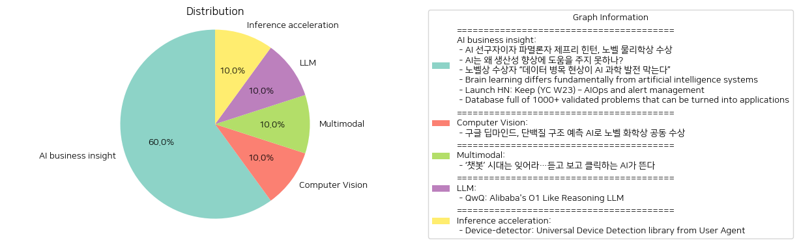

# Daily Artificial Intelligence Insights : News

## 🥳 AI business insight

**요약:**

1. **주요 테마**:
   이번 뉴스 기사들에서 주요하게 다룬 테마는 인공지능(AI)와 관련된 발전과 한계, 그리고 새로운 기술 접근 방식입니다. AI의 기술적 기여와 그로 인한 과학 발전의 잠재적 혜택, 그러나 여전히 해결되지 않은 생산성 개선의 한계, AI 발전을 위해 필요한 고품질 데이터의 중요성 등이 중심 주제를 이루고 있습니다. 또한 새로운 학습 메커니즘에 대한 연구와 실용적인 애플리케이션 개발 아이디어도 다뤄지고 있습니다.

2. **주요 사건**:
   - 제프리 힌턴이 현대 AI 기술 발전에 기여한 공로로 노벨 물리학상을 수상했습니다.
   - AI가 생산성 향상에 주지 못하는 이유로 몇 가지 중대한 개선이 필요함을 강조했습니다.
   - 노벨상 수상자가 데이터를 병목 현상으로 지목하며 AI 과학 발전에 장애물이 되고 있음을 시사했습니다.
   - 연구자들이 기존의 역전파 학습 방법보다 효율적이고 효과적이라고 주장하는 'prospective configuration'이라는 새로운 학습 메커니즘을 제안했습니다.
   - Keep 개발 팀이 AIOps와 경고 관리를 자동화하는 맞춤형 도구를 출시했습니다.
   - 수천 개의 검증된 문제를 바탕으로 SaaS 개발을 위한 데이터베이스를 구축하여 사용자 고충을 해결하는 아이디어 제시법을 소개했습니다.

3. **영향 분석**:
   - **경제**: AI의 발전은 경제 발전에 기여할 수 있는 잠재적인 요소로 기대되지만, 데이터의 병목 현상과 생산성 향상에 대한 실질적 성과 부재는 경제적 혜택 실현을 방해할 수 있습니다. 새로운 학습 메커니즘과 애플리케이션 개발 아이디어가 이러한 문제를 해결하는 데 기여할 수 있을 것입니다.
   - **사회**: AI 기술의 한계 극복을 위한 연구와 개발은 사회적 신뢰와 기술 수용도를 높이는 데 중요한 역할을 할 것입니다.
   - **정치**: AI 기술에 대한 발전은 글로벌 경쟁에서 중요한 위치를 차지하며, AI 기술 개발에 대한 정책과 투자 결정에 영향을 미칠 것입니다.

4. **최종 요약**:
   최근 AI 발전은 기술적 기여와 그 한계 사이에서 균형을 이루고 있습니다. 제프리 힌턴과 같은 선구자들은 AI 기술 기반 확립에 기여하며 그 가치를 인정받아 노벨상을 수상하였으나, 생산성 개선과 같은 문제는 여전히 해결 과제로 남아 있습니다. 데이터의 중요성 및 학습 방법론 혁신을 통해 이러한 도전을 극복하기 위한 노력이 진행되고 있습니다. 미래의 발전은 이렇게 지적된 문제들에 대해 어떻게 해결책을 제시하느냐에 달려 있으며, 고품질 데이터 확보와 새로운 기술 방식을 통한 해결을 기대할 수 있습니다. AI 기술이 지속적으로 발전한다면 경제와 사회 전반에 걸쳐 긍정적인 영향을 미칠 잠재력이 큽니다. 앞으로의 발전을 위해 이러한 흐름을 주의 깊게 지켜볼 필요가 있습니다.

**출처:**

 - AI 선구자이자 파멸론자 제프리 힌턴, 노벨 물리학상 수상 (https://www.technologyreview.kr/ai-%ec%84%a0%ea%b5%ac%ec%9e%90%ec%9d%b4%ec%9e%90-%ed%8c%8c%eb%a9%b8%eb%a1%a0%ec%9e%90-%ec%a0%9c%ed%94%84%eb%a6%ac-%ed%9e%8c%ed%84%b4-%eb%85%b8%eb%b2%a8-%eb%ac%bc%eb%a6%ac%ed%95%99%ec%83%81-%ec%88%98/)
 - AI는 왜 생산성 향상에 도움을 주지 못하나? (https://www.technologyreview.kr/ai%eb%8a%94-%ec%99%9c-%ec%83%9d%ec%82%b0%ec%84%b1-%ed%96%a5%ec%83%81%ec%97%90-%eb%8f%84%ec%9b%80%ec%9d%84-%ec%a3%bc%ec%a7%80-%eb%aa%bb%ed%95%98%eb%82%98/)
 - 노벨상 수상자 “데이터 병목 현상이 AI 과학 발전 막는다” (https://www.technologyreview.kr/%eb%85%b8%eb%b2%a8%ec%83%81-%ec%88%98%ec%83%81%ec%9e%90-%eb%8d%b0%ec%9d%b4%ed%84%b0-%eb%b3%91%eb%aa%a9-%ed%98%84%ec%83%81%ec%9d%b4-ai-%ea%b3%bc%ed%95%99-%eb%b0%9c%ec%a0%84-%eb%a7%89%eb%8a%94/)
 - Brain learning differs fundamentally from artificial intelligence systems (https://www.nature.com/articles/s41593-023-01514-1)
 - Launch HN: Keep (YC W23) – AIOps and alert management (https://github.com/keephq/keep)
 - Database full of 1000+ validated problems that can be turned into applications (https://www.bigideasdb.com/)

## 🎉 Computer Vision

**요약:**

**1. 주요 주제:**
   - 인공지능(AI) 기술의 발전과 그 응용
   - 과학과 기술의 융합이 가져오는 혁신
   - 국제적인 과학 연구 및 그 성과에 대한 인정

**2. 주요 사건:**
   - 구글 딥마인드의 연구팀, 특히 데미스 허사비스와 존 점퍼가 AI를 활용하여 단백질 구조 예측 문제를 해결한 공로로 노벨 화학상을 공동 수상하였다.
   - 데이비드 베이커는 새로운 단백질을 만들고 혁신하는 데 성공, 동일한 상의 나머지 절반을 수상하였다.

**3. 영향 분석:**
   - **경제적 영향**: AI 기술의 발전은 생명과학 분야에 새로운 혁신을 가져올 것이며, 바이오테크 산업의 성장을 가속화할 것이다. 이는 또한 관련 투자와 연구 개발비용의 증가를 촉진시킬 수 있다.
   - **정치적 영향**: AI 기술의 발전과 그 활용에 관한 규제와 정책 토론이 활발해질 수 있으며, 각국은 이러한 기술을 전략적으로 활용하기 위한 국가 방침을 강화할 것이라 예상된다.
   - **사회적 영향**: AI의 발전은 질병 예방 및 치료, 새로운 약물 개발에 기여할 수 있어 인간의 삶의 질을 크게 향상시킬 것으로 기대된다. 또한, 새로운 직업과 산업 분야가 창출될 잠재력이 있다.

**4. 최종 요약:**
   - 구글 딥마인드 팀의 AI 기반 단백질 예측 성과는 과학과 기술이 융합하여 현재의 과학적 도전을 해결할 수 있음을 보여준다. 이러한 기술 혁신은 산업, 국가 정책, 사회 전반에 걸친 변화를 촉발할 수 있는 중요한 전환점이 될 것이다. 미래에는 이와 같은 AI 기술의 응용 분야가 더욱 확장될 것이며, 특히 생명과학 및 의료 분야에서 주목할 만한 발전이 있을 것으로 예상된다. 지속적인 기술 지향적인 연구와 규제 균형은 이 혁신의 영향을 최소한 부작용 없이 최대한으로 활용할 수 있게 할 중요한 과제가 될 것이다.

**출처:**

 - 구글 딥마인드, 단백질 구조 예측 AI로 노벨 화학상 공동 수상 (https://www.technologyreview.kr/%ea%b5%ac%ea%b8%80-%eb%94%a5%eb%a7%88%ec%9d%b8%eb%93%9c-%eb%8b%a8%eb%b0%b1%ec%a7%88-%ea%b5%ac%ec%a1%b0-%ec%98%88%ec%b8%a1-ai%eb%a1%9c-%eb%85%b8%eb%b2%a8-%ed%99%94%ed%95%99%ec%83%81-%ea%b3%b5%eb%8f%99/)

## 🪸 Multimodal

**요약:**

1. **주요 테마**:
   - 인공지능(AI)의 진화 및 발전: 텍스트 기반의 AI 챗봇에서 음성 및 영상 생성 기능이 있는 차세대 AI로의 전환이 주목받고 있습니다.
   - 기술 혁신과 변화: 새로운 AI 기술이 기존의 방식과 차별화되는 기능을 제공하며 주목받고 있습니다.

2. **주요 사건**:
   - 텍스트 중심의 AI 챗봇 시대가 저물고, 음성 및 영상을 생성할 수 있는 AI 기술이 새롭게 주목받고 있습니다. 이는 AI 기술의 진화와 발전을 보여주는 중요한 사건입니다.

3. **영향 분석**:
   - **경제**: 새로운 AI 기술은 시장에 혁신을 불러일으키고, 다양한 산업에 응용되어 생산성을 향상시키며, 관련 기술 개발 및 서비스 확산을 통해 경제적 기회를 창출할 것으로 예상됩니다.
   - **사회**: AI의 발전은 사용자 경험을 향상시키고, 더 많은 사람들이 기술을 쉽게 접할 수 있도록 하며, AI에 대한 사회적 수용성을 높일 가능성이 있습니다. 또한, 인간과 기계 간의 상호작용이 더욱 자연스럽게 진행될 것입니다.

4. **최종 요약**:
   최근 인공지능 기술은 텍스트 기반의 챗봇을 넘어 음성과 영상 생성 기능을 갖춘 형태로 발전하고 있으며, 이는 기술 혁신의 중요한 이정표로 볼 수 있습니다. 이러한 변화는 경제적으로 다양한 산업에 긍정적인 영향을 미치고, 사회적으로 AI와의 상호작용을 보다 자연스럽게 만듦으로써 사용자 경험을 향상시킬 것으로 기대됩니다. 향후 이러한 AI 기술의 발전이 어떤 방향으로 나아갈지, 그리고 그에 따라 또 다른 혁신적인 기술이 등장할지 주목할 필요가 있습니다.

**출처:**

 - ‘챗봇’ 시대는 잊어라…듣고 보고 클릭하는 AI가 뜬다 (https://www.technologyreview.kr/%ec%b1%97%eb%b4%87-%ec%8b%9c%eb%8c%80%eb%8a%94-%ec%9e%8a%ec%96%b4%eb%9d%bc-%eb%93%a3%ea%b3%a0-%eb%b3%b4%ea%b3%a0-%ed%81%b4%eb%a6%ad%ed%95%98%eb%8a%94-ai%ea%b0%80-%eb%9c%ac%eb%8b%a4/)

## 🌞 LLM

**요약:**

1. **핵심 주제**:
   - 'QwQ'는 AI 모델로, 질문과 호기심의 정신을 구현하고 있으며, 인내심 있는 탐구와 자기 성찰을 통해 진리를 추구하는 특징이 강조되고 있습니다. 모델의 뛰어난 분석 및 문제 해결 능력, 특히 기술 분야에서의 성과가 드러나고 있습니다. 이러한 AI의 학습 여정에서 나타나는 한계와 불완전성 또한 중요한 주제로 제시되고 있습니다.

2. **주요 사건**:
   - 알리바바의 'QwQ' 모델은 기술적 도메인에서의 분석적 능력과 문제 해결 능력을 시연하고 있습니다. 이는 AI의 발달과 활용에서 중요한 이정표로, 다양한 분야에서의 응용 가능성을 시사합니다. 모델은 질문과 성찰을 통해 진리를 탐구하려는 본질을 가지고 있는 것으로 보이며, 이는 데이터 기반의 새로운 방식의 사고를 가능하게 합니다.

3. **영향 분석**:
   - 경제적 영향: AI 기술의 발전은 여러 산업에 걸쳐 혁신과 효율성을 높이고 있으며, 'QwQ'와 같은 모델은 특히 기술적 문제 해결에서 중요한 도구로 자리매김할 가능성이 큽니다.
   - 사회적 및 교육적 영향: 이러한 AI 기술은 교육과 연구에서의 역할을 강화할 수 있으며, 새로운 학습 방법과 도구로 자리잡을 수 있습니다.
   - 정치 및 윤리적 고려: AI 개발에는 계속해서 윤리적 기준과 프라이버시 보호에 관한 논의가 필요하며, 이는 사회적 규범 및 정책에 영향을 미칠 수 있습니다.

4. **최종 요약**:
   'QwQ'는 Al리바바의 AI 모델로서, 호기심과 질문 속에서 진리를 탐구하며 기술 도메인에서 강력한 분석 및 문제 해결 능력을 보여줍니다. 그러나 AI의 발전은 경제적, 사회적, 정치적 측면에서 다양한 변화를 초래할 수 있으므로, 윤리적 고려와 규제 프레임워크의 발전 또한 필요합니다. 앞으로 AI 기술의 인간 사회 각 분야에서의 역할과 발전 방향에 주목할 필요가 있으며, 이는 교육, 경제의 효율성 개선, 그리고 더 나은 문제 해결의 새로운 기회를 제공할 것으로 기대됩니다.

**출처:**

 - QwQ: Alibaba's O1 Like Reasoning LLM (https://qwenlm.github.io/blog/qwq-32b-preview/)

## 🤩 Inference acceleration

**요약:**

1. **주요 주제**:
   여러 뉴스 기사들에서 반복적으로 나타나는 주요 주제는 기기 탐지와 관련된 기술 발전입니다. 특히, 사용자 에이전트를 통해 기기와 클라이언트, 운영 체제 및 브랜드를 식별하는 기술이 중점적으로 다루어지고 있습니다.

2. **주요 사건**:
   - 'Device-detector: Universal Device Detection library from User Agent': 이 기사는 DeviceDetector 라이브러리가 사용자 에이전트와 클라이언트 힌트를 통해 기기, 클라이언트, 운영 체제, 브랜드, 및 모델을 탐지하는 시스템에 대해 설명합니다. 캐싱 및 사용자 지정 YAML 해석기를 사용할 수 있으며, 사용자 에이전트가 봇인지 확인할 수 있는 간단한 방법을 제공합니다.

3. **영향 분석**:
   - 경제적 영향: 첨단 기기 탐지 기술의 발전은 광고 및 마케팅 분야에서 맞춤형 콘텐츠 제공과 타깃 마케팅의 정교함을 높일 수 있어 관련 산업의 경제적 가치를 증대시킬 수 있습니다.
   - 정치적 및 사회적 영향: 보다 정교한 기기 탐지 기술은 데이터 개인정보 보호와 관련된 규제 및 정책의 발전을 촉진할 수 있습니다. 특히, 개인 정보 보호에 대한 사회적 관심이 증대되면서 규제 기관의 주목을 받을 가능성이 큽니다.

4. **최종 요약**:
   기기 탐지 기술의 발전은 디지털 마케팅 및 개인정보 보호와 관련된 다양한 산업에 큰 영향을 미칠 것입니다. 이로 인해 사용자 경험의 개인화가 강화될 것이며, 이와 동시에 개인정보 보호 및 윤리적 고려에 대한 요구가 증가할 것입니다. 앞으로의 중요한 발전은 사용자 데이터의 안전성과 프라이버시 권리를 보호하기 위한 적절한 법적, 기술적 조치가 마련되느냐에 달려 있을 것입니다. 산업의 발전 방향과 규제의 균형이 어떻게 설정될지가 미래의 주요 관전 포인트입니다.

**출처:**

 - Device-detector: Universal Device Detection library from User Agent (https://github.com/matomo-org/device-detector)

