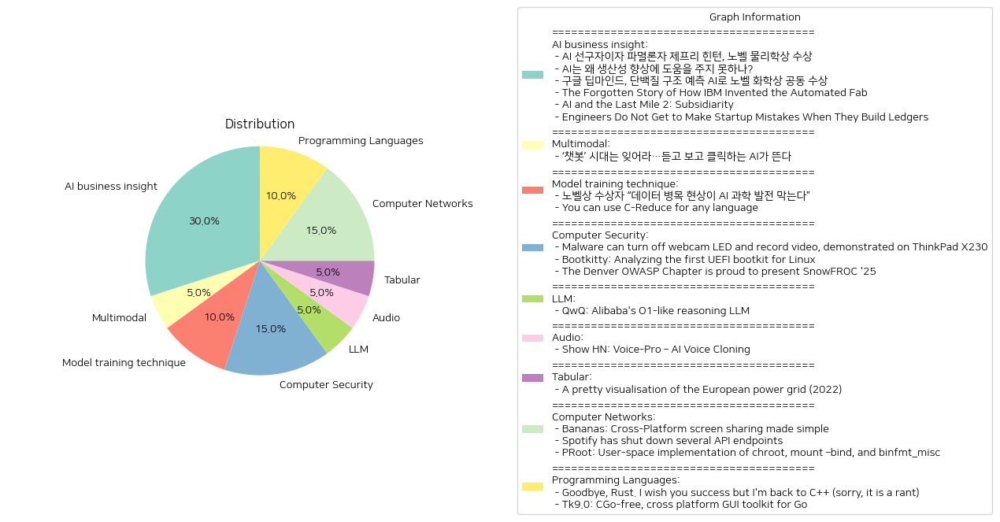

# Daily Artificial Intelligence Insights : News

## 🌅 AI business insight

**요약:**

**주요 주제**:
모든 뉴스 기사에서 반복되는 주요 주제는 인공지능(AI) 기술과 그 응용이다. 인공지능 개발의 기본 정신과 생산성에 대한 기여, 그리고 과학 분야에서의 인공지능 활용이 두드러지며, 또한 자동화와 중앙집권적 시스템의 한계에 대한 논의도 포함되어 있다.

**주요 사건**:
1. 제프리 힌턴과 존 홉필드는 현대 인공지능 기술의 발전을 위해 기초적인 기술을 개발한 공로로 노벨 물리학상을 수상했다.
2. 인공지능 기술은 경제 발전을 이끌 유망주로 주목받고 있지만, 아직 생산성 향상에 있어서는 발전이 필요한 상황임을 강조한다.
3. 구글 딥마인드의 AI를 활용한 연구가 단백질 구조 예측 문제를 해결하여 노벨 화학상을 공동 수상한 것이며, 이 기술은 생물학 연구에 큰 획을 그을 것으로 예상된다.
4. 1970년대 IBM의 Bill Harding은 완전 자동화된 웨이퍼 제작 라인을 구상하여, 급속 제작 시간을 실현했지만, 이후 기술 발전에도 불구하고 당시 성공을 뛰어넘지 못하고 있는 점이 강조된다.
5. AI 시스템의 중앙 집중화된 구조가 지역적 문맥과 구체적 상황 관리에 문제를 야기 한다는 것을 지적하며, 카톨릭 원리의 보조성 원칙과 관련지어 설명한다.
6. 스타트업 엔지니어들이 운영 체제에 필수적인 이중입력 회계 시스템을 구축하지 않음으로써 발생하는 실수를 방지해야 함을 강조하였다.

**영향 분석**:
- **경제**: AI는 생산성 향상에 대하여 큰 기대를 모으고 있으나, 아직까지 그 효능을 완전히 발휘하지 못하고 있는 것으로 진단된다. 이는 기술 발전과 경제 성장 간의 괴리감을 시사한다.
- **과학 및 환경**: AI의 노벨상 수상 사례는 과학 연구의 새로운 패러다임으로 떠오르며, 특히 생명과학 분야의 연구 진보를 촉진시키고 있다.
- **사회**: AI가 미래 사회에 미칠 영향에 대해 지속적인 논의가 필요하며, 자동화와 관련된 기술적, 윤리적 문제도 점차 대두되고 있다.

**최종 요약**:
이번 뉴스 기사들은 다양한 분야에서 인공지능의 현재와 미래에 대한 기대와 한계를 잘 나타내고 있다. AI 기술의 과학적 성과가 높게 평가되고 있으며, 생산성 향상에 대한 기여 가능성을 두고 지속적인 개선이 필요하다는 점이 강조된다. 앞으로 인공지능 발전의 방향성과 그로 인한 사회적 및 경제적 변화 등을 주목하면서, 더욱 발전된 형태의 AI 기술이 다양한 분야에서 자리 잡을 가능성을 엿볼 수 있다.

**출처:**

 - AI 선구자이자 파멸론자 제프리 힌턴, 노벨 물리학상 수상 (https://www.technologyreview.kr/ai-%ec%84%a0%ea%b5%ac%ec%9e%90%ec%9d%b4%ec%9e%90-%ed%8c%8c%eb%a9%b8%eb%a1%a0%ec%9e%90-%ec%a0%9c%ed%94%84%eb%a6%ac-%ed%9e%8c%ed%84%b4-%eb%85%b8%eb%b2%a8-%eb%ac%bc%eb%a6%ac%ed%95%99%ec%83%81-%ec%88%98/)
 - AI는 왜 생산성 향상에 도움을 주지 못하나? (https://www.technologyreview.kr/ai%eb%8a%94-%ec%99%9c-%ec%83%9d%ec%82%b0%ec%84%b1-%ed%96%a5%ec%83%81%ec%97%90-%eb%8f%84%ec%9b%80%ec%9d%84-%ec%a3%bc%ec%a7%80-%eb%aa%bb%ed%95%98%eb%82%98/)
 - 구글 딥마인드, 단백질 구조 예측 AI로 노벨 화학상 공동 수상 (https://www.technologyreview.kr/%ea%b5%ac%ea%b8%80-%eb%94%a5%eb%a7%88%ec%9d%b8%eb%93%9c-%eb%8b%a8%eb%b0%b1%ec%a7%88-%ea%b5%ac%ec%a1%b0-%ec%98%88%ec%b8%a1-ai%eb%a1%9c-%eb%85%b8%eb%b2%a8-%ed%99%94%ed%95%99%ec%83%81-%ea%b3%b5%eb%8f%99/)
 - The Forgotten Story of How IBM Invented the Automated Fab (https://spectrum.ieee.org/semiconductor-fabrication)
 - AI and the Last Mile 2: Subsidiarity (https://hollisrobbinsanecdotal.substack.com/p/ai-and-the-last-mile-2)
 - Engineers Do Not Get to Make Startup Mistakes When They Build Ledgers (https://news.alvaroduran.com/p/engineers-do-not-get-to-make-startup)

## 🌅 Multimodal

**요약:**

1. **주요 테마**:
   - AI 기술의 발전: 텍스트 기반 AI에서 음성 및 영상 생성 기능을 갖춘 AI로의 진화 강조.
   - AI의 새로운 시대: AI 기술이 인간의 상호작용 방식을 변화시킴.

2. **주요 사건**:
   - 챗봇 기술 의존이 줄어들고, 보다 발전된 음성 및 영상 생성 AI 기술이 주목받고 있음.
   - 기존의 텍스트 중심의 AI 사용에서 벗어나 보다 직관적이고 다양한 형태의 AI 활용 증가.

3. **영향 분석**:
   - 경제: AI의 기능 확장은 새로운 산업 기회를 창출하고 기존 산업에 변화를 일으킬 가능성이 있음. 특히, 콘텐츠 제작과 소비에서 큰 변화를 초래할 것으로 예상됨.
   - 사회: AI의 발전은 인간과 기계 간의 상호작용 방식을 변화시켜 일상 생활에 더 큰 영향을 미칠 것으로 보임.
   - 기술: AI가 더욱 진화된 형태로 발전함에 따라, 관련 기술 개발과 연구에 대한 필요성이 증가할 전망.

4. **최종 요약**:
   최근 AI 기술의 발전은 텍스트 기반의 챗봇 시대를 넘어 보다 직관적이고 다양한 기능을 갖춘 AI 시대를 열고 있습니다. 특히 음성과 영상 생성 기능의 발전이 주목받고 있으며, 이는 경제, 사회, 기술 전반에 걸쳐 영향을 미칠 것으로 보입니다. 이러한 변화는 새로운 기회를 창출함과 동시에 기존 산업과의 융합을 가속화하며, AI 기술의 지속적인 발전과 연구가 중요하게 자리잡을 것입니다. 향후 AI의 진화가 어떤 방향으로 진행될지 지속적인 관찰이 필요합니다.

**출처:**

 - ‘챗봇’ 시대는 잊어라…듣고 보고 클릭하는 AI가 뜬다 (https://www.technologyreview.kr/%ec%b1%97%eb%b4%87-%ec%8b%9c%eb%8c%80%eb%8a%94-%ec%9e%8a%ec%96%b4%eb%9d%bc-%eb%93%a3%ea%b3%a0-%eb%b3%b4%ea%b3%a0-%ed%81%b4%eb%a6%ad%ed%95%98%eb%8a%94-ai%ea%b0%80-%eb%9c%ac%eb%8b%a4/)

## 🫧 Model training technique

**요약:**

1. **주요 테마**:
   - 과학 및 기술 발전: AI의 과학적 발견 도구로서의 필요성, 데이터의 품질 관련 문제.
   - 소프트웨어 및 도구 활용: C-Reduce와 같은 도구를 활용한 코드 최적화 및 효율성 향상.

2. **주요 사건**:
   - '노벨상 수상자 “데이터 병목 현상이 AI 과학 발전 막는다”': AI 기술의 발전을 위해서는 양질의 데이터가 필수적이며, 데이터의 부족 또는 품질 저하가 AI의 과학적 활용에서의 장애물로 작용할 수 있음을 강조.
   - 'You can use C-Reduce for any language': C-Reduce는 C 컴파일러의 버그를 재현하는데 유용한 도구로, 비C 코드를 처리할 수 있고 파일 크기를 효과적으로 줄일 수 있음.

3. **영향 분석**:
   - 경제: AI 기술의 발전은 다양한 산업의 혁신을 가져올 수 있으나, 고품질 데이터 부족은 잠재적 경제적 손실을 초래할 수 있음. 또한, C-Reduce와 같은 도구는 소프트웨어 개발 비용 절감 및 효율성 전달에 기여.
   - 사회: AI의 과학적 활용 증대는 사회 전반에 걸쳐 다양한 응용 분야와 혁신을 초래할 수 있음. 그러나 데이터 품질 문제는 이러한 혁신 속도를 저해할 수 있는 요인.
   
4. **최종 요약**:
   최근 뉴스는 AI 기술 개발에 데이터 품질이 중요한 역할을 하며, 이를 해결하는 것이 과학적 발견을 가속화할 수 있음을 시사한다. 관련 도구 기술은 소프트웨어 개발에 있어 중요한 역할을 하여, 비용 절감 및 효율성 향상을 통해 산업 및 경제에 긍정적인 영향을 미칠 수 있다. 앞으로 양질의 데이터 확보와 다재다능한 도구 활용이 더욱 중요해질 것으로 보이며, 이는 다양한 분야에서 혁신 및 발전을 추구하는 기반이 될 것이다.

**출처:**

 - 노벨상 수상자 “데이터 병목 현상이 AI 과학 발전 막는다” (https://www.technologyreview.kr/%eb%85%b8%eb%b2%a8%ec%83%81-%ec%88%98%ec%83%81%ec%9e%90-%eb%8d%b0%ec%9d%b4%ed%84%b0-%eb%b3%91%eb%aa%a9-%ed%98%84%ec%83%81%ec%9d%b4-ai-%ea%b3%bc%ed%95%99-%eb%b0%9c%ec%a0%84-%eb%a7%89%eb%8a%94/)
 - You can use C-Reduce for any language (https://bernsteinbear.com/blog/creduce/)

## ✈️ Computer Security

**요약:**

**요약 보고서**

1. **주요 주제**:
   - 전반적으로 보안 문제와 관련된 주제가 가장 두드러집니다. 웹캠 제어 악성코드, Linux 시스템을 타겟으로 한 UEFI 부트킷, 그리고 보안 관련 행사가 주요 테마로 나타납니다.
   - UEFI 관련 보안 위협의 발전과 기존의 Windows 중심에서 다양한 운영체제로의 확산이 강조됩니다.

2. **주요 사건**:
   - **웹캠 LED 제어 악성코드**: ThinkPad X230 차단기 LED를 원격으로 제어하고 영상을 녹화할 수 있는 악성코드가 발견되었습니다. 이는 웹캠 펌웨어를 USB를 통해 재설치하여 가능한 기능이며, 사생활 침해의 심각성을 부각시킵니다.
   - **Bootkitty UEFI 부트킷**: Linux, 특히 Ubuntu 버전을 대상으로 하는 처음으로 발견된 UEFI 부트킷인 Bootkitty가 공개되었습니다. 이 부트킷은 커널 서명 검증을 비활성화하고, 알 수 없는 ELF 바이너리를 사전 로드하는 기능이 있습니다.
   - **SNOWFROC '25**: 2025년 3월 14일에 열리는 덴버 OWASP 챕터의 보안 컨퍼런스인 SNOWFROC 행사가 발표되었습니다.

3. **영향 분석**:
   - **경제**: 보안 관련 사건들은 보안 소프트웨어 시장의 성장을 촉발하고 기업들이 보안 강화를 위한 투자를 더욱 확대할 가능성이 높습니다.
   - **정치 및 사회**: 개인 정보 보호 및 사이버 보안에 대한 일반 대중의 인식이 높아지면서, 정부 및 관련 기관이 법적이고 정책적인 대비책을 강화하게끔 압력을 받을 것입니다.
   - **기술**: 웹캠과 같은 IoT 기기들의 보안 문제 및 Linux 플랫폼의 보안 위협 증가로 인해, 소프트웨어 개발자 및 보안 전문가들의 관심이 증가할 것입니다.

4. **최종 요약**:
   - 이번 뉴스 기사들은 현대의 기술 발전에 따른 보안 위협의 진화와 그 심각성을 잘 보여줍니다. 웹캠 LED 제어 악성소프트웨어와 Linux를 목표로 한 UEFI 부트킷은 사생활과 시스템 안전성에 대한 경각심을 일깨우고 있습니다.
   - 앞으로 IoT 기기 보안성 강화 및 다양한 운영체제의 UEFI 위협에 대한 대비가 중요해질 것입니다.
   - 보안 컨퍼런스, 특히 SNOWFROC '25와 같은 행사는 그러한 위험에 대응하기 위한 협력과 정보 공유의 장이 될 가능성이 높습니다. 지속적이고 효과적인 보안 전략 개발과 법적 대책 마련이 요구됩니다.

**출처:**

 - Malware can turn off webcam LED and record video, demonstrated on ThinkPad X230 (https://github.com/xairy/lights-out)
 - Bootkitty: Analyzing the first UEFI bootkit for Linux (https://www.welivesecurity.com/en/eset-research/bootkitty-analyzing-first-uefi-bootkit-linux/)
 - The Denver OWASP Chapter is proud to present SnowFROC '25 (https://snowfroc.com/)

## 🍋 LLM

**요약:**

**제목: 알리바바의 O1 유사 추론 LLM 'QwQ'**

1. **주요 주제**:
   - AI 모델의 발전
   - 기술적인 문제 해결 능력과 분석력
   - 질문과 호기심을 통한 진리를 탐구하는 여정
   - AI의 한계 및 지속적 학습의 중요성

2. **중요 사건**:
   - 'QwQ'는 알리바바에서 개발한 AI 모델로, 답을 찾기 위한 질문과 자기 성찰을 기반으로 한 추론 능력을 강조.
   - 기술 영역에서 뛰어난 분석 및 문제 해결 능력을 갖추고 있지만, 여전히 학습 중인 모델로서 한계 존재.

3. **영향 분석**:
   - **경제**: AI 모델의 발전은 기술 산업의 혁신을 가속화하고, 기업의 문제 해결 속도를 높이며, 생산성 증가에 기여할 수 있음.
   - **사회**: AI의 발전은 사회 전반에 걸쳐 인공지능에 대한 관심을 증가시키고, 이를 다루는 윤리적 및 실용적 논의를 활성화할 수 있음.
   - **기술**: 새로운 AI 모델의 도입은 기술 발전을 촉진하고, 다양한 분야에서 AI 연구에 대한 관심을 증대시킬 수 있음.

4. **최종 요약**:
   - 'QwQ'는 알리바바의 최신 AI 프로젝트로, 철학적 접근을 통해 기술적 문제 해결 능력을 강화하고자 함. 이러한 모델의 발전은 향후 AI가 경제 및 사회 시스템에서 더욱 중요한 역할을 하게 될 것을 시사. 그러나 현재 한계와 결점이 존재하며, 지속적인 학습이 필요함. AI의 발전과 활용에 대한 윤리적 고려가 중요한 이슈로 떠오르며, 이러한 기술이 가져올 경제적 기여도 주목해야 할 사항임. 앞으로 AI 모델의 윤리적 사용과 지속적인 연구 및 개선이 주요한 발전 사항으로 주목받을 전망.

**출처:**

 - QwQ: Alibaba's O1-like reasoning LLM (https://qwenlm.github.io/blog/qwq-32b-preview/)

## 🪐 Audio

**요약:**

**1. 주요 주제:**

위 뉴스 기사에서 주요 주제는 AI 기술 및 음성 복제 기술의 발전입니다. Voice-Pro는 다양한 언어를 지원하고, 쉬운 설치 과정을 통해 사용자가 빠르게 음성을 텍스트로 변환하고 통역할 수 있는 도구임을 강조하고 있습니다. 이러한 기술 발전은 특히 다국어 비디오 제작과 음성 분리에 중요한 기여를 하고 있습니다.

**2. 주요 이벤트:**

주요 이벤트로는 Voice-Pro의 출시가 있으며, 이 제품은 실시간 모드와 배치 모드를 통해 효과적인 음성 복제 및 처리 솔루션을 제공합니다. AI를 활용한 이러한 플랫폼의 출시는 관련 분야에서의 기술 혁신을 보여주는 중요한 사건으로 볼 수 있습니다.

**3. 영향 분석:**

- **경제:** 음성 복제 및 AI 기반 음성 처리 도구의 출시는 콘텐츠 제작 분야와 같은 다양한 산업에 경제적 효율성을 제공할 가능성이 큽니다. 해외 시장 진출 시 비용 절감 및 시장 확대의 잠재력을 가지고 있습니다.
  
- **사회:** 다중 언어 지원 기능은 글로벌 커뮤니케이션을 강화하고, 언어 장벽을 감소시키며 국가 간 이해를 증진시킬 수 있습니다. 또한, 청각 장애인을 위한 접근성을 개선할 수 있습니다.

**4. 최종 요약:**

Voice-Pro와 같은 AI 음성 복제 도구의 출시는 디지털 콘텐츠 산업에서 혁신적인 변화를 예고합니다. 이러한 기술 발전은 경제적인 이점, 사회적 접근성, 글로벌 커뮤니케이션을 강화할 수 있는 가능성을 제시합니다. 앞으로의 발전 방향에 따라 이 기술이 얼마나 광범위하게 활용될지, 그리고 윤리적 문제들이 어떻게 해결될지 지켜볼 필요가 있습니다.

**출처:**

 - Show HN: Voice-Pro – AI Voice Cloning (https://github.com/abus-aikorea/voice-pro)

## 🫧 Tabular

**요약:**

1. **주요 테마**:
   - 유럽 전력망 최적화
   - 전력 생산 및 소비에 대한 데이터 기반 분석
   - 저탄소 배출 전력 생산으로의 전환의 복잡성

2. **주요 사건**:
   - 유럽의 전력 전송 네트워크가 시각적으로 잘 표현된 지도가 공개됨.
   - 이 지도는 최적화 알고리즘을 사용하여 전력 흐름을 최적화하며, 역사적 데이터와 가격 정보를 기반으로 전력 생산 및 소비를 계산함.

3. **영향 분석**:
   - **경제적 영향**: 에너지 시장의 가격 변동성과 저탄소 전력 생산으로의 전환에 따른 경제적 변동이 발생할 수 있음. 에너지 가격을 기반으로 하는 최적화는 비용 절감을 통해 경제적 효율성을 높일 수 있음.
   - **정치적 영향**: 유럽 각국의 에너지 정책 협력 및 저탄소 목표 달성을 위한 공동 노력이 필요함.
   - **환경적 영향**: 저탄소 배출 전력 생산으로의 전환은 기후 변화 완화에 중요한 역할을 할 수 있으며, 환경 보호에도 기여할 것임.
   - **사회적 영향**: 전력 생산 방식의 변화는 일자리의 변동을 야기할 수 있으며, 전력 비용의 변화는 사회적 불평등에 영향을 미칠 수 있음.

4. **최종 요약**:
   - 유럽 전력망의 최적화 및 시각화는 에너지 시장의 복잡성을 이해하는 데 중요한 도구로 작용할 수 있음. 특히, 데이터를 기반으로 한 전력 생산 및 소비 분석은 저탄소 에너지 전환의 필요성을 강조하며, 경제와 정치, 환경 전반에 걸쳐 다차원적인 영향을 미칠 것으로 예상됨. 앞으로도 지속 가능한 에너지원 장려 및 에너지 효율성 제고를 위한 기술적, 정책적 노력의 강화가 필요함. 추가적으로, 전력 전송의 스마트화가 사회적 수용성을 높이고 경제적 혜택을 극대화할 수 있는 방향으로 발전할 가능성이 큼.

**출처:**

 - A pretty visualisation of the European power grid (2022) (https://121gigawatts.org/copper-sushi-power-flow-european-grid/)

## 🪸 Computer Networks

**요약:**

**1. 주요 테마**:

- **기술과 소프트웨어 개발**: 모든 기사에서 다루고 있는 주제는 기술과 소프트웨어 개발 관련 내용입니다. 각 기사 모두 기술적인 도구나 기능, 보안 조치에 대해 설명하고 있습니다.
- **보안 및 유저 편의성**: 스포티파이의 API 접근 제한과 PRoot의 사용 환경 제공 등에서 보안과 사용자 편의성을 중시하는 경향이 나타납니다.

**2. 주요 사건 요약**:

- **Bananas: 간단한 플랫폼 간 화면 공유**: Bananas Screen Sharing은 Mac, Windows, Linux에서 간편하게 사용할 수 있는 화면 공유 도구로, 계정 없이 피어투피어 연결 방식으로 화면을 공유할 수 있는 기능을 제공합니다.
  
- **Spotify: API 엔드포인트의 차단**: 스포티파이는 보안 강화 조치의 일환으로 새로운 웹 API 사용 사례에 대한 특정 엔드포인트 접근을 제한했습니다. 기존 확장 모드 웹 API 접근은 변함없이 유지되며, 보안을 중요시하면서도 타사 통합을 지원하는 방향으로 나아가고 있습니다.

- **PRoot: 사용자 공간에서 chroot 구현**: PRoot는 사용자 공간에서 chroot 등의 기능을 구현하여 사용자가 특권 없이 제한된 환경에서 프로그램을 실행할 수 있도록 합니다. 이는 다른 CPU 아키텍처를 위한 프로그램도 실행할 수 있게 하고 바인드 메커니즘과 혼합 실행 기능을 제공합니다.

**3. 영향 분석**:

- **경제**: 기술의 발전과 보안 강화는 관련 산업에 긍정적인 영향을 미칠 수 있습니다. 일반 사용자와 기업 모두에게 효율성과 안전성을 제공하며, 간단한 도구는 생산성을 높일 가능성이 있습니다.
  
- **정치 및 사회**: 개인정보 보호 법률 및 보안 규제와 관련하여 스포티파이의 API 제한 같은 조치는 다른 기업들로 하여금 유사한 보안 강화 조치를 고려하게 할 수 있습니다.

**4. 최종 요약**:

최근의 기술적 발전은 사용자 편의성과 보안을 동시에 중시하는 방향으로 나아가고 있습니다. Bananas처럼 접근이 쉬운 도구는 협업을 증대시키며, Spontify의 보안 조치는 개인정보 보호와 관련된 중요성을 강조합니다. 이러한 흐름은 기술 분야의 지속적인 혁신을 예고하고 있으며, 특히 보안을 중심으로 한 정책 변화와 사용자 경험 향상에 관한 발전을 지속적으로 지켜볼 필요가 있습니다.

**출처:**

 - Bananas: Cross-Platform screen sharing made simple (https://github.com/mistweaverco/bananas)
 - Spotify has shut down several API endpoints (https://developer.spotify.com/blog/2024-11-27-changes-to-the-web-api)
 - PRoot: User-space implementation of chroot, mount –bind, and binfmt_misc (https://proot-me.github.io/)

## 🧸 Programming Languages

**요약:**

1. **주요 테마**:
   두 기사는 모두 소프트웨어 개발과 관련된 주제를 다루고 있습니다. 첫 번째 기사는 프로그래밍 언어(Rust와 C++)에 대한 개인적인 견해를 중심으로 하고 있으며, 두 번째 기사는 새로운 GUI 툴킷(Tk9.0)을 소개하고 있습니다. 공통적으로, 프로그래밍 및 소프트웨어 개발에 대한 관심과 기술적인 발전이 도드라집니다.

2. **주요 사건**:
   - 첫 번째 기사에서는 Rust 대신 C++로 돌아간다는 개인의 선택이 소개되었습니다. Rust는 현대적인 언어로 각광받지만, C++로 돌아간 이유는 개인적인 사용 및 환경의 제한 때문입니다.
   - 두 번째 기사에서는 Tk9.0이라는 새로운 GUI 툴킷의 개발 소식이 전해졌습니다. 이 툴킷은 CGo 없이도 Go로 GUI 애플리케이션을 개발할 수 있게 하며, 여러 플랫폼에서 사용할 수 있는 장점이 있습니다.

3. **영향 분석**:
   - **경제**: 프로그래밍 언어와 툴킷의 발전은 소프트웨어 개발 산업에 직접적인 영향을 미칩니다. 새로운 툴킷의 개발은 생산성 향상과 개발 프로세스의 효율성을 증대시킬 수 있습니다.
   - **사회**: 프로그래밍 언어 및 기술은 사용자 경험과 개발자 커뮤니티의 확대에 기여할 수 있습니다. 새로운 툴킷은 개발자가 다양한 플랫폼에서 쉽게 적용할 수 있는 기회를 제공합니다.
   - **기술**: Rust와 C++ 사이의 논쟁은 개발자들 사이에서 언어 선택의 중요성을 부각시키며, Tk9.0은 개발자들이 더 나은 도구를 사용할 수 있는 가능성을 제시합니다.

4. **최종 요약**:
   이번 기사들을 통해 프로그래밍 언어에서의 개인적인 선호도와 새로운 기술 발전이 소프트웨어 개발 커뮤니티에 미치는 영향을 살펴보았습니다. Rust와 C++의 논란은 여전히 진행 중이며, 각 언어의 장단점이 주기적인 토론의 주제가 될 것으로 보입니다. 또한, Tk9.0의 출범은 개발자들에게 새로운 가능성을 열어주며, 향후 이 툴킷의 발전과 적용 범위가 지속적인 관심을 받을 것으로 예상됩니다. 향후에는 이러한 언어와 도구의 발전이 개발 환경에 어떤 변화를 가져오는지 주목할 필요가 있습니다.

**출처:**

 - Goodbye, Rust. I wish you success but I'm back to C++ (sorry, it is a rant) (https://old.reddit.com/r/rust/comments/1h15md8/goodbye_rust_i_wish_you_success_but_im_back_to_c/)
 - Tk9.0: CGo-free, cross platform GUI toolkit for Go (https://pkg.go.dev/modernc.org/tk9.0)

