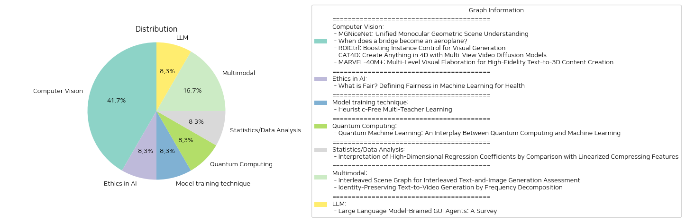

# Daily Artificial Intelligence Insights : Papers

## 🍊 Computer Vision

**요약:**

1. 주요 주제 및 테마 추출:
   - "MGNiceNet: Unified Monocular Geometric Scene Understanding": 자율 주행차를 위한 단안 기하학적 장면 이해, 전역적 세그멘테이션, 자기지도 심도 추정.
   - "When does a bridge become an aeroplane?": 구조적 건강 모니터링, 이질적인 구조 간의 지식 전이.
   - "ROICtrl: Boosting Instance Control for Visual Generation": 텍스트 기반 시각 생성 모델의 인스턴스 제어 향상.
   - "CAT4D: Create Anything in 4D with Multi-View Video Diffusion Models": 단일 시점 비디오로부터 4D 장면 생성.
   - "MARVEL-40M+: Multi-Level Visual Elaboration for High-Fidelity Text-to-3D Content Creation": 텍스트에서 고품질의 3D 콘텐츠 생성, 대규모 데이터셋.

2. 공통 키워드, 트렌드, 패턴 식별:
   - 심도 및 구조 추정, 시각적 생성 및 제어, 데이터셋 및 모델의 고도화.
   - 자율 주행, 시각 데이터의 합성 및 변환.
   - 다중 시각 요소 조작 (여러 인스턴스, 여러 관점).

3. 각 논문의 주요 이벤트 및 중요한 정보 요약:
   - "MGNiceNet"는 자율 주행차용 실시간 실행 가능한 기하학적 장면 이해법으로, 깊이 추정과 전역 범주 분할을 결합.
   - "When does a bridge become an aeroplane?"는 매우 다른 구조 간의 긍정적인 정보 전이가 가능한 경우를 탐구.
   - "ROICtrl"는 시각적 생성에서의 인스턴스 제어를 위한 새로운 접근법을 도입.
   - "CAT4D"는 새로운 관점 및 시간대에서 4D 장면을 재구성할 수 있는 멀티 뷰 비디오 확산 모델을 소개.
   - "MARVEL-40M+"는 대규모 텍스트 주석 데이터셋을 활용해 고품질 3D 콘텐츠 생성을 지원.

4. 이러한 이벤트의 다양한 분야에 대한 영향 분석:
   - 자율 주행: "MGNiceNet" 및 "CAT4D" 방법론은 실시간 장면 분석과 고급 재구성 기술 개선에 기여.
   - 구조적 모니터링: "When does a bridge become an aeroplane?"는 구조적 유사성을 기반으로 한 정보 전이 방법을 제공.
   - 컴퓨터 비전 및 AI: "ROICtrl"와 "MARVEL-40M+"은 시각 생성과 3D 콘텐츠 제작에서의 정밀성 및 품질을 향상.

5. 종합 요약 및 결론:
   최근 심도 추정 및 전역 범주 분할 분야의 진보는 자율 주행 기술의 성능을 향상시키고 있으며, 복잡한 구조 사이의 정보 전이 연구가 증가하고 있습니다. 시각적 생성 모델에서의 인스턴스 제어 기술은 다중 요소를 보다 정확하게 처리할 수 있게 하며, 대규모 고품질 데이터셋의 활용은 3D 콘텐츠 생성의 정교함을 끌어올리고 있습니다. 앞으로는 이러한 기술을 통합해 다양한 적용 분야에서 더 정밀하고 효율적인 작업이 이루어질 것으로 기대됩니다.

**출처:**

 - MGNiceNet: Unified Monocular Geometric Scene Understanding (https://deeplearn.org/arxiv/549352/mgnicenet:-unified-monocular-geometric-scene-understanding)
 - When does a bridge become an aeroplane? (https://deeplearn.org/arxiv/553087/when-does-a-bridge-become-an-aeroplane?)
 - ROICtrl: Boosting Instance Control for Visual Generation (http://arxiv.org/abs/2411.17949v1)
 - CAT4D: Create Anything in 4D with Multi-View Video Diffusion Models (http://arxiv.org/abs/2411.18613v1)
 - MARVEL-40M+: Multi-Level Visual Elaboration for High-Fidelity Text-to-3D Content Creation (http://arxiv.org/abs/2411.17945v1)

## ☀️ Ethics in AI

**요약:**

요약 보고서:

1. 주요 주제 및 테마 추출:
   - 의료 분야에서의 인공지능(AI) 및 머신러닝(ML) 적용
   - 공정성(Fairness) 개념 및 지표 개발
   - 건강 불균형과 존재하는 편향 방지
   
2. 공통 키워드, 트렌드 및 패턴 식별:
   - 공정성(Fairness) 메트릭
   - 기계 학습 모델의 안전성과 효과성
   - 건강 격차의 확대 방지

3. 주요 사건 및 중요한 정보 요약:
   - 의료 분야에서의 ML 모델의 공정성 보장이 필수적이며, 이는 임상 의사 결정과 기존 건강 격차의 강화 방지를 위해 필요함.
   - ML 모델이 불공정할 수 있는 이유와 다양한 실제 사례에서 공정성이 어떻게 평가되었는지를 검토.
   - 공정성 메트릭의 일반적인 사용을 개괄하고, 공개된 전자 건강 기록(EHR) 데이터셋을 기반으로 한 사례 연구 제공.
   - 공정성을 정의하는 데 있어 현재의 도전과제 및 기회를 강조하면서 미래 연구 방향에 대해 논의.

4. 이러한 사건들의 다양한 분야에 대한 영향 분석:
   - 공정한 ML 모델의 개발은 다양한 환자 그룹에 대한 의료 서비스의 접근성을 향상시키고, 임상의의 결정적 지침을 제공함.
   - 잘 정의된 공정성 지표는 ML의 편향성과 차별을 줄이며, 지속적인 건강 격차 문제를 해결하는 데 기여할 수 있음.

5. 결론 및 주목할 만한 향후 발전 방향:
   - ML의 공정성 확보는 기술적, 윤리적 측면 모두에서 중요하며, 지속적인 연구와 협력이 요구됨.
   - 기존의 공정성 메트릭을 개선하고 새로운 전략을 개발함으로써 의료 AI 시스템의 신뢰성을 확보할 필요.
   - 공정성 문제에 대한 추가적인 실험 및 임상 적용 연구가 중요한 미래의 연구 영역으로 간주됨. 

이 보고서는 ML 모델의 공정성을 확보하는 것이 의료 분야에서의 필수적인 목표로 부각되고 있음을 보여주며, 향후 이 분야에서의 연구와 발전이 기대됩니다.

**출처:**

 - What is Fair? Defining Fairness in Machine Learning for Health (https://deeplearn.org/arxiv/550073/what-is-fair?-defining-fairness-in-machine-learning-for-health)

## 🫧 Model training technique

**요약:**

보고서 제목: 다중 교사 학습에서의 휴리스틱 없는 접근 방법

**주요 주제 및 주제 추출:**
- 다중 교사 학습(mei-learning) 프레임워크
- 수동 집합 휴리스틱 제거
- 교사별 입력 토큰 사용
- 데이터 변환과 훈련 과정 개혁
- 보조 작업과 주요 작업의 구분

**공통 키워드, 경향 및 패턴 식별:**
- 예측 결합의 휴리스틱에 의존하지 않는 새로운 방법론
- 다중 학습 패러다임의 원칙
- 다양한 아키텍처, 모달리티 및 작업에서의 강력한 경험적 결과

**각 논문의 주요 이벤트 및 중요한 정보 요약:**
논문은 Teacher2Task라는 새로운 프레임워크를 소개하며, 이는 다중 교사 학습에서 흔히 사용되는 수동 집합 휴리스틱을 제거하는 방법론을 제안한다. 기존 방법들은 여러 교사의 예측을 결합하는 과정에서 휴리스틱을 사용하여 최적 이하의 집합 레이블과 오류 전파를 유발하는 문제가 있었다. 제안된 Teacher2Task는 교사별 입력 토큰의 도입과 훈련 프로세스를 재구성하여 이러한 한계를 극복한다. 이 프레임워크는 훈련 데이터를 N+1개의 작업으로 변환하여 N명의 교사에 의한 레이블링 스타일을 예측하는 N개의 보조 작업과 실제 레이블에 중점을 둔 주요 작업으로 나눈다.

**이벤트가 다양한 부문에 미치는 영향 분석:**
이 프레임워크는 여러 학습 패러다임에서 사용 가능한 원칙을 활용하여, 다양한 아키텍처와 모달리티를 포함한 여러 작업에서 경험적으로 높은 성능을 보였다. 이러한 접근법은 교육 시간의 단축과 더 정확한 예측을 가능하게 하여 교육 및 인공지능 분야에 큰 영향을 미칠 것으로 보인다. 실제 적용에서는 데이터 주석 품질 향상과 오류 감소가 기대된다.

**최종 요약 및 주목할 미래 발전:**
Teacher2Task 프레임워크는 다중 교사 학습에서 수동 휴리스틱에 대한 의존을 피하여 보다 정확하고 효율적인 결과를 도출하는 혁신적인 접근법을 제공한다. 이 방식은 경험적으로 강력한 결과를 보임과 동시에 다양한 작업 및 환경에서 유용하게 사용될 수 있을 것으로 기대된다. 향후 발전 가능성으로는, 더욱 향상된 학습 효율성과 확장 가능성, 그리고 다양한 실제 응용 분야에서의 적용을 통한 데이터 주석 및 품질 개선이 예측된다.

**출처:**

 - Heuristic-Free Multi-Teacher Learning (https://deeplearn.org/arxiv/550099/heuristic-free-multi-teacher-learning)

## 💚 Quantum Computing

**요약:**

보고서 요약:

1. 주요 주제 및 테마 추출:
   - 양자 기계 학습 (QML)
   - 양자 컴퓨팅과 전통적인 기계 학습의 결합
   - 양자 컴퓨팅 원리와 기계 학습 기술의 혁신

2. 공통 키워드, 트렌드, 패턴 식별:
   - 양자 회로 (Variational Quantum Circuits, VQC)
   - 노이즈가 있는 중간 규모의 양자(NISQ) 장치
   - 양자 역학의 독특한 능력 활용
   - 산업적 영향 및 미래 연구 방향

3. 주요 사건 및 중요 정보 요약:
   - 양자 기계 학습은 양자 컴퓨팅의 독특한 능력을 활용하여 전통적인 기계 학습을 혁신하는 빠르게 성장하는 분야입니다.
   - 노이즈가 있는 중간 규모 양자 장치(NISQ)를 기반으로 하는 양자 회로(VQC)를 통해 양자 기계 학습 아키텍처를 개발합니다.
   - 이론적 및 실험적 연구 결과를 보여주며 양자 컴퓨팅을 위한 기계 학습의 패러다임을 소개합니다.
   - QML 연구의 산업적 영향을 조사하며, 미래 연구 방향을 탐구합니다.

4. 이러한 사건이 다양한 분야에 미치는 영향 분석:
   - QML은 기존의 컴퓨팅과 기계 학습 패러다임을 넘어서는 잠재력을 가집니다.
   - NISQ 장치의 발전은 양자 컴퓨팅 연구를 가속화할 수 있으며, QML은 산업과 다양한 응용 분야에서 혁신을 가져올 수 있습니다.

5. 종합 요약 및 미래 개발:
   - 양자 기계 학습은 현재 빠르게 발전 중이며, 이는 전통적인 기계 학습과 양자 컴퓨팅 모두에 상당한 영향을 미칩니다.
   - Variational Quantum Circuits(VQC)를 이용한 연구가 계속 증가하면서 실질적인 응용 분야의 확대 가능성이 큽니다.
   - 향후 연구는 QML의 산업적, 학문적 활용을 더욱 심화시키고 혁신을 주도할 것으로 기대됩니다. 앞으로의 발전 상황을 주의 깊게 관찰할 필요가 있습니다.

**출처:**

 - Quantum Machine Learning: An Interplay Between Quantum Computing and Machine Learning (https://deeplearn.org/arxiv/548667/quantum-machine-learning:-an-interplay-between-quantum-computing-and-machine-learning)

## 👽 Statistics/Data Analysis

**요약:**

요약 보고서:

1. 주요 주제 및 테마:
   - 고차원 회귀 계수의 해석
   - 비선형 응답에 대한 근사
   - 리튬 이온 배터리의 주기 수명 예측
   - 선형화 방법을 통한 기능 계수 도출

2. 공통 키워드, 트렌드 및 패턴 식별:
   - 고차원 데이터
   - 비선형 압축 기능
   - 선형 회귀 및 규제화의 역할

3. 각 논문의 주요 사건 및 중요한 정보 요약:
   - 고차원 기능 데이터의 비선형 응답을 선형 회귀가 어떻게 근사하는지 탐구
   - 리튬 이온 배터리 데이터를 통해 선형화 방법과 회귀 계수 비교
   - 단일 비선형 압축 기능을 활용하여 합성 응답 생성
   - 다양한 규제 조건에서 회귀 계수의 형상이 어떻게 변화하는지를 연구

4. 이러한 사건이 여러 부문에 미치는 영향 분석:
   - 고차원 데이터 분석 및 기계 학습 분야에서의 비선형 응답 이해도 향상
   - 리튬 이온 배터리의 주기 수명 예측 모델 향상 가능성
   - 규제화가 회귀 분석에서의 기능 선택 및 모델 정확도에 미치는 효과에 대한 인사이트 제공

5. 종합 요약 및 잠재적 미래 개발:
   이 연구는 고차원 데이터에서 선형 회귀와 비선형 압축 기능의 통합적 이해를 통해 데이터를 해석하는 새로운 방법을 제시하며, 이는 배터리 수명 예측 등 산업 및 연구에서의 실제 응용에서 중요한 의미를 가질 수 있다. 특히, 규제화가 어떻게 회귀 계수를 형성하고 비선형 응답을 근사하는 데 도움을 주는지에 대한 이해는 데이터 과학과 회귀 모델링의 발전에 있어 중요한 기여가 될 것으로 기대된다. 배터리 관리 시스템이나 기타 고차원 기능 데이터 응용 분야에서의 연구가 더욱 활발히 이루어질 가능성이 있다.

**출처:**

 - Interpretation of High-Dimensional Regression Coefficients by Comparison with Linearized Compressing Features (https://deeplearn.org/arxiv/550410/interpretation-of-high-dimensional-regression-coefficients-by-comparison-with-linearized-compressing-features)

## 🌞 Multimodal

**요약:**

요약 보고서:

1. 주요 주제와 테마 추출:
   - 첫 번째 논문: 텍스트와 이미지가 혼합된 콘텐츠 생성 평가를 위한 평가 프레임워크인 'Interleaved Scene Graph (ISG)' 개발. 텍스트와 이미지 간의 일관성과 구조를 평가하는 방법론 소개.
   - 두 번째 논문: 사람의 정체성을 유지하면서 텍스트를 비디오로 변환하는 'Identity-Preserving Text-to-Video (IPT2V)' 생성 모델 개발. 주파수 분석을 활용하여 정체성을 보존하면서 고품질 비디오 생성.

2. 공통 키워드, 경향, 패턴 식별:
   - 두 논문 모두 멀티모달 콘텐츠 생성에 초점을 맞추고 있으며, 텍스트와 이미지 또는 비디오의 일관성 및 품질 향상에 대한 연구를 수행.
   - '평가'와 '일관성'이 주요 키워드이며, 각각 다른 접근 방식(씬 그래프와 주파수 분해)으로 해결점을 제시.
   - 모델의 성능 향상을 위해 새로운 평가 프레임워크 및 제어 메커니즘을 개발.

3. 주요 사건 및 중요 정보 요약:
   - ISG는 텍스트 및 이미지 생성 시스템의 일관성을 측정하는 평가 프레임워크로, 다양한 레벨에서의 평가 체계를 제안하며, ISG-Bench 데이터를 포함하여 시범 평가를 통해 최근 모델들의 성능이 미비함을 보임. 이를 보완하기 위해 ISG-Agent라는 베이스라인 에이전트를 개발.
   - ConsisID는 새로운 주파수 기반 제어 메커니즘을 사용하여 텍스트-비디오 생성에서의 정체성 유지 문제를 해결하는 모델로, 실험 결과로 그 효과성을 입증하며, 튜닝 없는 파이프라인과 주파수 인식 제어 스킴을 개발.

4. 이러한 사건들이 각 분야에 미친 영향 분석:
   - ISG 프레임워크와 벤치마크는 비전-언어 모델의 성능 측정 및 평가 체계를 체계화하여, 향후 연구 개발 방향을 제공함.
   - ConsisID는 비디오 생성 분야에서 정체성 보존을 위한 새로운 접근을 제시하여, 향후 발전 가능성을 열었으며, 특히 광고 및 영화 산업에서의 높은 활용 가능성을 제시.

5. 최종 종합 요약 및 향후 주목할 개발 방향:
   - 두 논문은 모두 멀티모달 콘텐츠 생성에서의 모델 평가 및 개선에 중점을 두고 있으며, 각각의 방법론은 일관성 및 품질 향상에 기여하고 있음.
   - ISG와 ConsisID의 연구는 앞으로의 비전-언어 및 텍스트-비디오 생성 모델 개발에 크게 기여할 것으로 예상됨.
   - 향후 연구에서는 이 두 가지 접근법을 결합하여, 더 복잡하고 다양한 입력 조건을 지원할 수 있는 통합된 프레임워크와 모델 개발이 주목할 만한 발전 방향이 될 것.

**출처:**

 - Interleaved Scene Graph for Interleaved Text-and-Image Generation Assessment (http://arxiv.org/abs/2411.17188v1)
 - Identity-Preserving Text-to-Video Generation by Frequency Decomposition (http://arxiv.org/abs/2411.17440v1)

## 🍊 LLM

**요약:**

요약 보고서:

1. 핵심 주제 및 테마 추출:
   - 인간-컴퓨터 상호작용에서 GUI의 중심적 역할
   - 대형 언어 모델(LLM) 및 다중 모달 모델을 통한 새로운 GUI 자동화 시대의 도래
   - 자연어 이해, 코드 생성, 시각적 처리에서의 LLM의 장점
   - 자연어 지시에 의해 실행되는 LLM-브레인 GUI 에이전트
   - 웹 탐색, 모바일 앱 상호작용, 데스크탑 자동화를 비롯한 다양한 응용 분야

2. 공통 키워드, 트렌드 및 패턴:
   - LLM-브레인 GUI 에이전트의 자동화 능력
   - 대화형 명령을 통한 복잡한 작업 수행의 용이성
   - GUI 에이전트의 연구 및 산업적 신속한 발전
   - 연구 갭과 향후 발전 방안을 제시

3. 주요 이벤트 및 중요한 정보 요약:
   - LLM-브레인 GUI 에이전트는 복잡한 GUI 요소를 해석하고 자연어 명령을 통해 자율적으로 작업을 실행
   - 연구 및 산업 내에서 신속한 발전을 이루고 있는 분야
   - GUI 에이전트와 관련된 연구 프레임워크, 교육 데이터 사용, 대형 액션 모델 개발 및 평가 기준 등 탐구

4. 이러한 이벤트가 다양한 분야에 미치는 영향:
   - 사용자 경험의 혁신, 소프트웨어와의 상호작용 방식 혁신
   - 연구자 및 실무자에게 LLM-브레인 GUI 에이전트의 잠재력을 최대한 발휘하도록 지도

5. 최종 통합 요약 및 결론, 미래 동향:
   - LLM-브레인 GUI 에이전트는 사용자와 디지털 시스템 간의 상호작용 방식을 크게 상향하며, 자연어 및 시각적 이해도에서 뛰어난 능력을 발휘합니다.
   - 현재까지의 진보에 기반하여, 관련 연구 및 실무에 대한 추가 발전 동향을 주시해야 합니다.
   - 향후 연구는 연구상 공백을 해소하며, LLM-브레인 GUI 에이전트의 잠재력을 충실히 발휘하기 위한 발전 로드맵 필요성을 강조합니다.

**출처:**

 - Large Language Model-Brained GUI Agents: A Survey (http://arxiv.org/abs/2411.18279v1)

