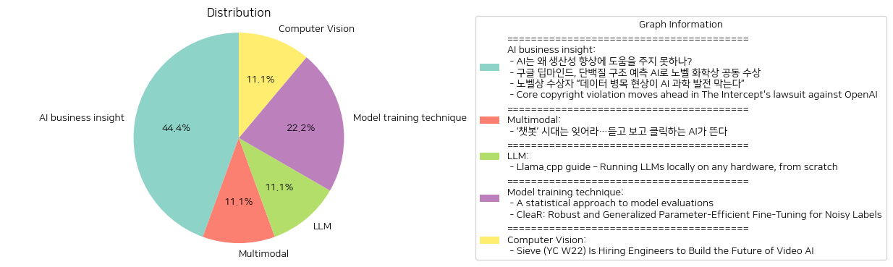

# Daily Artificial Intelligence Insights : News

## ❄️ AI business insight

**요약:**

1. **주요 주제**:
   - 인공지능(AI)의 발전과 그 한계
   - AI의 과학적 기여와 노벨상 수상
   - 데이터 품질과 AI 발전의 연관성
   - 저작권 침해와 AI 훈련 데이터의 사용 문제

2. **주요 사건**:
   - AI의 경제적 기대와 현재 생산성 향상에 기여하지 못하는 이유에 대한 논의
   - 구글 딥마인드의 AI 기술로 인해 노벨 화학상 공동 수상
   - AI 과학 발전을 저해하는 데이터 병목 현상에 대한 노벨상 수상자의 언급
   - The Intercept가 OpenAI에 저작권 침해 소송을 제기하고, 소송이 법원에서 진행 허가를 받은 사건

3. **영향 분석**:
   - **경제**: AI의 발전이 경제 성장의 동력으로 작용할 수 있지만, 개선이 필요하다는 점이 지적됨. 이는 AI의 효율성을 높이는 기술적 발전이 경제 전반에 중요한 영향을 미친다는 것을 시사함.
   - **정치**: AI의 연구와 발전에 있어 데이터의 중요성이 강조되며, 데이터 관리와 관련 규제 필요성이 부각됨.
   - **사회**: AI 기술의 윤리적 문제, 특히 저작권 침해와 관련된 사회적 논란이 예상됨.
   - **과학**: AI를 활용한 과학적 발견의 가능성이 열리지만, 데이터의 품질이 그 발전의 핵심 요소로 부각됨.

4. **최종 요약**:
   최근의 뉴스들은 AI 기술의 가능성과 도전 과제를 중심으로 여러 가지 사건과 논의가 진행되고 있음을 보여준다. 주요 키워드는 ‘생산성’, ‘노벨상 수상’, ‘데이터 품질’, ‘저작권 문제’ 등이며, AI 기술의 경제적 성장 가능성과 과학적 기여가 논의되지만, 데이터 품질과 관련된 기술적 제약과 법적 문제들이 해결되어야 함을 강조한다. 앞으로 AI의 경제적 및 사회적 가치가 극대화되기 위해서는 기술적, 법적, 윤리적 고려가 모두 필요할 것이다. 데이터 관리와 저작권 문제는 특히 향후 AI 발전의 걸림돌이 될 수 있으며, 관련 정책과 규제의 발전을 주의 깊게 지켜볼 필요가 있다.

**출처:**

 - AI는 왜 생산성 향상에 도움을 주지 못하나? (https://www.technologyreview.kr/ai%eb%8a%94-%ec%99%9c-%ec%83%9d%ec%82%b0%ec%84%b1-%ed%96%a5%ec%83%81%ec%97%90-%eb%8f%84%ec%9b%80%ec%9d%84-%ec%a3%bc%ec%a7%80-%eb%aa%bb%ed%95%98%eb%82%98/)
 - 구글 딥마인드, 단백질 구조 예측 AI로 노벨 화학상 공동 수상 (https://www.technologyreview.kr/%ea%b5%ac%ea%b8%80-%eb%94%a5%eb%a7%88%ec%9d%b8%eb%93%9c-%eb%8b%a8%eb%b0%b1%ec%a7%88-%ea%b5%ac%ec%a1%b0-%ec%98%88%ec%b8%a1-ai%eb%a1%9c-%eb%85%b8%eb%b2%a8-%ed%99%94%ed%95%99%ec%83%81-%ea%b3%b5%eb%8f%99/)
 - 노벨상 수상자 “데이터 병목 현상이 AI 과학 발전 막는다” (https://www.technologyreview.kr/%eb%85%b8%eb%b2%a8%ec%83%81-%ec%88%98%ec%83%81%ec%9e%90-%eb%8d%b0%ec%9d%b4%ed%84%b0-%eb%b3%91%eb%aa%a9-%ed%98%84%ec%83%81%ec%9d%b4-ai-%ea%b3%bc%ed%95%99-%eb%b0%9c%ec%a0%84-%eb%a7%89%eb%8a%94/)
 - Core copyright violation moves ahead in The Intercept's lawsuit against OpenAI (https://www.niemanlab.org/2024/11/copyright-claim-moves-ahead-in-the-intercepts-lawsuit-against-openai/)

## 🐱 Multimodal

**요약:**

1. **주요 테마**:
   - AI 기술의 진화: 텍스트 기반 AI 챗봇에서 음성과 영상 생성 기능이 강화된 AI로의 전환.
   - AI의 기능 및 활용 범위 확대: 단순한 채팅을 넘어 듣고 보고 클릭할 수 있는 AI의 기능 발전.

2. **주요 사건**:
   - AI의 기술 발전이 빠르게 이루어지고 있으며, 텍스트 기반 챗봇이 아닌 새로운 음성과 영상 생성 AI가 부상 중이라는 점이 강조됨.

3. **영향 분석**:
   - 경제: 더 진화한 AI 기술은 다양한 산업들, 특히 IT 및 미디어 산업에 새로운 기회를 제공할 가능성이 높음. AI가 제공하는 새로운 기능은 비즈니스 효율성을 높이고 새로운 서비스 모델을 창출할 수 있음.
   - 사회: 대중들은 보다 인터랙티브하고 몰입감 있는 AI 경험을 통해 일상생활의 편리함을 누릴 것으로 예상됨. 특히, 접근성 측면에서 더 많은 사람들이 AI의 혜택을 받을 수 있을 것임.
   - 기술업계: 혁신적으로 발전하는 AI 기술은 기업들 간의 경쟁을 더욱 치열하게 만들 것으로 보이며, 지속적인 연구와 투자가 요구될 것임.

4. **최종 요약**:
   - 현 시대의 AI 기술은 챗봇을 넘어 더욱 진화하여 음성과 영상 생성 기능을 갖춘 형태로 발전하고 있음. 이러한 발전은 경제와 사회 전반에 걸쳐 긍정적인 영향을 미칠 것으로 예상되며, AI 기술의 적용 가능성과 서비스의 다양성을 크게 확장시킬 잠재력이 있음. 앞으로 AI 기술의 발전 방향과 그것이 미칠 사회적, 경제적 영향을 주시해야 할 필요가 있음.

**출처:**

 - ‘챗봇’ 시대는 잊어라…듣고 보고 클릭하는 AI가 뜬다 (https://www.technologyreview.kr/%ec%b1%97%eb%b4%87-%ec%8b%9c%eb%8c%80%eb%8a%94-%ec%9e%8a%ec%96%b4%eb%9d%bc-%eb%93%a3%ea%b3%a0-%eb%b3%b4%ea%b3%a0-%ed%81%b4%eb%a6%ad%ed%95%98%eb%8a%94-ai%ea%b0%80-%eb%9c%ac%eb%8b%a4/)

## 🥳 LLM

**요약:**

**종합 요약 보고서: Llama.cpp 가이드**

1. **핵심 주제**:
   - 요즘 AI 기술 발전과 함께 사용자가 직접 대형 언어 모델(LLMs)을 로컬 환경에서 실행할 수 있는 다양한 방법이 논의되고 있습니다.
   - llama.cpp와 같은 툴을 통해 LLMs를 스스로 호스팅하고 설정하는 과정에 대한 관심이 증가하고 있습니다.
   - 이와 관련된 설치, 의존성 관리, 최적 성능을 위한 빌드 구성에 대한 가이드를 제공하는 내용이 주를 이루고 있습니다.

2. **주요 이벤트**:
   - 사용자가 llama.cpp라는 툴을 사용하여 자체 호스팅 LLMs를 설치 및 운영했으며, 이 과정에서 얻은 경험을 바탕으로 구체적인 설치 가이드를 전달하였습니다.
   - 프로젝트를 빌드하고 의존성을 설치한 뒤, 최적화를 위해 빌드 구성을 조정하는 과정을 상세히 안내하였습니다.

3. **영향 분석**:
   - **경제**: 소규모 기업이나 개인 개발자가 대형 언어 모델을 저렴하게 구동할 수 있는 방법을 제공함으로써 AI 관련 시장의 접근성을 높일 수 있습니다.
   - **사회**: 기술적 장벽을 낮춤으로써 다양한 사용자들이 AI 기술에 대한 접근성을 개선하고, 이를 통해 새로운 창작 활동이나 생산성을 증대시킬 수 있는 기회를 제공합니다.
   - **정치**: AI 기술의 대중화로 인한 개인정보 보호 및 데이터 보안 이슈가 대두될 가능성이 있습니다. 따라서 해당 분야의 규제 및 가이드라인이 필요할 것입니다.

4. **최종 요약**:
   - llama.cpp와 같은 툴을 활용하여 사용자가 직접 로컬 환경에서 LLMs를 운영할 수 있는 시대가 도래하고 있습니다. 이는 개인 및 중소기업에 새로운 기술을 활용할 수 있는 기회를 제공하며, AI 기술의 민주화를 촉진할 수 있습니다.
   - 앞으로 이러한 툴들이 사회 전반에 미칠 영향, 개인정보 보호에 대한 이슈, 그리고 AI 기술의 책임 있는 사용을 위한 규제 등에 주목할 필요가 있습니다.

**출처:**

 - Llama.cpp guide – Running LLMs locally on any hardware, from scratch (https://steelph0enix.github.io/posts/llama-cpp-guide/)

## 👽 Model training technique

**요약:**

**주요 주제**:
- AI 모델 평가와 데이터 클리닝에 관한 연구가 주요 주제로 나타납니다.
- 두 연구 모두 머신러닝 및 인공지능의 향상된 해석 가능성 및 정확성을 목표로 하고 있습니다.
- 데이터의 잡음 처리 및 평가 기준의 신뢰성을 높이는 방법론을 제시하고 있습니다.

**주요 이벤트**:
- 첫 번째 기사에서는 AI 모델 평가의 오차를 줄이기 위해 평가 결과에 표준 오차를 적용하는 방법이 제안되었습니다.
- 두 번째 기사에서는 잡음 있는 레이블 하에서 파라미터 효율적인 파인튜닝(PEFT)을 개선하기 위한 새로운 접근법인 Clean Routing을 소개하였습니다.

**영향 분석**:
- 경제: 더욱 정확한 AI 모델 평가 및 안정적인 데이터 처리 방법론은 AI 제품과 서비스의 상업적 가치 상승에 기여할 수 있습니다.
- 사회: AI 모델의 평가 정밀도를 향상시키고 잡음 있는 데이터 환경에서의 성능을 개선하면 AI 활용이 증대될 수 있습니다.
- 기술: 이러한 연구는 향후 AI 기술의 발전 방향을 제시하며, 실용적이고 신뢰할 수 있는 AI 모델 개발에 중요한 역할을 할 것입니다.

**최종 요약**:
이 기사는 AI 모델의 평가 및 데이터 클리닝에 관련된 중요한 연구 결과를 다루고 있으며, 기존 모델의 한계를 극복하여 더 나은 성능을 도출할 수 있는 방법을 탐구하고 있습니다. 이에 따라 특히 상업적 AI 응용 분야에서의 활용 가능성이 증가할 것으로 보이며, AI의 평가 및 데이터 처리 방법론에서 더 많은 연구가 이루어질 필요가 있습니다. 앞으로 이러한 방법론의 확장이 더욱 다양한 AI 시스템 및 분야에 적용될 것으로 기대됩니다.

**출처:**

 - A statistical approach to model evaluations (https://www.anthropic.com/research/statistical-approach-to-model-evals)
 - CleaR: Robust and Generalized Parameter-Efficient Fine-Tuning for Noisy Labels (https://arxiv.org/abs/2411.00873)

## ☀️ Computer Vision

**요약:**

**요약 보고서**

1. **주요 주제**:
   - 'Sieve'의 영상 AI 분야 혁신 및 개발
   - 맞춤형 애플리케이션 구축과 비용, 품질, 속도 간의 균형을 지원하는 플랫폼 제공
   - 기존 파이프라인에 통합 가능한 전문가 지원 및 전체 기능의 관찰 스택 제공
   - 유연한 가격 정책을 통해 다양한 사용자 요구 충족

2. **주요 사건**:
   - 'Sieve'가 엔지니어를 고용하여 영상 AI의 미래를 구축하는 중
   - 플랫폼을 통해 사용자에게 기존 애플리케이션의 맞춤화 또는 새로운 애플리케이션 구축 선택
   - 다양한 사례와의 통합에 대한 지원을 제공하며, 비용과 품질 및 속도 간의 트레이드오프를 포함한 아키텍처 강조

3. **영향 분석**:
   - **경제**: Sieve와 같은 플랫폼의 발전으로 인해 영상 AI 기술의 확산이 가속화될 수 있어, 관련 산업 분야의 경제적 성장 잠재력을 증대시킬 수 있음
   - **정치**: AI 및 기술 발전은 각국의 디지털 혁신 정책 및 규제에 영향을 미칠 수 있으며, 혁신 경쟁을 심화시킬 가능성
   - **사회**: 영상 AI 기술의 발전은 비즈니스와 일상생활의 효율성을 높이는 한편, 개인정보 보호 및 기술의 윤리적 사용에 대한 사회적 논의 필요성이 증대될 수 있음

4. **최종 요약**:
   'Sieve'는 영상 AI 분야의 중요한 혁신 업체로, 플랫폼을 통해 사용자의 다양한 요구에 맞춘 솔루션을 제공하고 있다. 이 회사의 성공적인 엔지니어 채용은 기술 발전에 기여할 것이며, 향후 영상 AI의 상용화 확대를 기대할 수 있다. 경제적 측면에서는 관련 산업의 성장을 촉진할 수 있으며, 사회적으로는 AI 기술 활용에 대한 윤리 및 규제 논의가 더욱 활발해질 것이다. 앞으로 'Sieve'와 같은 플랫폼의 기술적 진보가 지속될 것으로 예상되는 바, 이로 인해 AI 기술의 다양한 적용 사례가 증가할 가능성이 있다.

**출처:**

 - Sieve (YC W22) Is Hiring Engineers to Build the Future of Video AI (https://www.sievedata.com/)

