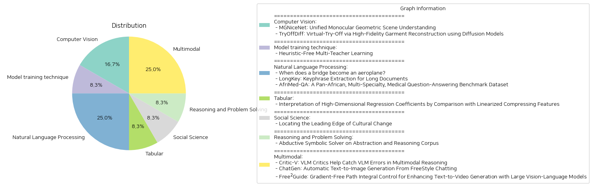

# Daily Artificial Intelligence Insights : Papers

## 💙 Computer Vision

**요약:**

보고서 요약:

1. MGNiceNet: 단일 카메라 기반 기하학적 장면 이해
   - 주제 및 주제: 본 연구는 단일 카메라를 통해 기하학적 장면을 이해하는 데 중점을 두고 있으며, 이는 범용 분할과 자가 지도 방식의 깊이 추정 기술을 결합하여 자율 차량에 실시간 적용에 중점을 둡니다. 
   - 주요 정보: MGNiceNet은 RT-K-Net을 기반으로 한 최신 실시간 범용 분할 기법을 확장하여, 범용 분할과 단일 카메라 깊이 추정을 통합하는 접근 방식을 제안합니다. 이 모델은 깊이 추정을 위해 범용 경로의 정보를 명시적으로 사용하는 자가 지도 방식의 깊이 예측기를 사용합니다.
   - 영향 분석: 이 방법은 기존의 비디오 범용 주석에 의존하지 않고 깊이 예측을 향상시키는 범용 기반 동작 마스킹 방법을 소개하며, 시내 스케이프와 KITTI 자율 주행 데이터셋에서 최첨단 결과를 나타내어 더 복잡한 계산 기법에 비해 성능 격차를 줄였습니다. 자율 주행 차량 분야에서 실시간 환경 이해의 효율성을 높이는 데 기여할 수 있습니다.

2. TryOffDiff: 확산 모델을 이용한 고정밀 의류 재구성을 통한 가상 착의
   - 주제 및 주제: VTOFF는 한 장의 사진에서 표준화된 의류 이미지를 생성하는 새로운 과제를 제시합니다. 이 연구는 전통적인 가상 착의(VTON)와 달리 의류 이미지를 추출하여 상품 이미지의 충실도를 평가하는 데 중점을 둡니다.
   - 주요 정보: TryOffDiff 모델은 안정한 확산 기법과 SigLIP 기반의 시각 조건 설정을 통해 충실도와 세부 사항을 보존함으로써 성능을 증대시킵니다. 실험 결과, 이 접근 방식이 기존의 자세 전환 및 가상 착의 기법보다 적은 전처리 및 후처리 단계로 더 우수한 결과를 보여줍니다.
   - 영향 분석: VTOFF는 상품 이미지를 향상시켜 전자상거래 응용 프로그램에서 활용 가능성을 보여주며, 생성 모델 평가를 진전시키고, 고정밀 재구성 기술에 대한 미래 연구에 영감을 줄 수 있습니다.

최종 통합 요약 및 결론:
이 두 논문은 각각 자율 주행 차량의 실시간 환경 이해와 전자상거래 이미지 제작에서 중요한 기여를 한다고 할 수 있습니다. MGNiceNet의 혁신적 방법론은 자율 주행 차량의 안전성 및 효율성을 높이는 데 기여할 수 있으며, TryOffDiff의 연구는 VTOFF를 통해 상품 묘사와 관련한 새로운 기준을 제시하고, 향후 고충실도의 재구성 모델 개발에 활력을 불러올 것입니다. 향후 이러한 기술들은 다양한 분야에서 응용 가능하며, 관련 연구와 산업 발전에 큰 영향을 미칠 것으로 기대됩니다.

**출처:**

 - MGNiceNet: Unified Monocular Geometric Scene Understanding (https://deeplearn.org/arxiv/549352/mgnicenet:-unified-monocular-geometric-scene-understanding)
 - TryOffDiff: Virtual-Try-Off via High-Fidelity Garment Reconstruction using Diffusion Models (http://arxiv.org/abs/2411.18350v1)

## 🌞 Model training technique

**요약:**

보고서 요약:

1. 주요 주제 및 테마:
   - 'Heuristic-Free Multi-Teacher Learning' 논문은 여러 교사를 활용한 학습 프레임워크에서 수작업으로 수행되는 집계 휴리스틱의 필요성을 제거하는 새로운 방법인 Teacher2Task를 소개합니다.

2. 공통 키워드, 트렌드, 패턴:
   - 다중 교사 학습, 수작업 휴리스틱 제거, 예측 결합의 최적화, 교사별 입력 토큰, 학습 과정의 재구성, 주요 및 보조 작업.

3. 주요 사건 및 중요한 정보 요약:
   - 기존의 다중 교사 학습 방법은 여러 교사의 예측을 결합하기 위해 주로 수작업 휴리스틱을 사용하지만, 이는 종종 최적의 집계 라벨이 아니게 만들고 집계 오류를 유발했습니다.
   - Teacher2Task는 이러한 문제를 해결하기 위해 교사별 입력 토큰을 도입하여 학습 과정을 개편합니다. 
   - 이 방식은 실제 라벨과 여러 교사의 주석을 N+1개의 독립된 작업으로 변환합니다. N개의 보조 작업은 각 교사의 라벨링 스타일을 예측하며, 하나의 주요 작업은 실제 라벨에 중점을 둡니다.

4. 이벤트의 다양한 부문에 대한 영향 분석:
   - 이 방식은 여러 학습 패러다임의 원리를 기반으로 하며, 다양한 아키텍처, 모달리티 및 작업에 걸쳐 강력한 실증적 결과를 보입니다.
   - 이는 인공지능 및 머신러닝 분야에서 수작업의 집계 휴리스틱을 대체할 수 있는 잠재적인 혁신적 방법으로 주목받고 있습니다.

5. 최종 통합 요약 및 결론, 향후 주목할 발전:
   - Teacher2Task는 여러 교사의 학습을 최적화할 수 있는 획기적인 방식으로써 기존의 한계를 보완하며 새로운 가능성을 제시합니다.
   - 앞으로는 해당 방식의 실용적인 적용 사례 및 다양한 분야에서의 확장 가능성을 지켜보는 것이 중요합니다. 이를 통해 다중 교사 학습의 효율성을 더욱 향상시키고, 다양한 작업에서의 성능을 극대화할 수 있을 것으로 기대됩니다.

**출처:**

 - Heuristic-Free Multi-Teacher Learning (https://deeplearn.org/arxiv/550099/heuristic-free-multi-teacher-learning)

## 🚀 Natural Language Processing

**요약:**

**종합 보고서**

1. **주요 주제 및 테마 추출:**
   - 첫 번째 논문은 이종 구조물 간 데이터 전송을 가능하게 하는 방법론을 다루며, 구조의 매개변수를 조정함으로써 구조 간 긍정적인 전송을 달성할 수 있는 가능성을 제시한다.
   - 두 번째 논문은 정보 과부하 시대에 대한 해결책으로 긴 문서에서 핵심 구문을 추출하는 방법을 소개하며, LongKey라는 새로운 프레임워크가 제안된다.
   - 세 번째 논문은 아프리카 대륙에서의 의료 질문-응답 벤치마크 데이터셋의 중요성을 강조하며, 다양한 의학 분야를 아우르는 15,000개의 질문을 포함한 AfriMed-QA의 개발을 설명한다.

2. **공통 키워드, 트렌드 및 패턴:**
   - "지식 전송," "데이터셋," "기계 학습 모델" 등은 논문 전반에 걸쳐 반복되는 키워드이다.
   - 현대의 데이터 과학 기술이 다양한 분야에 적용되어 문제를 해결하고 있는 것이 공통된 트렌드로 나타난다.
   - 자동화와 데이터 기반 접근 방식이 정보 추출 및 처리의 핵심으로 부상하고 있음.

3. **주요 사건 및 핵심 정보 요약:**
   - 첫 번째 논문에서는 구조 매개변수의 변화를 통한 정보 전송의 긍정적 사례를 보여주며, 이종 시스템 간의 성공적인 지식 전환을 입증하였다.
   - LongKey는 긴 문서에서 효율적으로 키프레이즈를 추출할 수 있는 방법을 제시하며, 다양한 데이터셋에 대한 테스트에서 우수한 성능을 보였다.
   - AfriMed-QA는 아프리카 전역의 의료 정보에 대한 접근성을 높이기 위한 데이터셋으로, 다양한 언어 모델에 기반한 평가를 통해 LLM의 활용 가능성을 탐구하고 있다.

4. **이벤트가 미치는 영향 분석:**
   - PBSHM 기술은 구조공학 및 관련 분야에서 정보 전송과 시스템 통합의 새로운 가능성을 열어준다.
   - LongKey framework는 문서 관리와 정보 검색 분야에 있어서 큰 혁신을 가져올 수 있으며, 연구 및 학술 활동의 효율성을 높일 수 있다.
   - AfriMed-QA는 의료 자원 부족국가에서 의료 접근성을 대폭 향상시킬 수 있는 방안을 제시하며, 특히 아프리카 대륙 내 표준화된 의료 서비스 제공의 기초를 마련할 수 있다.

5. **최종 요약 및 향후 개발 가능성:**
   - 구조적 건강 모니터링, 긴 문서에서의 정보 추출, 그리고 의료정보 접근성 강화와 같은 다양한 분야에서 기술적 진보와 문제 해결의 가능성을 탐구하는 연구들이 지속되고 있다.
   - PBSHM와 LongKey 같은 기술은 데이터 처리와 분석의 효율성을 증대시키며, 다양한 분야의 전문가들이 데이터 과부하에 효과적으로 대응할 수 있도록 돕는 역할을 할 것으로 기대된다.
   - AfriMed-QA와 같은 프로젝트는 글로벌 수준의 의료 서비스의 표준화를 향한 중요한 발걸음을 내딛으며, 특히 LMICs에서 LLM의 활용에 대한 기초 연구를 제공한다.
   - 향후에는 이러한 기술 및 데이터셋이 더욱 다양하고 복잡한 문제에 대응하며, 글로벌 및 지역별 도전에 대한 해결책을 제시할 가능성이 높다.

**출처:**

 - When does a bridge become an aeroplane? (https://deeplearn.org/arxiv/553087/when-does-a-bridge-become-an-aeroplane?)
 - LongKey: Keyphrase Extraction for Long Documents (http://arxiv.org/abs/2411.17863v1)
 - AfriMed-QA: A Pan-African, Multi-Specialty, Medical Question-Answering Benchmark Dataset (http://arxiv.org/abs/2411.15640v2)

## 🌿 Tabular

**요약:**

### 논문 요약 보고서

**주제 및 테마 추출:**
이 논문은 고차원 자료에서 선형 회귀의 해석 가능성을 개선하고자 하는 연구로, 리튬 이온 배터리의 수명 예측에서 시작되었습니다. 목표는 비선형 반응을 선형 회귀로 근사하는 방법을 이해하고, 고차원 기능 자료에서의 선형화된 특징 계수와 경로 상에 있는 회귀 해들의 계수를 비교하는 방법을 개발하는 것입니다.

**주요 용어 및 트렌드 식별:**
- 고차원 자료
- 선형 회귀
- 비선형 반응
- 리튬 이온 배터리
- 선형화 기법
- 기능 자료 분석
- 규제화된 도메인

**주요 사건 및 중요 정보 요약:**
연구는 고차원 기능 자료에 대해 선형 회귀 계수가 어떻게 형성되고, 이들이 선형화된 특징 계수와 어떤 관계가 있는지를 설명합니다. 이 과정에서 규제화 정도에 따라 회귀 계수의 형태가 어떻게 변화하며 비선형 반응을 근사하는 데 활용되는지를 배터리 데이터 사례 연구를 통해 보여주고 있습니다.

**사건의 영향 분석:**
이번 연구는 특히 고차원 데이터 분석에서 비선형 반응 추정을 위한 새로운 방법론을 제시함으로써 기능적인 데이터 과학 및 통계 해석에 중요한 기여를 했습니다. 이러한 접근은 리튬 이온 배터리 수명 예측 등과 같은 실질적 응용 분야에서 더욱 효과적으로 사용할 수 있는 가능성을 제공합니다.

**최종 종합 요약 및 향후 개발:**
본 연구는 고차원 기능 자료에 대한 선형 회귀의 해석 가능성을 새로운 관점에서 조명하고 기존 기술의 활용도를 높였습니다. 이러한 방법론이 데이터 과학 및 통계적 모델링 분야에서 다양한 응용 분야로 확산될 가능성을 품고 있어, 향후 고차원 자료 분석이 포함된 여러 산업 분야에서 이러한 방법의 적용에 주목할 필요가 있습니다. 앞으로는 이 연구를 바탕으로 더욱 복잡한 비선형 구조를 다룰 수 있는 기법 개발이 기대됩니다.

**출처:**

 - Interpretation of High-Dimensional Regression Coefficients by Comparison with Linearized Compressing Features (https://deeplearn.org/arxiv/550410/interpretation-of-high-dimensional-regression-coefficients-by-comparison-with-linearized-compressing-features)

## 🩵 Social Science

**요약:**

제목: '문화 변화의 선두를 찾기 위한 연구'  
요약: 문화 변화 연구에서 텍스트 유사성 및 차이 측정법이 점점 중요해지고 있습니다. 하지만 실제로 어떤 측정법이 사회적 변화 증거와 일치하는지는 불확실합니다. 본 연구는 세 가지 텍스트 표현(주제 모델, 문서 임베딩, 단어 수준의 난해성)을 문학 연구, 경제학, 문학 장르에서 비교합니다. 저명한 저자와 젊은 저자의 작품은 언제나 변화의 선두에 있으며, 특정 텍스트 표현이 다른 것보다 우수하다는 명확한 증거는 없습니다. 하지만 사회적 증거와 가장 일치하는 경우는 텍스트의 상위 4분위 구간을 통해 표현될 때, 특히 텍스트의 가장 혁신적인 부분이 지속적인 혁신보다 더 큰 영향을 미칠 수 있다는 것을 시사합니다.

이 연구는 문화 변화의 선두를 정의하는 데 중요한 트렌드를 밝히고, 혁신적인 부분이 얼마나 큰 영향을 미치는지를 확인합니다. 이러한 지표와 방법론이 다양한 분야에서의 문화 혁신 과정에 더 많이 활용될 전망입니다. 향후 연구에서는 텍스트의 가장 혁신적인 순간들이 사회 전반에 걸쳐 어떻게 수용되고 영향을 주는지를 자세히 분석하는 데 집중할 필요가 있을 것입니다.

**출처:**

 - Locating the Leading Edge of Cultural Change (https://deeplearn.org/arxiv/551310/locating-the-leading-edge-of-cultural-change)

## ⭐ Reasoning and Problem Solving

**요약:**

제목: '추론 및 상징 솔버의 추상화와 추론 코퍼스에 관한 연구'

이 논문은 인공지능의 추론 능력을 향상시키기 위한 도전에 대해 다루고 있으며, 특히 추상화 및 추론 코퍼스(ARC) 내에서의 논리성에 중점을 두고 있습니다. 사람은 이러한 시각적 추론 과제를 관찰과 가설을 바탕으로 해결하며, 자신의 해결 방법을 적절한 이유로 설명할 수 있습니다. 그러나, 이전의 많은 접근법은 그리드 전환에만 집중했으며, 이는 AI가 합리적이고 인간과 유사한 해결책을 제공하기에 충분하지 않았습니다. 사람의 시각적 추론 과제를 해결하는 과정을 고려했을 때, 사고 과정은 유도 추론 과정일 가능성이 높다는 결론을 내렸습니다. 따라서, 관찰된 데이터를 상징적으로 지식 그래프로 표현하여 해결책 생성에 사용할 수 있는 핵심 지식을 추출하는 새로운 프레임워크를 제안합니다. 이 정보는 해결책 검색 공간을 제한하고 합리적인 중간 과정을 제공하는 데 도움을 줍니다. 우리의 접근법은 해결책 공간을 효과적으로 좁히고 핵심 지식 추출에 기반하여 논리적인 해결책을 제공함으로써 ARC 과제에서 AI 성능을 개선할 가능성이 있습니다.

주요 테마:
- 인공지능 추론 능력 향상
- 시각적 추론 과제
- 유도 추론
- 지식 그래프와 핵심 지식 추출

논문의 중요 정보 분석:
논문은 시각적 추론 과제에 대한 인간의 해결 방식을 AI에 적용하기 위한 프레임워크를 제안합니다. 이를 통해 해결책 검색 공간을 제한하고, AI가 더 인간적이고 논리적인 솔루션을 제안할 수 있게 합니다.

영향 분석:
이러한 연구는 인공지능이 복잡한 시각적 추론 과제를 보다 효과적으로 해결하게 하여, 향후 다양한 응용 분야에서 AI의 응용 가능성을 확장할 수 있습니다. 특히, 로봇 공학, 컴퓨터 비전, 자동화된 문제 해결 등에서의 AI 성능을 획기적으로 향상시킬 수 있는 잠재력이 있습니다.

결론 및 발전 가능성:
본 연구는 AI 추론에 새로운 패러다임을 제시하며, AI가 인간과 유사한 방식으로 복잡한 과제를 해결할 가능성을 열어줍니다. 앞으로 이러한 추론 기법이 다양한 실제 적용 사례에서 AI의 적용을 빠르게 확장할 수 있는 길을 열어줄 것입니다. 향후 연구에서는 이러한 접근법이 다양한 시각적 및 논리적 문제에 어떻게 적용될 수 있는지를 탐구할 필요가 있습니다.

**출처:**

 - Abductive Symbolic Solver on Abstraction and Reasoning Corpus (https://deeplearn.org/arxiv/553225/abductive-symbolic-solver-on-abstraction-and-reasoning-corpus)

## 🪸 Multimodal

**요약:**

보고서:

1. 주요 주제 및 테마 추출:
   - 다중모달 추론에서 VLMs(비전-언어 모델)에 대한 비판 및 오류 수정
   - 텍스트-이미지(T2I) 생성 모델의 자동화 및 사용자 편의성 개선
   - 대형 비전-언어 모델을 활용한 텍스트-비디오(T2V) 생성의 개선과 정합성 문제 해결

2. 공통 키워드, 트렌드 및 패턴 식별:
   - 다중모달 추론, 텍스트-이미지 및 텍스트-비디오 생성에서의 정합성 개선
   - 자동화 및 사용자의 편리성을 고려한 비교적 복잡한 프로세스 간소화
   - 대형 비전-언어 모델 및 강화 학습 이론을 활용하여 모델 성능 향상

3. 각 논문의 주요 이벤트 및 중요 정보 요약:
   - 'Critic-V' 논문은 VLMs의 추론 오류를 보완하기 위해 Critic 모델을 도입하여 Reasoner가 생성하는 추론 경로를 더 정교하고 정확하게 결정하도록 향상시킴. 이를 통해 자율 주행 및 구현 지능과 같은 현실적인 다중모달 응용 분야에서 성능을 향상시킴.
   - 'ChatGen' 논문은 자유로운 대화를 통해 텍스트-이미지 생성의 모든 단계를 자동화하여 사용자 편의를 높이고 실수 시도를 줄임. ChatGen-Evo라는 멀티 스테이지 진화 전략을 제안하여 성능을 여러 단계에 걸쳐 향상시키며, 자동화 T2I의 발전을 위한 귀중한 통찰력을 제공.
   - 'Free$^2$Guide' 논문은 영상 생성에서 텍스트 정합성을 강화하기 위해 추가 모델 학습 없이 대형 비전-언어 모델을 활용한 비차별 가능한 보상 함수를 이용하는 프레임워크를 개발. 다양한 차원에서 텍스트 정합성을 크게 향상시키고, 생성된 비디오의 전반적인 품질을 향상시킴.

4. 이러한 이벤트가 다양한 분야에 미치는 영향 분석:
   - 다중모달 추론의 신뢰성과 정확성이 향상됨에 따라 자율주행차 및 인공 지능 기술의 발전에 긍정적인 영향을 미침.
   - 자동화된 텍스트-이미지 및 텍스트-비디오 생성은 미디어와 콘텐츠 제작 분야의 혁신을 주도하고, 사용자 경험을 향상시키며, 창의력을 확장할 수 있는 기회를 제공.
   - 강화학습 이론을 활용한 모델 개선은 더 복잡한 문제들을 해결할 수 있는 가능성을 열고, 다양한 산업과 학문 분야에 강력한 도구로 자리 잡을 수 있는 잠재력이 존재.

5. 종합 요약 및 결론:
   - 본 논문들은 VLMs와 같은 다중모달 AI 모델에서 정확성과 신뢰성을 높이기 위한 다양한 접근법을 제시하며, 이는 실제 응용 분야에서 큰 발전을 가져올 수 있음.
   - 향후 이러한 연구는 더 나은 사용자 경험과 실용성을 목표로 지속적으로 발전을 이룰 것으로 예상되며, 특히 AI 기반 자동화 시스템에서 중요한 역할을 할 가능성이 큼.
   - T2I 및 T2V 생성에서의 발전은 미디어 콘텐츠의 생산과 활용에 있어서 중대한 변혁을 가져올 전망이며, 관련 산업에 지속적으로 파급 효과를 미칠 것으로 기대됨.

**출처:**

 - Critic-V: VLM Critics Help Catch VLM Errors in Multimodal Reasoning (http://arxiv.org/abs/2411.18203v1)
 - ChatGen: Automatic Text-to-Image Generation From FreeStyle Chatting (http://arxiv.org/abs/2411.17176v1)
 - Free$^2$Guide: Gradient-Free Path Integral Control for Enhancing Text-to-Video Generation with Large Vision-Language Models (http://arxiv.org/abs/2411.17041v1)

