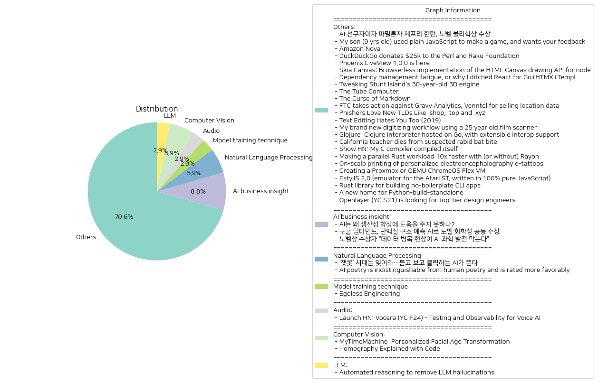

# Daily Artificial Intelligence Insights : News

## Computer Vision

**요약:**

**Key Themes**:
 AI, 노벨 화학상, 단백질 구조 예측, 구글 딥마인드

**Major Events**:
구글 딥마인드의 데미스 허사비스와 존 점퍼는 AI를 사용하여 단백질 접힘 예측 문제를 해결한 공로로 노벨 화학상을 공동 수상했습니다. 이 공로로 인해 구글 딥마인드는 노벨 화학상의 절반을 수상하게 되었습니다.

**Impact Analysis**:
이번 노벨 화학상 수상은 AI 기술의 발전과 생명과학 분야에서의 응용 가능성을 보여주는 중요한 사건입니다. 구글 딥마인드의 AI 기술은 단백질 구조 예측 문제를 해결하는 데에 성공했으며, 이는 생명과학 연구와 의료 분야에 큰 영향을 미칠 수 있습니다. 또한, 이 수상은 AI 기술의 발전과 그 응용 가능성을 보여주는 중요한 사건으로, 향후 다양한 분야에서 AI 기술의 응용 가능성을 높일 수 있습니다.

**Final Summary**:
구글 딥마인드의 데미스 허사비스와 존 점퍼는 AI를 사용하여 단백질 접힘 예측 문제를 해결한 공로로 노벨 화학상을 공동 수상했습니다. 이 수상은 AI 기술의 발전과 생명과학 분야에서의 응용 가능성을 보여주는 중요한 사건입니다. 향후 다양한 분야에서 AI 기술의 응용 가능성을 높일 수 있으며, 생명과학 연구와 의료 분야에 큰 영향을 미칠 수 있습니다.

**출처:**

 - 구글 딥마인드, 단백질 구조 예측 AI로 노벨 화학상 공동 수상 (https://www.technologyreview.kr/%ea%b5%ac%ea%b8%80-%eb%94%a5%eb%a7%88%ec%9d%b8%eb%93%9c-%eb%8b%a8%eb%b0%b1%ec%a7%88-%ea%b5%ac%ec%a1%b0-%ec%98%88%ec%b8%a1-ai%eb%a1%9c-%eb%85%b8%eb%b2%a8-%ed%99%94%ed%95%99%ec%83%81-%ea%b3%b5%eb%8f%99/)

## Others

**요약:**

1. **Key Themes**:
   - AI 및 기계 학습
   - 프로그래밍 언어 및 개발 도구
   - 기술 및 컴퓨터 과학
   - 데이터 및 보안
   - 교육 및 학습

2. **Major Events**:
   - Amazon Nova의 출시
   - DuckDuckGo의 Perl 및 Raku 재단에 대한 기부
   - FTC의 Gravy Analytics 및 Venntel에 대한 조치
   - Phishing 공격의 증가
   - California 교사의 사망
   - Openlayer의 설립

3. **Impact Analysis**:
   - AI 및 기계 학습 기술의 발전은 다양한 산업에 영향을 미칠 수 있습니다.
   - 프로그래밍 언어 및 개발 도구의 발전은 개발자들의 생산성을 높일 수 있습니다.
   - 데이터 및 보안은 중요한 문제로 남아 있습니다.
   - 교육 및 학습은 기술의 발전과 함께 중요성이 증가하고 있습니다.

4. **Final Summary**:
   - 기술 및 컴퓨터 과학 분야는 빠르게 발전하고 있습니다.
   - AI 및 기계 학습 기술은 다양한 산업에 영향을 미칠 수 있습니다.
   - 프로그래밍 언어 및 개발 도구의 발전은 개발자들의 생산성을 높일 수 있습니다.
   - 데이터 및 보안은 중요한 문제로 남아 있습니다.
   - 교육 및 학습은 기술의 발전과 함께 중요성이 증가하고 있습니다.
   - 미래에는 기술의 발전이 더욱 가속화될 것으로 예상됩니다.

**출처:**

 - Egoless Engineering (https://egoless.engineering)
 - My son (9 yrs old) used plain JavaScript to make a game, and wants your feedback (https://www.armaansahni.com/game/)
 - Amazon Nova (https://aws.amazon.com/blogs/aws/introducing-amazon-nova-frontier-intelligence-and-industry-leading-price-performance/)
 - DuckDuckGo donates $25k to the Perl and Raku Foundation (https://www.perl.com/article/duckduckgo-donates-25-000-to-the-perl-and-raku-foundation/)
 - Phoenix LiveView 1.0.0 is here (https://www.phoenixframework.org/blog/phoenix-liveview-1.0-released?release=1.0)
 - Skia Canvas: Browserless implementation of the HTML Canvas drawing API for node (https://skia-canvas.org/)
 - Dependency management fatigue, or why I ditched React for Go+HTMX+Templ (https://blog.erodriguez.de/dependency-management-fatigue-or-why-i-forever-ditched-react-for-go-htmx-templ/)
 - The Tube Computer (https://www.thetubecomputer.com/)
 - The Curse of Markdown (https://codehike.org/blog/the-curse-of-markdown)
 - FTC takes action against Gravy Analytics, Venntel for selling location data (https://www.ftc.gov/news-events/news/press-releases/2024/12/ftc-takes-action-against-gravy-analytics-venntel-unlawfully-selling-location-data-tracking-consumers)
 - Phishers Love New TLDs Like .shop, .top and .xyz (https://krebsonsecurity.com/2024/12/why-phishers-love-new-tlds-like-shop-top-and-xyz/)
 - Text Editing Hates You Too (2019) (https://lord.io/text-editing-hates-you-too/)
 - My brand new digitizing workflow using a 25 year old film scanner (https://blog.vladovince.com/my-brand-new-digitizing-workflow-using-a-25-year-old-film-scanner/)
 - Glojure: Clojure interpreter hosted on Go, with extensible interop support (https://github.com/glojurelang/glojure)
 - California teacher dies from suspected rabid bat bite (https://ktla.com/news/california/california-teacher-dies-from-suspect-rabid-bat-bite/)
 - Show HN: My C compiler compiled itself (https://github.com/keyvank/30cc)
 - Making a parallel Rust workload 10x faster with (or without) Rayon (https://gendignoux.com/blog/2024/11/18/rust-rayon-optimized.html)
 - On-scalp printing of personalized electroencephalography e-tattoos (https://www.cell.com/cell-biomaterials/fulltext/S3050-5623(24)00004-7)
 - Creating a Proxmox or QEMU ChromeOS Flex VM (https://kevindavid.org/code/2024/03/20/chrome-os-flex-proxmox.html)
 - EstyJS 2.0 (emulator for the Atari ST, written in 100% pure JavaScript) (https://kaiec.github.io/EstyJS/)
 - MyTimeMachine: Personalized Facial Age Transformation (https://mytimemachine.github.io)
 - A new home for Python-build-standalone (https://astral.sh/blog/python-build-standalone)
 - Rust library for building no-boilerplate CLI apps (https://github.com/JeffrayZhang/terse-cli)
 - Information Batteries (2021) [pdf] (https://raghavan.usc.edu/papers/infobatteries-eir21.pdf)
 - Homography Explained with Code (https://docs.opencv.org/4.x/d9/dab/tutorial_homography.html)
 - Openlayer (YC S21) is looking for top-tier design engineers (https://www.ycombinator.com/companies/openlayer/jobs/ZEEO8UB-design-engineer)

## LLM

**요약:**

**1. 주요 주제 (Key Themes)**:
대규모 언어 모델(LLM)에서 발생하는 허구(hallucination) 현상을 제거하기 위한 자동화된 추론(Automated Reasoning) 기술이 등장하고 있습니다. 이 기술은 사실 오류를 방지하고, 생성된 응답이 알려진 사실과 일치하도록 보장하는 데 중점을 두고 있습니다.

**2. 주요 사건 (Major Events)**:
아마존(Amazon)은 Bedrock Guardrails에 자동화된 추론(Automated Reasoning) 기능을 추가하여 대규모 언어 모델(LLM)에서 발생하는 허구(hallucination) 현상을 방지하고 있습니다. 이 기능은 수학적이고 논리적인 검증을 통해 생성된 응답이 알려진 사실과 일치하도록 보장합니다.

**3. 영향 분석 (Impact Analysis)**:
이 기술의 등장은 다음과 같은 영향을 미칠 수 있습니다.
- **경제**: 자동화된 추론 기술은 대규모 언어 모델(LLM)을 사용하는 기업들이 더 정확하고 신뢰할 수 있는 응답을 생성할 수 있도록 해줌으로써, 비즈니스 효율성을 높이고 고객 만족도를 향상시킬 수 있습니다.
- **정치**: 자동화된 추론 기술은 정치 분야에서 허구(hallucination) 현상을 방지함으로써, 더 정확하고 신뢰할 수 있는 정보를 제공할 수 있습니다.
- **사회**: 자동화된 추론 기술은 대규모 언어 모델(LLM)을 사용하는 다양한 분야에서 허구(hallucination) 현상을 방지함으로써, 더 정확하고 신뢰할 수 있는 정보를 제공할 수 있습니다.

**4. 최종 요약 (Final Summary)**:
대규모 언어 모델(LLM)에서 발생하는 허구(hallucination) 현상을 제거하기 위한 자동화된 추론(Automated Reasoning) 기술이 등장하고 있습니다. 이 기술은 사실 오류를 방지하고, 생성된 응답이 알려진 사실과 일치하도록 보장하는 데 중점을 두고 있습니다. 이 기술의 등장은 경제, 정치, 사회 등 다양한 분야에서 긍정적인 영향을 미칠 수 있습니다. 향후, 자동화된 추론 기술의 발전과 더 정확하고 신뢰할 수 있는 정보 제공을 위한 연구가 지속될 것으로 예상됩니다.

**출처:**

 - Automated reasoning to remove LLM hallucinations (https://aws.amazon.com/blogs/aws/prevent-factual-errors-from-llm-hallucinations-with-mathematically-sound-automated-reasoning-checks-preview/)

