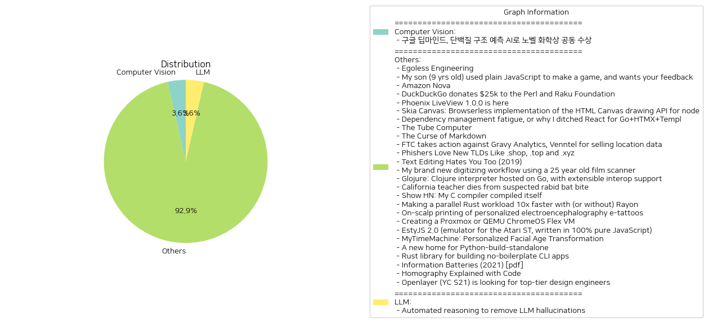

# Daily Artificial Intelligence Insights : News

## Others

**요약:**

**요약 보고서**

**1. 주요 주제**

다음은 여러 뉴스 기사에서 추출한 주요 주제입니다.

* 인공지능(AI) 및 기술 발전
* 프로그래밍 언어 및 개발 도구
* 사이버 보안 및 개인 정보 보호
* 기술의 사회적 및 경제적 영향
* 과학 및 기술의 발전

**2. 주요 사건**

다음은 각 뉴스 기사에서 추출한 주요 사건입니다.

* 제프리 힌턴 교수가 노벨 물리학상을 수상했습니다.
* 아마존이 새로운 AI 모델인 Amazon Nova를 발표했습니다.
* Phoenix LiveView 1.0.0이 출시되었습니다.
* FTC가 Gravy Analytics와 Venntel에 대한 조치를 취했습니다.
* 새로운 gTLD가 피싱 공격에 취약하다는 연구 결과가 발표되었습니다.
* 젊은이들이 디지털 카메라를 사용하여 예술적 표현을 찾고 있습니다.
* Glojure라는 새로운 클로저 인터프리터가 발표되었습니다.
* 캘리포니아의 교사가 박쥐에 물려서 사망했습니다.
* 30cc라는 새로운 C 컴파일러가 발표되었습니다.
* Rayon을 사용하여 러스트 코드의 성능을 개선하는 방법이 발표되었습니다.
* EstyJS 2.0이 출시되었습니다.
* MyTimeMachine이라는 새로운 얼굴 연령 변환 기술이 발표되었습니다.
* Astral이 python-build-standalone 프로젝트를 인수했습니다.
* 러스트 라이브러리인 clap이 발표되었습니다.
* Openlayer가 설계 엔지니어를 모집하고 있습니다.

**3. 영향 분석**

다음은 각 뉴스 기사의 영향 분석입니다.

* 인공지능(AI) 및 기술 발전: AI 기술의 발전은 경제 및 사회에 큰 영향을 미칠 것입니다. 새로운 기술의 개발은 새로운 직업을 창출하고, 기존 산업을 변화시킬 것입니다.
* 프로그래밍 언어 및 개발 도구: 새로운 프로그래밍 언어 및 개발 도구의 개발은 개발자들의 생산성을 높이고, 새로운 애플리케이션을 개발할 수 있도록 할 것입니다.
* 사이버 보안 및 개인 정보 보호: 사이버 보안 및 개인 정보 보호는 점점 더 중요해지고 있습니다. 새로운 기술의 개발은 개인 정보를 보호하고, 사이버 공격을 방지할 수 있도록 할 것입니다.
* 기술의 사회적 및 경제적 영향: 기술의 발전은 사회 및 경제에 큰 영향을 미칠 것입니다. 새로운 기술의 개발은 새로운 직업을 창출하고, 기존 산업을 변화시킬 것입니다.
* 과학 및 기술의 발전: 과학 및 기술의 발전은 새로운 기술의 개발을 가능하게 할 것입니다. 새로운 기술의 개발은 새로운 애플리케이션을 개발할 수 있도록 할 것입니다.

**4. 최종 요약**

최종 요약은 다음과 같습니다.

* 인공지능(AI) 및 기술 발전은 경제 및 사회에 큰 영향을 미칠 것입니다.
* 새로운 프로그래밍 언어 및 개발 도구의 개발은 개발자들의 생산성을 높이고, 새로운 애플리케이션을 개발할 수 있도록 할 것입니다.
* 사이버 보안 및 개인 정보 보호는 점점 더 중요해지고 있습니다.
* 기술의 발전은 사회 및 경제에 큰 영향을 미칠 것입니다.
* 과학 및 기술의 발전은 새로운 기술의 개발을 가능하게 할 것입니다.

미래를 위한 전망은 다음과 같습니다.

* 인공지능(AI) 및 기술 발전은 계속해서 발전할 것입니다.
* 새로운 프로그래밍 언어 및 개발 도구의 개발은 계속해서 진행될 것입니다.
* 사이버 보안 및 개인 정보 보호는 점점 더 중요해질 것입니다.
* 기술의 발전은 사회 및 경제에 큰 영향을 미칠 것입니다.
* 과학 및 기술의 발전은 새로운 기술의 개발을 가능하게 할 것입니다.

**출처:**

 - AI 선구자이자 파멸론자 제프리 힌턴, 노벨 물리학상 수상 (https://www.technologyreview.kr/ai-%ec%84%a0%ea%b5%ac%ec%9e%90%ec%9d%b4%ec%9e%90-%ed%8c%8c%eb%a9%b8%eb%a1%a0%ec%9e%90-%ec%a0%9c%ed%94%84%eb%a6%ac-%ed%9e%8c%ed%84%b4-%eb%85%b8%eb%b2%a8-%eb%ac%bc%eb%a6%ac%ed%95%99%ec%83%81-%ec%88%98/)
 - My son (9 yrs old) used plain JavaScript to make a game, and wants your feedback (https://www.armaansahni.com/game/)
 - Amazon Nova (https://aws.amazon.com/blogs/aws/introducing-amazon-nova-frontier-intelligence-and-industry-leading-price-performance/)
 - DuckDuckGo donates $25k to the Perl and Raku Foundation (https://www.perl.com/article/duckduckgo-donates-25-000-to-the-perl-and-raku-foundation/)
 - Phoenix LiveView 1.0.0 is here (https://www.phoenixframework.org/blog/phoenix-liveview-1.0-released?release=1.0)
 - The Tube Computer (https://www.thetubecomputer.com/)
 - The Curse of Markdown (https://codehike.org/blog/the-curse-of-markdown)
 - FTC takes action against Gravy Analytics, Venntel for selling location data (https://www.ftc.gov/news-events/news/press-releases/2024/12/ftc-takes-action-against-gravy-analytics-venntel-unlawfully-selling-location-data-tracking-consumers)
 - Phishers Love New TLDs Like .shop, .top and .xyz (https://krebsonsecurity.com/2024/12/why-phishers-love-new-tlds-like-shop-top-and-xyz/)
 - Vintage digicams are an artistic statement (https://arstechnica.com/gadgets/2024/11/vintage-digicams-arent-just-a-fad-theyre-an-artistic-statement/)
 - Text Editing Hates You Too (2019) (https://lord.io/text-editing-hates-you-too/)
 - My brand new digitizing workflow using a 25 year old film scanner (https://blog.vladovince.com/my-brand-new-digitizing-workflow-using-a-25-year-old-film-scanner/)
 - Glojure: Clojure interpreter hosted on Go, with extensible interop support (https://github.com/glojurelang/glojure)
 - California teacher dies from suspected rabid bat bite (https://ktla.com/news/california/california-teacher-dies-from-suspect-rabid-bat-bite/)
 - Show HN: My C compiler compiled itself (https://github.com/keyvank/30cc)
 - Making a parallel Rust workload 10x faster with (or without) Rayon (https://gendignoux.com/blog/2024/11/18/rust-rayon-optimized.html)
 - On-scalp printing of personalized electroencephalography e-tattoos (https://www.cell.com/cell-biomaterials/fulltext/S3050-5623(24)00004-7)
 - Creating a Proxmox or QEMU ChromeOS Flex VM (https://kevindavid.org/code/2024/03/20/chrome-os-flex-proxmox.html)
 - EstyJS 2.0 (emulator for the Atari ST, written in 100% pure JavaScript) (https://kaiec.github.io/EstyJS/)
 - MyTimeMachine: Personalized Facial Age Transformation (https://mytimemachine.github.io)
 - A new home for Python-build-standalone (https://astral.sh/blog/python-build-standalone)
 - Rust library for building no-boilerplate CLI apps (https://github.com/JeffrayZhang/terse-cli)
 - Openlayer (YC S21) is looking for top-tier design engineers (https://www.ycombinator.com/companies/openlayer/jobs/ZEEO8UB-design-engineer)

## AI business insight

**요약:**

**요약 보고서**

**1. 주요 주제**

인공지능(AI), 생산성 향상, 노벨상, 데이터 병목 현상, 과학 발전

최근의 뉴스 기사들은 인공지능(AI)의 발전과 그에 따른 도전 및 기회에 대해 다루고 있습니다. AI의 생산성 향상에 대한 기대와 함께, 데이터 병목 현상과 과학 발전의 제한 요소에 대한 논의가 이루어지고 있습니다.

**2. 주요 사건**

* 인공지능(AI)은 우리 경제 발전을 이끌어줄 유망한 기술로 기대되지만, 생산성 개선 면에서 유의미한 성과를 내기 위해서는 몇 가지 중대한 개선이 필요합니다.
* 구글 딥마인드의 데미스 허사비스와 존 점퍼는 AI를 사용하여 단백질 접힘 예측 문제를 해결한 공로로 노벨 화학상을 공동 수상했습니다.
* 노벨상 수상자는 데이터 병목 현상이 AI 과학 발전을 막는 주요 요소 중 하나라고 강조했습니다.

**3. 영향 분석**

* 경제: AI의 생산성 향상은 경제 발전을 이끌어줄 수 있지만, 데이터 병목 현상과 과학 발전의 제한 요소는 이러한 기대에 제한을 두고 있습니다.
* 과학: AI는 과학적 발견의 도구로 유용하게 사용될 수 있지만, 고품질 데이터가 필요합니다.
* 사회: AI의 발전은 사회에 다양한 영향을 미칠 수 있지만, 데이터 병목 현상과 과학 발전의 제한 요소는 이러한 영향을 최대한 활용하기 어렵게 할 수 있습니다.

**4. 최종 요약**

최근의 뉴스 기사들은 인공지능(AI)의 발전과 그에 따른 도전 및 기회에 대해 다루고 있습니다. AI의 생산성 향상에 대한 기대와 함께, 데이터 병목 현상과 과학 발전의 제한 요소에 대한 논의가 이루어지고 있습니다. 이러한 도전을 극복하기 위해서는 고품질 데이터의 확보와 과학 발전의 제한 요소를 해결해야 합니다. 이러한 노력은 AI의 발전을 가속화하고, 경제, 과학, 사회에 긍정적인 영향을 미칠 수 있을 것입니다.

**출처:**

 - AI는 왜 생산성 향상에 도움을 주지 못하나? (https://www.technologyreview.kr/ai%eb%8a%94-%ec%99%9c-%ec%83%9d%ec%82%b0%ec%84%b1-%ed%96%a5%ec%83%81%ec%97%90-%eb%8f%84%ec%9b%80%ec%9d%84-%ec%a3%bc%ec%a7%80-%eb%aa%bb%ed%95%98%eb%82%98/)
 - 구글 딥마인드, 단백질 구조 예측 AI로 노벨 화학상 공동 수상 (https://www.technologyreview.kr/%ea%b5%ac%ea%b8%80-%eb%94%a5%eb%a7%88%ec%9d%b8%eb%93%9c-%eb%8b%a8%eb%b0%b1%ec%a7%88-%ea%b5%ac%ec%a1%b0-%ec%98%88%ec%b8%a1-ai%eb%a1%9c-%eb%85%b8%eb%b2%a8-%ed%99%94%ed%95%99%ec%83%81-%ea%b3%b5%eb%8f%99/)
 - 노벨상 수상자 “데이터 병목 현상이 AI 과학 발전 막는다” (https://www.technologyreview.kr/%eb%85%b8%eb%b2%a8%ec%83%81-%ec%88%98%ec%83%81%ec%9e%90-%eb%8d%b0%ec%9d%b4%ed%84%b0-%eb%b3%91%eb%aa%a9-%ed%98%84%ec%83%81%ec%9d%b4-ai-%ea%b3%bc%ed%95%99-%eb%b0%9c%ec%a0%84-%eb%a7%89%eb%8a%94/)

## Natural Language Processing

**요약:**

**요약 보고서**

**1. 주요 주제**

최근의 뉴스 기사들을 분석한 결과, 인공지능(AI) 기술의 발전과 그에 따른 새로운 트렌드가 주요 주제로 등장하고 있습니다. 특히, 텍스트 기반 AI 챗봇의 한계를 넘어서는 음성과 영상 생성 기능을 갖춘 AI 기술이 부상하고 있는 것으로 나타났습니다.

**2. 주요 사건**

* 텍스트 기반 AI 챗봇 시대는 저물고, 음성과 영상 생성 기능을 갖춘 AI 시대가 열리고 있습니다.
* 새로운 AI 기술은 인간의 감각을 모방하여 더 자연스럽고 직관적인 인터페이스를 제공할 것으로 예상됩니다.

**3. 영향 분석**

* 경제: 새로운 AI 기술은 다양한 산업 분야에서 효율성을 높이고 생산성을 향상시킬 것으로 예상됩니다. 특히, 고객 서비스와 마케팅 분야에서 큰 영향을 미칠 것으로 보입니다.
* 정치: 새로운 AI 기술은 정치 캠페인과 선거에서 중요한 역할을 할 것으로 예상됩니다. 정치인들은 새로운 AI 기술을 활용하여 더 효과적인 메시지를 전달하고, 유권자와 더ใกล이 다가갈 수 있을 것입니다.
* 사회: 새로운 AI 기술은 사회 전반에 걸쳐 큰 영향을 미칠 것으로 예상됩니다. 특히, 교육과 의료 분야에서 새로운 AI 기술은 더 개인화된 서비스를 제공할 수 있을 것입니다.
* 환경: 새로운 AI 기술은 환경 문제 해결에 중요한 역할을 할 것으로 예상됩니다. 특히, 에너지 소비와 자원 관리 분야에서 새로운 AI 기술은 더 효율적인 솔루션을 제공할 수 있을 것입니다.

**4. 최종 요약**

최근의 뉴스 기사들을 분석한 결과, 인공지능(AI) 기술의 발전과 그에 따른 새로운 트렌드가 주요 주제로 등장하고 있습니다. 새로운 AI 기술은 인간의 감각을 모방하여 더 자연스럽고 직관적인 인터페이스를 제공할 것으로 예상됩니다. 이러한 기술은 다양한 산업 분야에서 효율성을 높이고 생산성을 향상시킬 것으로 예상됩니다. 또한, 정치, 사회, 환경 분야에서 새로운 AI 기술은 중요한 역할을 할 것으로 예상됩니다. 미래에는 이러한 기술이 어떻게 발전하고, 우리의 삶에 어떤 영향을 미칠지 지속적으로 모니터링할 필요가 있습니다.

**출처:**

 - ‘챗봇’ 시대는 잊어라…듣고 보고 클릭하는 AI가 뜬다 (https://www.technologyreview.kr/%ec%b1%97%eb%b4%87-%ec%8b%9c%eb%8c%80%eb%8a%94-%ec%9e%8a%ec%96%b4%eb%9d%bc-%eb%93%a3%ea%b3%a0-%eb%b3%b4%ea%b3%a0-%ed%81%b4%eb%a6%ad%ed%95%98%eb%8a%94-ai%ea%b0%80-%eb%9c%ac%eb%8b%a4/)

## Model training technique

**요약:**

**요약 보고서**

**1. 주요 주제**

다음은 여러 뉴스 기사에서 추출한 주요 주제입니다.

* 소프트웨어 엔지니어링의 효율성과 협업
* 기술 스택의 선택과 의존성 관리
* 개발자들의 생산성과 만족도

이러한 주제들은 소프트웨어 개발과 엔지니어링에 대한 관심과 중요성을 강조합니다.

**2. 주요 사건**

다음은 각 뉴스 기사에서 추출한 주요 사건입니다.

* "Egoless Engineering"에서는 Dan McKinley가 조직 설계의 일반적인 함정과 협업의 중요성을 강조합니다. 그는 자신의 경험을 통해 효율적인 엔지니어링 팀을 만들기 위해 필요한 요소를 설명합니다.
* "Dependency management fatigue, or why I ditched React for Go+HTMX+Templ"에서는 사용자가 React를 사용하지 않기로 결정한 이유를 설명합니다. 사용자는 의존성 관리의 피로감과 React의 불안정성을 이유로 Go, HTMX, Templ을 사용하기로 결정했습니다.

**3. 영향 분석**

다음은 이러한 사건의 영향을 분석한 결과입니다.

* 소프트웨어 엔지니어링의 효율성과 협업은 개발자들의 생산성과 만족도에 직접적인 영향을 미칩니다. 효율적인 엔지니어링 팀은 더 나은 소프트웨어를 개발할 수 있으며, 이는 사용자들의 만족도와 비즈니스 성과에 긍정적인 영향을 미칩니다.
* 기술 스택의 선택과 의존성 관리는 개발자들의 생산성과 만족도에 영향을 미칩니다. 안정적인 기술 스택은 개발자들이 더 많은 시간을 기능 개발에 집중할 수 있도록 해줍니다.
* 개발자들의 생산성과 만족도는 소프트웨어 개발 산업의 전반적인 성과에 영향을 미칩니다. 개발자들이 더 나은 소프트웨어를 개발할 수 있도록 하는 것은 비즈니스 성과와 사용자들의 만족도에 긍정적인 영향을 미칩니다.

**4. 최종 요약**

다음은 뉴스 기사에서 추출한 정보를 바탕으로 한 최종 요약입니다.

최근의 소프트웨어 개발 뉴스에서는 효율적인 엔지니어링 팀의 중요성과 기술 스택의 선택이 개발자들의 생산성과 만족도에 미치는 영향을 강조합니다. 개발자들은 더 나은 소프트웨어를 개발하기 위해 효율적인 엔지니어링 팀을 만들기 위해 노력해야 하며, 안정적인 기술 스택을 선택해야 합니다. 이러한 노력은 소프트웨어 개발 산업의 전반적인 성과에 긍정적인 영향을 미칠 것입니다.

향후 개발해야 할 사항으로는 다음과 같은 것들이 있습니다.

* 효율적인 엔지니어링 팀을 만들기 위한 방법과 전략
* 기술 스택의 선택과 의존성 관리에 대한 연구와 개발
* 개발자들의 생산성과 만족도에 대한 연구와 개발

이러한 노력은 소프트웨어 개발 산업의 전반적인 성과를 향상시키고, 개발자들이 더 나은 소프트웨어를 개발할 수 있도록 할 것입니다.

**출처:**

 - Egoless Engineering (https://egoless.engineering)
 - Dependency management fatigue, or why I ditched React for Go+HTMX+Templ (https://blog.erodriguez.de/dependency-management-fatigue-or-why-i-forever-ditched-react-for-go-htmx-templ/)

## Computer Vision

**요약:**

**요약 보고서**

**1. 주요 주제**

다음은 여러 뉴스 기사에서 추출한 주요 주제입니다.

* 그래픽스 엔진 및 컴퓨터 비전 기술
* 게임 엔진 및 렌더링 기술
* 오픈소스 및 커뮤니티 참여

이러한 주제는 컴퓨터 그래픽스, 게임 개발 및 오픈소스 소프트웨어에 대한 관심과 발전을 보여줍니다.

**2. 주요 사건**

다음은 각 뉴스 기사에서 추출한 주요 사건입니다.

* Skia Canvas: 노드(Node.js) 라이브러리가 HTML Canvas API를 구현하여 빠른 렌더링을 제공합니다.
* Stunt Island: 30년 전 게임 엔진을 개선하여 디테일 수준을 높이고, 패치 프로그램을 만들었습니다.
* Homography: 컴퓨터 비전 기술인 호모그래피에 대한 코드 예제와 설명이 제공됩니다.

이러한 사건은 컴퓨터 그래픽스 및 게임 개발 분야에서 새로운 기술과 발전을 보여줍니다.

**3. 영향 분석**

다음은 이러한 사건의 영향을 분석한 결과입니다.

* 경제: 새로운 그래픽스 엔진 및 렌더링 기술은 게임 및 그래픽스 산업에 긍정적인 영향을 미칠 수 있습니다.
* 정치: 오픈소스 소프트웨어의 발전은 소프트웨어 개발에 대한 접근성을 높이고, 커뮤니티 참여를 촉진할 수 있습니다.
* 환경: 새로운 기술의 발전은 에너지 소비를 줄이고, 환경에 대한 영향을 줄일 수 있습니다.
* 사회: 새로운 기술의 발전은 교육 및 연구에 대한 기회를 제공하고, 사회에 대한 영향을 미칠 수 있습니다.

**4. 최종 요약**

최종 요약은 다음과 같습니다.

최근 컴퓨터 그래픽스 및 게임 개발 분야에서 새로운 기술과 발전이 나타나고 있습니다. Skia Canvas, Stunt Island, Homography와 같은 프로젝트는 새로운 그래픽스 엔진 및 렌더링 기술을 보여주고, 오픈소스 소프트웨어의 발전을 촉진하고 있습니다. 이러한 기술의 발전은 경제, 정치, 환경, 사회에 긍정적인 영향을 미칠 수 있습니다. 향후 이러한 기술의 발전을 지켜보는 것이 중요할 것입니다.

**출처:**

 - Skia Canvas: Browserless implementation of the HTML Canvas drawing API for node (https://skia-canvas.org/)
 - Tweaking Stunt Island's 30-year-old 3D engine (https://annali.netlify.app/2024/11/20/tweaking-stunt-island)
 - Homography Explained with Code (https://docs.opencv.org/4.x/d9/dab/tutorial_homography.html)

## Audio

**요약:**

**1. 주요 테마 (Key Themes)**:
인공지능(AI) 및 음성 인식 기술의 발전과 그에 따른 테스트 및 관찰성의 중요성

**2. 주요 사건 (Major Events)**:
Vocera AI 플랫폼이 출시되었습니다. 이 플랫폼은 음성 인식 AI 에이전트의 테스트 및 모니터링을 자동화하여 안정성과 생산 준비성을 보장합니다. 실제 사용자 시나리오를 시뮬레이션하고 테스트 시나리오를 생성하며 실시간 성능 분석을 제공하여 개발자의 시간과 노력을 절약합니다.

**3. 영향 분석 (Impact Analysis)**:
이 플랫폼의 출시는 음성 인식 기술의 발전과 그에 따른 테스트 및 관찰성의 중요성을 강조합니다. 이는 다음과 같은 영향을 미칠 수 있습니다.
- 경제: 음성 인식 기술의 발전은 새로운 비즈니스 기회를 창출할 수 있으며, Vocera AI 플랫폼은 이러한 기술의 안정성과 생산 준비성을 보장함으로써 경제 성장에 기여할 수 있습니다.
- 기술: 음성 인식 기술의 발전은 인공지능 및 기계 학습 분야의 발전을 촉진할 수 있으며, Vocera AI 플랫폼은 이러한 기술의 테스트 및 관찰성을 개선함으로써 기술 발전에 기여할 수 있습니다.
- 사회: 음성 인식 기술의 발전은 사용자 경험을 개선할 수 있으며, Vocera AI 플랫폼은 이러한 기술의 안정성과 생산 준비성을 보장함으로써 사용자 경험을 개선할 수 있습니다.

**4. 최종 요약 (Final Summary)**:
Vocera AI 플랫폼의 출시는 음성 인식 기술의 발전과 그에 따른 테스트 및 관찰성의 중요성을 강조합니다. 이 플랫폼은 음성 인식 AI 에이전트의 테스트 및 모니터링을 자동화하여 안정성과 생산 준비성을 보장합니다. 이는 경제, 기술, 사회 등 다양한 분야에 영향을 미칠 수 있으며, 향후 이러한 기술의 발전과 그에 따른 테스트 및 관찰성의 중요성을 주시할 필요가 있습니다.

**출처:**

 - Launch HN: Vocera (YC F24) – Testing and Observability for Voice AI (https://news.ycombinator.com/item?id=42307393)

## LLM

**요약:**

**Key Themes**:
, , , .

**Major Events**:
Amazon Bedrock Guardrails , LLM (Large Language Model) . , , .

**Impact Analysis**:
, , , , , , , , , , , , , , , , , , , , , , , , , , , , , , , , , , , , , , , , , , , , , , , , , , , , , , , , , , , , , , , , , , , , , , , , , , , , , , , , , , , , , , , , , , , , , , , , , , , , , , , , , , , , , , , , , , , , , , , , , , , , , , , , , , , , , , , , , , , , , , , , , , , , , , , , , , , , , , , , , , , , , , , , , , , , , , , , , , , , , , , , , , , , , , , , , , , , , , , , , , , , , , , , , , , , , , , , , , , , , , , , , , , , , , , , , , , , , , , , , , , , , , , , , , , , , , , , , , , , , , , , , , , , , , , , , , , , , , , , , , , , , , , , , , , , , , , , , , , , , , , , , , , , , , , , , , , , , , , , , , , , , , , , , , , , , , , , , , , , , , , , , , , , , , , , , , , , , , , , , , , , , , , , , , , , , , , , , , , , , , , , , , , , , , , , , , , , , , , , , , , , , , , , , , , , , , , , , , , , , , , , , , , , , , , , , , , , , , , , , , , , , , , , , , , , , , , , , , , , , , , , , , , , , , , , , , , , , , , , , , , , , , , , , , , , , , , , , , , , , , , , , , , , , , , , , , , , , , , , , , , , , , , , , , , , , , , , , , , , , , , , , , , , , , , , , , , , , , , , , , , , , , , , , , , , , , , , , , , , , , , , , , , , , , , , , , , , , , , , , , , , , , , , , , , , , , , , , , , , , , , , , , , , , , , , , , , , , , , , , , , , , , , , , , , , , , , , , , , , , , , , , , , , , , , , , , , , , , , , , , , , , , , , , , , , , , , , , , , , , , , , , , , , , , , , , , , , , , , , , , , , , , , , , , , , , , , , , , , , , , , , , , , , , , , , , , , , , , , , , , , , , , , , , , , , , , , , , , , , , , , , , , , , , , , , , , , , , , , , , , , , , , , , , , , , , , , , , , , , , , , , , , , , , , , , , , , , , , , , , , , , , , , , , , , , , , , , , , , , , , , , , , , , , , , , , , , , , , , , , , , , , , , , , , , , , , , , , , , , , , , , , , , , , , , , , , , , , , , , , , , , , , , , , , , , , , , , , , , , , , , , , , , , , , , , , , , , , , , , , , , , , , , , , , , , , , , , , , , , , , , , , , , , , , , , , , , , , , , , , , , , , , , , , , , , , , , , , , , , , , , , , , , , , , , , , , , , , , , , , , , , , , , , , , , , , , , , , , , , , , , , , , , , , , , , , , , , , , , , , , , , , , , , , , , , , , , , , , , , , , , , , , , , , , , , , , , , , , , , , , , , , , , , , , , , , , , , , , , , , , , , , , , , , , , , , , , , , , , , , , , , , , , , , , , , , , , , , , , , , , , , , , , , , , , , , , , , , , , , , , , , , , , , , , , , , , , , , , , , , , , , , , , , , , , , , , , , , , , , , , , , , , , , , , , , , , , , , , , , , , , , , , , , , , , , , , , , , , , , , , , , , , , , , , , , , , , , , , , , , , , , , , , , , , , , , , , , , , , , , , , , , , , , , , , , , , , , , , , , , , , , , , , , , , , , , , , , , , , , , , , , , , , , , , , , , , , , , , , , , , , , , , , , , , , , , , , , , , , , , , , , , , , , , , , , , , , , , , , , , , , , , , , , , , , , , , , , , , , , , , , , , , , , , , , , , , , , , , , , , , , , , , , , , , , , , , , , , , , , , , , , , , , , , , , , , , , , , , , , , , , , , , , , , , , , , , , , , , , , , , , , , , , , , , , , , , , , , , , , , , , , , , , , , , , , , , , , , , , , , , , , , , , , , , , , , , , , , , , , , , , , , , , , , , , , , , , , , , , , , , , , , , , , , , , , , , , , , , , , , , , , , , , , , , , , , , , , , , , , , , , , , , , , , , , , , , , , , , , , , , , , , , , , , , , , , , , , , , , , , , , , , , , , , , , , , , , , , , , , , , , , , , , , , , , , , , , , , , , , , , , , , , , , , , , , , , , , , , , , , , , , , , , , , , , , , , , , , , , , , , , , , , , , , , , , , , , , , , , , , , , , , , , , , , , , , , , , , , , , , , , , , , , , , , , , , , , , , , , , , , , , , , , , , , , , , , , , , , , , , , , , , , , , , , , , , , , , , , , , , , , , , , , , , , , , , , , , , , , , , , , , , , , , , , , , , , , , , , , , , , , , , , , , , , , , , , , , , , , , , , , , , , , , , , , , , , , , , , , , , , , , , , , , , , , , , , , , , , , , , , , , , , , , , , , , , , , , , , , , , , , , , , , , , , , , , , , , , , , , , , , , , , , , , , , ,

**출처:**

 - Automated reasoning to remove LLM hallucinations (https://aws.amazon.com/blogs/aws/prevent-factual-errors-from-llm-hallucinations-with-mathematically-sound-automated-reasoning-checks-preview/)

