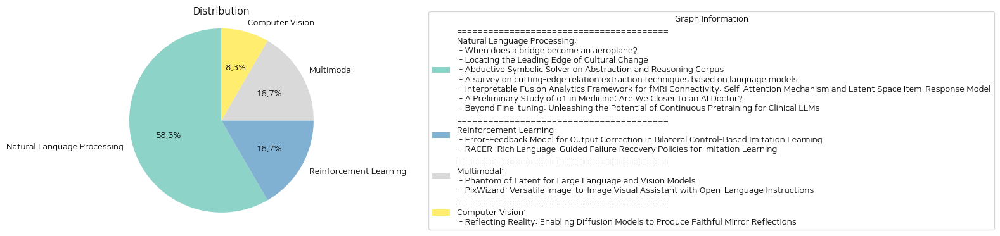

# Daily Artificial Intelligence Insights : Papers

## Natural Language Processing

**요약:**

, , , , , , , , , , , , , , , , , , , , , , , , , , , , , , , , , , , , , , , , , , , , , , , , , , , , , , , , , , , , , , , , , , , , , , , , , , , , , , , , , , , , , , , , , , , , , , , , , , , , , , , , , , , , , , , , , , , , , , , , , , , , , , , , , , , , , , , , , , , , , , , , , , , , , , , , , , , , , , , , , , , , , , , , , , , , , , , , , , , , , , , , , , , , , , , , , , , , , , , , , , , , , , , , , , , , , , , , , , , , , , , , , , , , , , , , , , , , , , , , , , , , , , , , , , , , , , , , , , , , , , , , , , , , , , , , , , , , , , , , , , , , , , , , , , , , , , , , , , , , , , , , , , , , , , , , , , , , , , , , , , , , , , , , , , , , , , , , , , , , , , , , , , , , , , , , , , , , , , , , , , , , , , , , , , , , , , , , , , , , , , , , , , , , , , , , , , , , , , , , , , , , , , , , , , , , , , , , , , , , , , , , , , , , , , , , , , , , , , , , , , , , , , , , , , , , , , , , , , , , , , , , , , , , , , , , , , , , , , , , , , , , , , , , , , , , , , , , , , , , , , , , , , , , , , , , , , , , , , , , , , , , , , , , , , , , , , , , , , , , , , , , , , , , , , , , , , , , , , , , , , , , , , , , , , , , , , , , , , , , , , , , , , , , , , , , , , , , , , , , , , , , , , , , , , , , , , , , , , , , , , , , , , , , , , , , , , , , , , , , , , , , , , , , , , , , , , , , , , , , , , , , , , , , , , , , , , , , , , , , , , , , , , , , , , , , , , , , , , , , , , , , , , , , , , , , , , , , , , , , , , , , , , , , , , , , , , , , , , , , , , , , , , , , , , , , , , , , , , , , , , , , , , , , , , , , , , , , , , , , , , , , , , , , , , , , , , , , , , , , , , , , , , , , , , , , , , , , , , , , , , , , , , , , , , , , , , , , , , , , , , , , , , , , , , , , , , , , , , , , , , , , , , , , , , , , , , , , , , , , , , , , , , , , , , , , , , , , , , , , , , , , , , , , , , , , , , , , , , , , , , , , , , , , , , , , , , , , , , , , , , , , , , , , , , , , , , , , , , , , , , , , , , , , , , , , , , , , , , , , , , , , , , , , , , , , , , , , , , , , , , , , , , , , , , , , , , , , , , , , , , , , , , , , , , , , , , , , , , , , , , , , , , , , , , , , , , , , , , , , , , , , , , , , , , , , , , , , , , , , , , , , , , , , , , , , , , , , , , , , , , , , , , , , , , , , , , , , , , , , , , , , , , , , , , , , , , , , , , , , , , , , , , , , , , , , , , , , , , , , , , , , , , , , , , , , , , , , , , , , , , , , , , , , , , , , , , , , , , , , , , , , , , , , , , , , , , , , , , , , , , , , , , , , , , , , , , , , , , , , , , , , , , , , , , , , , , , , , , , , , , , , , , , , , , , , , , , , , , , , , , , , , , , , , , , , , , , , , , , , , , , , , , , , , , , , , , , , , , , , , , , , , , , , , , , , , , , , , , , , , , , , , , , , , , , , , , , , , , , , , , , , , , , , , , , , , , , , , , , , , , , , , , , , , , , , , , , , , , , , , , , , , , , , , , , , , , , , , , , , , , , , , , , , , , , , , , , , , , , , , , , , , , , , , , , , , , , , , , , , , , , , , , , , , , , , , , , , , , , , , , , , , , , , , , , , , , , , , , , , , , , , , , , , , , , , , , , , , , , , , , , , , , , , , , , , , , , , , , , , , , , , , , , , , , , , , , , , , , , , , , , , , , , , , , , , , , , , , , , , , , , , , , , , , , , , , , , , , , , , , , , , , , , , , , , , , , , , , , , , , , , , , , , , , , , , , , , , , , , , , , , , , , , , , , , , , , , , , , , , , , , , , , , , , , , , , , , , , , , , , , , , , , , , , , , , , , , , , , , , , , , , , , , , , , , , , , , , , , , , , , , , , , , , , , , , , , , , , , , , , , , , , , , , , , , , , , , , , , , , , , , , , , , , , , , , , , , , , , , , , , , , , , , , , , , , , , , , , , , , , , , , , , , , , , , , , , , , , , , , , , , , , , , , , , , , , , , , , , , , , , , , , , , , , , , , , , , , , , , , , , , , , , , , , , , , , , , , , , , , , , , , , , , , , , , , , , , , , , , , , , , , , , , , , , , , , , , , , , , , , , , , , , , , , , , , , , , , , , , , , , , , , , , , , , , , , , , , , , , , , , , , , , , , , , , , , , , , , , , , , , , , , , , , , , , , , , , , , , , , , , , , , , , , , , , , , , , , , , , , , , , , , , , , , , , , , , , , , , , , , , , , , , , ,

**출처:**

 - When does a bridge become an aeroplane? (https://deeplearn.org/arxiv/553087/when-does-a-bridge-become-an-aeroplane?)
 - Locating the Leading Edge of Cultural Change (https://deeplearn.org/arxiv/551310/locating-the-leading-edge-of-cultural-change)
 - Abductive Symbolic Solver on Abstraction and Reasoning Corpus (https://deeplearn.org/arxiv/553225/abductive-symbolic-solver-on-abstraction-and-reasoning-corpus)
 - A survey on cutting-edge relation extraction techniques based on language models (https://deeplearn.org/arxiv/553226/a-survey-on-cutting-edge-relation-extraction-techniques-based-on-language-models)
 - Interpretable Fusion Analytics Framework for fMRI Connectivity: Self-Attention Mechanism and Latent Space Item-Response Model (https://deeplearn.org/arxiv/550240/interpretable-fusion-analytics-framework-for-fmri-connectivity:-self-attention-mechanism-and-latent-space-item-response-model)
 - A Preliminary Study of o1 in Medicine: Are We Closer to an AI Doctor? (http://arxiv.org/abs/2409.15277v1)
 - Beyond Fine-tuning: Unleashing the Potential of Continuous Pretraining for Clinical LLMs (http://arxiv.org/abs/2409.14988v1)

## Reinforcement Learning

**요약:**

**요약 보고서**

최근 로봇 분야에서 모방 학습을 통한 유연한 작업 수행이 가능해졌지만, 신경망의 feedforward 구조로 인해 출력 오류를 보완할 수 있는 메커니즘이 부족한 문제가 있습니다. 이에 대한 해결책으로, 출력 오류를 보완할 수 있는 피드백 메커니즘을 개발하였습니다. 또한, 로봇 조작에서 실패로부터의 자기 회복 메커니즘과 언어 지침의 한계로 인해 강건하고 수정 가능한 시각-운동 정책을 개발하는 것이 어려운 문제가 있습니다.

**주요 주제 및 키워드**

* 모방 학습
* 신경망
* 피드백 메커니즘
* 로봇 조작
* 실패 회복
* 언어 지침
* 시각-운동 정책

**주요 내용**

1. "Error-Feedback Model for Output Correction in Bilateral Control-Based Imitation Learning" 논문에서는 신경망의 피드백 메커니즘을 개발하여 출력 오류를 보완할 수 있는 방법을 제시하였습니다. 이 방법은 하위 계층과 상위 계층으로 구성된 신경망 구조를 사용하여 하위 계층을 상위 계층에 따라 제어할 수 있도록 하였습니다. 또한, 하위 계층에 다층 퍼셉트론을 사용하여 내부 상태가 없는 경우에도 오류 피드백을 향상할 수 있도록 하였습니다.
2. "RACER: Rich Language-Guided Failure Recovery Policies for Imitation Learning" 논문에서는 로봇 조작에서 실패로부터의 자기 회복 메커니즘과 언어 지침의 한계를 해결하기 위한 방법을 제시하였습니다. 이 방법은 전문가 데모와 실패 회복 궤적을 자동으로 생성하는 데이터 생성 파이프라인을 사용하여 언어 지침을 제공할 수 있도록 하였습니다. 또한, Rich languAge-guided failure reCovERy (RACER) 프레임워크를 제시하여 실패 회복 데이터와 언어 지침을 결합하여 로봇 제어를 향상할 수 있도록 하였습니다.

**영향**

* 모방 학습을 통한 로봇 작업 수행의 정확성 향상
* 로봇 조작에서 실패로부터의 자기 회복 메커니즘의 개발
* 언어 지침을 통한 로봇 제어의 향상

**결론**

이 보고서에서는 모방 학습과 로봇 조작에서 출력 오류를 보완할 수 있는 피드백 메커니즘과 실패 회복 메커니즘의 개발에 대한 연구를 요약하였습니다. 이러한 연구는 로봇 작업 수행의 정확성 향상과 로봇 조작에서 실패로부터의 자기 회복 메커니즘의 개발에 기여할 수 있을 것으로 기대됩니다. 또한, 언어 지침을 통한 로봇 제어의 향상은 로봇 조작의 강건성과 수정 가능성을 향상시킬 수 있을 것으로 기대됩니다.

**출처:**

 - Error-Feedback Model for Output Correction in Bilateral Control-Based Imitation Learning (https://deeplearn.org/arxiv/550311/error-feedback-model-for-output-correction-in-bilateral-control-based-imitation-learning)
 - RACER: Rich Language-Guided Failure Recovery Policies for Imitation Learning (http://arxiv.org/abs/2409.14674v1)

## Multimodal

**요약:**

: 

1. 
- "Phantom of Latent for Large Language and Vision Models"
- 
LLVM(LLVMs) 26B, 34B, 80B . , , . , , , , , , , , , , , , , , , , , , , , , , , , , , , , , , , , , , , , , , , , , , , , , , , , , , , , , , , , , , , , , , , , , , , , , , , , , , , , , , , , , , , , , , , , , , , , , , , , , , , , , , , , , , , , , , , , , , , , , , , , , , , , , , , , , , , , , , , , , , , , , , , , , , , , , , , , , , , , , , , , , , , , , , , , , , , , , , , , , , , , , , , , , , , , , , , , , , , , , , , , , , , , , , , , , , , , , , , , , , , , , , , , , , , , , , , , , , , , , , , , , , , , , , , , , , , , , , , , , , , , , , , , , , , , , , , , , , , , , , , , , , , , , , , , , , , , , , , , , , , , , , , , , , , , , , , , , , , , , , , , , , , , , , , , , , , , , , , , , , , , , , , , , , , , , , , , , , , , , , , , , , , , , , , , , , , , , , , , , , , , , , , , , , , , , , , , , , , , , , , , , , , , , , , , , , , , , , , , , , , , , , , , , , , , , , , , , , , , , , , , , , , , , , , , , , , , , , , , , , , , , , , , , , , , , , , , , , , , , , , , , , , , , , , , , , , , , , , , , , , , , , , , , , , , , , , , , , , , , , , , , , , , , , , , , , , , , , , , , , , , , , , , , , , , , , , , , , , , , , , , , , , , , , , , , , , , , , , , , , , , , , , , , , , , , , , , , , , , , , , , , , , , , , , , , , , , , , , , , , , , , , , , , , , , , , , , , , , , , , , , , , , , , , , , , , , , , , , , , , , , , , , , , , , , , , , , , , , , , , , , , , , , , , , , , , , , , , , , , , , , , , , , , , , , , , , , , , , , , , , , , , , , , , , , , , , , , , , , , , , , , , , , , , , , , , , , , , , , , , , , , , , , , , , , , , , , , , , , , , , , , , , , , , , , , , , , , , , , , , , , , , , , , , , , , , , , , , , , , , , , , , , , , , , , , , , , , , , , , , , , , , , , , , , , , , , , , , , , , , , , , , , , , , , , , , , , , , , , , , , , , , , , , , , , , , , , , , , , , , , , , , , , , , , , , , , , , , , , , , , , , , , , , , , , , , , , , , , , , , , , , , , , , , , , , , , , , , , , , , , , , , , , , , , , , , , , , , , , , , , , , , , , , , , , , , , , , , , , , , , , , , , , , , , , , , , , , , , , , , , , , , , , , , , , , , , , , , , , , , , , , , , , , , , , , , , , , , , , , , , , , , , , , , , , , , , , , , , , , , , , , , , , , , , , , , , , , , , , , , , , , , , , , , , , , , , , , , , , , , , , , , , , , , , , , , , , , , , , , , , , , , , , , , , , , , , , , , , , , , , , , , , , , , , , , , , , , , , , , , , , , , , , , , , , , , , , , , , , , , , , , , , , , , , , , , , , , , , , , , , , , , , , , , , , , , , , , , , , , , , , , , , , , , , , , , , , , , , , , , , , , , , , , , , , , , , , , , , , , , , , , , , , , , , , , , , , , , , , , , , , , , , , , , , , , , , , , , , , , , , , , , , , , , , , , , , , , , , , , , , , , , , , , , , , , , , , , , , , , , , , , , , , , , , , , , , , , , , , , , , , , , , , , , , , , , , , , , , , , , , , , , , , , , , , , , , , , , , , , , , , , , , , , , , , , , , , , , , , , , , , , , , , , , , , , , , , , , , , , , , , , , , , , , , , , , , , , , , , , , , , , , , , , , , , , , , , , , , , , , , , , , , , , , , , , , , , , , , , , , , , , , , , , , , , , , , , , , , , , , , , , , , , , , , , , , , , , , , , , , , , , , , , , , , , , , , , , , , , , , , , , , , , , , , , , , , , , , , , , , , , , , , , , , , , , , , , , , , , , , , , , , , , , , , , , , , , , , , , , , , , , , , , , , , , , , , , , , , , , , , , , , , , , , , , , , , , , , , , , , , , , , , , , , , , , , , , , , , , , , , , , , , , , , , , , , , , , , , , , , , , , , , , , , , , , , , , , , , , , , , , , , , , , , , , , , , , , , , , , , , , , , , , , , , , , , , , , , , , , , , , , , , , , , , , , , , , , , , , , , , , , , , , , , , , , , , , , , , , , , , , , , , , , , , , , , , , , , , , , , , , , , , , , , , , , , , , , , , , , , , , , , , , , , , , , , , , , , , , , , , , , , , , , , , , , , , , , , , , , , , , , , , , , , , , , , , , , , , , , , , , , , , , , , , , , , , , , , , , , , , , , , , , , , , , , , , , , , , , , , , , , , , , , , , , , , , , , , , , , , , , , , , , , , , , , , , , , , , , , , , , , , , , , ,

**출처:**

 - Phantom of Latent for Large Language and Vision Models (http://arxiv.org/abs/2409.14713v1)
 - PixWizard: Versatile Image-to-Image Visual Assistant with Open-Language Instructions (http://arxiv.org/abs/2409.15278v2)

## Computer Vision

**요약:**

**요약 보고서**

**제목:** 반사 현실: 확산 모델을 통한忠實한 거울 반사 생성

**요약:**

본 논문은 확산 기반 생성 모델을 사용하여 매우 현실적이고 가능성 있는 거울 반사를 생성하는 문제를 해결하고자 한다. 이를 위해 이미지 인페인팅 작업으로 문제를 정의하고, 사용자가 생성 과정에서 거울의 위치를 제어할 수 있도록 한다. 이를 위해 SynMirror라는 대규모 데이터셋을 생성하였으며, 이는 다양한 합성 장면과 거울 앞에 있는 객체를 포함한다. SynMirror에는 약 198K개의 샘플과 66K개의 고유한 3D 객체가 포함되어 있으며, 각 객체의 깊이 맵, 노멀 맵 및 인스턴스별 분할 마스크가 함께 제공된다. 이러한 데이터셋을 사용하여 MirrorFusion이라는 새로운 깊이 조건부 인페인팅 방법을 제안하였으며, 이는 입력 이미지와 거울 영역을 표시하는 마스크가 주어졌을 때, 높은 품질의 기하학적으로 일관된 사진 현실적인 거울 반사를 생성한다. MirrorFusion은 SynMirror에서 최첨단 방법을 능가하는 것으로 나타났으며, 광범위한 정량적 및 정성적 분석을 통해 입증되었다. 현재까지 본 연구진은 확산 기반 모델을 사용하여 장면 내 객체의 제어된忠實한 거울 반사를 성공적으로 해결한 최초의 연구진이다. SynMirror과 MirrorFusion은 이미지 편집 및 증강 현실 애플리케이션을 위한 새로운 방향을 열어주고 있다.

**주요 키워드:**

* 확산 모델
* 거울 반사
* 이미지 인페인팅
* SynMirror 데이터셋
* MirrorFusion 방법

**추가 분석:**

본 연구는 이미지 편집 및 증강 현실 애플리케이션을 위한 새로운 방향을 열어주고 있다. MirrorFusion 방법은 높은 품질의 기하학적으로 일관된 사진 현실적인 거울 반사를 생성할 수 있으며, 이는 다양한 산업 분야에서 활용될 수 있다. 또한, SynMirror 데이터셋은 거울 반사 생성을 위한 표준 데이터셋으로 사용될 수 있으며, 향후 연구를 위한 기초를 제공할 수 있다.

**결론:**

본 연구는 확산 모델을 사용하여忠實한 거울 반사를 생성하는 문제를 해결하고자 하였다. MirrorFusion 방법과 SynMirror 데이터셋을 제안하였으며, 이는 높은 품질의 기하학적으로 일관된 사진 현실적인 거울 반사를 생성할 수 있다. 본 연구는 이미지 편집 및 증강 현실 애플리케이션을 위한 새로운 방향을 열어주고 있으며, 향후 연구를 위한 기초를 제공할 수 있다.

**출처:**

 - Reflecting Reality: Enabling Diffusion Models to Produce Faithful Mirror Reflections (http://arxiv.org/abs/2409.14677v1)

