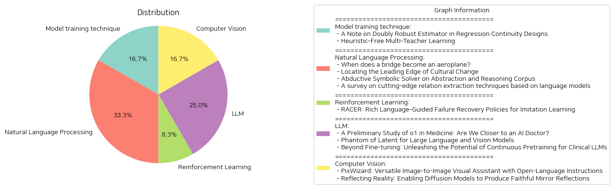

# Daily Artificial Intelligence Insights : Papers

## Natural Language Processing

**요약:**

**요약 보고서**

최근의 연구들은 인공지능, 자연어 처리, 의료 분야 등 다양한 분야에서 새로운 기술과 접근법을 제시하고 있습니다. 이 보고서는 이러한 연구들을 요약하고, 주요 주제와 기술을 식별하며, 향후 발전 방향을 제시합니다.

**주요 주제**

1. **인공지능과 자연어 처리**: 인공지능의 추론 능력 향상, 자연어 처리의 새로운 접근법, 의료 분야에서의 인공지능 적용 등이 주요 주제입니다.
2. **의료 분야에서의 인공지능**: 의료 분야에서의 인공지능 적용, 의료 데이터 처리, 의료 지식 추출 등이 주요 주제입니다.
3. **연속적 사전 훈련**: 연속적 사전 훈련의 효과, 의료 분야에서의 연속적 사전 훈련 적용 등이 주요 주제입니다.

**주요 기술**

1. **BERT 기반 방법**: BERT 기반 방법이 자연어 처리 분야에서 우수한 성능을 보여주고 있습니다.
2. **대규모 언어 모델**: 대규모 언어 모델이 다양한 분야에서 새로운 가능성을 열어주고 있습니다.
3. **연속적 사전 훈련**: 연속적 사전 훈련이 의료 분야에서의 인공지능 성능 향상에 기여할 수 있습니다.

**향후 발전 방향**

1. **의료 분야에서의 인공지능 적용**: 의료 분야에서의 인공지능 적용이 더욱 활발해질 것으로 예상됩니다.
2. **연속적 사전 훈련의 확장**: 연속적 사전 훈련의 확장이 다양한 분야에서 새로운 가능성을 열어줄 수 있습니다.
3. **인공지능의 추론 능력 향상**: 인공지능의 추론 능력 향상이 다양한 분야에서 새로운 가능성을 열어줄 수 있습니다.

**결론**

최근의 연구들은 인공지능, 자연어 처리, 의료 분야 등 다양한 분야에서 새로운 기술과 접근법을 제시하고 있습니다. 이 보고서는 이러한 연구들을 요약하고, 주요 주제와 기술을 식별하며, 향후 발전 방향을 제시합니다. 향후 연구에서는 이러한 기술과 접근법을 더욱 발전시켜 다양한 분야에서 새로운 가능성을 열어갈 수 있을 것입니다.

**출처:**

 - When does a bridge become an aeroplane? (https://deeplearn.org/arxiv/553087/when-does-a-bridge-become-an-aeroplane?)
 - Locating the Leading Edge of Cultural Change (https://deeplearn.org/arxiv/551310/locating-the-leading-edge-of-cultural-change)
 - Abductive Symbolic Solver on Abstraction and Reasoning Corpus (https://deeplearn.org/arxiv/553225/abductive-symbolic-solver-on-abstraction-and-reasoning-corpus)
 - A survey on cutting-edge relation extraction techniques based on language models (https://deeplearn.org/arxiv/553226/a-survey-on-cutting-edge-relation-extraction-techniques-based-on-language-models)
 - A Preliminary Study of o1 in Medicine: Are We Closer to an AI Doctor? (http://arxiv.org/abs/2409.15277v1)
 - Beyond Fine-tuning: Unleashing the Potential of Continuous Pretraining for Clinical LLMs (http://arxiv.org/abs/2409.14988v1)

## Multimodal

**요약:**

**요약 보고서**

최근에 발표된 세 가지 논문은 인공 지능, 컴퓨터 비전, 자연어 처리 분야에서 새로운 기술과 접근 방식을 제시하고 있습니다. 이 보고서는 이러한 논문에서 추출한 주요 주제와 결과를 요약하고, 이를 통해 나타나는 트렌드와 패턴을 분석합니다.

**주요 주제**

1. **인터프리터블한 분석 프레임워크**: 첫 번째 논문은 인공 지능을 이용한 뇌 영상 분석에서 인터프리터블한 결과를 얻기 위한 새로운 프레임워크를 제시합니다. 이 프레임워크는 자기 주의 메커니즘과 잠재 공간 아이템-응답 모델을 사용하여 뇌 영상 데이터에서 의미 있는 패턴을 추출합니다.
2. **효율적인 대규모 언어 및 비전 모델**: 두 번째 논문은 대규모 언어 및 비전 모델(LLVM)의 효율성을 높이기 위한 새로운 접근 방식을 제시합니다. 이 접근 방식은 잠재 공간의 크기를 임시로 증가시켜 모델의 학습 능력을 향상시키는 Phantom이라는 모델을 제시합니다.
3. **이미지-이미지 시각적 어시스턴트**: 세 번째 논문은 이미지-이미지 시각적 어시스턴트인 PixWizard를 제시합니다. 이 모델은 오픈 언어 명령을 사용하여 이미지 생성, 편집, 번역 등을 수행할 수 있습니다.

**트렌드와 패턴**

1. **인터프리터블한 인공 지능**: 세 가지 논문 모두 인공 지능의 인터프리터블성을 향상시키는 데 중점을 두고 있습니다. 이는 인공 지능의 결과를 더 잘 이해하고 신뢰할 수 있도록 하는 데 중요합니다.
2. **효율적인 모델**: 두 번째와 세 번째 논문은 효율적인 모델을 개발하는 데 중점을 두고 있습니다. 이는 모델의 크기를 줄이고 학습 시간을 단축하는 데 중요합니다.
3. **다중 모달리티**: 세 가지 논문 모두 다중 모달리티를 다루고 있습니다. 이는 이미지, 언어, 비전 등 다양한 데이터 형식을 통합하여 더 나은 결과를 얻는 데 중요합니다.

**결론**

세 가지 논문은 인공 지능, 컴퓨터 비전, 자연어 처리 분야에서 새로운 기술과 접근 방식을 제시하고 있습니다. 인터프리터블한 인공 지능, 효율적인 모델, 다중 모달리티는 이러한 논문에서 나타나는 주요 트렌드와 패턴입니다. 이러한 기술은 다양한 분야에서 더 나은 결과를 얻는 데 중요하며, 향후 더 많은 연구와 개발이 필요합니다.

**출처:**

 - Interpretable Fusion Analytics Framework for fMRI Connectivity: Self-Attention Mechanism and Latent Space Item-Response Model (https://deeplearn.org/arxiv/550240/interpretable-fusion-analytics-framework-for-fmri-connectivity:-self-attention-mechanism-and-latent-space-item-response-model)
 - Phantom of Latent for Large Language and Vision Models (http://arxiv.org/abs/2409.14713v1)
 - PixWizard: Versatile Image-to-Image Visual Assistant with Open-Language Instructions (http://arxiv.org/abs/2409.15278v2)

## Reinforcement Learning

**요약:**

**요약 보고서**

최근 로봇 학습 분야에서 모방 학습을 위한 신경망을 사용하여 로봇이 유연한 작업을 수행할 수 있도록 하는 연구가 활발히 진행되고 있습니다. 그러나 신경망은 출력 오류를 보정할 수 있는 메커니즘을 갖고 있지 않아 제한적입니다. 이에 따라 출력 오류를 보정할 수 있는 피드백 메커니즘을 개발하고, 이를 통해 로봇의 제어 성능을 향상시키는 연구가 진행되고 있습니다.

**주요 연구**

1. **출력 오류 보정 모델**

최근 연구에서는 신경망의 출력 오류를 보정하기 위한 피드백 메커니즘을 개발했습니다. 이 모델은 하위 계층과 상위 계층으로 구성된 신경망을 사용하여 출력 오류를 보정합니다. 하위 계층은 상위 계층을 따라가도록 제어되며, 다층 퍼셉트론을 사용하여 내부 상태가 없는 하위 계층에서 출력 오류를 보정합니다. 이 모델은 문자 쓰기 작업에서 이전에 학습되지 않은 문자를 쓰는 정확성을 향상시켰습니다.

2. **RACER: 언어 가이드 실패 복구 정책**

또 다른 연구에서는 로봇 조작을 위한 강건하고 수정 가능한 시각-운동 정책을 개발하기 위한 연구를 진행했습니다. 이 연구에서는 실패 복구 메커니즘의 부족과 단순한 언어 지시의 제한으로 인해 로봇 조작이 어려운 문제를 해결하기 위해 스케일러블 데이터 생성 파이프라인을 제안했습니다. 이 파이프라인은 전문가 데모를 실패 복구 궤적과 세부 언어 주석과 함께 자동으로 보강하여 훈련에 사용합니다. 또한, 실패 복구 데이터와 풍부한 언어 설명을 결합하여 로봇 제어를 향상시키는 RACER 프레임워크를 제안했습니다. RACER는 온라인 감독자로서 세부 언어 지침을 제공하는 비전-언어 모델(VLM)과 언어 조건부 시각-운동 정책을 사용하여 다음 동작을 예측합니다. 실험 결과, RACER는 표준 장기 지연 작업, 동적 목표 변경 작업 및 제로샷 작업에서 RVT보다 우수한 성능을 보여주었습니다.

**결론**

이 연구들은 로봇 학습 분야에서 모방 학습을 위한 신경망을 사용하여 로봇의 제어 성능을 향상시키는 데에 중점을 두고 있습니다. 출력 오류 보정 모델과 RACER 프레임워크는 로봇의 제어 성능을 향상시키는 데에 기여할 수 있는 연구입니다. 이러한 연구는 로봇 학습 분야에서 모방 학습을 위한 신경망을 사용하여 로봇의 제어 성능을 향상시키는 데에 새로운 방향을 제시할 수 있습니다.

**향후 연구 방향**

향후 연구에서는 로봇 학습 분야에서 모방 학습을 위한 신경망을 사용하여 로봇의 제어 성능을 향상시키는 데에 중점을 두고 있습니다. 출력 오류 보정 모델과 RACER 프레임워크를 기반으로 하여 로봇의 제어 성능을 향상시키는 새로운 연구가 필요합니다. 또한, 로봇 학습 분야에서 모방 학습을 위한 신경망을 사용하여 로봇의 제어 성능을 향상시키는 데에 새로운 기술과 방법론을 개발하는 연구가 필요합니다.

**출처:**

 - Error-Feedback Model for Output Correction in Bilateral Control-Based Imitation Learning (https://deeplearn.org/arxiv/550311/error-feedback-model-for-output-correction-in-bilateral-control-based-imitation-learning)
 - RACER: Rich Language-Guided Failure Recovery Policies for Imitation Learning (http://arxiv.org/abs/2409.14674v1)

## Computer Vision

**요약:**

**요약 보고서**

**제목:** 반사 현상을 구현하는 확산 모델의 개발

**요약:** 본 연구는 확산 기반 생성 모델을 사용하여 매우 현실적이고 가능성 있는鏡 반사 이미지를 생성하는 문제를 해결하고자 한다. 이를 위해鏡 반사 이미지를 생성하는 문제를 이미지 인페인팅 작업으로 정의하고, 사용자가鏡의 위치를 제어할 수 있도록 한다. 이를 위해 대규모의 합성 데이터셋인 SynMirror를 생성하였으며, 이는 66,000개의 고유한 3D 객체를 사용하여 생성된 약 198,000개의 샘플을 포함하고 있다. 이 데이터셋에는 각 객체의 깊이 맵, 노멀 맵 및 인스턴스별 분할 마스크가 포함되어 있어, 장면의 기하학적 속성을 캡처한다. 이 데이터셋을 사용하여鏡 반사 이미지를 생성하는 새로운 방법인 MirrorFusion을 제안하였으며, 이는 입력 이미지와鏡 영역을 표시하는 마스크를 사용하여 높은 품질의 기하학적으로 일치하고 사진과 같은鏡 반사 이미지를 생성한다. MirrorFusion은 SynMirror 데이터셋에서 최첨단 방법을 능가하는 것으로 나타났으며, 광범위한 정량적 및 정성적 분석을 통해 입증되었다. 본 연구는 확산 기반 모델을 사용하여 장면 내 객체의 제어된鏡 반사 이미지를 생성하는 문제를 성공적으로 해결한 최초의 연구이다. SynMirror와 MirrorFusion은 이미지 편집 및 증강 현실 애플리케이션을 위한 새로운 방향을 열어주고 있다.

**주요 키워드:** 확산 모델,鏡 반사, 이미지 인페인팅, SynMirror, MirrorFusion

**주요 내용:**

* 확산 기반 생성 모델을 사용하여鏡 반사 이미지를 생성하는 문제를 해결하고자 한다.
* 대규모의 합성 데이터셋인 SynMirror를 생성하여鏡 반사 이미지를 생성하는 문제를 해결한다.
* 새로운 방법인 MirrorFusion을 제안하여 높은 품질의 기하학적으로 일치하고 사진과 같은鏡 반사 이미지를 생성한다.
* SynMirror 데이터셋에서 최첨단 방법을 능가하는 것으로 나타났다.

**향후 발전 방향:**

* 이미지 편집 및 증강 현실 애플리케이션을 위한 새로운 방향을 열어준다.
* 확산 모델을 사용하여 다양한 장면 내 객체의鏡 반사 이미지를 생성하는 문제를 해결할 수 있다.
* MirrorFusion 방법을 사용하여 높은 품질의 기하학적으로 일치하고 사진과 같은鏡 반사 이미지를 생성할 수 있다.

**출처:**

 - Reflecting Reality: Enabling Diffusion Models to Produce Faithful Mirror Reflections (http://arxiv.org/abs/2409.14677v1)

