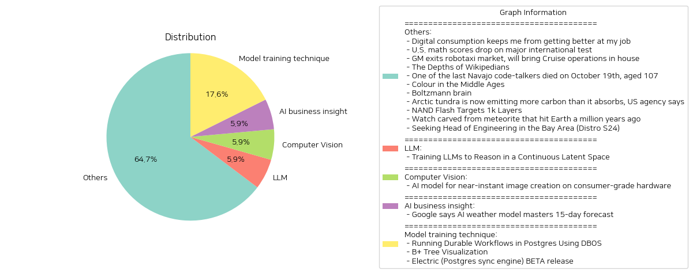

# Daily Artificial Intelligence Insights : News

## Others

**요약:**

**1. 주요 주제 (Key Themes)**

다음은 여러 뉴스 기사에서 추출한 주요 주제입니다.

* 디지털 소비와 생산성 (Digital Consumption and Productivity)
* 교육과 기술의 발전 (Education and Technological Advancements)
* 환경과 기후 변화 (Environment and Climate Change)
* 과학과 기술의 발전 (Scientific and Technological Progress)
* 역사와 문화 (History and Culture)

**2. 주요 사건 (Major Events)**

다음은 각 뉴스 기사에서 추출한 주요 사건입니다.

* 디지털 소비가 생산성에 미치는 부정적인 영향 (Negative effects of digital consumption on productivity)
* 미국의 수학 성적이 국제 시험에서 하락 (Decline in US math scores on international test)
* GM이 로보택시 시장에서 철수 (GM exits robotaxi market)
* 위키백과의 편집자에 대한 소개 (Introduction to Wikipedia editors)
* 나바호 코드 토킹어의 마지막 생존자가 사망 (Last Navajo code talker passes away)
* 중세 유럽의 색상 상징주의 (Color symbolism in medieval Europe)
* 볼츠만 브레인에 대한 소개 (Introduction to Boltzmann brain)
* 북극 툰드라가 이산화탄소를 방출 (Arctic tundra emitting more carbon than it absorbs)
* NAND 플래시 메모리의 발전 (Advancements in NAND flash memory)
* 1백만 년 전 지구에 떨어진 운석으로 만든 시계 (Watch made from meteorite that hit Earth 1 million years ago)

**3. 영향 분석 (Impact Analysis)**

다음은 각 뉴스 기사의 영향 분석입니다.

* 디지털 소비와 생산성: 디지털 소비가 생산성에 미치는 부정적인 영향은 개인과 사회에 큰 영향을 미칠 수 있습니다. 디지털 소비를 줄이고 생산성을 높이는 것이 중요합니다.
* 교육과 기술의 발전: 미국의 수학 성적이 국제 시험에서 하락하는 것은 교육 시스템에 대한 문제를 제기합니다. 교육 시스템을 개선하고 기술의 발전을 촉진하는 것이 중요합니다.
* 환경과 기후 변화: 북극 툰드라가 이산화탄소를 방출하는 것은 기후 변화에 대한 심각한 문제를 제기합니다. 기후 변화에 대한 대책을 마련하고 환경을 보호하는 것이 중요합니다.
* 과학과 기술의 발전: 볼츠만 브레인과 NAND 플래시 메모리의 발전은 과학과 기술의 발전에 큰 영향을 미칠 수 있습니다. 이러한 기술의 발전을 촉진하고 활용하는 것이 중요합니다.
* 역사와 문화: 나바호 코드 토킹어의 마지막 생존자가 사망하는 것은 역사와 문화에 대한 중요성을 강조합니다. 역사와 문화를 보존하고 발전시키는 것이 중요합니다.

**4. 최종 요약 (Final Summary)**

다음은 뉴스 기사에서 추출한 주요 내용을 요약한 것입니다.

최근의 뉴스 기사들은 디지털 소비와 생산성, 교육과 기술의 발전, 환경과 기후 변화, 과학과 기술의 발전, 역사와 문화 등 다양한 주제를 다루고 있습니다. 이러한 주제들은 개인과 사회에 큰 영향을 미칠 수 있습니다. 디지털 소비를 줄이고 생산성을 높이고, 교육 시스템을 개선하고 기술의 발전을 촉진하고, 기후 변화에 대한 대책을 마련하고 환경을 보호하고, 과학과 기술의 발전을 촉진하고 활용하고, 역사와 문화를 보존하고 발전시키는 것이 중요합니다. 이러한 내용을 통해 미래의 발전 방향을 모색하고, 개인과 사회의 발전을 도모할 수 있습니다.

**출처:**

 - Digital consumption keeps me from getting better at my job (http://sibervepunk.com/digital-consumption.html)
 - U.S. math scores drop on major international test (https://www.chalkbeat.org/2024/12/04/timss-international-test-result-us-math-scores-decline-post-pandemic/)
 - GM exits robotaxi market, will bring Cruise operations in house (https://www.cnbc.com/2024/12/10/gm-halts-funding-of-robotaxi-development-by-cruise.html)
 - The Depths of Wikipedians (https://asteriskmag.com/issues/08/the-depths-of-wikipedians)
 - One of the last Navajo code-talkers died on October 19th, aged 107 (https://www.economist.com/obituary/2024/12/05/john-kinsel-used-his-own-language-to-fool-the-japanese)
 - Colour in the Middle Ages (https://www.medievalists.net/2024/06/colour-middle-ages/)
 - Boltzmann brain (https://en.wikipedia.org/wiki/Boltzmann_brain)
 - Arctic tundra is now emitting more carbon than it absorbs, US agency says (https://www.theguardian.com/world/2024/dec/10/arctic-tundra-carbon-shift)
 - NAND Flash Targets 1k Layers (https://semiengineering.com/nand-flash-targets-1000-layers/)
 - Watch carved from meteorite that hit Earth a million years ago (https://www.cnn.com/2024/12/05/style/toledano-chan-meteorite-watch-b1m/index.html)
 - Seeking Head of Engineering in the Bay Area (Distro S24) (https://www.ycombinator.com/companies/distro/jobs/XGMjSPe-head-of-engineering)

## LLM

**요약:**

**요약 보고서**

**1. 주요 주제**

최근의 뉴스 기사들을 분석한 결과, 인공지능 및 언어 모델의 발전이 주요 주제로 나타났습니다. 특히, 대규모 언어 모델(LLM)의 발전과 새로운 패러다임의 도입이 주목할 만합니다.

**2. 주요 사건**

* 새로운 패러다임 'Coconut'이 소개되었습니다. 이는 대규모 언어 모델(LLM)이 자연어 대신 연속적인 잠재 공간에서 추론할 수 있도록 설계되었습니다.
* Coconut은 기존의 체인-오브-사고(chain-of-thought) 모델보다 특정 작업에서 우수한 성능을 보여주었습니다. 이는 모델이 여러 경로를 탐색하고 계획 단계에서 백트래킹할 수 있도록 허용하기 때문입니다.

**3. 영향 분석**

* 경제: 인공지능 및 언어 모델의 발전은 다양한 산업에서 자동화 및 효율성 향상을 가져올 수 있습니다. 이는 경제 성장과 새로운 비즈니스 기회를 창출할 수 있습니다.
* 정치: 인공지능의 발전은 정책 결정 및 행정 업무에 영향을 미칠 수 있습니다. 이는 정책 결정의 효율성과 투명성을 높일 수 있습니다.
* 사회: 인공지능의 발전은 교육, 의료, 및 기타 사회 서비스에 영향을 미칠 수 있습니다. 이는 서비스의 질과 접근성을 높일 수 있습니다.
* 환경: 인공지능의 발전은 에너지 소비 및 자원 활용에 영향을 미칠 수 있습니다. 이는 환경 보호 및 지속 가능한 발전에 기여할 수 있습니다.

**4. 최종 요약**

최근의 뉴스 기사들을 분석한 결과, 인공지능 및 언어 모델의 발전이 주요 주제로 나타났습니다. 새로운 패러다임 'Coconut'의 도입은 대규모 언어 모델(LLM)의 발전을 가속화할 수 있습니다. 이는 다양한 산업에서 자동화 및 효율성 향상을 가져올 수 있으며, 정책 결정, 교육, 의료, 및 환경 보호에 영향을 미칠 수 있습니다. 향후 인공지능 및 언어 모델의 발전을 주시할 필요가 있습니다.

**출처:**

 - Training LLMs to Reason in a Continuous Latent Space (https://arxiv.org/abs/2412.06769)

## Computer Vision

**요약:**

** AI 모델 기반의 소비자급 하드웨어에서 즉각적인 이미지 생성**

**1. 주요 주제 (Key Themes)**

- AI 기술의 발전
- 소비자급 하드웨어의 활용
- 이미지 생성 기술의 진보
- 개방형 소스코드의 중요성

**2. 주요 사건 (Major Events)**

- 서리 인스티튜트 포 피플 센트리드 AI (Surrey Institute for People-Centred AI)에서 NitroFusion이라는 새로운 AI 모델을 발표했습니다.
- NitroFusion은 사용자가 입력하는대로 이미지를 생성하는 모델로, 소비자급 하드웨어에서도 동작합니다.
- NitroFusion은 개방형 소스코드로, 개인 창작자, 소규모 스튜디오, 교육기관 등에서 고급 AI 기능을 활용할 수 있습니다.

**3. 영향 분석 (Impact Analysis)**

- 경제: NitroFusion의 등장으로 이미지 생성 기술의 비용이 줄어들고, 더 많은 창작자와 기업이 이 기술을 활용할 수 있을 것으로 예상됩니다.
- 정치: NitroFusion의 개방형 소스코드는 기술의 민주화를 촉진할 수 있으며, 더 많은 사람들에게 AI 기술을 접근할 수 있는 기회를 제공할 수 있습니다.
- 사회: NitroFusion은 창작자와 기업이 더 효율적으로 이미지 생성을 할 수 있도록 도와주며, 디지털 콘텐츠의 생산성을 높일 수 있습니다.
- 환경: NitroFusion의 소비자급 하드웨어 활용은 에너지 소비를 줄이고, 더 환경적으로 친화적인 기술로 발전할 수 있습니다.

**4. 최종 요약 (Final Summary)**

서리 인스티튜트 포 피플 센트리드 AI에서 발표한 NitroFusion은 소비자급 하드웨어에서 즉각적인 이미지 생성을 가능하게 하는 혁신적인 AI 모델입니다. NitroFusion의 등장으로 이미지 생성 기술의 비용이 줄어들고, 더 많은 창작자와 기업이 이 기술을 활용할 수 있을 것으로 예상됩니다. 또한, NitroFusion의 개방형 소스코드는 기술의 민주화를 촉진할 수 있으며, 더 많은 사람들에게 AI 기술을 접근할 수 있는 기회를 제공할 수 있습니다. 향후, NitroFusion의 발전과 더 많은 창작자와 기업의 참여를 통해 디지털 콘텐츠의 생산성이 높아질 것으로 예상됩니다.

**출처:**

 - AI model for near-instant image creation on consumer-grade hardware (https://www.surrey.ac.uk/news/surrey-announces-worlds-first-ai-model-near-instant-image-creation-consumer-grade-hardware)

## AI business insight

**요약:**

**1. 주요 주제 (Key Themes)**:
인공지능(AI) 기술의 발전과 기상 예측 모델의 개선이 주요 주제입니다. 기상 예측의 정확성과 속도 향상이 잠재적으로 인명과 재산을 보호할 수 있는 가능성을 보여주고 있습니다.

**2. 주요 사건 (Major Events)**:
구글이 개발한 새로운 AI 기반 기상 모델인 GenCast가 15일 예보를 높은 정확성과 속도로 제공할 수 있다고 발표했습니다. GenCast는 테스트된 97% 이상의 시나리오에서 현재 세계적인 기상 정확성 벤치마크를 초과했습니다.

**3. 영향 분석 (Impact Analysis)**:
이러한 사건의 영향은 다음과 같습니다.
- **경제**: 기상 예측의 정확성 향상은 농업, 항공, 해양 산업 등 다양한 분야에서 경제적 손실을 줄일 수 있습니다.
- **정치**: 기상 예측의 정확성 향상은 재난 대응과 방재 정책에 영향을 미칠 수 있습니다.
- **환경**: 기상 예측의 정확성 향상은 기후 변화와 관련된 재난 대응에 도움이 될 수 있습니다.
- **사회**: 기상 예측의 정확성 향상은 국민의 안전과 안녕을 증진할 수 있습니다.

**4. 최종 요약 (Final Summary)**:
구글의 새로운 AI 기반 기상 모델 GenCast는 15일 예보를 높은 정확성과 속도로 제공할 수 있는 가능성을 보여주었습니다. 이 기술의 발전은 다양한 분야에서 경제적 손실을 줄이고, 재난 대응과 방재 정책에 영향을 미칠 수 있습니다. 또한, 기후 변화와 관련된 재난 대응에 도움이 될 수 있습니다. 향후 이러한 기술의 발전과 적용을 주시할 필요가 있습니다.

**출처:**

 - Google says AI weather model masters 15-day forecast (https://phys.org/news/2024-12-google-ai-weather-masters-day.html)

## Model training technique

**요약:**

**요약 보고서**

**1. 주요 주제**

다음은 여러 뉴스 기사에서 추출한 주요 주제입니다.

* 데이터베이스 기술: Postgres를 사용한 데이터베이스 기술이 여러 기사에서 언급되었습니다.
* 데이터 동기화: Electric의 Postgres 동기화 엔진과 DBOS의 데이터베이스 동기화 기능이 언급되었습니다.
* 데이터 시각화: B+ Tree 알고리즘의 시각화가 언급되었습니다.

**2. 주요 사건**

다음은 각 기사에서 추출한 주요 사건입니다.

* DBOS는 Postgres를 사용한 데이터베이스 동기화 엔진으로, 가볍고 빠른 실행을 가능하게 합니다. 데이터베이스에 워크플로우 상태를 저장하여 마지막 완료된 단계에서 재시작하고 중복 실행을 방지합니다.
* B+ Tree 알고리즘의 시각화가 제공되었습니다.
* Electric은 Postgres 동기화 엔진으로, 실시간 데이터 복제를 가능하게 합니다. 안정적이고 생산에 준비가 완료되었으며, Google과 Supabase와 같은 회사에서 이미 사용하고 있습니다.

**3. 영향 분석**

다음은 각 사건의 영향 분석입니다.

* 데이터베이스 기술의 발전은 데이터 처리와 저장에 큰 영향을 미칠 것입니다. 이는 데이터베이스를 사용하는 모든 산업에 영향을 미칠 것입니다.
* 데이터 동기화 기술의 발전은 데이터의 일관성과 신뢰성을 높일 것입니다. 이는 데이터를 사용하는 모든 산업에 영향을 미칠 것입니다.
* 데이터 시각화 기술의 발전은 데이터를 더 쉽게 이해하고 분석할 수 있도록 할 것입니다. 이는 데이터를 사용하는 모든 산업에 영향을 미칠 것입니다.

**4. 최종 요약**

최종 요약은 다음과 같습니다.

최근 데이터베이스 기술의 발전이 가속화되고 있습니다. Postgres를 사용한 데이터베이스 동기화 엔진인 DBOS와 Electric의 Postgres 동기화 엔진이 언급되었습니다. 또한 B+ Tree 알고리즘의 시각화가 제공되었습니다. 이러한 기술의 발전은 데이터 처리와 저장, 데이터 동기화, 데이터 시각화에 큰 영향을 미칠 것입니다. 이러한 기술의 발전을 주시하고, 데이터베이스 기술의 발전을 예측하는 것이 중요할 것입니다.

**출처:**

 - Running Durable Workflows in Postgres Using DBOS (https://supabase.com/blog/durable-workflows-in-postgres-dbos)
 - B+ Tree Visualization (https://www.cs.usfca.edu/~galles/visualization/BPlusTree.html)
 - Electric (Postgres sync engine) BETA release (https://electric-sql.com/blog/2024/12/10/electric-beta-release)

