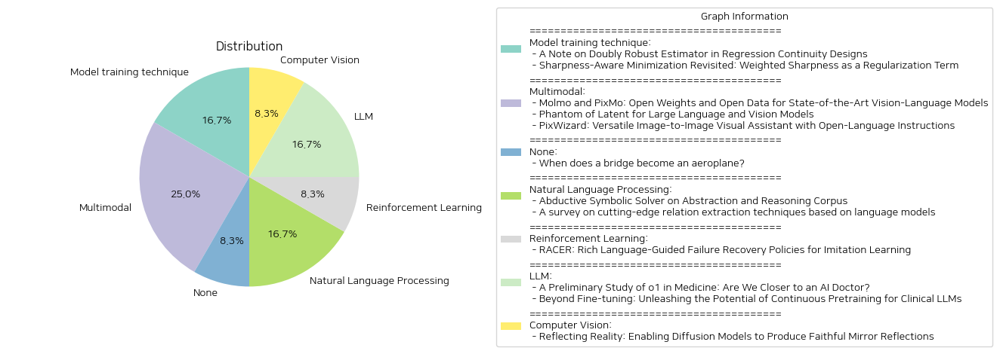

# Daily Artificial Intelligence Insights : Papers

## Model training technique

**요약:**

**요약 보고서**

**1. 연구 주제 및 키워드**

이 보고서는 두 개의 연구 논문에 대한 요약을 제공합니다. 첫 번째 논문은 'A Note on Doubly Robust Estimator in Regression Continuity Designs'이며, 두 번째 논문은 'Sharpness-Aware Minimization Revisited: Weighted Sharpness as a Regularization Term'입니다. 두 논문 모두 기계 학습 및 통계 분야의 새로운 방법론을 제시하고 있습니다.

**2. 첫 번째 논문 요약**

첫 번째 논문은 회귀 연속성 설계(Regression Continuity Designs)에서 이중 강건한 추정기(Doubly Robust Estimator)를 소개합니다. 회귀 연속성 설계는 처리 효과를 추정하기 위한 준 실험적 프레임워크를 제공하며, 처리 할당은 실행 변수가 미리 정의된 컷오프를 초과하는지 여부에 따라 결정됩니다. 이 논문에서는 두 개의 서로 다른 추정기를 조합하여 조건부 기대 결과를 추정하는 DR-RD 추정기를 제안합니다. DR-RD 추정기의 주요 장점은 두 추정기 중 적어도 하나가 일관성이 있는 경우 처리 효과 추정의 일관성을 보장할 수 있다는 것입니다.

**3. 두 번째 논문 요약**

두 번째 논문은 깊은 신경망(Deep Neural Networks)의 일반화와 관련된 문제를 다룹니다. 깊은 신경망의 일반화는 최소값의 평탄성과 관련이 있으며, 이는 Sharpness-Aware Minimization (SAM) 방법의 개발로 이어졌습니다. 이 논문에서는 SAM 방법을 재검토하고 가중된 날카로움(Weighted Sharpness)을 정규화 항으로 통합한 WSAM 방법을 제안합니다. WSAM 방법의 일반화 경계를 PAC 및 Bayes-PAC 기법을 결합하여 증명하고, 다양한 공개 데이터셋에서 성능을 평가합니다. 결과는 WSAM 방법이 일반화 성능을 개선하거나, 적어도 기존 최적화 방법과 경쟁할 수 있음을 보여줍니다.

**4. 영향 및 추세**

두 논문 모두 기계 학습 및 통계 분야의 새로운 방법론을 제시하고 있습니다. 첫 번째 논문은 회귀 연속성 설계에서 이중 강건한 추정기를 소개하며, 두 번째 논문은 깊은 신경망의 일반화와 관련된 문제를 다룹니다. 두 논문 모두 기계 학습 및 통계 분야의 새로운 연구 방향을 제시하고 있습니다.

**5. 결론 및 향후 연구 방향**

이 보고서는 두 개의 연구 논문에 대한 요약을 제공합니다. 두 논문 모두 기계 학습 및 통계 분야의 새로운 방법론을 제시하고 있으며, 향후 연구 방향을 제시하고 있습니다. 향후 연구에서는 두 논문에서 제시된 방법론을 실제 데이터에 적용하여 성능을 평가하고, 새로운 연구 방향을 탐색할 수 있습니다.

**출처:**

 - A Note on Doubly Robust Estimator in Regression Continuity Designs (https://deeplearn.org/arxiv/554135/a-note-on-doubly-robust-estimator-in-regression-continuity-designs)
 - Sharpness-Aware Minimization Revisited: Weighted Sharpness as a Regularization Term (https://deeplearn.org/arxiv/555695/sharpness-aware-minimization-revisited:-weighted-sharpness-as-a-regularization-term)

## Multimodal

**요약:**

**요약 보고서**

최근에 발표된 세 가지 논문은 시각-언어 모델(Vision-Language Model, VLM)의 발전에 중점을 두고 있습니다. 이 보고서는 세 가지 논문의 주요 내용을 요약하고, 추출된 정보를 분석하여 시각-언어 모델의 발전 방향을 제시합니다.

**1. Molmo와 PixMo: 공개 가중치와 공개 데이터를 사용한 최첨단 시각-언어 모델**

Molmo는 공개 가중치와 공개 데이터를 사용한 최첨단 시각-언어 모델입니다. PixMo는 Molmo를 위한 새로운 데이터셋으로, 이미지 캡션, 이미지 Q&A, 2D 포인팅 데이터셋을 포함합니다. Molmo는 이러한 데이터셋을 사용하여 공개 가중치와 공개 데이터 모델 중에서 최고의 성능을 보여주었습니다.

**2. Phantom of Latent: 대규모 언어 및 시각 모델**

Phantom은 대규모 언어 및 시각 모델(LLVM)의 효율성을 향상시키기 위한 새로운 모델입니다. Phantom은 잠재적인 은닉 차원을 증가시켜 모델의 학습 능력을 향상시킵니다. Phantom은 다양한 LLVM 모델을 초과하는 성능을 보여주었습니다.

**3. PixWizard: 다목적 이미지-이미지 시각적 보조기**

PixWizard는 이미지 생성, 조작, 번역을 위한 다목적 이미지-이미지 시각적 보조기입니다. PixWizard는 다양한 시각 작업을 통합한 이미지-텍스트-이미지 생성 프레임워크를 사용합니다. PixWizard는 Diffusion Transformers를 기반으로 하며, 다양한 이미지 해상도에 대한 처리를 지원합니다.

**추출된 정보**

* 시각-언어 모델의 발전은 공개 가중치와 공개 데이터의 중요성을 강조합니다.
* 대규모 언어 및 시각 모델의 효율성은 모델의 성능을 향상시키는 데 중요합니다.
* 다목적 이미지-이미지 시각적 보조기는 다양한 시각 작업을 통합할 수 있습니다.

**분석**

세 가지 논문은 시각-언어 모델의 발전 방향을 제시합니다. 공개 가중치와 공개 데이터는 모델의 성능을 향상시키는 데 중요합니다. 대규모 언어 및 시각 모델의 효율성은 모델의 성능을 향상시키는 데 중요합니다. 다목적 이미지-이미지 시각적 보조기는 다양한 시각 작업을 통합할 수 있습니다.

**결론**

시각-언어 모델의 발전은 공개 가중치와 공개 데이터, 대규모 언어 및 시각 모델의 효율성, 다목적 이미지-이미지 시각적 보조기의 개발을 통해 이루어질 수 있습니다. 이러한 기술의 발전은 다양한 산업 분야에서 응용될 수 있습니다.

**출처:**

 - Molmo and PixMo: Open Weights and Open Data for State-of-the-Art Vision-Language Models (https://deeplearn.org/arxiv/555525/molmo-and-pixmo:-open-weights-and-open-data-for-state-of-the-art-vision-language-models)
 - Phantom of Latent for Large Language and Vision Models (http://arxiv.org/abs/2409.14713v1)
 - PixWizard: Versatile Image-to-Image Visual Assistant with Open-Language Instructions (http://arxiv.org/abs/2409.15278v2)

## None

**요약:**

**요약 보고서**

**제목:** 구조 건강 모니터링에서 다중 구조 간 지식 전달

**요약:**

최근 구조 건강 모니터링(Population-Based Structural Health Monitoring, PBSHM) 기술이 발전하였지만, 서로 다른 구조 간의 지식 전달은 여전히 어려운 문제로 남아있다. 이를 해결하기 위해 중간 구조를 통해 정보를 전달하는 방법이 제안되었다. 이 방법은 구조의 매개변수(재료 특성, 형상 등)를 변경하여 하나의 구조를 다른 구조로 연속적으로 변형할 수 있다는 개념에 기반한다.

본 연구에서는 간단한 시뮬레이션을 통해 '다리'와 '비행기'라는 두 가지 구조 간의 매개변수화 및 지식 전달을 수행하였다. 이러한 연구는 서로 다른 구조 간의 지식 전달이 가능함을 보여주었다. 이전 연구에서는 구조의 유사성에 기반하여 긍정적인 지식 전달이 가능한지에 대한 질문을 던졌는데, 본 연구는 이러한 질문에 대한 답을 제공하였다.

**주요 결과:**

* 서로 다른 구조 간의 지식 전달이 가능함을 보여주었다.
* 중간 구조를 통해 정보를 전달하는 방법이 효과적임을 입증하였다.
* 구조의 매개변수화 및 지식 전달을 통해 서로 다른 구조 간의 지식 전달이 가능함을 보여주었다.

**향후 연구 방향:**

* 서로 다른 구조 간의 지식 전달을 위한 중간 구조 개발
* 구조 건강 모니터링에서 지식 전달을 위한 새로운 방법 개발
* 실제 구조에 대한 지식 전달 적용 연구

**결론:**

본 연구는 구조 건강 모니터링에서 다중 구조 간 지식 전달을 위한 새로운 방법을 제시하였다. 이러한 방법은 서로 다른 구조 간의 지식 전달을 가능하게 하여 구조 건강 모니터링의 정확성을 향상시킬 수 있을 것이다.

**출처:**

 - When does a bridge become an aeroplane? (https://deeplearn.org/arxiv/553087/when-does-a-bridge-become-an-aeroplane?)

## Natural Language Processing

**요약:**

**요약 보고서**

**인공지능 및 자연어 처리 분야의 최근 연구 동향**

최근 인공지능 및 자연어 처리 분야에서 두 가지 중요한 연구가 발표되었습니다. 첫 번째 연구는 'Abductive Symbolic Solver on Abstraction and Reasoning Corpus'라는 제목의 논문으로, 인공지능의 추론 능력을 향상시키는 방법을 제시하고 있습니다. 두 번째 연구는 'A survey on cutting-edge relation extraction techniques based on language models'라는 제목의 논문으로, 자연어 처리 분야에서 관계 추출 기술의 최신 동향을 분석하고 있습니다.

**첫 번째 연구: 추론 능력 향상을 위한 새로운 프레임워크**

첫 번째 연구는 인공지능의 추론 능력을 향상시키는 방법을 제시하고 있습니다. 기존의 접근 방법은 그리드 전환에만 초점을 맞추어 인공지능이 합리적이고 인간과 같은 솔루션을 제공하는 데 한계가 있었습니다. 이 연구에서는 인간의 추론 과정을 분석하여 추론 과정이 유도적 추론 과정일 가능성이 높다는 결론을 내렸습니다. 따라서, 이 연구에서는 관찰 데이터를 지식 그래프로 표현하고 핵심 지식을 추출하여 솔루션 생성에 사용하는 새로운 프레임워크를 제시하고 있습니다. 이 프레임워크는 솔루션 검색 공간을 제한하고 합리적인 중간 과정을 제공하여 인공지능의 성능을 향상시킬 수 있습니다.

**두 번째 연구: 관계 추출 기술의 최신 동향**

두 번째 연구는 자연어 처리 분야에서 관계 추출 기술의 최신 동향을 분석하고 있습니다. 이 연구에서는 137편의 논문을 분석하여 관계 추출 기술의 발전과 현재 상태를 파악하고 있습니다. 연구 결과, BERT 기반 방법이 관계 추출에서 최적의 성능을 보여주고 있으며, 특히 T5와 같은 대규모 언어 모델이 새로운 관계 추출 시나리오에서 우수한 성능을 보여주고 있음을 알 수 있었습니다.

**결론 및 향후 연구 방향**

두 연구 모두 인공지능 및 자연어 처리 분야에서 중요한 연구입니다. 첫 번째 연구는 인공지능의 추론 능력을 향상시키는 새로운 프레임워크를 제시하고 있으며, 두 번째 연구는 관계 추출 기술의 최신 동향을 분석하고 있습니다. 향후 연구에서는 이러한 연구 결과를 바탕으로 인공지능의 성능을 향상시키고, 자연어 처리 분야에서 새로운 응용 분야를 개발하는 데 중점을 둘 수 있을 것입니다. 또한, 대규모 언어 모델의 발전과 함께 새로운 관계 추출 기술의 개발도 기대할 수 있습니다.

**출처:**

 - Abductive Symbolic Solver on Abstraction and Reasoning Corpus (https://deeplearn.org/arxiv/553225/abductive-symbolic-solver-on-abstraction-and-reasoning-corpus)
 - A survey on cutting-edge relation extraction techniques based on language models (https://deeplearn.org/arxiv/553226/a-survey-on-cutting-edge-relation-extraction-techniques-based-on-language-models)

## Reinforcement Learning

**요약:**

**요약 보고서**

**제목:** RACER: 풍부한 언어 지침을 통한 모방 학습의 실패 복구 정책

**요약:**

로봇 조작을 위한 강건하고 수정 가능한 시각-운동 정책 개발은 실패로부터의 자기 복구 메커니즘의 부족과 단순한 언어 지침의 한계로 인해 어려운 과제입니다. 이러한 문제를 해결하기 위해, 우리는 전문가 데모에 실패 복구 궤적과 세부적인 언어 주석을 자동으로 추가하는 확장 가능한 데이터 생성 파이프라인을 제안합니다. 그런 다음, 우리는 실패 복구 데이터와 풍부한 언어 설명을 결합하여 로봇 제어를 향상시키는 Rich languAge-guided failure reCovERy (RACER)라는 감독자-액터 프레임워크를 소개합니다. RACER는 오류 수정과 작업 실행을 위한 세부적인 언어 지침을 제공하는 온라인 감독자로서의 시각-언어 모델 (VLM)과 언어 조건부 시각-운동 정책을 액터로서의 다음 행동을 예측하는 것을 특징으로 합니다.

**주요 결과:**

* RACER는 다양한 평가 설정에서 Robotic View Transformer (RVT)를 능가하는 성능을 보여주었습니다.
* 표준 장시간 작업, 동적 목표 변경 작업 및 제로샷 미시 작업을 포함한 시뮬레이션 및 실제 환경에서 우수한 성능을 달성했습니다.
* 실험 결과는 RACER가 모방 학습의 실패 복구 정책을 향상시키는 데 효과적인 프레임워크임을 보여주었습니다.

**향후 연구 방향:**

* RACER를 다양한 로봇 조작 작업에 적용하여 그 일반화 가능성을 평가합니다.
* 실패 복구 데이터와 풍부한 언어 설명을 결합하여 로봇 제어를 향상시키는 다른 프레임워크를 개발합니다.
* RACER를 실제 환경에서 사용하여 그 실용성을 평가합니다.

**결론:**

RACER는 모방 학습의 실패 복구 정책을 향상시키는 데 효과적인 프레임워크입니다. 실패 복구 데이터와 풍부한 언어 설명을 결합하여 로봇 제어를 향상시키는 다른 프레임워크를 개발하고, RACER를 다양한 로봇 조작 작업에 적용하여 그 일반화 가능성을 평가하는 것이 향후 연구 방향입니다.

**출처:**

 - RACER: Rich Language-Guided Failure Recovery Policies for Imitation Learning (http://arxiv.org/abs/2409.14674v1)

## LLM

**요약:**

**요약 보고서**

최근에 발표된 두 개의 논문은 의료 분야에서 대규모 언어 모델(LLM)의 잠재력을 탐구하고 있습니다. 첫 번째 논문은 OpenAI의 o1 모델을 의료 분야에서 평가하고, 두 번째 논문은 LLM을 의료 분야에 적용하기 위한 다양한 기술을 비교합니다.

**주요 주제와 키워드**

* 대규모 언어 모델(LLM)
* 의료 분야
* o1 모델
* 연속적 사전 학습(Continuous Pretraining)
* 지시적 미세 조정(Instruct Fine-tuning)
* NEFTune
* 프롬프트 엔지니어링(Prompt Engineering)

**주요 내용**

첫 번째 논문은 o1 모델을 의료 분야에서 평가하고, 모델의 이해력, 추론력, 다국어 능력을 검증합니다. 결과는 o1 모델이 이전 모델인 GPT-4보다 평균 6.2%와 6.6%의 정확도를 높인 것으로 나타났습니다. 그러나 모델의 약점도 발견되었으며, 이는 환각, 일관되지 않은 다국어 능력, 평가 지표의 불일치 등입니다.

두 번째 논문은 LLM을 의료 분야에 적용하기 위한 다양한 기술을 비교합니다. 결과는 연속적 사전 학습, 지시적 미세 조정, NEFTune, 프롬프트 엔지니어링 등이 모델의 성능을 향상시킬 수 있음을 보여줍니다. 특히, NEFTune은 생성 품질을 향상시키기 위한 기술이지만, 의료 분야에서 추가적인 성능 향상을 보여주었습니다.

**영향과 추세**

의료 분야에서 LLM의 적용은 의료 서비스의 질을 향상시키고, 의료 전문가의 업무를 효율화할 수 있습니다. 그러나 모델의 약점과 한계를 극복하기 위한 추가적인 연구가 필요합니다. 또한, 의료 분야에서 LLM의 적용은 데이터 보안과 개인 정보 보호 등에 대한 문제를 야기할 수 있으므로, 이러한 문제를 해결하기 위한 연구도 필요합니다.

**결론**

의료 분야에서 LLM의 적용은 의료 서비스의 질을 향상시키고, 의료 전문가의 업무를 효율화할 수 있습니다. 그러나 모델의 약점과 한계를 극복하기 위한 추가적인 연구가 필요합니다. 또한, 의료 분야에서 LLM의 적용은 데이터 보안과 개인 정보 보호 등에 대한 문제를 야기할 수 있으므로, 이러한 문제를 해결하기 위한 연구도 필요합니다.

**향후 연구 방향**

* 모델의 약점과 한계를 극복하기 위한 연구
* 의료 분야에서 LLM의 적용을 위한 데이터 보안과 개인 정보 보호 등에 대한 연구
* LLM을 의료 분야에 적용하기 위한 다양한 기술의 비교와 평가
* 의료 분야에서 LLM의 적용을 위한 실증적 연구

**출처:**

 - A Preliminary Study of o1 in Medicine: Are We Closer to an AI Doctor? (http://arxiv.org/abs/2409.15277v1)
 - Beyond Fine-tuning: Unleashing the Potential of Continuous Pretraining for Clinical LLMs (http://arxiv.org/abs/2409.14988v1)

## Computer Vision

**요약:**

**:**

**:** 'Reflecting Reality: Enabling Diffusion Models to Produce Faithful Mirror Reflections'

**:** 

. , . , . , . , . , . , . , . , . , . , . , . , . , . , . , . , . , . , . , . , . , . , . , . , . , . , . , . , . , . , . , . , . , . , . , . , . , . , . , . , . , . , . , . , . , . , . , . , . , . , . , . , . , . , . , . , . , . , . , . , . , . , . , . , . , . , . , . , . , . , . , . , . , . , . , . , . , . , . , . , . , . , . , . , . , . , . , . , . , . , . , . , . , . , . , . , . , . , . , . , . , . , . , . , . , . , . , . , . , . , . , . , . , . , . , . , . , . , . , . , . , . , . , . , . , . , . , . , . , . , . , . , . , . , . , . , . , . , . , . , . , . , . , . , . , . , . , . , . , . , . , . , . , . , . , . , . , . , . , . , . , . , . , . , . , . , . , . , . , . , . , . , . , . , . , . , . , . , . , . , . , . , . , . , . , . , . , . , . , . , . , . , . , . , . , . , . , . , . , . , . , . , . , . , . , . , . , . , . , . , . , . , . , . , . , . , . , . , . , . , . , . , . , . , . , . , . , . , . , . , . , . , . , . , . , . , . , . , . , . , . , . , . , . , . , . , . , . , . , . , . , . , . , . , . , . , . , . , . , . , . , . , . , . , . , . , . , . , . , . , . , . , . , . , . , . , . , . , . , . , . , . , . , . , . , . , . , . , . , . , . , . , . , . , . , . , . , . , . , . , . , . , . , . , . , . , . , . , . , . , . , . , . , . , . , . , . , . , . , . , . , . , . , . , . , . , . , . , . , . , . , . , . , . , . , . , . , . , . , . , . , . , . , . , . , . , . , . , . , . , . , . , . , . , . , . , . , . , . , . , . , . , . , . , . , . , . , . , . , . , . , . , . , . , . , . , . , . , . , . , . , . , . , . , . , . , . , . , . , . , . , . , . , . , . , . , . , . , . , . , . , . , . , . , . , . , . , . , . , . , . , . , . , . , . , . , . , . , . , . , . , . , . , . , . , . , . , . , . , . , . , . , . , . , . , . , . , . , . , . , . , . , . , . , . , . , . , . , . , . , . , . , . , . , . , . , . , . , . , . , . , . , . , . , . , . , . , . , . , . , . , . , . , . , . , . , . , . , . , . , . , . , . , . , . , . , . , . , . , . , . , . , . , . , . , . , . , . , . , . , . , . , . , . , . , . , . , . , . , . , . , . , . , . , . , . , . , . , . , . , . , . , . , . , . , . , . , . , . , . , . , . , . , . , . , . , . , . , . , . , . , . , . , . , . , . , . , . , . , . , . , . , . , . , . , . , . , . , . , . , . , . , . , . , . , . , . , . , . , . , . , . , . , . , . , . , . , . , . , . , . , . , . , . , . , . , . , . , . , . , . , . , . , . , . , . , . , . , . , . , . , . , . , . , . , . , . , . , . , . , . , . , . , . , . , . , . , . , . , . , . , . , . , . , . , . , . , . , . , . , . , . , . , . , . , . , . , . , . , . , . , . , . , . , . , . , . , . , . , . , . , . , . , . , . , . , . , . , . , . , . , . , . , . , . , . , . , . , . , . , . , . , . , . , . , . , . , . , . , . , . , . , . , . , . , . , . , . , . , . , . , . , . , . , . , . , . , . , . , . , . , . , . , . , . , . , . , . , . , . , . , . , . , . , . , . , . , . , . , . , . , . , . , . , . , . , . , . , . , . , . , . , . , . , . , . , . , . , . , . , . , . , . , . , . , . , . , . , . , . , . , . , . , . , . , . , . , . , . , . , . , . , . , . , . , . , . , . , . , . , . , . , . , . , . , . , . , . , . , . , . , . , . , . , . , . , . , . , . , . , . , . , . , . , . , . , . , . , . , . , . , . , . , . , . , . , . , . , . , . , . , . , . , . , . , . , . , . , . , . , . , . , . , . , . , . , . , . , . , . , . , . , . , . , . , . , . , . , . , . , . , . , . , . , . , . , . , . , . , . , . , . , . , . , . , . , . , . , . , . , . , . , . , . , . , . , . , . , . , . , . , . , . , . , . , . , . , . , . , . , . , . , . , . , . , . , . , . , . , . , . , . , . , . , . , . , . , . , . , . , . , . , . , . , . , . , . , . , . , . , . , . , . , . , . , . , . , . , . , . , . , . , . , . , . , . , . , . , . , . , . , . , . , . , . , . , . , . , . , . , . , . , . , . , . , . , . , . , . , . , . , . , . , . , . , . , . , . , . , . , . , . , . , . , . , . , . , . , . , . , . , . , . , . , . , . , . , . , . , . , . , . , . , . , . , . , . , . , . , . , . , . , . , . , . , . , . , . , . , . , . , . , . , . , . , . , . , . , . , . , . ,

**출처:**

 - Reflecting Reality: Enabling Diffusion Models to Produce Faithful Mirror Reflections (http://arxiv.org/abs/2409.14677v1)

