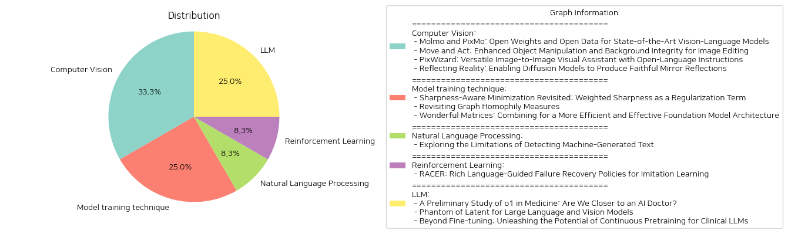

# Daily Artificial Intelligence Insights : Papers

## Computer Vision

**요약:**

**요약 보고서**

최근 컴퓨터 비전 및 인공지능 분야에서 다양한 연구들이 진행되고 있습니다. 이 보고서는 이러한 연구들을 요약하고, 주요 내용을 분석하여 향후 발전 방향을 제시하고자 합니다.

**주요 연구 내용**

1. **Molmo와 PixMo: 오픈 소스 비전-언어 모델**
Molmo는 오픈 소스 비전-언어 모델로, PixMo라는 새로운 데이터셋을 사용하여 훈련되었습니다. PixMo는 이미지 캡션, 이미지 Q&A, 2D 포인팅 데이터셋으로 구성되어 있으며, 외부 비전-언어 모델을 사용하지 않고 수집되었습니다. Molmo는 오픈 소스 모델 중에서 최고의 성능을 보여주고 있으며, 일부 대형 사유 모델을 능가하는 성능을 보여주고 있습니다.

2. **Move and Act: 개선된 객체 조작 및 배경 보존**
이 연구에서는 이미지 편집을 위한 새로운 방법을 제시합니다. 기존 방법들은 객체의 위치를 제어할 수 없고, 배경을 보존하지 못하는 문제가 있었습니다. 이 연구에서는 이러한 문제를 해결하기 위해 새로운 방법을 제시하였으며, 객체의 위치를 제어할 수 있고, 배경을 보존할 수 있는 이미지 편집 결과를 보여주고 있습니다.

3. **PixWizard: 다목적 이미지-이미지 시각적 보조기**
PixWizard는 이미지 생성, 조작, 번역을 위한 다목적 이미지-이미지 시각적 보조기입니다. 이 연구에서는 다양한 비전 작업을 하나의 통합 프레임워크로 통합하였으며, Omni Pixel-to-Pixel Instruction-Tuning Dataset을 사용하여 훈련되었습니다. PixWizard는 다양한 이미지 작업에 대해 우수한 성능을 보여주고 있으며, 새로운 작업에 대한 일반화 능력도 뛰어난 것으로 나타났습니다.

4. **Reflecting Reality: 확산 모델을 사용한鏡 반사 생성**
이 연구에서는 확산 모델을 사용하여鏡 반사를 생성하는 문제를 해결하고자 합니다. 이 연구에서는 SynMirror라는 대규모 데이터셋을 생성하였으며, MirrorFusion이라는 새로운 방법을 제시하였습니다. MirrorFusion은 입력 이미지와鏡 영역을 나타내는 마스크를 사용하여鏡 반사를 생성하며, 기존 방법보다 우수한 성능을 보여주고 있습니다.

**분석 및 결론**

이 연구들은 컴퓨터 비전 및 인공지능 분야에서 새로운 발전을 보여주고 있습니다. Molmo와 PixMo는 오픈 소스 비전-언어 모델의 가능성을 보여주고 있으며, Move and Act는 이미지 편집을 위한 새로운 방법을 제시하고 있습니다. PixWizard는 다목적 이미지-이미지 시각적 보조기를 제공하고 있으며, Reflecting Reality는 확산 모델을 사용한鏡 반사 생성을 해결하고 있습니다.

이러한 연구들은 향후 컴퓨터 비전 및 인공지능 분야에서 새로운 발전을 기대할 수 있습니다. 특히, 오픈 소스 모델의 개발과 새로운 데이터셋의 생성은 이 분야에서 새로운 가능성을 열어줄 수 있을 것입니다. 또한, 이미지 편집과鏡 반사 생성을 위한 새로운 방법은 다양한 응용 분야에서 활용될 수 있을 것입니다.

**출처:**

 - Molmo and PixMo: Open Weights and Open Data for State-of-the-Art Vision-Language Models (https://deeplearn.org/arxiv/555525/molmo-and-pixmo:-open-weights-and-open-data-for-state-of-the-art-vision-language-models)
 - Move and Act: Enhanced Object Manipulation and Background Integrity for Image Editing (https://deeplearn.org/arxiv/557925/move-and-act:-enhanced-object-manipulation-and-background-integrity-for-image-editing)
 - PixWizard: Versatile Image-to-Image Visual Assistant with Open-Language Instructions (http://arxiv.org/abs/2409.15278v2)
 - Reflecting Reality: Enabling Diffusion Models to Produce Faithful Mirror Reflections (http://arxiv.org/abs/2409.14677v1)

## Model training technique

**요약:**

**요약 보고서**

**1. 연구 주제 및 키워드**

이 보고서는 세 가지 논문에 대한 요약을 제공하며, 각 논문은 딥러닝, 그래프 이론, 및 기초 모델 아키텍처에 관한 연구를 다룹니다. 주요 키워드는 다음과 같습니다.

* 딥러닝: 일반화, 샤피니스 어웨어 미니마이제이션 (SAM), 가중 샤피니스 (WSAM)
* 그래프 이론: 호모필리, 그래프 속성, 무편향 호모필리
* 기초 모델 아키텍처: 시퀀스 변환, 상태 변환, 원더풀 매트릭스

**2. 연구 내용 및 결과**

첫 번째 논문은 샤피니스 어웨어 미니마이제이션 (SAM)을 재검토하고 가중 샤피니스 (WSAM)를 제안합니다. WSAM은 샤피니스를 정규화 항으로 통합하여 일반화 성능을 향상시킵니다. 실험 결과, WSAM은 기존의 SAM 및 그 변형보다 더 나은 일반화 성능을 보여주었습니다.

두 번째 논문은 그래프 호모필리 측정에 관한 연구를 다룹니다. 기존의 호모필리 측정 방법은 클래스 수 및 클래스 크기 균형에 따라 다르게 동작하는 문제가 있습니다. 이 논문에서는 무편향 호모필리 측정 방법을 제안하여 이러한 문제를 해결합니다. 실험 결과, 무편향 호모필리 측정 방법은 기존의 측정 방법보다 더 나은 성능을 보여주었습니다.

세 번째 논문은 기초 모델 아키텍처를 개선하기 위한 연구를 다룹니다. 이 논문에서는 시퀀스 변환 및 상태 변환을 결합하여 원더풀 매트릭스를 제안합니다. 원더풀 매트릭스는 기존의 모델 아키텍처보다 더 나은 성능을 보여주었습니다.

**3. 연구의 영향 및 향후 연구 방향**

이 연구는 딥러닝, 그래프 이론, 및 기초 모델 아키텍처에 관한 연구를 다룹니다. 이러한 연구는 기계 학습 및 인공지능 분야에 큰 영향을 미칠 수 있습니다. 향후 연구 방향으로는 WSAM 및 무편향 호모필리 측정 방법을 실제 문제에 적용하여 성능을 평가하는 것이 중요합니다. 또한, 원더풀 매트릭스를 기반으로 한 새로운 모델 아키텍처를 개발하여 성능을 향상시키는 것이 필요합니다.

**4. 결론**

이 보고서는 세 가지 논문에 대한 요약을 제공하며, 각 논문은 딥러닝, 그래프 이론, 및 기초 모델 아키텍처에 관한 연구를 다룹니다. 이러한 연구는 기계 학습 및 인공지능 분야에 큰 영향을 미칠 수 있습니다. 향후 연구 방향으로는 WSAM 및 무편향 호모필리 측정 방법을 실제 문제에 적용하여 성능을 평가하는 것이 중요합니다. 또한, 원더풀 매트릭스를 기반으로 한 새로운 모델 아키텍처를 개발하여 성능을 향상시키는 것이 필요합니다.

**출처:**

 - Sharpness-Aware Minimization Revisited: Weighted Sharpness as a Regularization Term (https://deeplearn.org/arxiv/555695/sharpness-aware-minimization-revisited:-weighted-sharpness-as-a-regularization-term)
 - Revisiting Graph Homophily Measures (https://deeplearn.org/arxiv/558497/revisiting-graph-homophily-measures)
 - Wonderful Matrices: Combining for a More Efficient and Effective Foundation Model Architecture (https://deeplearn.org/arxiv/558660/wonderful-matrices:-combining-for-a-more-efficient-and-effective-foundation-model-architecture)

## Natural Language Processing

**요약:**

**기계 생성 텍스트 탐지의 한계에 대한 연구**

최근 대규모 언어 모델의 발전으로 인해 기계 생성 텍스트를 식별하는 연구가 활발히 진행되고 있다. 이러한 연구들은 일반적으로 높은 성능의 탐지기를 제시하지만, 인간과 기계가 서로 다른 스타일과 도메인에서 텍스트를 생성할 수 있다는 점을 고려하지 않는다. 이에 본 논문에서는 다양한 쓰기 스타일의 텍스트에 대해 기계 생성 텍스트 탐지 시스템의 성능을 평가하였다.

본 연구의 결과는 다음과 같다.

*   분류기가 스타일적 변화와 텍스트 복잡성의 차이에 매우 민감하며, 일부 경우에는 무작위 분류기로 성능이 저하되는 것으로 나타났다.
*   탐지 시스템은 특히 읽기 쉬운 텍스트를 잘못 분류하는 경향이 있으며, 복잡한 텍스트에서는 높은 성능을 보이는 것으로 나타났다. 이는 탐지 시스템의 신뢰성에 대한 우려를 제기한다.
*   향후 연구에서는 인간이 작성한 텍스트와 기계가 생성한 텍스트의 스타일적 요소와 읽기 난이도 수준을 고려해야 한다.

본 연구는 기계 생성 텍스트 탐지 시스템의 한계를 밝히고, 향후 연구 방향을 제시하였다.

**출처:**

 - Exploring the Limitations of Detecting Machine-Generated Text (https://deeplearn.org/arxiv/557968/exploring-the-limitations-of-detecting-machine-generated-text)

## Reinforcement Learning

**요약:**

**요약 보고서**

**제목:** RACER: 풍부한 언어 지침을 통한 모방 학습의 실패 복구 정책

**요약:**

로봇 조작을 위한 강건하고 수정 가능한 시각-운동 정책 개발은 실패로부터의 자기 복구 메커니즘의 부족과 단순한 언어 지침의 한계로 인해 어려운 도전이다. 이러한 문제를 해결하기 위해, 우리는 전문가 데모에 실패 복구 궤적과 세부적인 언어 주석을 자동으로 추가하는 확장 가능한 데이터 생성 파이프라인을 제안한다. 그런 다음, 우리는 실패 복구 데이터와 풍부한 언어 설명을 결합하여 로봇 제어를 향상시키는 Rich languAge-guided failure reCovERy (RACER)라는 감독자-액터 프레임워크를 소개한다. RACER는 온라인 감독자로서 세부적인 언어 지침을 제공하는 비전-언어 모델(VLM)과 언어 조건부 시각-운동 정책을 액터로서 다음 행동을 예측하는 것을 특징으로 한다. 실험 결과는 RACER가 RLbench에서 다양한 평가 설정에서 상태 오프 더 아트 Robotic View Transformer (RVT)를 능가하는 것을 보여주었으며, 표준 장기 지연 작업, 동적 목표 변경 작업 및 제로샷 미시 작업을 포함하여 시뮬레이션 및 실제 환경에서 우수한 성능을 달성했다.

**주요 주제 및 키워드:**

* 로봇 조작
* 모방 학습
* 실패 복구 정책
* 풍부한 언어 지침
* 비전-언어 모델
* 언어 조건부 시각-운동 정책

**트렌드 및 패턴:**

* 로봇 조작을 위한 강건하고 수정 가능한 시각-운동 정책 개발의 중요성
* 실패로부터의 자기 복구 메커니즘의 부족과 단순한 언어 지침의 한계
* 풍부한 언어 지침을 통한 실패 복구 정책의 효과

**영향:**

* 로봇 조작을 위한 강건하고 수정 가능한 시각-운동 정책 개발
* 실패로부터의 자기 복구 메커니즘의 개선
* 로봇 제어의 향상

**결론 및 향후 개발 방향:**

* RACER는 로봇 조작을 위한 강건하고 수정 가능한 시각-운동 정책 개발에 새로운 방향을 제시한다.
* 풍부한 언어 지침을 통한 실패 복구 정책의 효과는 로봇 조작을 위한 강건하고 수정 가능한 시각-운동 정책 개발에 새로운 가능성을 열어준다.
* 향후 연구는 RACER의 확장과 응용을 위한 다양한 분야에서 진행될 수 있다.

**출처:**

 - RACER: Rich Language-Guided Failure Recovery Policies for Imitation Learning (http://arxiv.org/abs/2409.14674v1)

## LLM

**요약:**

**요약 보고서**

최근에 발표된 세 개의 논문은 인공지능(AI) 및 자연어 처리(NLP) 분야에서 새로운 발전을 보여주고 있습니다. 이 보고서는 세 개의 논문에서 추출한 주요 주제와 결과를 요약하고, 이를 통해 미래의 발전 방향을 제시합니다.

**1. 의료 분야에서 AI의 발전**

첫 번째 논문은 OpenAI의 o1 모델을 의료 분야에서 평가한 결과를 발표했습니다. o1 모델은 내부적으로 사고 체인을 사용하여 의료 분야에서 강력한 성능을 보여주었습니다. 특히, o1 모델은 의료 분야에서 이전 모델인 GPT-4보다 평균 6.2%와 6.6%의 성능 향상을 보여주었습니다. 그러나 o1 모델에도 약점이 존재하며, 이를 개선하기 위한 연구가 필요합니다.

**2. 효율적인 대형 언어 및 비전 모델**

두 번째 논문은 Phantom이라는 새로운 효율적인 대형 언어 및 비전 모델(LLVM)을 제시했습니다. Phantom 모델은 기존 모델보다 작은 크기에도 불구하고 강력한 성능을 보여주었습니다. Phantom 모델은 잠재적인 은닉 차원을 증가시켜 비전-언어 지식을 학습할 수 있습니다. Phantom 모델은 기존의 대형 모델보다 작은 크기에도 불구하고 강력한 성능을 보여주었습니다.

**3. 임상 분야에서 대형 언어 모델의 발전**

세 번째 논문은 임상 분야에서 대형 언어 모델(LLM)의 발전을 다루었습니다. 이 논문은 LLM을 임상 분야에서 사용하기 위한 네 가지 기법을 평가했습니다. 결과는 LLM의 성능을 향상시키기 위한 새로운 기법의 필요성을 보여주었습니다. 특히, NEFTune 기법은 LLM의 성능을 향상시키는 데 효과적인 것으로 나타났습니다.

**결론**

세 개의 논문은 AI 및 NLP 분야에서 새로운 발전을 보여주고 있습니다. o1 모델은 의료 분야에서 강력한 성능을 보여주었으며, Phantom 모델은 효율적인 대형 언어 및 비전 모델을 제시했습니다. 임상 분야에서 대형 언어 모델의 발전은 새로운 기법의 필요성을 보여주었습니다. 이러한 연구는 미래의 발전 방향을 제시하며, AI 및 NLP 분야의 발전을 기대할 수 있습니다.

**미래의 발전 방향**

* 의료 분야에서 AI의 발전: o1 모델의 약점을 개선하고, 의료 분야에서 AI의 적용을 확대하는 연구가 필요합니다.
* 효율적인 대형 언어 및 비전 모델: Phantom 모델의 성능을 향상시키고, 새로운 효율적인 모델을 개발하는 연구가 필요합니다.
* 임상 분야에서 대형 언어 모델의 발전: 새로운 기법을 개발하고, 임상 분야에서 대형 언어 모델의 적용을 확대하는 연구가 필요합니다.

**출처:**

 - A Preliminary Study of o1 in Medicine: Are We Closer to an AI Doctor? (http://arxiv.org/abs/2409.15277v1)
 - Phantom of Latent for Large Language and Vision Models (http://arxiv.org/abs/2409.14713v1)
 - Beyond Fine-tuning: Unleashing the Potential of Continuous Pretraining for Clinical LLMs (http://arxiv.org/abs/2409.14988v1)

