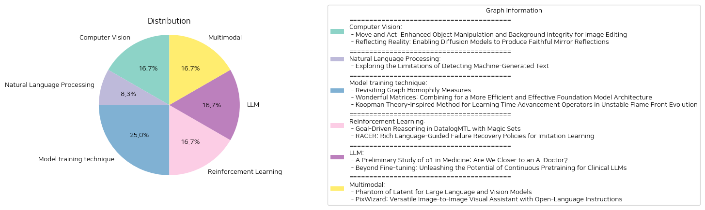

# Daily Artificial Intelligence Insights : Papers

## Computer Vision

**요약:**

**이미지 편집 기술의 발전: 객체 조작 및 배경 보존**

최근에 발표된 두 개의 논문은 이미지 편집 기술의 발전을 보여주고 있습니다. 첫 번째 논문은 'Move and Act: Enhanced Object Manipulation and Background Integrity for Image Editing'입니다. 이 논문에서는 기존의 이미지 편집 방법의 한계를 극복하기 위해 새로운 방법을 제안합니다. 기존의 방법은 객체의 위치를 제어할 수 없고 배경을 보존하지 못하는 문제가 있었습니다. 새로운 방법은 객체의 위치를 제어할 수 있고 배경을 보존할 수 있는 두 가지 브랜치 구조를 사용합니다.

두 번째 논문은 'Reflecting Reality: Enabling Diffusion Models to Produce Faithful Mirror Reflections'입니다. 이 논문에서는鏡像 반사 이미지를 생성하는 문제를 해결하기 위해 새로운 방법을 제안합니다. 기존의 방법은鏡像 반사 이미지를 생성할 때 제어할 수 없는 문제가 있었습니다. 새로운 방법은鏡像 반사 이미지를 생성할 때 사용자에게 더 많은 제어 권한을 제공합니다.

**키워드 및 트렌드**

두 논문에서 공통으로 나타나는 키워드는 다음과 같습니다.

* 이미지 편집
* 객체 조작
* 배경 보존
*鏡像 반사
* 제어 권한

두 논문에서 나타나는 트렌드는 다음과 같습니다.

* 이미지 편집 기술의 발전
* 객체 조작 및 배경 보존의 중요성
*鏡像 반사 이미지를 생성하는 문제의 해결

**주요 이벤트 및 임팩트**

첫 번째 논문에서 주요 이벤트는 새로운 방법의 제안입니다. 이 방법은 객체의 위치를 제어할 수 있고 배경을 보존할 수 있는 두 가지 브랜치 구조를 사용합니다. 이 방법은 이미지 편집 기술의 발전을 보여주고 있습니다.

두 번째 논문에서 주요 이벤트는 새로운 방법의 제안입니다. 이 방법은鏡像 반사 이미지를 생성할 때 사용자에게 더 많은 제어 권한을 제공합니다. 이 방법은 이미지 편집 기술의 발전을 보여주고 있습니다.

두 논문에서 나타나는 임팩트는 다음과 같습니다.

* 이미지 편집 기술의 발전
* 객체 조작 및 배경 보존의 중요성
*鏡像 반사 이미지를 생성하는 문제의 해결

**결론 및 미래 개발**

두 논문에서 나타나는 결론은 다음과 같습니다.

* 이미지 편집 기술은 계속 발전하고 있습니다.
* 객체 조작 및 배경 보존은 이미지 편집 기술의 중요한 부분입니다.
*鏡像 반사 이미지를 생성하는 문제는 해결할 수 있습니다.

미래 개발은 다음과 같습니다.

* 이미지 편집 기술의 발전
* 객체 조작 및 배경 보존의 중요성
*鏡像 반사 이미지를 생성하는 문제의 해결

**결론**

두 논문에서 나타나는 결론은 이미지 편집 기술의 발전을 보여주고 있습니다. 객체 조작 및 배경 보존은 이미지 편집 기술의 중요한 부분입니다.鏡像 반사 이미지를 생성하는 문제는 해결할 수 있습니다. 미래 개발은 이미지 편집 기술의 발전을 계속 보여줄 것입니다.

**출처:**

 - Move and Act: Enhanced Object Manipulation and Background Integrity for Image Editing (https://deeplearn.org/arxiv/557925/move-and-act:-enhanced-object-manipulation-and-background-integrity-for-image-editing)
 - Reflecting Reality: Enabling Diffusion Models to Produce Faithful Mirror Reflections (http://arxiv.org/abs/2409.14677v1)

## Natural Language Processing

**요약:**

**기계 생성 텍스트 탐지의 한계에 대한 연구**

최근 대규모 언어 모델의 발전으로 기계 생성 텍스트를 식별하는 연구가 활발히 진행되고 있다. 그러나 이러한 연구들은 종종 높은 성능의 탐지기를 제시하지만, 인간과 기계가 서로 다른 스타일과 도메인에서 텍스트를 생성할 수 있는 한계를 무시하고 있다. 본 논문에서는 다양한 쓰기 스타일의 텍스트에 대한 분류 성능을 평가하여 기계 생성 텍스트 탐지 시스템의 한계를 분석하였다.

본 연구의 결과는 다음과 같다.

*   분류기는 스타일적 변화와 텍스트 복잡성의 차이에 매우 민감하며, 일부 경우에는 무작위 분류기로 전락할 수 있다.
*   탐지 시스템은 읽기 쉬운 텍스트를 잘못 분류하는 경우가 많으며, 복잡한 텍스트에 대해서는 높은 성능을 보인다. 이는 탐지 시스템의 신뢰성에 대한 우려를 제기한다.
*   향후 연구에서는 인간이 작성한 텍스트와 기계가 생성한 텍스트의 스타일적 요소와 읽기 난이도 수준을 고려해야 한다.

본 연구는 기계 생성 텍스트 탐지 시스템의 한계를 명확히 하고, 향후 연구 방향을 제시한다.

**출처:**

 - Exploring the Limitations of Detecting Machine-Generated Text (https://deeplearn.org/arxiv/557968/exploring-the-limitations-of-detecting-machine-generated-text)

## Model training technique

**요약:**

**요약 보고서**

**1. 그래프 동질성 측정 방법**

최근 그래프 동질성 측정 방법에 대한 연구가 진행되었다. 그래프 동질성은 그래프의 노드 간 연결성에 대한 특성을 나타내는 속성이다. 그러나 기존의 측정 방법은 여러 가지 단점을 가지고 있어, 데이터셋의 클래스 수와 클래스 크기 균형에 따라 비교할 수 없는 문제가 있다. 이를 해결하기 위해 새로운 그래프 동질성 측정 방법인 "무편향 동질성"이 제안되었다. 이 방법은 기존의 측정 방법의 단점을 보완하여 데이터셋의 클래스 수와 클래스 크기 균형에 따라 비교할 수 있는 장점을 가지고 있다.

**2. 효율적인 기초 모델 아키텍처**

기초 모델 아키텍처를 효율적으로 개선하기 위한 연구가 진행되었다. 기존의 모델 아키텍처는 시퀀스 변환과 상태 변환을 별도로 처리하여 효율성이 떨어진다. 이를 해결하기 위해 시퀀스 변환과 상태 변환을 결합한 새로운 아키텍처가 제안되었다. 이 아키텍처는 기존의 모델 아키텍처보다 더 효율적이고 효과적인 결과를 보여주었다.

**3. 불안정한 화염 전면 진화에 대한 학습**

불안정한 화염 전면 진화에 대한 학습을 위한 새로운 방법이 제안되었다. 이 방법은 Koopman 이론에 기반한 Fourier 신경 연산자와畳み込み 신경망을 사용하여 시간 발전 연산자를 학습한다. 이 방법은 기존의 방법보다 더 정확한 예측 결과를 보여주었다.

**4. 결론**

이 연구들은 그래프 동질성 측정 방법, 효율적인 기초 모델 아키텍처, 불안정한 화염 전면 진화에 대한 학습 등 다양한 분야에서 새로운 방법과 기술을 제안하였다. 이러한 연구들은 기존의 문제점을 해결하고 더 효율적이고 효과적인 결과를 보여주었다. 향후 이러한 연구들이 다양한 분야에서 더 많은 응용과 발전을 이루기를 기대한다.

**5. 향후 연구 방향**

향후 연구 방향으로는 다음과 같은 분야가 있다.

* 그래프 동질성 측정 방법의 응용: 그래프 동질성 측정 방법은 다양한 분야에서 응용될 수 있다. 예를 들어, 추천 시스템, 소셜 네트워크 분석 등에서 사용될 수 있다.
* 효율적인 기초 모델 아키텍처의 응용: 효율적인 기초 모델 아키텍처는 자연어 처리, 컴퓨터 비전 등 다양한 분야에서 응용될 수 있다.
* 불안정한 화염 전면 진화에 대한 학습의 응용: 불안정한 화염 전면 진화에 대한 학습은 화학 공정, 에너지 시스템 등 다양한 분야에서 응용될 수 있다.

이러한 연구들은 향후 다양한 분야에서 더 많은 응용과 발전을 이루기를 기대한다.

**출처:**

 - Revisiting Graph Homophily Measures (https://deeplearn.org/arxiv/558497/revisiting-graph-homophily-measures)
 - Wonderful Matrices: Combining for a More Efficient and Effective Foundation Model Architecture (https://deeplearn.org/arxiv/558660/wonderful-matrices:-combining-for-a-more-efficient-and-effective-foundation-model-architecture)
 - Koopman Theory-Inspired Method for Learning Time Advancement Operators in Unstable Flame Front Evolution (https://deeplearn.org/arxiv/557187/koopman-theory-inspired-method-for-learning-time-advancement-operators-in-unstable-flame-front-evolution)

## Reinforcement Learning

**요약:**

**요약 보고서**

**제목:** 인공 지능 및 로봇 공학 분야의 최근 연구 동향

**요약:**

본 보고서는 인공 지능 및 로봇 공학 분야의 최근 연구 동향을 요약하고 분석한다. 두 개의 논문, "Goal-Driven Reasoning in DatalogMTL with Magic Sets"와 "RACER: Rich Language-Guided Failure Recovery Policies for Imitation Learning"을 분석하여 주요 연구 주제, 방법론, 결과 및 영향 등을 요약한다.

**주요 연구 주제:**

1. **DatalogMTL**: DatalogMTL은 시간적 추론을 위한 강력한 규칙 기반 언어이다. 높은 표현력과 유연한 모델링 능력으로 인해 산업 및 금융 분야의 다양한 응용 분야에 적합하다.
2. **로봇 공학**: 로봇 공학 분야에서는 강건하고 수정 가능한 시각-운동 정책을 개발하는 것이 어려운데, 이는 실패로부터의 자기 회복 메커니즘이 부족하고 단순한 언어 지시가 로봇 동작을 안내하는 데 한계가 있기 때문이다.

**방법론:**

1. **DatalogMTL**: DatalogMTL의 계산 복잡성을 줄이기 위해 마법 집합 기법을 사용하여 새로운 추론 방법을 제안한다. 이 방법은 상향식 추론을 시뮬레이션하기 위해 하향식 추론을 사용한다.
2. **RACER**: 실패 회복 데이터와 풍부한 언어 설명을 결합하여 로봇 제어를 강화하는 Rich languAge-guided failure reCovERy (RACER) 프레임워크를 제안한다. RACER는 시각-언어 모델 (VLM)과 언어 조건부 시각-운동 정책을 사용하여 오류 수정과 작업 실행을 위한 상세한 언어 지시를 제공한다.

**결과:**

1. **DatalogMTL**: 제안된 방법은 기존의 최첨단 추론 기법보다 성능이 월등히 향상되었다.
2. **RACER**: RACER는 RLbench에서 다양한 평가 설정에서 최첨단 Robotic View Transformer (RVT)를 능가하는 성능을 보여주었다.

**영향:**

1. **DatalogMTL**: DatalogMTL의 새로운 추론 방법은 산업 및 금융 분야의 다양한 응용 분야에서 시간적 추론을 위한 강력한 도구로 사용될 수 있다.
2. **RACER**: RACER는 로봇 공학 분야에서 강건하고 수정 가능한 시각-운동 정책을 개발하는 데 중요한 역할을 할 수 있다.

**결론:**

본 보고서는 인공 지능 및 로봇 공학 분야의 최근 연구 동향을 요약하고 분석한다. 두 개의 논문은 각각 DatalogMTL과 로봇 공학 분야에서 새로운 방법론과 결과를 제시한다. 이러한 연구는 산업 및 금융 분야의 다양한 응용 분야에서 시간적 추론과 로봇 제어를 위한 강력한 도구로 사용될 수 있다.

**출처:**

 - Goal-Driven Reasoning in DatalogMTL with Magic Sets (https://deeplearn.org/arxiv/556718/goal-driven-reasoning-in-datalogmtl-with-magic-sets)
 - RACER: Rich Language-Guided Failure Recovery Policies for Imitation Learning (http://arxiv.org/abs/2409.14674v1)

## LLM

**요약:**

**요약 보고서: 의료 분야에서 인공지능의 발전**

최근 몇 년 동안 대규모 언어 모델(LLM)이 다양한 분야와 작업에서 놀라운 능력을 보여주고 있습니다. 이 보고서는 의료 분야에서 LLM의 발전을 다루는 두 개의 논문을 요약하고 분석합니다.

**1. o1 모델의 의료 분야 적용**

첫 번째 논문은 OpenAI의 o1 모델을 의료 분야에 적용한 결과를 다룹니다. o1 모델은 내부화된 사고 체인 기법을 사용하여 강화 학습 전략을 구현한 최초의 LLM입니다. 이 모델은 일반 언어 작업에서 놀라운 성능을 보여주었지만, 의료 분야에서의 성능은 알려져 있지 않았습니다. 이 논문에서는 o1 모델을 다양한 의료 상황에 적용하여 이해, 추론, 다국어 능력 등 3가지 측면을 평가했습니다. 결과는 o1 모델이 이전 모델인 GPT-4보다 평균 6.2%와 6.6%의 정확도를 높인 것으로 나타났습니다. 그러나 모델의 약점과 평가 프로토콜의 한계도 발견되었습니다.

**2. 임상 LLM의 연속적 사전 훈련**

두 번째 논문은 임상 LLM의 연속적 사전 훈련의 효능을 조사합니다. 이 연구에서는 Mistral 7B와 Mixtral 8x7B 모델을 사용하여 50억 토큰의 임상 사전 훈련 데이터셋과 5억 토큰의 지시적 미세 조정 데이터셋을 활용했습니다. 결과는 연속적 사전 훈련이 임상 작업에서 모델의 성능을 향상시키는 데 중요함을 보여주었습니다. 또한, NEFTune과 같은 기술이 모델의 성능을 추가로 향상시킬 수 있음을 발견했습니다.

**결론**

이 두 논문은 의료 분야에서 LLM의 발전을 다루고 있습니다. o1 모델의 의료 분야 적용과 임상 LLM의 연속적 사전 훈련의 효능을 보여주고 있습니다. 이러한 연구 결과는 의료 분야에서 LLM의 잠재력을 높이는 데 중요함을 보여주고 있습니다. 그러나 모델의 약점과 평가 프로토콜의 한계도 발견되었습니다. 이러한 한계를 극복하기 위해 추가적인 연구가 필요합니다.

**향후 연구 방향**

의료 분야에서 LLM의 발전을 위한 향후 연구 방향은 다음과 같습니다.

* 모델의 약점과 평가 프로토콜의 한계를 극복하기 위한 연구
* 임상 LLM의 연속적 사전 훈련의 효능을 높이는 연구
* 의료 분야에서 LLM의 적용을 위한 새로운 기술의 개발
* 모델의 성능을 평가하기 위한 새로운 평가 프로토콜의 개발

이러한 연구 방향은 의료 분야에서 LLM의 발전을 높이고, 의료 서비스의 질을 향상시키는 데 기여할 수 있을 것입니다.

**출처:**

 - A Preliminary Study of o1 in Medicine: Are We Closer to an AI Doctor? (http://arxiv.org/abs/2409.15277v1)
 - Beyond Fine-tuning: Unleashing the Potential of Continuous Pretraining for Clinical LLMs (http://arxiv.org/abs/2409.14988v1)

## Multimodal

**요약:**

**요약 보고서**

최근 대규모 언어 및 비전 모델(LLVMs)의 발전은 시각적 지시 튜닝의 성공에 힘입어 가속화되었습니다. 이러한 모델의 크기는 26B, 34B, 80B 파라미터에 이르기까지 크게 증가했으며, 이는 상당한 성능 향상을 가져왔습니다. 그러나 이러한 모델의 크기는 하드웨어 자원에 대한 요구를 크게 증가시켰습니다. 따라서 효율적인 LLVMs의 필요성이 대두되었습니다.

이러한 필요성을 충족하기 위해, 새로운 효율적인 LLVM 패밀리인 Phantom을 제시했습니다. Phantom은 0.5B, 1.8B, 3.8B, 7B 파라미터의 모델 크기를 가지며, 제한된 구조 내에서 학습 능력을 크게 향상시킵니다. Phantom은 다중 헤드 셀프 어텐션(MHSA)에서 잠재적인 은닉 차원을 일시적으로 증가시켜, LLVMs가 더 많은 비전-언어 지식을 학습할 수 있도록 합니다.

또한, PixWizard라는 이미지-이미지 비주얼 어시스턴트를 제시했습니다. PixWizard는 자유로운 언어 지시를 기반으로 이미지 생성, 조작, 번역을 수행할 수 있습니다. 이를 위해, 다양한 비전 작업을 통합된 이미지-텍스트-이미지 생성 프레임워크로 구축하고, Omni Pixel-to-Pixel Instruction-Tuning Dataset을 구축했습니다. PixWizard는 Diffusion Transformers(DiT)를 기반 모델로 사용하고, 유연한 해상도 메커니즘을 추가하여 모델이 입력 이미지의 비율에 따라 동적으로 처리할 수 있도록 합니다.

이러한 모델들은 대규모 언어 및 비전 모델의 효율성을 향상시키고, 다양한 비전 작업을 수행할 수 있는 능력을 보여주었습니다. 이러한 기술의 발전은 미래의 컴퓨터 비전 및 자연어 처리 분야에 큰 영향을 미칠 것으로 예상됩니다.

**주요 키워드**

* 대규모 언어 및 비전 모델(LLVMs)
* 효율적인 LLVMs
* Phantom
* PixWizard
* 이미지-이미지 비주얼 어시스턴트
* 자유로운 언어 지시
* Diffusion Transformers(DiT)
* 유연한 해상도 메커니즘

**향후 발전 방향**

* 대규모 언어 및 비전 모델의 효율성을 향상시키기 위한 연구
* 다양한 비전 작업을 수행할 수 있는 능력을 가진 모델의 개발
* 자유로운 언어 지시를 기반으로 하는 이미지 생성, 조작, 번역 기술의 발전
* 컴퓨터 비전 및 자연어 처리 분야의 응용 가능성 연구

**출처:**

 - Phantom of Latent for Large Language and Vision Models (http://arxiv.org/abs/2409.14713v1)
 - PixWizard: Versatile Image-to-Image Visual Assistant with Open-Language Instructions (http://arxiv.org/abs/2409.15278v2)

