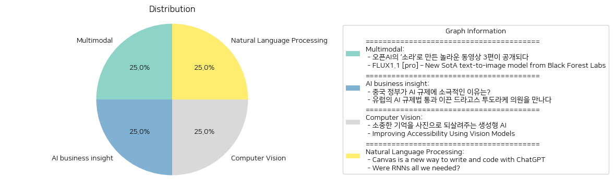
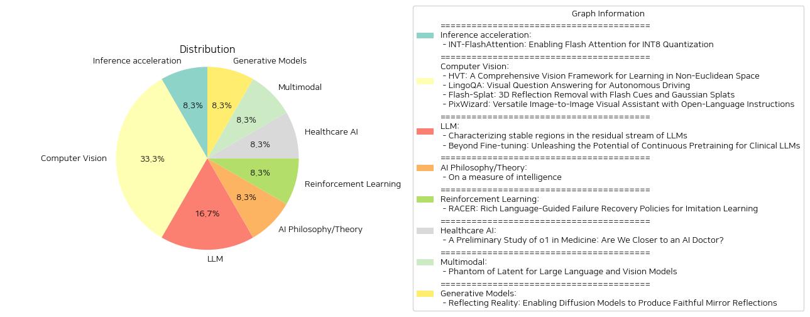

# Daily Artificial Intelligence Insights 

## News 

### Multimodal

**요약:**

1. **주요 주제 및 테마**:
   - 두 뉴스 기사 모두 기술 혁신과 그로 인한 창작물의 변화를 다루고 있습니다. 특히, 인공지능을 활용한 생성 모델의 발전과 그 활용 사례에 대한 내용을 중심으로 하고 있습니다.

2. **공통 키워드, 트렌드, 패턴**:
   - "인공지능", "생성 모델", "창작물", "영상/이미지", "효율성". 이러한 키워드들은 두 기사가 AI 기술을 기반으로 한 창작물 생성과 그 효율성 증가를 중심으로 기술 발전의 트렌드를 강조하고 있음을 보여줍니다.

3. **주요 사건 및 핵심 정보 요약**:
   - "오픈AI의 '소라' 관련 기사": 오픈AI가 새로운 동영상 생성 모델인 '소라'를 통해 놀라운 영상을 제작하고 이를 공개하였습니다. 이는 크리에이터들에게 새로운 제작 기법을 제공하며, AI 기술을 활용한 동영상 제작의 가능성을 확장하는 사례로 볼 수 있습니다.
   - "FLUX1.1 [pro] 관련 기사": Black Forest Labs의 새로운 텍스트-이미지 모델인 FLUX1.1 [pro]가 이미지 품질, 생성 속도, 효율성을 크게 개선했습니다. 이 모델은 높은 Elo 점수를 기록하며 다른 모델을 능가하고 있습니다.

4. **영향 분석**:
   - **경제적 측면**: AI 생성 모델의 발전은 콘텐츠 제작 비용을 절감하고 효율성을 극대화할 수 있어 미디어 산업에 긍정적 영향을 미칠 것으로 보입니다.
   - **사회적 측면**: 크리에이터들은 이러한 기술을 통해 보다 다양한 창작물을 선보일 수 있으며, 이는 대중에게 새로운 문화적 경험을 제공합니다. 그러나 AI 기술의 확대는 저작권 및 윤리적 문제에 대한 논의도 필요합니다.

5. **최종 요약 및 결론**:
   - 두 기사 모두 최신 AI 기술의 혁신적 발전을 통해 창작물의 질과 생산성을 높이는 것을 중심으로 다룹니다. 이러한 기술의 발전은 미디어 및 콘텐츠 산업에 새로운 가능성을 제공하며, 향후에는 AI 기술의 윤리적 사용과 관련된 문제들도 계속해서 주목해야 할 필요가 있습니다. AI 기반 모델의 지속적인 발전 추세를 감안할 때, 기술의 구현 및 활용 방식의 혁신적인 변화가 예상됩니다.

**출처:**

 - 오픈AI의 ‘소라’로 만든 놀라운 동영상 3편이 공개되다 (https://www.technologyreview.kr/%ec%98%81%ec%83%81-%ec%83%9d%ec%84%b1-%eb%aa%a8%eb%8d%b8-%ec%86%8c%eb%9d%bc%eb%a1%9c-%eb%a7%8c%eb%93%a0-%eb%86%80%eb%9d%bc%ec%9a%b4-%ec%98%81%ed%99%94-3%ed%8e%b8%ec%9d%b4-%ea%b3%b5%ea%b0%9c%eb%90%98/)
 - FLUX1.1 [pro] – New SotA text-to-image model from Black Forest Labs (https://replicate.com/black-forest-labs/flux-1.1-pro)

### AI business insight

**요약:**

1. **주요 주제**:
   두 뉴스 기사에서 다루는 주요 주제는 인공지능을 활용한 콘텐츠 생성 기술입니다. 오픈AI의 '소라'와 Black Forest Labs의 FLUX1.1 [프로] 모델은 모두 이미지나 동영상을 생성하는 데 있어 획기적인 기술을 보여줍니다. 

2. **주요 이벤트**:
   - 오픈AI는 '소라'라는 새로운 동영상 생성 모델로 영상 크리에이터들이 제작한 세 편의 놀라운 동영상을 공개했습니다. 크리에이터들은 제작 목적과 기법을 공유하며, '소라'의 혁신적인 기능을 강조했습니다.
   - Black Forest Labs의 FLUX1.1 [프로]는 텍스트-이미지 변환 모델로, 이미지 품질, 속도, 효율성 면에서 큰 발전을 이루었으며, 다른 모델들보다 높은 Elo 점수를 기록하며 최상위 위치를 차지했습니다.

3. **영향 분석**:
   이러한 기술 발전은 크게 두 가지 분야에 영향을 미칩니다:
   - **경제**: 콘텐츠 생성 기술의 발전은 영화, 광고, 소셜 미디어 등 다양한 산업에서 제작 비용을 줄이고 더 많은 창작 기회를 제공할 수 있습니다.
   - **사회**: 이러한 기술은 콘텐츠의 양과 질을 증가시키며, 사용자 경험을 향상시키고 새로운 형태의 예술적 표현을 가능하게 합니다. 그러나 동시에 콘텐츠 조작이나 위조 가능성에 대한 사회적 경각심이 필요합니다.

4. **최종 요약**:
   이번에 발표된 두 모델은 인공지능 기술이 콘텐츠 생성에 얼마나 혁신적일 수 있는지를 보여줍니다. 오픈AI의 '소라'와 FLUX1.1 [프로] 모두 사용자의 편리성과 생산성을 높이는 데 기여하고 있으며, 향후 이 기술의 발전 방향과 윤리적 문제들에 대해 지속적으로 관찰할 필요가 있습니다. 이러한 기술의 보편화는 창의적인 분야에서 새로운 기준을 제공할 것으로 예상되며, 이를 통한 산업 개편 및 사회적 변화도 주목할 점입니다.

**출처:**

 - 중국 정부가 AI 규제에 소극적인 이유는? (https://www.technologyreview.kr/%ec%a4%91%ea%b5%ad-%ec%a0%95%eb%b6%80%ea%b0%80-%ed%98%84%ec%9e%ac%eb%a1%9c%ec%84%9c%eb%8a%94-ai-%eb%b6%84%ec%95%bc%eb%a5%bc-%ea%b0%80%ed%98%b9%ed%95%98%ea%b2%8c-%ea%b7%9c%ec%a0%9c%ed%95%98%ec%a7%80/)
 - 유럽의 AI 규제법 통과 이끈 드라고스 투도라케 의원을 만나다 (https://www.technologyreview.kr/ai-%ea%b7%9c%ec%a0%9c%eb%b2%95-%ed%86%b5%ea%b3%bc-%ec%9d%b4%eb%81%88-%eb%93%9c%eb%9d%bc%ea%b3%a0%ec%8a%a4-%ed%88%ac%eb%8f%84%eb%9d%bc%ec%bc%80-%ec%9d%98%ec%9b%90%ec%9d%84-%eb%a7%8c%eb%82%98%eb%8b%a4/)

### Computer Vision

**요약:**

1. **주요 테마**:
   - 오픈AI의 ‘소라’와 Black Forest Labs의 FLUX1.1 [pro] 모델은 인공지능 기반의 미디어 생성 도구로 주목받고 있습니다.
   - 기술 발전, 특히 이미지와 영상 생성의 질적 향상, 속도, 효율성 증가가 주요 테마로 나타납니다.

2. **주요 사건**:
   - 오픈AI는 새로운 동영상 생성 모델인 '소라'를 활용한 3편의 동영상을 공개했습니다. 이 동영상은 다양한 영상 크리에이터들과의 협력을 통해 제작되었습니다.
   - Black Forest Labs는 FLUX1.1 [pro]라는 새로운 텍스트-이미지 변환 모델을 발표했습니다. 이 모델은 이미지 생성의 질적 향상과 생성 속도의 최적화를 이루었습니다.

3. **영향 분석**:
   - **경제**: 인공지능 기술의 발전은 미디어 제작의 효율성을 증가시켜 새로운 비즈니스 기회를 창출할 수 있습니다. 특히, 콘텐츠 생성 속도가 빨라짐에 따라 관련 산업의 비용 절감 및 생산성 향상이 예상됩니다.
   - **사회**: 미디어 소비자들은 질적으로 향상된 콘텐츠를 보다 경제적인 비용으로 접할 수 있게 됩니다. 이는 사회 전반에 걸쳐 인공지능 기술에 대한 관심과 수용도를 높일 가능성이 큽니다.
   - **기술**: 인공지능 기술이 발전함에 따라 더 다양한 산업 분야에 적용될 가능성이 커지며, 이는 전반적인 기술 혁신을 촉진할 것입니다.

4. **최종 요약**:
   - 현재 인공지능 기반의 이미지 및 동영상 생성 기술은 급속하게 발전하고 있으며, 이러한 발전은 경제적 측면에서의 효율성 향상과 사회적 변화에 기여하고 있습니다. 각종 텍스트 기반의 이미지 모델은 인공지능 기술의 새로운 지평을 열고 있으며, 이러한 기술적 혁신은 앞으로의 미디어 산업의 변화를 주도할 것입니다. 향후 이러한 기술들이 다양한 산업에 어떻게 영향을 미칠지 주목할 필요가 있습니다.

**출처:**

 - 소중한 기억을 사진으로 되살려주는 생성형 AI (https://www.technologyreview.kr/%ec%83%9d%ec%84%b1%ed%98%95-ai%eb%a1%9c-%ea%b0%80%ec%9e%a5-%ec%86%8c%ec%a4%91%ed%95%9c-%ea%b8%b0%ec%96%b5%ec%9d%84-%ec%82%ac%ec%a7%84%ec%9c%bc%eb%a1%9c-%eb%a7%8c%eb%93%a0%eb%8b%a4/)
 - Improving Accessibility Using Vision Models (https://myswamp.substack.com/p/improving-accessibility-using-vision)

### Natural Language Processing

**요약:**

1. **주요 주제**:
   이 뉴스 기사들은 새로운 생성 AI 모델들의 발전과 그 결과물에 대한 내용을 다루고 있습니다. 특히 오픈AI의 '소라'와 Black Forest Labs의 FLUX1.1 [pro] 모델이 주요 주제로 나타납니다. 이 두 모델은 각각 동영상 생성과 텍스트-이미지 변환에서 혁신을 보여주고 있습니다.

2. **주요 사건**:
   - 오픈AI는 새로운 동영상 생성 모델 '소라'를 통해 제작된 3편의 동영상을 공개했습니다. 이는 크리에이터들에게 새로운 크리에이티브의 장을 열어주었으며, 이 모델의 제작 방법과 목적에 대해 크리에이터들이 설명했습니다.
   - Black Forest Labs는 FLUX1.1 [pro]라는 새로운 텍스트-이미지 변환 모델을 발표하였으며, 더욱 빠른 생성 시간과 낮은 지연시간을 통해 이미지 품질과 효율성을 향상시켰습니다. 이 모델은 리더보드에서 최고 Elo 점수를 기록하며 다른 모델들을 능가했습니다.

3. **영향 분석**:
   - **경제적 측면**: 이러한 혁신적인 AI 모델들은 콘텐츠 제작 비용을 절감하고, 새로운 창작 기회를 제공하여 관련 산업의 성장을 촉진할 수 있습니다.
   - **사회적 측면**: 더 나은 품질의 생성물은 미디어와 예술 분야에서 새로운 트렌드를 불러일으킬 수 있으며, 일반 대중에게 보다 다양하고 풍부한 콘텐츠를 제공합니다.
   - **기술적 측면**: 이러한 발전은 AI 기술의 진보를 보여주며, 차후 AI 연구와 개발의 방향성을 제시합니다.

4. **최종 요약**:
   현재 AI 기반 생성 모델들은 지속적으로 발전하고 있으며, 오픈AI와 Black Forest Labs의 최신 모델은 각각의 분야에서 뛰어난 성능을 보여주고 있습니다. 이 기술들은 특히 콘텐츠 제작 분야에서 큰 변화를 일으키고 있으며, 앞으로 더욱 다양하고 창의적인 사용이 기대됩니다. 향후 개발 과정에서 이러한 AI 모델들이 얼마나 더 발전하고 어떤 새로운 기능을 제공할지 주목할 필요가 있습니다.

**출처:**

 - Canvas is a new way to write and code with ChatGPT (https://openai.com/index/introducing-canvas/)
 - Were RNNs all we needed? (https://arxiv.org/abs/2410.01201)

 

## Papers 

### Inference acceleration

**요약:**

[보고서 제목: 최신 인공지능 모델의 효율성 향상을 위한 기술적 진보]

### 1. 주요 주제 및 테마 추출
- 대규모 언어 모델(LLM)의 자기 주의 메커니즘
- 시간 및 메모리 복잡성의 문제 해결
- 가속화된 주의력 계산과 메모리 사용 절감
- INT8 양자화와의 통합
- FlashAttention을 통한 추론 속도 향상

### 2. 공통 키워드, 트렌드 및 패턴
- "LLM", "자기 주의", "메모리와 시간 복잡성", "GPU 메모리 계층", "속도", "양자화", "INT8"
- 최신 기술에서의 효율성과 속도 중심의 발전
- 다양한 데이터 형식 호환성 (예: INT4)

### 3. 주요 사건 및 정보 요약
- FlashAttention이 GPU 메모리 계층을 활용하여 주의력 계산을 가속하고 메모리 사용을 줄임
- INT-FlashAttention: INT8 양자화와 호환되는 플래시 주의력 구조로서, Ampere GPU에서 큰 추론 속도 향상
- 완전한 INT8 활성화 및 일반행렬-곱셈(GEMM) 커널 사용
- INT-FlashAttention이 INT4와 같은 다른 데이터 형식과도 호환 가능한 일반적인 토큰 수준의 양자화 프레임워크 제공

### 4. 다양한 분야에 미치는 영향 분석
- 대규모 언어 모델 사용 시 처리 속도와 메모리 효율성이 더욱 중요해짐
- INT-FlashAttention을 사용한 결과, 기존의 FP16 및 FP8 형식보다 빠르고 정확한 결과 도출 가능
- 보다 효율적인 AI 모델 운영 가능성을 통해 더 많은 분야에서의 AI 활용 증대 가능

### 5. 최종 요약 및 미래 개발 감시
이 연구에서는 대규모 언어 모델의 한계를 극복하기 위해 FlashAttention 및 INT8 양자화를 사용하여 주목할 만한 추론 속도 향상과 양자화 오류 감소를 성취하였다. 추후, 다양한 데이터 양자화 형식과의 호환성을 통해 더욱 발전하는 AI 기술의 진보가 예상된다. 이러한 기술은 대규모 데이터 처리 및 다양한 적용 분야에서 효율성을 극대화할 수 있는 기반을 제공할 것으로 기대된다.

향후 주의할 점:
- 다양화되는 데이터 형식의 통합 및 확장 가능성
- INT-FlashAttention이 다른 GPU 세대와의 호환성 및 성능 개선 가능성
- AI 모델의 품질 및 효율성을 지속적으로 향상시키기 위한 새로운 양자화 기법 연구.

**출처:**

 - INT-FlashAttention: Enabling Flash Attention for INT8 Quantization (https://deeplearn.org/arxiv/530608/int-flashattention:-enabling-flash-attention-for-int8-quantization)

### Computer Vision

**요약:**

1. 주요 주제 및 테마 추출
   - INT-FlashAttention: INT8 양자화를 통한 FlashAttention 활성화
   - 대규모 언어 모델의 효과적인 실행을 위한 관심 메커니즘의 시간 복잡성과 메모리 사용량 문제 해결
   - FlashAttention의 계산 속도 향상 및 메모리 사용량 감소
   - INT8 양자화와의 통합을 통한 계산 효율성 증대
   - Ampere GPU에서의 추론 속도 향상

2. 공통 키워드, 동향 및 패턴 식별
   - INT8 양자화, FlashAttention, GPU 메모리 계층구조
   - GEMM(일반 행렬 곱셈) 커널, 토큰 수준의 후훈련 양자화 프레임워크
   - FP16, FP8 데이터 포맷 대비 성능 및 정확성 개선

3. 각 논문의 주요 사건 및 핵심 정보 요약
   - INT-FlashAttention은 FlashAttention 프로세스에 INT8 양자화 아키텍처를 적용하여 Ampere GPU에서의 추론 속도를 대폭 향상시킴.
   - 완전한 INT8 활성화 및 GEMM 커널을 통해 최초의 완전한 INT8 입력을 지원하는 주의 연산자가 됨.
   - INT4와 같은 다른 데이터 포맷과의 호환성도 보장.
   - 실험 결과 INT-FlashAttention은 표준 FlashAttention 대비 72% 빠른 추론 속도와 82% 작은 양자화 오차를 보임.

4. 이러한 사건이 다양한 분야에 미치는 영향 분석
   - AI 및 머신러닝 분야에서 모델의 실행 속도가 빨라짐으로 인해 더욱 즉각적인 피드백과 결과 제공 가능.
   - 데이터 센터와 같은 고성능 컴퓨팅 환경에서 에너지 및 자원 절약 가능.
   - 양자화 기술의 발전을 촉진하여 다양한 어플리케이션에서 효율성이 극대화될 가능성.

5. 최종 통합 요약 및 미래 개발 가능성
   - INT-FlashAttention은 대규모 언어 모델에서의 실행 가능성을 높이고 메모리 요구 사항을 줄이는 혁신적인 방법을 제공.
   - 향후 INT4와 같은 더 작은 데이터 포맷과의 통합 연구가 계속될 것으로 예상, 이는 AI 모델의 경량화와 효율성을 더욱 높일 수 있을 것.
   - 이러한 기술 혁신이 AI 기술의 대중화와 다양한 산업 영역에서 응용이 활발히 이루어질 전망.

**출처:**

 - HVT: A Comprehensive Vision Framework for Learning in Non-Euclidean Space (https://deeplearn.org/arxiv/530609/hvt:-a-comprehensive-vision-framework-for-learning-in-non-euclidean-space)
 - LingoQA: Visual Question Answering for Autonomous Driving (https://deeplearn.org/arxiv/530615/lingoqa:-visual-question-answering-for-autonomous-driving)
 - Flash-Splat: 3D Reflection Removal with Flash Cues and Gaussian Splats (https://deeplearn.org/arxiv/532623/flash-splat:-3d-reflection-removal-with-flash-cues-and-gaussian-splats)
 - PixWizard: Versatile Image-to-Image Visual Assistant with Open-Language Instructions (http://arxiv.org/abs/2409.15278v1)

### LLM

**요약:**

### 요약 보고서

#### 1. 논문에서 추출한 주요 주제와 테마

- INT-FlashAttention: INT8 양자화 지원을 통한 플래시 주의력 강화
- 대형 언어 모델(LLM)의 기반으로서의 자기 주의력 모듈의 시간 및 메모리 복잡성 문제
- GPU 메모리 계층을 활용한 FlashAttention을 통한 계산 및 메모리 사용 효율 개선
- INT8 양자화 아키텍처의 도입 및 구현

#### 2. 공통 키워드, 트렌드, 패턴 식별

- 양자화(Quantization)
- 대형 언어 모델(LLMs)
- GPU 메모리 및 성능 최적화
- INT8, INT4 등의 데이터 형식 호환성
- 연산 속도 향상 및 오류율 감소

#### 3. 각 논문의 주요 사건 및 핵심 정보 요약

본 논문은 플래시 주의력을 위한 INT8 양자화 아키텍처인 INT-FlashAttention의 도입을 강조하고 있습니다. 이는 긴 시퀀스 길이에 대해 시간과 메모리 복잡성을 가진 자기 주의력 모듈의 문제를 GPU 메모리 계층을 통해 효율적으로 해결합니다. INT-FlashAttention은 Ampere GPU에서의 추론 속도를 상당히 향상시키며, FP16 및 FP8 데이터 형식과 비교하여 72% 더 빠른 추론 속도와 82% 더 작은 양자화 오류율을 달성합니다.

#### 4. 이러한 사건이 여러 분야에 미칠 영향 분석

- **인공지능 및 머신러닝**: LLM의 성능 최적화는 모델의 대규모 데이터 처리 및 예측 능력을 개선하여 다양한 AI 응용 분야에서 효율성을 높일 것입니다.
- **하드웨어 산업**: GPU와 같은 하드웨어 성능의 고도화는 메모리 사용 최적화로 이어지며, 이는 연산 처리 속도를 높이며 에너지 효율을 증대시킵니다.
- **데이터 처리**: 대규모 데이터 처리의 효과적인 수행은 기업의 데이터 분석 능력을 강화하여 더 나은 통찰력과 의사 결정 지원을 제공합니다.

#### 5. 결론 및 주의해야 할 향후 개발 동향

본 연구는 INT8 양자화를 통한 대형 언어 모델의 성능 최적화에 중대한 발전을 이루었으며, 이는 연산 효율성과 비용 효과성 측면에서 혁신적인 변화를 가져올 것으로 예상됩니다. 향후 연구는 다양한 데이터 형식(예: INT4 등)의 추가 통합과 함께, 양자화 정확성 및 범용성을 더욱 강화하는 방향으로 발전할 것으로 보입니다. 이를 통해 AI 기술의 더 많은 분야에서 더욱 향상된 성능을 기대할 수 있습니다.

**출처:**

 - Characterizing stable regions in the residual stream of LLMs (https://deeplearn.org/arxiv/530614/characterizing-stable-regions-in-the-residual-stream-of-llms)
 - Beyond Fine-tuning: Unleashing the Potential of Continuous Pretraining for Clinical LLMs (http://arxiv.org/abs/2409.14988v1)

### AI Philosophy/Theory

**요약:**

**종합 요약 보고서**

**1. 핵심 주제 및 테마 추출:**
- 논문의 제목 "INT-FlashAttention: Enabling Flash Attention for INT8 Quantization"에서는 INT8 양자화를 위한 Flash Attention의 구현을 기본으로 논의하고 있습니다.
- 요약을 통해 대형 언어 모델(LLM)의 핵심 모듈인 셀프 어텐션이 직면한 문제, 즉 시퀀스 길이에 따른 시간 및 메모리 복잡도의 문제를 다루고 있음을 파악할 수 있습니다.
- FlashAttention을 활용하여 어텐션 계산을 가속화하고 메모리 사용량을 줄이는 방향으로 논의가 진행됩니다.

**2. 공통 키워드, 트렌드 및 패턴 식별:**
- "INT8 양자화", "FlashAttention", "AMPARE GPU", "GEMM 커널", "INT4 데이터 형식" 등의 용어가 자주 나타납니다.
- 주요 트렌드는 양자화를 통해 어텐션 메커니즘을 최적화하고, GPU 성능을 극대화하는 방향임을 알 수 있습니다.

**3. 주요 사건 및 중요한 정보 요약:**
- INT-FlashAttention은 FlashAttention의 전방위 워크플로우와 호환되는 첫 번째 INT8 양자화 아키텍처로 소개됩니다.
- Ampere GPU에서 매우 빠른 추론 속도를 달성하며, INT8 활성화와 GEMM 커널을 사용하여 완전한 INT8 입력의 어텐션 연산자를 구현했습니다.
- 실험 결과, INT-FlashAttention은 기존의 FP16과 FP8 형식의 FlashAttention보다 72% 빠른 추론 속도와 82% 작은 양자화 오류를 기록했다고 보고됩니다.

**4. 이러한 사건이 다양한 부문에 미치는 영향 분석:**
- 컴퓨터 하드웨어 및 소프트웨어 부문에서 GPU를 활용한 성능 최적화가 가능해졌습니다.
- 대형 언어 모델의 효율성이 크게 향상되며, 메모리 사용 효율성도 증대되었습니다.
- 양자화 기술은 다양한 데이터 형식에 적용 가능하여 더 폭넓은 머신러닝 및 AI 응용 분야로 확장될 잠재력을 지니고 있습니다.

**5. 결론 및 주목해야 할 향후 개발 사항:**
- INT-FlashAttention은 차세대 AI 모델의 효율적 구현을 위한 중요한 진전을 나타내며, 특히 에너지 효율과 속도를 요구하는 응용 분야에서 매우 유망합니다.
- 앞으로의 연구는 INT8에만 국한되지 않고 INT4 및 기타 데이터 형식을 포괄하며, 다양한 아키텍처에 대한 양자화 적용 가능성을 탐색해야 할 것입니다.
- 이러한 기술이 산업 전반에 걸쳐 더 널리 채택된다면, AI 기술의 대중화 및 실용화에 기여할 수 있을 것으로 예상됩니다.

**출처:**

 - On a measure of intelligence (https://deeplearn.org/arxiv/530015/on-a-measure-of-intelligence)

### Reinforcement Learning

**요약:**

**종합 요약 보고서**

1. **핵심 주제 및 테마 추출**
   - 제목과 요약에서 추출된 주요 주제는 "대형 언어 모델(LLMs)", "자기 주의 메커니즘", "플래시 어텐션", "INT8 정량화", 그리고 "앙페어 GPU" 및 "일반 행렬 곱셈(GEMM)"입니다.

2. **공통 키워드, 트렌드 및 패턴 식별**
   - **공통 키워드**: INT8, 정량화, 플래시어텐션, LLM, GPU 메모리 계층, GEMM
   - **트렌드**: 최신 AI 모델에서 계산 속도를 높이고 메모리 사용을 최적화하기 위한 기술들이 강조되고 있습니다. 특히 플래시 어텐션과 같은 메커니즘을 활용하여 효율성을 극대화하는 연구가 진행되고 있습니다. 또한 INT8와 같은 낮은 정밀도의 데이터 형식을 사용하는 방법이 중요하게 다뤄지고 있습니다.

3. **주요 사건 및 핵심 정보 요약**
   - 플래시어텐션은 대형 언어 모델의 효과적인 수행을 위해 자기 주의 메커니즘의 속도와 메모리 사용을 개선합니다.
   - INT-플래시어텐션은 이러한 플래시어텐션을 INT8 정량화와 통합하여 앙페어 GPU에서 추론 속도를 크게 향상시켰습니다. 
   - 이는 완전한 INT8 액티베이션 및 GEMM 커널을 사용하여 최초의 완전한 INT8 입력을 가진 주의 연산자로 만들었습니다.
   - 실험 결과, INT-플래시어텐션은 FP16 및 FP8 포맷의 표준 플래시어텐션과 비교하여 72% 빠른 추론 속도와 82% 적은 정량화 오류를 달성했습니다.

4. **이 사건들의 다양한 부문에 대한 영향 분석**
   - **AI 및 머신러닝 분야**: INT8 정량화 기법을 통해 모델의 속도 및 메모리 효율성을 개선함으로써 더 큰 규모의 모델을 더 낮은 비용으로 운영할 수 있게 됩니다.
   - **하드웨어/반도체 산업**: GPU 메모리 계층을 활용한 최적화가 새로운 하드웨어 디자인에 반영될 것으로 보입니다.
   - **데이터 처리 및 저장**: 더 적은 공간과 에너지로 대량의 데이터를 처리할 수 있는 가능성을 높입니다.

5. **최종 결론 및 주목할 만한 미래 발전 전망**
   - INT-플래시어텐션과 같은 연구는 AI 모델의 실시간 성능을 개선하는 데 중대한 기여를 할 것으로 예상됩니다. 이런 기술 발전은 대형 언어 모델의 상용화와 응용 분야 확대에 긍정적인 영향을 미칠 것입니다.
   - 앞으로 더 많은 연구가 다양한 정량화 형식(INT4 등)과의 호환성 및 효율성을 탐구할 것으로 기대되며, 이는 AI 분야의 혁신을 지속적으로 촉진할 것입니다.

**출처:**

 - RACER: Rich Language-Guided Failure Recovery Policies for Imitation Learning (http://arxiv.org/abs/2409.14674v1)

### Healthcare AI

**요약:**

**종합 요약 보고서**

1. **핵심 주제 및 테마 추출**  
주요 주제는 대형 언어 모델(LLMs)의 기본 개념인 자가-어텐션 모듈의 개선입니다. 이 모듈은 시퀀스 길이에 비례하여 시간과 메모리 복잡도가 증가하는 문제를 가지고 있습니다. 이 문제를 해결하기 위해 "FlashAttention" 기술과 INT8 양자화 방법을 결합하여 성능을 대폭 향상시키고자 합니다. 특히, 이 논문은 INT8 양자화 아키텍처와 FlashAttention의 전방 워크플로우의 호환성을 강조하고 있습니다.

2. **공통 키워드, 트렌드 및 패턴 식별**  
공통 키워드는 "FlashAttention", "INT8 양자화", "자가-어텐션 모듈", "추론 속도", "Ampere GPU", "GEMM 커널", 그리고 "데이터 포맷"입니다. 주요 트렌드는 자가-어텐션 기술의 개선을 통한 대형 언어 모델의 효율성 극대화입니다.

3. **주요 이벤트 및 핵심 정보 요약**  
논문은 자가-어텐션 모듈의 시간과 메모리 복잡도를 줄이기 위해 GPU 메모리 계층 구조를 활용하는 FlashAttention 기술을 소개합니다. 이를 양자화 방법과 통합하여, 특히 Ampere GPU에서의 추론 속도를 크게 향상시킵니다. INT-FlashAttention으로 명명된 이 기술은 완전한 INT8 활성화와 GEMM 커널을 구현하여 최초로 완벽한 INT8 입력을 처리할 수 있는 어텐션 연산자를 제공합니다.

4. **이벤트가 다양한 분야에 미치는 영향 분석**  
이 연구는 특히 GPU를 사용하는 고성능 컴퓨팅 및 인공지능 모델의 효율성을 높이는 데 중요한 영향을 미칠 수 있습니다. INT8 양자화는 데이터 처리 속도를 높이고 메모리 사용량을 줄이는 데 기여하여, 대형 언어 모델을 더욱 빠르고 효율적이게 만듭니다. 이는 AI 연구뿐만 아니라 실제 응용 분야에서도 광범위하게 대형 언어 모델을 활용하는 길을 여는 데 기여할 수 있습니다.

5. **최종 통합 요약, 결론 및 잠재적인 미래 개발**  
결론적으로, INT-FlashAttention은 대형 언어 모델의 실시간 응용 및 확장에 있어서 중요한 계기를 제공할 수 있습니다. 특히 AMP의 GPU를 활용할 경우, 효율적으로 성능을 최적화하면서도 정확성을 유지할 수 있는 가능성을 보여줍니다. 앞으로는 INT4와 같은 다양한 데이터 포맷과의 호환성 확장을 통해 더욱 다양한 환경에서의 활용을 기대해볼 수 있습니다. 이러한 발전은 인공지능의 성능과 응용 분야를 더욱 확대시킬 수 있는 큰 잠재력을 가지고 있습니다.

**출처:**

 - A Preliminary Study of o1 in Medicine: Are We Closer to an AI Doctor? (http://arxiv.org/abs/2409.15277v1)

### Multimodal

**요약:**

**종합 보고서: INT-FlashAttention 논문 요약**

1. **핵심 주제 및 테마 추출:**
   - 대상 논문의 핵심 주제는 대규모 언어 모델(LLMs)의 기본 구성 요소인 자기 주의 메커니즘(self-attention)이었습니다. 특히, 시퀀스 길이에 따른 시간 및 메모리 복잡성 문제를 해결하기 위한 방법론으로 FlashAttention의 가속화 및 양자화(Quantization) 통합이 대해 주목하고 있습니다. 

2. **공통 키워드, 트렌드 및 패턴 확인:**
   - 'FlashAttention', 'INT8 양자화', 'Ampere GPU', 'GEMM 커널', '양자화 오류 감소', '추론 속도 향상' 등이 공통적으로 언급된 키워드입니다. 
   - FlashAttention의 주요 이점으로 GPU 메모리 계층 활용을 통해 주의 계산을 가속하고 메모리 사용을 줄이는 방향성이 트렌드로 나타났습니다.

3. **주요 사건 및 핵심 정보 요약:**
   - INT-FlashAttention은 INT8 양자화 아키텍처로, FlashAttention의 전방 워크플로우에 적합한 최초의 양자화 구조를 통해 Ampere GPU에서의 추론 속도를 크게 개선시켰습니다.
   - 이 프로토타입은 INT8 활성화 및 GEMM 커널을 사용하여 완전한 INT8 입력을 제공하는 최초의 주의 연산자로 구현되었습니다.
   - 실험 결과, INT-FlashAttention은 FP16 및 FP8 데이터 형식을 사용하는 표준 FlashAttention에 비해 추론 속도는 72% 빨라졌고, 양자화 오류는 82% 감소되었습니다.

4. **이 사건들이 다양한 부문에 미치는 영향 분석:**
   - INT-FlashAttention의 도입은 특히 대규모 언어 모델의 효율적인 운영을 가능하게 하며, GPU 사용 환경의 자원 최적화에 기여할 수 있습니다.
   - 더욱 빠르고 작은 에러율을 가진 추론을 통해 데이터 센터의 운영 비용을 줄이고 에너지 효율성을 높일 가능성이 있습니다.

5. **결론 및 잠재적 미래 발전 사항:**
   - INT-FlashAttention은 LLMs의 실행 효율성을 크게 향상시켜 딥러닝 모델의 실제적 활용도를 확대할 것입니다.
   - 향후 연구는 INT4와 같은 다양한 데이터 형식의 호환성 및 더 나은 양자화 기술을 개발하는 방향으로 전개될 수 있으며, 이는 딥러닝 인프라의 발전과 최적화에 지속적으로 기여할 것입니다.

**출처:**

 - Phantom of Latent for Large Language and Vision Models (http://arxiv.org/abs/2409.14713v1)

### Generative Models

**요약:**

**종합 보고서: INT-FlashAttention을 통한 INT8 양자화 연구**

1. **핵심 주제와 테마 추출:**
   - *주제:* 대형 언어 모델(LLM)을 위한 플래시 어텐션과 INT8 양자화.
   - *테마:* 시퀀스 길이에 따른 자가 주의 모듈의 시간과 메모리 복잡도, 플래시 어텐션을 활용한 주의 계산 가속화, GPU 메모리 계층 활용, 양자화 기법 통합.

2. **공통 키워드, 트렌드 및 패턴 식별:**
   - *키워드:* INT8 양자화, 플래시 어텐션, Ampere GPU, GEMM(일반 행렬 곱셈) 커널, 양자화 오류, 추론 속도.
   - *트렌드:* INT8 완전 활성화 및 입력을 사용한 추론 처리의 가속화 및 효율성 증가.

3. **주요 사건 및 핵심 정보 요약:**
   - 연구는 플래시 어텐션의 추론 속도를 크게 향상시키는 첫 번째 INT8 양자화 아키텍처인 INT-FlashAttention을 소개한다.
   - 전체 INT8 활성화를 통해 최초의 주의 연산자를 구현하고, GEMM 커널을 사용한다.
   - INT-FlashAttention은 다른 데이터 형식, 예를 들면 INT4와도 호환된다.
   - 실험 결과, FP16 및 FP8 데이터 형식을 사용하는 기존 플래시 어텐션보다 72% 빠른 추론 속도와 82% 적은 양자화 오류를 달성했다.

4. **이러한 사건이 다양한 부문에 미치는 영향 분석:**
   - *기술 및 산업:* 효율적인 대형 언어 모델 추론이 가능해짐에 따라 산업에서의 적용 가능성이 확대되고, 경쟁력이 강화될 것으로 예상된다.
   - *연구 개발:* INT8과 같은 고급 양자화 기술은 자원 활용의 최적화를 통해 AI 연구와 개발을 한층 더 진전시킬 것이다.

5. **최종 종합 요약 및 결론과 잠재적 향후 개발:**
   - INT-FlashAttention의 도입은 플래시 어텐션의 성능을 획기적으로 향상시켜 대형 언어 모델의 실제 적용을 보다 가능하게 한다. 앞으로는 더욱 다양한 데이터 형식과의 호환성을 갖춘 양자화 기술 개발이 기대된다. 양자화 기술의 발전과 함께 AI 모델의 효율성과 정확도 향상에 기여할 수 있는 다양한 응용 연구가 이루어질 것으로 보인다.

**출처:**

 - Reflecting Reality: Enabling Diffusion Models to Produce Faithful Mirror Reflections (http://arxiv.org/abs/2409.14677v1)

        