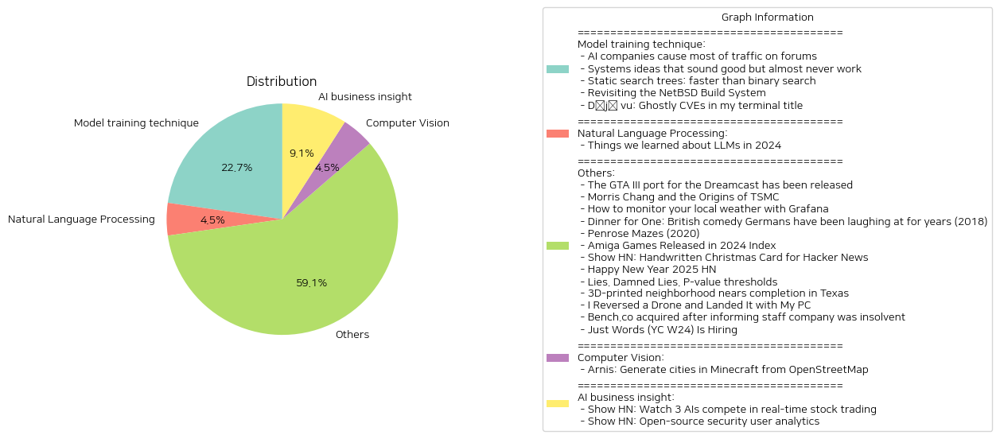

# Daily Artificial Intelligence Insights : News

## Model training technique

**요약:**

**1. 주요 주제 (Key Themes)**

다음은 다섯 개의 뉴스 기사에서 추출한 주요 주제입니다.

- 인공지능(AI) 및 기술의 발전
- 소프트웨어 엔지니어링의 도전과 해결책
- 컴퓨터 시스템 및 네트워크의 성능 최적화
- 운영 체제 및 빌드 시스템의 발전
- 컴퓨터 보안 및 취약점

이러한 주제들은 기술의 발전과 함께 나타나는 도전과 해결책, 성능 최적화, 보안 취약점 등 다양한 측면을 다루고 있습니다.

**2. 주요 사건 (Major Events)**

다음은 다섯 개의 뉴스 기사에서 추출한 주요 사건입니다.

- 인공지능 회사에서 운영하는 GPTBot가 Diaspora* 웹 인프라스트럭처에 24.6%의 트래픽을 발생시켜 인프라스트럭처에 대한 우려를 제기했습니다.
- 소프트웨어 엔지니어링에서 흔히 발생하는 오류와 해결책에 대해 논의했습니다.
- 정렬된 데이터를 검색하는 데 사용되는 정적 검색 트리(S+ tree)의 성능을 최적화하여 바이너리 검색보다 40배 빠른 속도를 달성했습니다.
- NetBSD의 빌드 시스템을 사용하여 임베디드 프로젝트를 진행하고, 빌드 시스템의 발전을 논의했습니다.
- 터미널의 보안 취약점과 CVE에 대해 논의했습니다.

**3. 영향 분석 (Impact Analysis)**

다음은 다섯 개의 뉴스 기사에서 추출한 주요 사건의 영향 분석입니다.

- 인공지능의 발전은 기술의 발전을 가속화할 수 있지만, 인프라스트럭처에 대한 부담을 증가시킬 수 있습니다.
- 소프트웨어 엔지니어링의 도전과 해결책은 기술의 발전을 가속화할 수 있습니다.
- 컴퓨터 시스템 및 네트워크의 성능 최적화는 기술의 발전을 가속화할 수 있습니다.
- 운영 체제 및 빌드 시스템의 발전은 기술의 발전을 가속화할 수 있습니다.
- 컴퓨터 보안 및 취약점은 기술의 발전을 가속화할 수 있지만, 보안에 대한 우려를 증가시킬 수 있습니다.

**4. 최종 요약 (Final Summary)**

다음은 다섯 개의 뉴스 기사에서 추출한 주요 주제와 사건의 최종 요약입니다.

기술의 발전은 다양한 측면에서 영향을 미치고 있습니다. 인공지능의 발전은 기술의 발전을 가속화할 수 있지만, 인프라스트럭처에 대한 부담을 증가시킬 수 있습니다. 소프트웨어 엔지니어링의 도전과 해결책은 기술의 발전을 가속화할 수 있습니다. 컴퓨터 시스템 및 네트워크의 성능 최적화는 기술의 발전을 가속화할 수 있습니다. 운영 체제 및 빌드 시스템의 발전은 기술의 발전을 가속화할 수 있습니다. 컴퓨터 보안 및 취약점은 기술의 발전을 가속화할 수 있지만, 보안에 대한 우려를 증가시킬 수 있습니다.

향후 기술의 발전을 주시해야 할 점은 다음과 같습니다.

- 인공지능의 발전과 인프라스트럭처에 대한 부담
- 소프트웨어 엔지니어링의 도전과 해결책
- 컴퓨터 시스템 및 네트워크의 성능 최적화
- 운영 체제 및 빌드 시스템의 발전
- 컴퓨터 보안 및 취약점

**출처:**

 - AI companies cause most of traffic on forums (https://pod.geraspora.de/posts/17342163)
 - Systems ideas that sound good but almost never work (https://hardcoresoftware.learningbyshipping.com/p/225-systems-ideas-that-sound-good)
 - Static search trees: faster than binary search (https://curiouscoding.nl/posts/static-search-tree/)
 - Revisiting the NetBSD Build System (https://blogsystem5.substack.com/p/netbsd-build-system)
 - Déjà vu: Ghostly CVEs in my terminal title (https://dgl.cx/2024/12/ghostty-terminal-title)

## Others

**요약:**

**1. Key Themes**:

본 뉴스 기사들은 다양한 주제를 다루고 있지만, 몇 가지 주요한 주제가 반복적으로 나타납니다. 

* 기술 발전: GTA III의 드림캐스트 포팅, TSMC의 반도체 산업 혁신, 3D 프린팅 기술의 발전 등 기술 발전이 주요 주제 중 하나입니다.
* 창의적 표현: "Dinner for One"의 독일 뉴 이어스 이브 전통, Penrose Maze의 고유한 패턴 등 창의적 표현이 나타납니다.
* 기술의 사회적 영향: Bench.co의 인수, Just Words의 인재 채용 등 기술의 사회적 영향이 주요 주제 중 하나입니다.
* 혁신과 발전: Amiga 게임의 새로운 출시, ICON의 3D 프린팅 기술 등 혁신과 발전이 주요 주제 중 하나입니다.

**2. Major Events**:

각 뉴스 기사에서 가장 중요한 사건이나 이야기를 요약하면 다음과 같습니다.

* GTA III의 드림캐스트 포팅이 출시되었습니다.
* TSMC의 창립자 Morris Chang의 반도체 산업 혁신에 대한 이야기가 나왔습니다.
* Grafana를 사용하여 지역 날씨를 모니터링하는 방법에 대한 가이드가 제공되었습니다.
* "Dinner for One"이 영국에서 방영되었습니다.
* Penrose Maze의 고유한 패턴에 대한 이야기가 나왔습니다.
* Amiga 게임의 새로운 출시가 요약되었습니다.
* ICON의 3D 프린팅 기술을 사용하여 텍사스에서 100개의 집이 건설되었습니다.
* Parrot Anafi 드론의 취약점이 발견되었습니다.
* Bench.co가 인수되었습니다.
* Just Words가 인재를 채용하고 있습니다.

**3. Impact Analysis**:

이러한 사건의 경제, 정치, 환경, 사회 등 다양한 분야에 미치는 영향을 분석하면 다음과 같습니다.

* 기술 발전은 경제에 긍정적인 영향을 미칠 수 있습니다. 예를 들어, TSMC의 반도체 산업 혁신은 경제 성장에 기여할 수 있습니다.
* 창의적 표현은 사회에 긍정적인 영향을 미칠 수 있습니다. 예를 들어, "Dinner for One"은 독일 뉴 이어스 이브 전통으로 사회에 긍정적인 영향을 미쳤습니다.
* 기술의 사회적 영향은 다양한 분야에 영향을 미칠 수 있습니다. 예를 들어, Bench.co의 인수는 경제에 영향을 미칠 수 있습니다.
* 혁신과 발전은 환경에 긍정적인 영향을 미칠 수 있습니다. 예를 들어, ICON의 3D 프린팅 기술은 건설 산업에서 폐기물을 줄일 수 있습니다.

**4. Final Summary**:

본 뉴스 기사들을 통해 기술 발전, 창의적 표현, 기술의 사회적 영향, 혁신과 발전 등 다양한 주제를 다루고 있음을 알 수 있습니다. 이러한 사건은 경제, 정치, 환경, 사회 등 다양한 분야에 영향을 미칠 수 있습니다. 기술 발전은 경제 성장에 기여할 수 있고, 창의적 표현은 사회에 긍정적인 영향을 미칠 수 있습니다. 기술의 사회적 영향은 다양한 분야에 영향을 미칠 수 있고, 혁신과 발전은 환경에 긍정적인 영향을 미칠 수 있습니다. 이러한 주제를 계속해서 모니터링하고, 기술 발전과 창의적 표현을 통해 사회에 긍정적인 영향을 미치는 방안을 모색하는 것이 중요합니다.

**출처:**

 - The GTA III port for the Dreamcast has been released (https://gitlab.com/skmp/dca3-game)
 - Morris Chang and the Origins of TSMC (https://www.construction-physics.com/p/morris-chang-and-the-origins-of-tsmc)
 - How to monitor your local weather with Grafana (https://grafana.com/blog/2024/12/26/how-to-monitor-your-local-weather-with-grafana/)
 - Dinner for One: British comedy Germans have been laughing at for years (2018) (https://www.theguardian.com/tv-and-radio/2018/dec/30/dinner-for-one-german-television-new-years-eve)
 - Penrose Mazes (2020) (https://justinpombrio.net/archive/penrose-maze/)
 - Amiga Games Released in 2024 Index (https://www.lemonamiga.com/forum/viewtopic.php?t=19114)
 - Show HN: Handwritten Christmas Card for Hacker News (https://handwritten-card.vercel.app/show-hn)
 - Happy New Year 2025 HN (https://news.ycombinator.com/item?id=42562750)
 - Lies. Damned Lies. P-value thresholds (https://www.newyorker.com/magazine/2019/09/09/what-statistics-can-and-cant-tell-us-about-ourselves)
 - 3D-printed neighborhood nears completion in Texas (https://www.yahoo.com/news/worlds-largest-3d-printed-neighborhood-060654029.html)
 - I Reversed a Drone and Landed It with My PC (https://www.hardbreak.wiki/network-analysis/protocols/application-layer/proprietary-protocols/parrot-anafi-drone-reverse-engineering)
 - Bench.co acquired after informing staff company was insolvent (https://www.bench.co/press-release)
 - Just Words (YC W24) Is Hiring (https://www.ycombinator.com/companies/just-words/jobs/lwVZeEN-sr-software-engineer-frontend)

## Computer Vision

**요약:**

**1. 주요 주제 (Key Themes)**

- 기술 발전 (Technological Advancements)
- 지리 정보 활용 (Utilization of Geographic Information)
- 게임 개발 (Game Development)
- 오픈소스 데이터 활용 (Utilization of Open-Source Data)

**2. 주요 사건 (Major Events)**

- Arnis는 오픈스트리트맵(OpenStreetMap) 데이터를 사용하여 실제 지리와 건축물을 가진 마인크래프트 세계를 생성하는 러스트(Rust) 기반 도구입니다.
- 이 도구는 러스트의 효율적이고 강력한 세계 생성 기능을 활용하여 실제 세계를 마인크래프트에서 재현합니다.

**3. 영향 분석 (Impact Analysis)**

- 경제: Arnis와 같은 도구는 게임 개발 산업에 새로운 기회를 제공할 수 있습니다. 실제 지리와 건축물을 활용하여 게임을 개발하는 것은 새로운 게임 개발 방식이 될 수 있습니다.
- 정치: 이 도구는 오픈소스 데이터를 활용하여 개발되었습니다. 이는 오픈소스 데이터의 중요성을 강조하며, 데이터의 공개와 공유를 촉진할 수 있습니다.
- 환경: Arnis는 실제 지리와 건축물을 활용하여 게임을 개발하는 데 사용됩니다. 이는 환경에 대한 이해와 관심을 높일 수 있습니다.
- 사회: 이 도구는 게임 개발에 새로운 기회를 제공할 수 있습니다. 이는 게임 개발에 대한 관심과 참여를 높일 수 있습니다.

**4. 최종 요약 (Final Summary)**

Arnis는 오픈스트리트맵 데이터를 사용하여 실제 지리와 건축물을 가진 마인크래프트 세계를 생성하는 러스트 기반 도구입니다. 이 도구는 게임 개발 산업에 새로운 기회를 제공할 수 있으며, 오픈소스 데이터의 중요성을 강조합니다. 또한, 환경에 대한 이해와 관심을 높일 수 있으며, 게임 개발에 대한 관심과 참여를 높일 수 있습니다. 향후, 이 도구의 발전과 게임 개발 산업의 변화를 주시할 필요가 있습니다.

**출처:**

 - Arnis: Generate cities in Minecraft from OpenStreetMap (https://github.com/louis-e/arnis)

