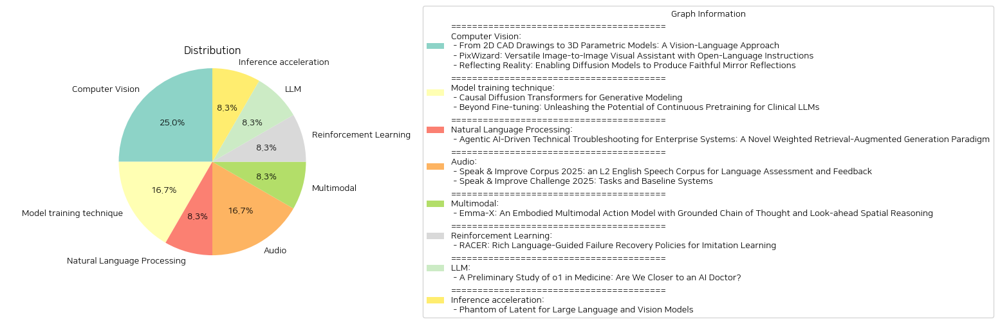

# Daily Artificial Intelligence Insights : Papers

## Computer Vision

**요약:**

**요약 보고서**

최근 컴퓨터 비전 및 인공지능 분야에서 다양한 연구들이 진행되고 있습니다. 이 보고서는 3D 모델링, 이미지 생성 및 편집, 그리고 미러 리플렉션 생성에 관한 세 가지 논문을 요약하고 분석합니다.

**주요 주제 및 키워드**

* 3D 모델링: 2D CAD 도면에서 3D 파라메트릭 모델로의 변환
* 이미지 생성 및 편집: 이미지-텍스트-이미지 생성 프레임워크 및 오픈 언어 명령
* 미러 리플렉션 생성: 디퓨전 모델을 사용한 미러 리플렉션 생성

**세부 요약**

1. **2D CAD 도면에서 3D 파라메트릭 모델로의 변환**

이 논문에서는 CAD2Program이라는 새로운 방법을 제시합니다. 이 방법은 2D CAD 도면을 3D 파라메트릭 모델로 변환하는 데 사용됩니다. 이 방법은 비전-언어 모델(VLM)의 성공에 영감을 받아, 기존의 방법과는 다르게 2D CAD 도면을 래스터 이미지로 간주하고, ViT 모델을 사용하여 이미지 인코딩을 수행합니다. 실험 결과, 이 방법은 기존의 방법과 비교하여 경쟁력 있는 성능을 보여주었습니다.

2. **이미지 생성 및 편집**

이 논문에서는 PixWizard라는 이미지-텍스트-이미지 생성 프레임워크를 제시합니다. 이 프레임워크는 오픈 언어 명령을 사용하여 이미지 생성, 편집, 및 변환을 수행할 수 있습니다. 이 프레임워크는 다양한 비전 작업을 하나의 프레임워크로 통합하고, Omni Pixel-to-Pixel Instruction-Tuning Dataset을 사용하여 모델을 학습시킵니다. 실험 결과, PixWizard는 다양한 이미지 해상도에서 인상적인 생성 및 이해 능력을 보여주었습니다.

3. **미러 리플렉션 생성**

이 논문에서는 미러 리플렉션 생성 문제를 해결하기 위해 SynMirror라는 대규모 데이터셋을 생성합니다. 이 데이터셋은 다양한 3D 객체와 미러 리플렉션을 포함하고 있습니다. 이 논문에서는 MirrorFusion이라는 새로운 방법을 제시합니다. 이 방법은 디퓨전 모델을 사용하여 미러 리플렉션을 생성하는 데 사용됩니다. 실험 결과, MirrorFusion은 기존의 방법과 비교하여 높은 성능을 보여주었습니다.

**결론 및 향후 연구 방향**

이 보고서는 3D 모델링, 이미지 생성 및 편집, 그리고 미러 리플렉션 생성에 관한 세 가지 논문을 요약하고 분석했습니다. 이 연구들은 컴퓨터 비전 및 인공지능 분야에서 새로운 가능성을 열어주고 있습니다. 향후 연구 방향으로는 이러한 기술을 실제 응용 분야에 적용하는 것이 중요할 것입니다. 또한, 이러한 기술을 사용하여 새로운 응용 분야를 개발하는 것도 중요할 것입니다.

**출처:**

 - From 2D CAD Drawings to 3D Parametric Models: A Vision-Language Approach (https://deeplearn.org/arxiv/558907/from-2d-cad-drawings-to-3d-parametric-models:-a-vision-language-approach)
 - PixWizard: Versatile Image-to-Image Visual Assistant with Open-Language Instructions (http://arxiv.org/abs/2409.15278v2)
 - Reflecting Reality: Enabling Diffusion Models to Produce Faithful Mirror Reflections (http://arxiv.org/abs/2409.14677v1)

## Model training technique

**요약:**

**요약 보고서**

최근의 연구들은 인공지능 모델의 성능을 향상시키기 위한 새로운 접근 방식을 제시하고 있습니다. 이 보고서는 두 개의 연구 논문에 대한 요약을 제공하며, 인공지능 모델의 발전과 그 응용에 대한 새로운 관점을 제시합니다.

**1. 인과 확산 변환기(Causal Diffusion Transformers)**

첫 번째 논문은 인과 확산 변환기(Causal Diffusion Transformers)를 소개합니다. 이 모델은 확산 모델(Diffusion models)의 자율 회귀(AR) 대응 모델로, 이산형(discrete)과 연속형(continuous) 데이터에 모두 적합하며, 기존의 다음 토큰 예측 모델(LLaMA, GPT 등)과 호환됩니다. 이 모델은 순차적 인자화(sequential factorization)를 통해 확산 모델의 성능을 향상시키고, AR과 확산 생성 모드 사이의 원활한 전환을 가능하게 합니다. 또한, 이 모델은 이미지 생성Benchmark에서 최적의 결과를 달성하며, AR의 장점을 활용하여任意의 토큰 수를 생성할 수 있습니다.

**2. 임상용 대규모 언어 모델(LLMs)의 지속적 사전 훈련**

두 번째 논문은 임상용 대규모 언어 모델(LLMs)의 지속적 사전 훈련에 대한 연구를 소개합니다. 이 연구는 임상용 LLMs를 위한 네 가지 기법을 조사합니다: 지속적 사전 훈련, 지시적 미세 조정(instruct fine-tuning), NEFTune, 및 프롬프트 엔지니어링(prompt engineering). 이 연구는 Mistral 7B와 Mixtral 8x7B 모델을 사용하여 대규모 임상 사전 훈련 데이터셋(50억 토큰)과 지시적 미세 조정 데이터셋(5억 토큰)을 활용합니다. 평가 결과는 각 기법의 영향을 보여줍니다. 지속적 사전 훈련은 250억 토큰 이상에서 약간의 개선만 보여주지만, 지시적 미세 조정의 기초를 마련합니다. 또한, NEFTune은 생성 품질을 향상시키기 위한 기법으로 설계되었지만, Benchmark에서 추가적인 개선 효과를 보여줍니다. 복잡한 프롬프트 엔지니어링 방법은 성능을 더욱 향상시킵니다.

**결론**

이 두 논문은 인공지능 모델의 발전과 그 응용에 대한 새로운 관점을 제시합니다. 인과 확산 변환기는 확산 모델의 성능을 향상시키고, AR과 확산 생성 모드 사이의 원활한 전환을 가능하게 합니다. 임상용 대규모 언어 모델(LLMs)의 지속적 사전 훈련은 임상용 LLMs의 성능을 향상시키기 위한 새로운 접근 방식을 제시합니다. 이러한 연구 결과는 인공지능 모델의 발전과 그 응용에 대한 새로운 관점을 제공하며, 향후 연구에 대한 새로운 방향을 제시합니다.

**출처:**

 - Causal Diffusion Transformers for Generative Modeling (https://deeplearn.org/arxiv/558908/causal-diffusion-transformers-for-generative-modeling)
 - Beyond Fine-tuning: Unleashing the Potential of Continuous Pretraining for Clinical LLMs (http://arxiv.org/abs/2409.14988v1)

## Natural Language Processing

**요약:**

**요약 보고서**

**제목:** 엔터프라이즈 시스템을 위한 신뢰할 수 있는 AI 기반 기술 문제 해결: 가중치가 부여된 검색-증강 생성 프레임워크

**요약:**

본 논문은 엔터프라이즈 환경에서 기술 문제 해결을 위한 신뢰할 수 있는 AI 기반 솔루션을 제시한다. 가중치가 부여된 검색-증강 생성 프레임워크(WRAG Framework)를 기반으로 하는 이 솔루션은 다양한 데이터 소스에서 관련 정보를 동적으로 검색하고 가중치를 부여하여 가장 관련성이 높은 데이터를 우선순위로 한다. 예를 들어, 제품 매뉴얼은 SKU 관련 쿼리에 우선순위를 부여하고, 일반적인 FAQ는 더 광범위한 문제에 통합된다. 이 시스템은 효율적인 밀집 벡터 검색을 위한 FAISS와 다중 소스 결과를 통합하기 위한 동적 집계 메커니즘을 사용한다. 또한, Llama 기반의 자기 평가기(self-evaluator)는 생성된 응답의 문맥적 정확성과 신뢰성을 보장한다. 이 반복적인 검색과 검증 과정은 응답 생성의 정밀도, 다양성, 신뢰성을 향상시킨다. 대규모 엔터프라이즈 데이터셋에 대한 초기 평가 결과는 이 프레임워크가 문제 해결 정확성, 해결 시간, 다양한 기술적 도전에 대한 적응성을 향상시키는 데 효과적임을 보여준다. 향후 연구는 고급 대화형 AI 기능을 통합하여 더 상호 작용적이고 직관적인 문제 해결 경험을 제공하는 데 중점을 둘 것이다. 또한, 강화 학습을 통해 동적 가중치 메커니즘을 정제하여 검색된 정보의 관련성과 정밀성을 더욱 최적화할 것이다. 이러한 발전을 통해 제안된 프레임워크는 엔터프라이즈 환경에서 기술 서비스 워크플로우를 재정의하는 완전한 자율형 AI 솔루션으로 발전할 수 있을 것이다.

**주요 키워드:** AI 기반 기술 문제 해결, 가중치가 부여된 검색-증강 생성 프레임워크, 엔터프라이즈 시스템, 기술 서비스 워크플로우, 자율형 AI 솔루션.

**추가 정보:**

* 이 프레임워크는 엔터프라이즈 환경에서 기술 문제 해결을 위한 신뢰할 수 있는 AI 기반 솔루션을 제공한다.
* 가중치가 부여된 검색-증강 생성 프레임워크는 다양한 데이터 소스에서 관련 정보를 동적으로 검색하고 가중치를 부여하여 가장 관련성이 높은 데이터를 우선순위로 한다.
* 이 시스템은 효율적인 밀집 벡터 검색을 위한 FAISS와 다중 소스 결과를 통합하기 위한 동적 집계 메커니즘을 사용한다.
* Llama 기반의 자기 평가기는 생성된 응답의 문맥적 정확성과 신뢰성을 보장한다.
* 이 프레임워크는 엔터프라이즈 환경에서 기술 서비스 워크플로우를 재정의하는 완전한 자율형 AI 솔루션으로 발전할 수 있다.

**출처:**

 - Agentic AI-Driven Technical Troubleshooting for Enterprise Systems: A Novel Weighted Retrieval-Augmented Generation Paradigm (https://deeplearn.org/arxiv/558909/agentic-ai-driven-technical-troubleshooting-for-enterprise-systems:-a-novel-weighted-retrieval-augmented-generation-paradigm)

## Audio

**요약:**

**요약 보고서**

**제목:** Speak & Improve Corpus 2025 및 Speak & Improve Challenge 2025에 대한 분석

**요약:**

이 보고서는 Speak & Improve Corpus 2025와 Speak & Improve Challenge 2025에 대한 분석을 제공합니다. 두 논문은 영어 학습자 데이터베이스와 언어 평가 및 피드백에 대한 연구를 다룹니다.

**주요 주제 및 키워드:**

* Speak & Improve Corpus 2025: 영어 학습자 데이터베이스, 언어 평가 및 피드백
* Speak & Improve Challenge 2025: 언어 평가 및 피드백에 대한 연구, 자동 음성 인식, 발화 언어 평가, 발화 문법 오류 수정
* 영어 학습자 데이터, 언어 평가, 피드백, 자동 음성 인식, 발화 언어 평가, 발화 문법 오류 수정

**이벤트 및 영향:**

* Speak & Improve Corpus 2025는 영어 학습자 데이터베이스를 제공하여 언어 평가 및 피드백에 대한 연구를 지원합니다.
* Speak & Improve Challenge 2025는 언어 평가 및 피드백에 대한 연구를 촉진하고, 자동 음성 인식, 발화 언어 평가, 발화 문법 오류 수정 등의 기술을 개발합니다.
* 두 논문은 영어 학습자 데이터베이스와 언어 평가 및 피드백에 대한 연구를 다루고, 언어 교육 및 기술 개발에 대한 새로운 방향을 제시합니다.

**결론 및 향후 발전:**

* Speak & Improve Corpus 2025와 Speak & Improve Challenge 2025는 영어 학습자 데이터베이스와 언어 평가 및 피드백에 대한 연구를 지원하고, 언어 교육 및 기술 개발에 대한 새로운 방향을 제시합니다.
* 향후에는 영어 학습자 데이터베이스와 언어 평가 및 피드백에 대한 연구가 더욱 활발하게 진행될 것으로 예상되며, 자동 음성 인식, 발화 언어 평가, 발화 문법 오류 수정 등의 기술이 더욱 발전할 것으로 기대됩니다.

**추천:**

* 영어 학습자 데이터베이스와 언어 평가 및 피드백에 대한 연구를 지원하기 위해 Speak & Improve Corpus 2025와 Speak & Improve Challenge 2025를 활용할 것을 권장합니다.
* 언어 교육 및 기술 개발에 대한 새로운 방향을 제시하기 위해 Speak & Improve Corpus 2025와 Speak & Improve Challenge 2025를 활용할 것을 권장합니다.

**출처:**

 - Speak & Improve Corpus 2025: an L2 English Speech Corpus for Language Assessment and Feedback (https://deeplearn.org/arxiv/558910/speak-&-improve-corpus-2025:-an-l2-english-speech-corpus-for-language-assessment-and-feedback)
 - Speak & Improve Challenge 2025: Tasks and Baseline Systems (https://deeplearn.org/arxiv/558911/speak-&-improve-challenge-2025:-tasks-and-baseline-systems)

## Multimodal

**요약:**

제목: 'Emma-X: Embodied Multimodal Action Model with Grounded Chain of Thought and Look-ahead Spatial Reasoning'

요약: 
기존 강화 학습 기반 로봇 제어 방법은 일반적으로 특정 작업에 국한되어 있으며 다양한 환경이나 미지의 객체 및 지시에서 일반화되지 못하는 경우가 많습니다. 시각 언어 모델(VLM)은 강력한 장면 이해 및 계획 능력을 보여주지만 특정 로봇의 구현에 맞는 실행 가능한 정책을 생성하는 능력이 부족합니다. 이를 해결하기 위해 시각-언어-행동(VLA) 모델이 등장했지만 장기 공간 추론 및 근거 있는 작업 계획에 대한 도전을 겪고 있습니다. 본 연구에서는 Embodied Multimodal Action Model with Grounded Chain of Thought and Look-ahead Spatial Reasoning, Emma-X를 제안합니다. Emma-X는 BridgeV2를 기반으로 구축된 계층적 구현 데이터셋을 활용하며, 60,000개의 로봇 조작 궤적이 근거 있는 작업 추론 및 공간 지침과 함께 자동으로 주석 처리되었습니다. 또한, 그리퍼 상태 및 운동 궤적을 기반으로 하는 궤적 분할 전략을 도입하여 근거 있는 하위 작업 추론 생성에서 환각을 완화하는 데 도움이 될 수 있습니다. 실험 결과는 Emma-X가 경쟁적인 기준선에 비해 우수한 성능을 보여주며, 특히 공간 추론이 필요한 실제 로봇 작업에서 그렇습니다.

주요 키워드: 
- 강화 학습
- 로봇 제어
- 시각 언어 모델
- Embodied Multimodal Action Model
- 근거 있는 작업 추론
- 공간 추론

추론: 
본 연구는 로봇 제어를 위한 새로운 모델인 Emma-X를 제안합니다. Emma-X는 강화 학습 기반 로봇 제어 방법의 한계를 극복하고, 시각 언어 모델의 장점을 활용하여 로봇의 구현에 맞는 실행 가능한 정책을 생성합니다. 또한, 근거 있는 작업 추론 및 공간 추론을 위한 새로운 전략을 도입하여 로봇의 작업 능력을 향상시킵니다. 이러한 연구는 로봇 제어 및 인공지능 분야에서 중요한 의미를 가지며, 향후 로봇의 작업 능력 향상에 기여할 수 있을 것입니다.

**출처:**

 - Emma-X: An Embodied Multimodal Action Model with Grounded Chain of Thought and Look-ahead Spatial Reasoning (https://deeplearn.org/arxiv/558912/emma-x:-an-embodied-multimodal-action-model-with-grounded-chain-of-thought-and-look-ahead-spatial-reasoning)

## Reinforcement Learning

**요약:**

**제목:** RACER: 풍부한 언어 지침을 통한 모방 학습을 위한 실패 복구 정책

**요약:**

로봇 조작을 위한 강력하고 수정 가능한 시각-운동 정책 개발은 실패로부터의 자기 복구 메커니즘의 부족과 단순한 언어 지침의 한계로 인해 어려운 도전을 겪고 있습니다. 이러한 문제를 해결하기 위해, 우리는 전문가 데모에 실패 복구 궤적과 세부적인 언어 주석을 자동으로 추가하는 확장 가능한 데이터 생성 파이프라인을 제안합니다. 그런 다음, 우리는 실패 복구 데이터와 풍부한 언어 설명을 결합하여 로봇 제어를 향상시키는 Rich languAge-guided failure reCovERy (RACER)라는 감독자-액터 프레임워크를 소개합니다. RACER는 오류 수정과 작업 실행을 위한 세부적인 언어 지침을 제공하는 온라인 감독자로서의 시각-언어 모델 (VLM)과 언어 조건부 시각-운동 정책을 액터로서의 다음 동작을 예측합니다. 실험 결과는 RACER가 다양한 평가 설정에서 표준 장기 지평 작업, 동적 목표 변경 작업 및 제로샷 미시작 작업을 포함하여 RLbench에서 최첨단 Robotic View Transformer (RVT)를 능가한다는 것을 보여주었습니다. 시뮬레이션 환경과 실제 환경 모두에서 우수한 성능을 달성했습니다. 비디오와 코드는 다음 주소에서 확인할 수 있습니다: https://rich-language-failure-recovery.github.io.

**주요 내용:**

* 로봇 조작을 위한 강력하고 수정 가능한 시각-운동 정책 개발의 어려움
* 실패 복구 데이터와 풍부한 언어 설명을 결합하여 로봇 제어를 향상시키는 RACER 프레임워크
* 실험 결과: RACER가 다양한 평가 설정에서 표준 장기 지평 작업, 동적 목표 변경 작업 및 제로샷 미시작 작업을 포함하여 RLbench에서 최첨단 Robotic View Transformer (RVT)를 능가함

**향후 발전 방향:**

* RACER 프레임워크의 확장과 응용
* 로봇 조작을 위한 더 강력하고 수정 가능한 시각-운동 정책 개발
* 실패 복구 데이터와 풍부한 언어 설명을 결합하여 로봇 제어를 향상시키는 새로운 방법론 개발

**출처:**

 - RACER: Rich Language-Guided Failure Recovery Policies for Imitation Learning (http://arxiv.org/abs/2409.14674v1)

## LLM

**요약:**

제목: 의학 분야에서 o1의 잠재력: 인공지능 의사가 가까이 다가오고 있는가?

요약: 
최근에 개발된 대규모 언어 모델(LLM)인 o1은 내부화된 사고 체인 기법을 사용하여 강화 학습 전략을 구현한 최초의 모델입니다. o1은 다양한 일반 언어 작업에서 놀라운 성능을 보여주었지만, 의학 분야와 같은 전문 분야에서의 성능은 아직 알려지지 않았습니다. 이 보고서는 o1의 의학 분야에서의 성능을 평가하기 위해 3가지 측면(이해, 추론, 다국어성)을 분석하였습니다. 평가에는 37개의 의학 데이터셋을 사용하였으며, 2개의 새로운 의학 퀴즈 데이터셋을 포함하였습니다. 이 데이터셋은 표준 의학 QA 벤치마크보다 더 높은 임상적 관련성을 제공하여 실제 임상 환경에서 더 유용합니다. o1의 분석 결과, LLM의 향상된 추론 능력이 의학 지침을 이해하고 복잡한 임상 상황을 추론하는 능력에 크게 기여할 수 있음을 보여주었습니다. 특히, o1은 이전의 GPT-4보다 19개의 데이터셋과 2개의 새로운 복잡한 QA 상황에서 평균 6.2%와 6.6%의 정확도를 높였습니다. 그러나 모델의 능력과 평가 프로토콜의 약점을 발견하였습니다. 이러한 약점에는 환각, 일관되지 않은 다국어 능력, 평가를 위한 불일치한 지표 등이 포함됩니다. 이 연구의 데이터와 모델 출력은 https://ucsc-vlaa.github.io/o1_medicine/에서 공개되었습니다.

주요 내용:
- o1은 의학 분야에서 이전 모델보다 더 높은 성능을 보여주었습니다.
- o1의 향상된 추론 능력이 의학 지침을 이해하고 복잡한 임상 상황을 추론하는 능력에 기여할 수 있습니다.
- 모델의 약점은 환각, 일관되지 않은 다국어 능력, 평가를 위한 불일치한 지표 등입니다.
- 이 연구의 데이터와 모델 출력은 공개되었습니다.

향후 연구 방향:
- o1의 약점을 개선하기 위한 연구가 필요합니다.
- o1을 실제 임상 환경에서 적용하기 위한 연구가 필요합니다.
- o1의 성능을 다른 의학 분야에서 평가하기 위한 연구가 필요합니다.

**출처:**

 - A Preliminary Study of o1 in Medicine: Are We Closer to an AI Doctor? (http://arxiv.org/abs/2409.15277v1)

## Inference acceleration

**요약:**

phantom of latent for large language and vision models

LLVMs의 효율적인 개발 필요성

최근 대규모 언어 및 비전 모델(LLVMs)의 성공은 시각적 지시 튜닝의 발전에 기여했습니다. 이러한 모델은 26B, 34B, 80B 파라미터까지 크기가 증가했으며, 이는 성능 향상을 가져왔지만 하드웨어 자원에 대한 요구가 크게 증가했습니다. 따라서 효율적인 LLVMs의 개발 필요성이 대두되었습니다.

Phantom 모델의 소개

이러한 필요성을 충족하기 위해, 우리는 새로운 효율적인 LLVM 패밀리인 Phantom을 제시합니다. Phantom은 0.5B, 1.8B, 3.8B, 7B 파라미터 크기로 구성되며, 제한된 구조 내에서 학습 능력을 크게 향상시킵니다. Phantom은 다중 헤드 자기 주의(MHSA)에서 잠재적 은닉 차원을 일시적으로 증가시켜, 물리적 모델 크기를 크게 증가시키지 않고도 비전-언어 지식을 학습할 수 있도록 합니다.

Phantom 최적화

Phantom의 효율성을 극대화하기 위해, 우리는 Phantom 최적화(PO)를 제시합니다. PO는 자기 회귀 감독 미세 조정(SFT)과 직접 선호도 최적화(DPO) 개념을 사용하여 올바른 답변을 따르면서 잘못된 답변을 제거합니다. Phantom은 다양한 대규모 LLVMs를 능가하며, 효율적인 LLVMs의 선두 주자로 자리 잡았습니다.

결론

Phantom은 효율적인 LLVMs의 개발 필요성을 충족하기 위해 제시된 새로운 모델입니다. Phantom은 제한된 구조 내에서 학습 능력을 크게 향상시키며, 효율적인 LLVMs의 선두 주자로 자리 잡았습니다. Phantom의 효율성은 다양한 응용 분야에서 활용될 수 있으며, 향후 더 많은 연구와 개발이 필요합니다.

**출처:**

 - Phantom of Latent for Large Language and Vision Models (http://arxiv.org/abs/2409.14713v1)

