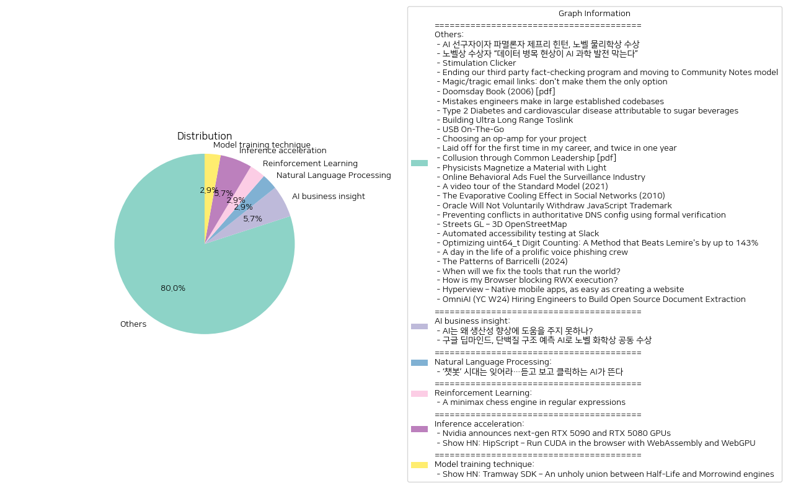

# Daily Artificial Intelligence Insights : News

## Others

**요약:**

**요약 보고서**

**1. 주요 주제**

다음은 여러 뉴스 기사에서 추출한 주요 주제입니다.

* 인공지능(AI) 및 기술 발전
* 과학 및 물리학 연구
* 데이터 및 보안
* 경제 및 산업 동향
* 기술 및 소프트웨어 개발
* 사회 및 환경 문제

**2. 주요 사건**

다음은 각 뉴스 기사에서 추출한 주요 사건입니다.

* 제프리 힌턴 교수가 노벨 물리학상을 수상했습니다.
* AI를 과학적 발견의 도구로 사용하려면 고품질 데이터가 필요합니다.
* 메타는 사실 확인 프로그램을 종료하고 커뮤니티 노트 시스템을 도입했습니다.
* MIT 물리학자들은 새로운 자기 상태를 만들었습니다.
* 온라인 행동 광고는 감시 산업을 연료로 합니다.
* 표준 모델은 물리학의 기본 입자와 힘을 설명하지만 한계가 있습니다.
* Oracle는 자발적으로 JavaScript 상표를 철회하지 않을 것입니다.
* 클라우드플레어는 공식 검증 시스템을 개발했습니다.
* 슬랙은 자동화된 접근성 테스트를 통합했습니다.

**3. 영향 분석**

다음은 각 뉴스 기사에서 추출한 주요 사건의 영향 분석입니다.

* 경제: AI 및 기술 발전은 경제에 큰 영향을 미칠 수 있습니다. 예를 들어, 자동화된 접근성 테스트는 소프트웨어 개발에 큰 영향을 미칠 수 있습니다.
* 정치: 메타의 사실 확인 프로그램 종료는 정치적으로 논란이 될 수 있습니다.
* 환경: 온라인 행동 광고는 환경에 부정적인 영향을 미칠 수 있습니다.
* 사회: 표준 모델의 한계는 과학 연구에 큰 영향을 미칠 수 있습니다.

**4. 최종 요약**

다음은 뉴스 기사에서 추출한 주요 주제와 사건의 최종 요약입니다.

* AI 및 기술 발전은 경제, 정치, 환경, 사회에 큰 영향을 미칠 수 있습니다.
* 과학 연구는 계속해서 발전하고 있습니다.
* 데이터 및 보안은 중요한 문제입니다.
* 기술 및 소프트웨어 개발은 계속해서 발전하고 있습니다.
* 사회 및 환경 문제는 중요합니다.

**미래 동향**

다음은 뉴스 기사에서 추출한 주요 주제와 사건의 미래 동향입니다.

* AI 및 기술 발전은 계속해서 발전할 것입니다.
* 과학 연구는 계속해서 발전할 것입니다.
* 데이터 및 보안은 중요하게 유지될 것입니다.
* 기술 및 소프트웨어 개발은 계속해서 발전할 것입니다.
* 사회 및 환경 문제는 중요하게 유지될 것입니다.

**출처:**

 - AI 선구자이자 파멸론자 제프리 힌턴, 노벨 물리학상 수상 (https://www.technologyreview.kr/ai-%ec%84%a0%ea%b5%ac%ec%9e%90%ec%9d%b4%ec%9e%90-%ed%8c%8c%eb%a9%b8%eb%a1%a0%ec%9e%90-%ec%a0%9c%ed%94%84%eb%a6%ac-%ed%9e%8c%ed%84%b4-%eb%85%b8%eb%b2%a8-%eb%ac%bc%eb%a6%ac%ed%95%99%ec%83%81-%ec%88%98/)
 - 노벨상 수상자 “데이터 병목 현상이 AI 과학 발전 막는다” (https://www.technologyreview.kr/%eb%85%b8%eb%b2%a8%ec%83%81-%ec%88%98%ec%83%81%ec%9e%90-%eb%8d%b0%ec%9d%b4%ed%84%b0-%eb%b3%91%eb%aa%a9-%ed%98%84%ec%83%81%ec%9d%b4-ai-%ea%b3%bc%ed%95%99-%eb%b0%9c%ec%a0%84-%eb%a7%89%eb%8a%94/)
 - Stimulation Clicker (https://neal.fun/stimulation-clicker/)
 - Ending our third party fact-checking program and moving to Community Notes model (https://about.fb.com/news/2025/01/meta-more-speech-fewer-mistakes/)
 - Magic/tragic email links: don't make them the only option (https://recyclebin.zip/posts/annoyinglinks/)
 - Doomsday Book (2006) [pdf] (https://www.crisesnotes.com/content/files/2023/12/NYFRB-2006.--Doomsday-Book--Searchable.pdf)
 - Mistakes engineers make in large established codebases (https://www.seangoedecke.com/large-established-codebases/)
 - Type 2 Diabetes and cardiovascular disease attributable to sugar beverages (https://www.nature.com/articles/s41591-024-03345-4)
 - Building Ultra Long Range Toslink (https://blog.benjojo.co.uk/post/sfp-experiment-ultra-long-range-toslink)
 - USB On-The-Go (https://computer.rip/2024-01-06-usb-on-the-go.html)
 - Choosing an op-amp for your project (https://lcamtuf.substack.com/p/choosing-an-op-amp-for-your-project)
 - Laid off for the first time in my career, and twice in one year (https://dillonshook.com/laid-off/)
 - Collusion through Common Leadership [pdf] (https://wwws.law.northwestern.edu/research-faculty/clbe/events/antitrust/documents/prager_collusion_through_common_leadership.pdf)
 - Physicists Magnetize a Material with Light (https://news.mit.edu/2024/physicists-magnetize-material-using-light-1218)
 - Online Behavioral Ads Fuel the Surveillance Industry (https://www.eff.org/deeplinks/2025/01/online-behavioral-ads-fuel-surveillance-industry-heres-how)
 - A video tour of the Standard Model (2021) (https://www.quantamagazine.org/a-video-tour-of-the-standard-model-20210716/)
 - The Evaporative Cooling Effect in Social Networks (2010) (https://blogs.cornell.edu/info2040/2015/10/14/the-evaporative-cooling-effect-in-social-network/)
 - Oracle Will Not Voluntarily Withdraw JavaScript Trademark (https://twitter.com/deno_land/status/1876728474666217739)
 - Preventing conflicts in authoritative DNS config using formal verification (https://blog.cloudflare.com/topaz-policy-engine-design/)
 - Streets GL – 3D OpenStreetMap (https://streets.gl/#47.35245,8.50958,21.25,42.00,459.10)
 - Automated accessibility testing at Slack (https://slack.engineering/automated-accessibility-testing-at-slack/)
 - Optimizing uint64_t Digit Counting: A Method that Beats Lemire's by up to 143% (https://github.com/RealTimeChris/BenchmarkSuite/blob/digit-counting/Benchmark/main.cpp)
 - A day in the life of a prolific voice phishing crew (https://krebsonsecurity.com/2025/01/a-day-in-the-life-of-a-prolific-voice-phishing-crew/)
 - The Patterns of Barricelli (2024) (https://akkartik.name/post/2024-08-30-devlog)
 - When will we fix the tools that run the world? (https://www.cgustavo.com/blog/tools)
 - How is my Browser blocking RWX execution? (https://rwxstoned.github.io/2025-01-04-Reviewing-browser-hooks/)
 - Hyperview – Native mobile apps, as easy as creating a website (https://hyperview.org/)
 - OmniAI (YC W24) Hiring Engineers to Build Open Source Document Extraction (https://www.ycombinator.com/companies/omniai/jobs/LG5jeP2-full-stack-engineer)

## AI business insight

**요약:**

**요약 보고서**

**1. 주요 주제**

인공지능(AI)의 발전과 그 응용 분야가 주요 주제로 나타났습니다. 특히, AI의 생산성 향상에 대한 기대와 한계, 그리고 AI의 과학적 응용 분야에서 이루어진 성과가 주요 주제로 나타났습니다.

**2. 주요 사건**

* 인공지능(AI)은 우리 경제 발전을 이끌어줄 유망한 기술로 기대되지만, AI가 생산성 개선 면에서 유의미한 성과를 내게 만들려면 몇 가지 중대한 개선이 필요하다는 것이 밝혀졌습니다.
* 구글 딥마인드의 데미스 허사비스와 존 점퍼는 AI를 사용하여 단백질 접힘 예측 문제를 해결한 공로로 노벨 화학상을 공동 수상하였습니다.

**3. 영향 분석**

* 경제: AI의 생산성 향상에 대한 기대는 경제 발전을 이끌어줄 수 있지만, 현재의 한계를 극복하기 위한 노력이 필요합니다.
* 과학: AI의 과학적 응용 분야에서 이루어진 성과는 새로운 기술 개발과 과학적 지식의 확장에 기여할 수 있습니다.
* 사회: AI의 발전은 새로운 직업 창출과 사회적 변화를 가져올 수 있습니다.

**4. 최종 요약**

인공지능(AI)의 발전은 우리 경제와 사회에 큰 영향을 미칠 수 있습니다. 그러나 AI의 생산성 향상에 대한 기대는 현재의 한계를 극복하기 위한 노력이 필요합니다. 구글 딥마인드의 노벨 화학상 수상은 AI의 과학적 응용 분야에서 이루어진 성과를 보여주고 있습니다. 앞으로 AI의 발전이 어떻게 우리 경제와 사회에 영향을 미칠지 지켜보아야 할 것입니다. 특히, AI의 생산성 향상에 대한 연구와 개발이 필요하며, AI의 과학적 응용 분야에서 이루어진 성과를 더 많이 기대할 수 있습니다.

**출처:**

 - AI는 왜 생산성 향상에 도움을 주지 못하나? (https://www.technologyreview.kr/ai%eb%8a%94-%ec%99%9c-%ec%83%9d%ec%82%b0%ec%84%b1-%ed%96%a5%ec%83%81%ec%97%90-%eb%8f%84%ec%9b%80%ec%9d%84-%ec%a3%bc%ec%a7%80-%eb%aa%bb%ed%95%98%eb%82%98/)
 - 구글 딥마인드, 단백질 구조 예측 AI로 노벨 화학상 공동 수상 (https://www.technologyreview.kr/%ea%b5%ac%ea%b8%80-%eb%94%a5%eb%a7%88%ec%9d%b8%eb%93%9c-%eb%8b%a8%eb%b0%b1%ec%a7%88-%ea%b5%ac%ec%a1%b0-%ec%98%88%ec%b8%a1-ai%eb%a1%9c-%eb%85%b8%eb%b2%a8-%ed%99%94%ed%95%99%ec%83%81-%ea%b3%b5%eb%8f%99/)

## Natural Language Processing

**요약:**

**요약 보고서**

**1. 주요 주제 (Key Themes)**

최근의 뉴스 기사들을 분석한 결과, 인공지능(AI) 기술의 발전과 그에 따른 새로운 기술의 등장이라는 주제가 두드러졌다. 특히, 텍스트 기반 AI 챗봇의 한계를 넘어서는 음성과 영상 생성 기능을 갖춘 AI 기술이 주목받고 있다.

**2. 주요 사건 (Major Events)**

최근의 뉴스 기사들은 텍스트 기반 AI 챗봇 시대가 저물고, 더 진화한 음성과 영상 생성 기능을 갖춘 AI 시대가 열리고 있다고 보도했다. 이는 인공지능 기술의 발전과 그에 따른 새로운 기술의 등장으로 인해 기존의 텍스트 기반 챗봇이 한계를 맞이하고, 더 발전된 기술이 등장하고 있음을 의미한다.

**3. 영향 분석 (Impact Analysis)**

이러한 기술의 발전은 다양한 분야에 영향을 미칠 것으로 예상된다.

* 경제: 새로운 기술의 등장으로 인해 관련 산업의 성장과 새로운 비즈니스 모델의 등장으로 경제에 긍정적인 영향을 미칠 수 있다.
* 정치: 새로운 기술의 등장으로 인해 정치 캠페인과 선거 과정에 새로운 전략과 방법이 등장할 수 있다.
* 사회: 새로운 기술의 등장으로 인해 사람들의 생활 방식과 소통 방식에 변화가 있을 수 있다.
* 환경: 새로운 기술의 등장으로 인해 에너지 소비와 자원 사용에 변화가 있을 수 있다.

**4. 최종 요약 (Final Summary)**

최근의 뉴스 기사들을 분석한 결과, 인공지능 기술의 발전과 그에 따른 새로운 기술의 등장이라는 주제가 두드러졌다. 텍스트 기반 AI 챗봇 시대가 저물고, 더 진화한 음성과 영상 생성 기능을 갖춘 AI 시대가 열리고 있다. 이러한 기술의 발전은 다양한 분야에 영향을 미칠 것으로 예상된다. 따라서, 이러한 기술의 발전을 주시하고, 그에 따른 새로운 기회와 도전을 준비해야 할 것이다.

**출처:**

 - ‘챗봇’ 시대는 잊어라…듣고 보고 클릭하는 AI가 뜬다 (https://www.technologyreview.kr/%ec%b1%97%eb%b4%87-%ec%8b%9c%eb%8c%80%eb%8a%94-%ec%9e%8a%ec%96%b4%eb%9d%bc-%eb%93%a3%ea%b3%a0-%eb%b3%b4%ea%b3%a0-%ed%81%b4%eb%a6%ad%ed%95%98%eb%8a%94-ai%ea%b0%80-%eb%9c%ac%eb%8b%a4/)

## Reinforcement Learning

**요약:**

**1. 주요 주제 (Key Themes)**

- 인공지능 및 기계학습
- 컴퓨터 과학 및 알고리즘
- 체스 엔진 및 게임 이론
- 병렬 처리 및 성능 최적화

**2. 주요 사건 (Major Events)**

- 저자는 정규 표현식 기반 CPU를 사용하여 체스 엔진을 개발했습니다.
- 이 엔진은 병렬 처리, 기호 실행 및 정규 표현식을 결합하여 성능을 최적화하고 초기 버전보다 100배 빠른 속도를 달성했습니다.
- 체스 엔진은 여러 상태를 동시에 처리할 수 있어 체스 포지션을 병렬로 평가하고 빠르게 이동할 수 있습니다.

**3. 영향 분석 (Impact Analysis)**

- 경제: 체스 엔진의 성능 최적화는 컴퓨터 과학 및 인공지능 분야에서 새로운 기술 개발을 촉진할 수 있습니다. 이는 관련 산업의 성장과 새로운 비즈니스 기회를 창출할 수 있습니다.
- 정치: 체스 엔진의 개발은 인공지능 및 기계학습 분야에서 새로운 연구 및 개발을 촉진할 수 있습니다. 이는 국가의 과학 기술 정책에 영향을 미칠 수 있습니다.
- 환경: 체스 엔진의 개발은 컴퓨터 과학 및 인공지능 분야에서 새로운 기술 개발을 촉진할 수 있습니다. 이는 에너지 소비 및 환경에 미치는 영향을 줄일 수 있습니다.
- 사회: 체스 엔진의 개발은 인공지능 및 기계학습 분야에서 새로운 연구 및 개발을 촉진할 수 있습니다. 이는 교육 및 직업 시장에 영향을 미칠 수 있습니다.

**4. 최종 요약 (Final Summary)**

최근 체스 엔진의 개발은 컴퓨터 과학 및 인공지능 분야에서 새로운 기술 개발을 촉진할 수 있습니다. 체스 엔진의 성능 최적화는 관련 산업의 성장과 새로운 비즈니스 기회를 창출할 수 있습니다. 또한, 체스 엔진의 개발은 인공지능 및 기계학습 분야에서 새로운 연구 및 개발을 촉진할 수 있습니다. 이는 국가의 과학 기술 정책, 교육 및 직업 시장에 영향을 미칠 수 있습니다. 향후, 체스 엔진의 개발은 컴퓨터 과학 및 인공지능 분야에서 새로운 기술 개발을 촉진할 수 있을 것으로 예상됩니다.

**출처:**

 - A minimax chess engine in regular expressions (https://nicholas.carlini.com/writing/2025/regex-chess.html)

## Inference acceleration

**요약:**

**1. 주요 테마(Key Themes)**

다음은 여러 뉴스 기사에서 추출한 주요 테마입니다.

* 그래픽 처리 장치(GPU)의 발전
* 인공지능 및 딥러닝 기술의 발전
* 웹 기술의 발전 및 확장

**2. 주요 사건(Major Events)**

다음은 각 뉴스 기사에서 추출한 주요 사건입니다.

* 엔비디아는 차세대 RTX 5090 및 RTX 5080 그래픽 카드를 발표했습니다. 이 그래픽 카드는 이전 모델보다 성능이 향상되었으며 DLSS 4 및 RTX Neural Materials와 같은 새로운 기능을 제공합니다.
* HipScript는 웹 브라우저에서 CUDA 코드를 실행할 수 있는 온라인 컴파일러입니다. 이는 웹 개발자들이 CUDA를 사용하여 고성능 그래픽 처리를 할 수 있도록 해줍니다.

**3. 영향 분석(Impact Analysis)**

다음은 각 뉴스 기사에서 추출한 주요 사건의 영향 분석입니다.

* 엔비디아의 차세대 그래픽 카드 발표는 컴퓨터 하드웨어 산업에 큰 영향을 미칠 것입니다. 새로운 그래픽 카드는 게임 및 그래픽 디자인 산업에서 높은 성능을 제공할 것이며, 이는 이러한 산업의 발전에 기여할 것입니다.
* HipScript의 출시는 웹 개발자들이 CUDA를 사용하여 고성능 그래픽 처리를 할 수 있도록 해줍니다. 이는 웹 개발 산업에서 새로운 가능성을 열어줄 것입니다.

**4. 최종 요약(Final Summary)**

최근의 뉴스 기사에서 추출한 주요 테마는 그래픽 처리 장치(GPU)의 발전, 인공지능 및 딥러닝 기술의 발전, 웹 기술의 발전 및 확장입니다. 엔비디아의 차세대 그래픽 카드 발표와 HipScript의 출시 등은 컴퓨터 하드웨어 산업과 웹 개발 산업에 큰 영향을 미칠 것입니다. 이러한 기술의 발전은 게임 및 그래픽 디자인 산업의 발전에 기여할 것이며, 새로운 가능성을 열어줄 것입니다. 향후 이러한 기술의 발전을 주시할 필요가 있습니다.

**출처:**

 - Nvidia announces next-gen RTX 5090 and RTX 5080 GPUs (https://www.theverge.com/2025/1/6/24337396/nvidia-rtx-5080-5090-5070-ti-5070-price-release-date)
 - Show HN: HipScript – Run CUDA in the browser with WebAssembly and WebGPU (https://hipscript.lights0123.com/)

## Model training technique

**요약:**

**1. 주요 주제 (Key Themes)**

트램웨이 SDK(Tramway SDK)와 관련된 주요 주제는 다음과 같습니다.

* 게임 엔진의 발전과 다양화
* 환경 친화적이고 효율적인 게임 개발 방법론
* 게임 개발 플랫폼의 경쟁과 혁신

**2. 주요 사건 (Major Events)**

트램웨이 SDK와 관련된 주요 사건은 다음과 같습니다.

* 트램웨이 SDK의 개발과 발표: 트램웨이 SDK는 하프라이프(Half-Life)와 모로윈드(Morrowind) 엔진을 결합한 새로운 게임 엔진입니다. 이 엔진은 기존의 게임 엔진보다 더 효율적이고 환경 친화적이라고 주장합니다.
* 트램웨이 SDK의 특징: 트램웨이 SDK는 엔티티 기반 시스템과 선택적 에디터를 제공하여 로우폴리 게임과 오픈월드 RPG를 개발하기에 적합합니다.

**3. 영향 분석 (Impact Analysis)**

트램웨이 SDK의 영향은 다음과 같습니다.

* 경제: 트램웨이 SDK는 게임 개발 산업에 새로운 경쟁력을 제공할 수 있습니다. 이는 게임 개발사들이 더 효율적이고 환경 친화적인 엔진을 선택하게 할 수 있습니다.
* 정치: 트램웨이 SDK는 게임 개발 산업의 규제와 정책에 영향을 미칠 수 있습니다. 이는 게임 개발사들이 더 환경 친화적인 엔진을 선택하게 할 수 있습니다.
* 환경: 트램웨이 SDK는 게임 개발 산업의 환경 영향을 줄일 수 있습니다. 이는 게임 개발사들이 더 효율적이고 환경 친화적인 엔진을 선택하게 할 수 있습니다.
* 사회: 트램웨이 SDK는 게임 개발 산업의 사회적 영향을 미칠 수 있습니다. 이는 게임 개발사들이 더 환경 친화적인 엔진을 선택하게 할 수 있습니다.

**4. 최종 요약 (Final Summary)**

트램웨이 SDK는 게임 개발 산업에 새로운 경쟁력을 제공할 수 있는 게임 엔진입니다. 이 엔진은 기존의 게임 엔진보다 더 효율적이고 환경 친화적이라고 주장합니다. 트램웨이 SDK의 개발과 발표는 게임 개발 산업의 규제와 정책, 환경 영향, 사회적 영향을 미칠 수 있습니다. 따라서, 트램웨이 SDK의 발전과 다양화를 주시하는 것이 중요합니다.

**출처:**

 - Show HN: Tramway SDK – An unholy union between Half-Life and Morrowind engines (https://racenis.github.io/tram-sdk/why.html)

