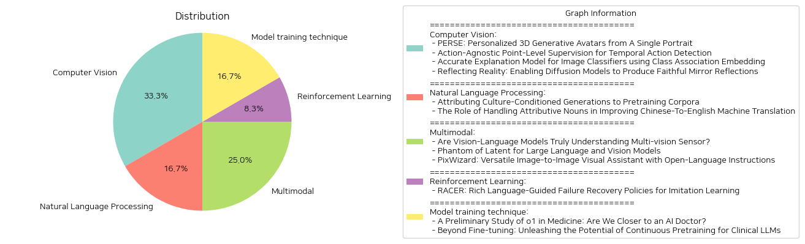

# Daily Artificial Intelligence Insights : Papers

## Computer Vision

**요약:**

**요약 보고서**

최근 컴퓨터 비전 및 인공지능 분야에서 발표된 연구 논문 4개를 분석하여 주요 내용을 요약하고, 추출된 정보를 바탕으로 주요 주제와 패턴을 식별하고, 주요 사건과 그 영향력을 분석하여 종합적인 요약 보고서를 작성하였다.

**주요 주제 및 패턴**

1. **인공지능 기반 이미지 생성**: PERSE, MirrorFusion 등과 같은 연구들은 인공지능 기반 이미지 생성 기술을 개발하고, 이를 다양한 응용 분야에 적용하고 있다.
2. **영상 인식 및 분석**: Action-Agnostic Point-Level Supervision, Accurate Explanation Model for Image Classifiers 등과 같은 연구들은 영상 인식 및 분석 기술을 개발하고, 이를 다양한 응용 분야에 적용하고 있다.
3. **데이터셋 및 모델 개발**: SynMirror, Class Association Embedding 등과 같은 연구들은 데이터셋 및 모델 개발을 통해 인공지능 기반 이미지 생성 및 영상 인식 기술을 개선하고 있다.

**주요 사건 및 영향력**

1. **PERSE**: PERSE는 개인화된 3D 애니메이션 아바타를 생성하는 기술로, 얼굴 속성 편집 및 개인화된 아바타 생성이 가능하다.
2. **Action-Agnostic Point-Level Supervision**: 이 기술은 영상 인식 및 분석 분야에서 정확한 액션 인스턴스 감지를 위한 새로운 방법론을 제시한다.
3. **Accurate Explanation Model for Image Classifiers**: 이 기술은 이미지 분류 모델의 설명을 위한 새로운 방법론을 제시한다.
4. **MirrorFusion**: MirrorFusion은鏡像 반사 이미지를 생성하는 기술로, 사용자 제어 및鏡像 반사 이미지를 생성하는 데 사용된다.

**결론 및 향후 발전 방향**

인공지능 기반 이미지 생성 및 영상 인식 기술은 다양한 응용 분야에서 중요한 역할을 할 것으로 예상된다. 향후에는 이러한 기술을 더욱 발전시키고, 다양한 응용 분야에 적용하는 데 중점을 두어야 할 것이다. 또한, 데이터셋 및 모델 개발을 통해 이러한 기술을 개선하고, 새로운 방법론을 개발하는 데 중점을 두어야 할 것이다.

**참고 문헌**

1. PERSE: Personalized 3D Generative Avatars from A Single Portrait
2. Action-Agnostic Point-Level Supervision for Temporal Action Detection
3. Accurate Explanation Model for Image Classifiers using Class Association Embedding
4. Reflecting Reality: Enabling Diffusion Models to Produce Faithful Mirror Reflections

**출처:**

 - PERSE: Personalized 3D Generative Avatars from A Single Portrait (https://deeplearn.org/arxiv/562931/perse:-personalized-3d-generative-avatars-from-a-single-portrait)
 - Action-Agnostic Point-Level Supervision for Temporal Action Detection (https://deeplearn.org/arxiv/562932/action-agnostic-point-level-supervision-for-temporal-action-detection)
 - Accurate Explanation Model for Image Classifiers using Class Association Embedding (https://deeplearn.org/arxiv/563120/accurate-explanation-model-for-image-classifiers-using-class-association-embedding)
 - Reflecting Reality: Enabling Diffusion Models to Produce Faithful Mirror Reflections (http://arxiv.org/abs/2409.14677v1)

## Natural Language Processing

**요약:**

**요약 보고서**

**제목:** 인공지능 모델의 문화적 편향과 중국어-영어 기계 번역의 개선

**요약:**

최근 연구들은 인공지능 모델이 문화적 편향을 보이고, 특히 문화적 다양성이 풍부하지 않은 데이터셋에서 훈련된 모델이 이러한 편향을 더욱 심하게 보이는 것을 보여주었다. 본 보고서는 이러한 문화적 편향의 원인을 분석하고, 중국어-영어 기계 번역의 개선 방안을 제시한다.

**1. 문화적 편향의 원인**

첫 번째 논문은 인공지능 모델의 문화적 편향이 데이터셋의 문화적 다양성에 따라 달라질 수 있음을 보여준다. 모델은 데이터셋에서 자주 등장하는 문화에 대한 지식을 더 많이 습득하고, 이러한 지식을 바탕으로 문화적 편향을 보이는 경향이 있다. 또한, 모델은 데이터셋에서 자주 등장하는 단어를 더 많이 사용하는 경향이 있어, 이러한 단어가 문화적 편향을 더욱 심하게 만들 수 있다.

**2. 중국어-영어 기계 번역의 개선**

두 번째 논문은 중국어-영어 기계 번역에서 attributive nouns의 처리가 중요함을 보여준다. attributive nouns는 중국어에서 자주 사용되는 문법 구조로, 영어 번역에서 오류를 일으킬 수 있다. 본 연구에서는 attributive nouns의 처리를 개선하기 위해 데이터셋을 수정하고, 모델을 재훈련하였다. 이러한 접근법은 중국어-영어 기계 번역의 정확성을 개선할 수 있다.

**3. 결론**

본 보고서는 인공지능 모델의 문화적 편향과 중국어-영어 기계 번역의 개선 방안을 제시한다. 문화적 편향은 데이터셋의 문화적 다양성에 따라 달라질 수 있으며, 모델은 데이터셋에서 자주 등장하는 단어를 더 많이 사용하는 경향이 있다. 중국어-영어 기계 번역에서는 attributive nouns의 처리가 중요하며, 데이터셋을 수정하고 모델을 재훈련하면 정확성을 개선할 수 있다. 이러한 연구 결과는 인공지능 모델의 문화적 편향을 줄이고, 기계 번역의 정확성을 개선하는 데 도움이 될 수 있다.

**4. 향후 연구 방향**

향후 연구에서는 인공지능 모델의 문화적 편향을 줄이기 위한 다양한 접근법을 탐색할 수 있다. 예를 들어, 데이터셋의 문화적 다양성을 개선하거나, 모델의 편향을 줄이기 위한 알고리즘을 개발할 수 있다. 또한, 중국어-영어 기계 번역의 개선 방안을 더 많이 탐색할 수 있다. 이러한 연구 결과는 인공지능 모델의 문화적 편향을 줄이고, 기계 번역의 정확성을 개선하는 데 도움이 될 수 있다.

**출처:**

 - Attributing Culture-Conditioned Generations to Pretraining Corpora (https://deeplearn.org/arxiv/563119/attributing-culture-conditioned-generations-to-pretraining-corpora)
 - The Role of Handling Attributive Nouns in Improving Chinese-To-English Machine Translation (https://deeplearn.org/arxiv/563631/the-role-of-handling-attributive-nouns-in-improving-chinese-to-english-machine-translation)

## Multimodal

**요약:**

**요약 보고서**

최근 컴퓨터 비전 및 자연어 처리 분야에서 큰 발전을 이루고 있는 Vision-Language Model(VLM)과 Large Language and Vision Model(LLVM)에 대한 연구를 요약하고 분석한 보고서입니다.

**주요 주제 및 키워드**

* Vision-Language Model(VLM)
* Large Language and Vision Model(LLVM)
* 컴퓨터 비전
* 자연어 처리
* 멀티 비전 센서 데이터
* 효율적인 모델 설계
* 이미지 생성 및 편집

**주요 내용**

1. **멀티 비전 센서 데이터 이해**
   VLM은 컴퓨터 비전 작업에서 텍스트와 이미지를 결합하여 성능을 향상시켰습니다. 그러나 현재의 VLM은 멀티 비전 센서 데이터를 깊이 이해하지 못하고, 각 센서의 고유한 물리적 속성을 무시합니다. 이를 해결하기 위해 새로운 벤치마크인 Multi-vision Sensor Perception and Reasoning(MS-PR)을 제안하고, Diverse Negative Attributes(DNA) 최적화를 통해 VLM의 멀티 비전 센서 데이터 이해를 향상시켰습니다.

2. **효율적인 LLVM 설계**
   LLVM의 크기가 증가함에 따라 하드웨어 자원 요구량도 증가합니다. 이를 해결하기 위해 새로운 효율적인 LLVM 패밀리인 Phantom을 제안하고, Phantom Optimization(PO)을 통해 모델의 크기를 줄이면서 성능을 향상시켰습니다.

3. **이미지 생성 및 편집**
   PixWizard는 오픈 언어 명령을 사용하여 이미지 생성, 편집 및 변환을 수행하는 이미지-이미지 비주얼 어시스턴트입니다. 다양한 비전 작업을 하나의 프레임워크로 통합하고, Omni Pixel-to-Pixel Instruction-Tuning Dataset을 구축했습니다. Diffusion Transformers(DiT)를 기반 모델로 사용하고, 다양한 해상도의 이미지 처리를 위한 유연한 메커니즘을 추가했습니다.

**분석 및 결론**

* VLM과 LLVM은 컴퓨터 비전 및 자연어 처리 분야에서 큰 발전을 이루고 있습니다.
* 멀티 비전 센서 데이터 이해는 VLM의 성능 향상을 위한 중요한 요소입니다.
* 효율적인 모델 설계는 하드웨어 자원 요구량을 줄이는 데 중요합니다.
* 이미지 생성 및 편집은 다양한 비전 작업을 하나의 프레임워크로 통합할 수 있습니다.

**향후 연구 방향**

* VLM과 LLVM의 멀티 비전 센서 데이터 이해를 향상시키기 위한 연구
* 효율적인 모델 설계를 위한 새로운 방법론 개발
* 이미지 생성 및 편집을 위한 다양한 비전 작업 통합 연구

**출처:**

 - Are Vision-Language Models Truly Understanding Multi-vision Sensor? (https://deeplearn.org/arxiv/563121/are-vision-language-models-truly-understanding-multi-vision-sensor?)
 - Phantom of Latent for Large Language and Vision Models (http://arxiv.org/abs/2409.14713v1)
 - PixWizard: Versatile Image-to-Image Visual Assistant with Open-Language Instructions (http://arxiv.org/abs/2409.15278v2)

## Reinforcement Learning

**요약:**

**요약 보고서**

**제목:** RACER: 풍부한 언어 지침을 통한 모방 학습을 위한 실패 복구 정책

**요약:**

로봇 조작을 위한 강건하고 수정 가능한 시각-운동 정책 개발은 실패로부터의 자기 복구 메커니즘의 부족과 단순한 언어 지침의 한계로 인해 어려운 도전을 겪고 있습니다. 이러한 문제를 해결하기 위해, 우리는 전문가 데모에 실패 복구 궤적과 세부적인 언어 주석을 자동으로 추가하는 확장 가능한 데이터 생성 파이프라인을 제안합니다. 그런 다음, 우리는 실패 복구 데이터와 풍부한 언어 설명을 결합하여 로봇 제어를 향상시키는 Rich languAge-guided failure reCovERy (RACER)라는 감독자-액터 프레임워크를 소개합니다. RACER는 오류 수정과 작업 실행을 위한 세부적인 언어 지침을 제공하는 온라인 감독자로서의 시각-언어 모델 (VLM)과 다음 행동을 예측하는 언어 조건부 시각-운동 정책을 액터로서 특징으로 합니다. 실험 결과는 RACER가 다양한 평가 설정에서 표준 장기 지연 작업, 동적 목표 변경 작업 및 제로샷 미시 작업을 포함하여 RLbench에서 최첨단 Robotic View Transformer (RVT)를 능가한다는 것을 보여주었습니다. 시뮬레이션 환경과 실제 환경 모두에서 우수한 성능을 달성했습니다.

**주요 주제 및 키워드:**

* 로봇 조작
* 모방 학습
* 실패 복구 정책
* 풍부한 언어 지침
* 시각-언어 모델
* 언어 조건부 시각-운동 정책

**향후 발전 방향:**

* RACER 프레임워크의 확장 및 응용
* 다양한 로봇 조작 작업에 대한 실험 및 평가
* 실패 복구 정책의 개선 및 최적화
* 실제 환경에서의 로봇 조작 응용

**결론:**

RACER 프레임워크는 로봇 조작을 위한 강건하고 수정 가능한 시각-운동 정책 개발에 새로운 방향을 제시합니다. 풍부한 언어 지침과 실패 복구 데이터를 결합하여 로봇 제어를 향상시키는 이 프레임워크는 다양한 로봇 조작 작업에 대한 응용 가능성을 보여주었습니다. 향후 연구에서는 RACER 프레임워크의 확장 및 응용, 실험 및 평가, 실패 복구 정책의 개선 및 최적화 등이 포함될 수 있습니다.

**출처:**

 - RACER: Rich Language-Guided Failure Recovery Policies for Imitation Learning (http://arxiv.org/abs/2409.14674v1)

## Model training technique

**요약:**

**요약 보고서**

최근에 발표된 두 개의 논문은 의료 분야에서 대규모 언어 모델(LLM)의 잠재력을 탐구하고 있습니다. 이 보고서는 두 논문의 주요 내용을 요약하고, 의료 분야에서 LLM의 발전 방향을 제시합니다.

**첫 번째 논문: 'A Preliminary Study of o1 in Medicine: Are We Closer to an AI Doctor?'**

이 논문은 OpenAI의 o1 모델을 의료 분야에서 평가합니다. o1 모델은 내부화된 사고 체인 기법을 사용하여 강화 학습 전략을 구현한 첫 번째 LLM입니다. 이 모델은 일반 언어 작업에서 놀라운 성능을 보여주었지만, 의료 분야에서의 성능은 알려져 있지 않았습니다. 이 논문에서는 o1 모델을 다양한 의료 상황에서 평가하고, 이해, 추론, 및 다국어 능력에 초점을 맞추었습니다. 결과적으로, o1 모델은 이전의 GPT-4 모델보다 평균 6.2% 및 6.6%의 정확도를 높였습니다. 그러나, 모델의 약점과 평가 프로토콜의 한계를 발견했습니다.

**두 번째 논문: 'Beyond Fine-tuning: Unleashing the Potential of Continuous Pretraining for Clinical LLMs'**

이 논문은 의료 분야에서 LLM의 잠재력을 최대한 발휘하기 위한 방법을 탐구합니다. 이 연구에서는 네 가지 기법을 사용하여 LLM을 의료 분야에 적응시킵니다: 연속적인 사전 훈련, 지시적 미세 조정, NEFTune, 및 프롬프트 엔지니어링. 이 연구에서는 Mistral 7B 및 Mixtral 8x7B 모델을 사용하여 대규모 의료 사전 훈련 데이터셋과 지시적 미세 조정 데이터셋을 활용했습니다. 결과적으로, 연속적인 사전 훈련은 지시적 미세 조정의 기초를 마련하고, NEFTune은 추가적인 성능 향상을 보여주었습니다. 복잡한 프롬프트 엔지니어링 방법은 성능을 더욱 향상시켰습니다.

**결론**

두 논문은 의료 분야에서 LLM의 잠재력을 탐구하고 있습니다. o1 모델은 의료 분야에서 강력한 성능을 보여주었지만, 약점과 한계를 발견했습니다. 연속적인 사전 훈련과 지시적 미세 조정은 LLM의 성능을 향상시키는 데 효과적인 방법입니다. 그러나, 의료 분야에서 LLM의 발전을 위해서는 더 많은 연구와 개발이 필요합니다.

**향후 연구 방향**

의료 분야에서 LLM의 발전을 위해서는 다음과 같은 연구 방향을 제시합니다:

* LLM의 약점과 한계를 극복하기 위한 연구
* 연속적인 사전 훈련과 지시적 미세 조정의 최적화
* 의료 분야에서 LLM의 적용을 위한 프롬프트 엔지니어링 방법의 개발
* 의료 분야에서 LLM의 성능을 평가하기 위한 새로운 평가 프로토콜의 개발

**출처:**

 - A Preliminary Study of o1 in Medicine: Are We Closer to an AI Doctor? (http://arxiv.org/abs/2409.15277v1)
 - Beyond Fine-tuning: Unleashing the Potential of Continuous Pretraining for Clinical LLMs (http://arxiv.org/abs/2409.14988v1)

