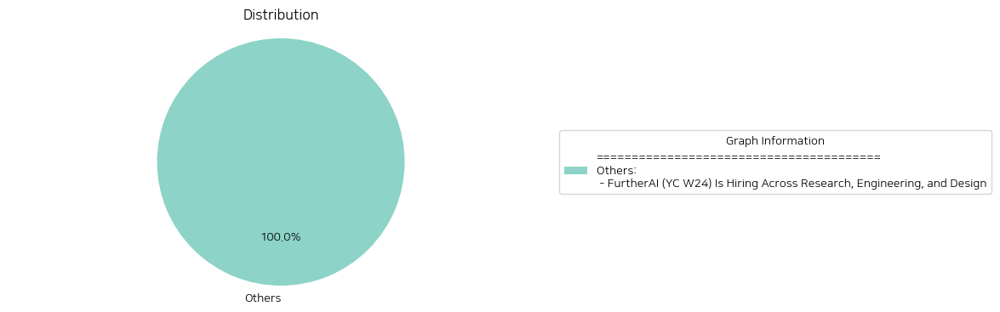

# Daily Artificial Intelligence Insights : News

## Others

**요약:**

**1. 주요 주제 (Key Themes)**:
인공지능 기술의 발전과 그 응용 분야, 특히 보험 업계에서의 자동화, 인공지능 기술의 신뢰성과 적응성, 스타트업의 성장과 투자 등이 주요 주제로 나타납니다.

**2. 주요 사건 (Major Events)**:
FurtherAI는 보험 업무 자동화를 목표로 하는 인공지능 팀메이트를 개발 중이며, 애플의 언어 모델링 과학자와 함께 설립된 경험이 풍부한 창립 팀을 보유하고 있습니다. FurtherAI는 유명한 투자자들로부터 자금을 확보하였으며, 연구, 엔지니어링, 디자인 분야에서 인재를 모집하고 있습니다.

**3. 영향 분석 (Impact Analysis)**:
이러한 사건은 다음과 같은 분야에 영향을 미칠 수 있습니다.
- 경제: FurtherAI의 보험 업무 자동화 기술은 보험 업계의 효율성을 높이고 비용을 절감할 수 있습니다. 또한, 인공지능 기술의 발전은 새로운 직업 창출과 산업의 성장을 촉진할 수 있습니다.
- 정치: FurtherAI의 기술은 보험 업계의 규제와 정책에 영향을 미칠 수 있습니다. 정부는 인공지능 기술의 발전을 지원하고 규제를 마련해야 할 수 있습니다.
- 사회: FurtherAI의 기술은 보험 업무의 자동화로 인해 일자리 감소의 우려가 있습니다. 그러나, 새로운 직업 창출과 산업의 성장은 이러한 영향을 상쇄할 수 있습니다.

**4. 최종 요약 (Final Summary)**:
FurtherAI의 보험 업무 자동화 기술은 보험 업계의 효율성을 높이고 비용을 절감할 수 있습니다. 인공지능 기술의 발전은 새로운 직업 창출과 산업의 성장을 촉진할 수 있습니다. 그러나, 이러한 기술의 발전은 규제와 정책의 마련이 필요하며, 일자리 감소의 우려도 있습니다. 향후, FurtherAI의 기술 발전과 보험 업계의 변화에 주목해야 할 것입니다.

**출처:**

 - FurtherAI (YC W24) Is Hiring Across Research, Engineering, and Design (https://www.ycombinator.com/companies/furtherai/jobs)

