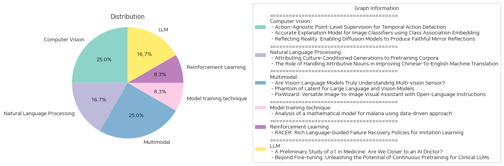

# Daily Artificial Intelligence Insights : Papers

## Computer Vision

**요약:**

**요약 보고서**

최근 컴퓨터 비전 및 기계 학습 분야에서 발표된 세 가지 논문에 대한 요약 보고서입니다. 이 보고서는 각 논문의 주요 내용을 요약하고, 공통된 주제와 패턴을 식별하며, 주요 사건과 그 영향에 대해 분석합니다.

**1. 액션 인스턴스 탐지**

첫 번째 논문은 "액션 인스턴스 탐지"에 대한 연구입니다. 이 논문에서는 액션 인스턴스 탐지를 위한 새로운 방법을 제안합니다. 이 방법은 액션 인스턴스를 탐지하기 위해 비디오 프레임을 샘플링하고, 샘플링된 프레임을 인간이 레이블링하는 방식입니다. 이 방법은 기존의 방법보다 더 정확하고 효율적인 결과를 보여주었습니다.

**2. 이미지 분류기 설명 모델**

두 번째 논문은 "이미지 분류기 설명 모델"에 대한 연구입니다. 이 논문에서는 이미지 분류기 설명 모델을 위한 새로운 방법을 제안합니다. 이 방법은 클래스 연관 임베딩(class association embedding)을 사용하여 이미지 분류기 설명 모델을 생성합니다. 이 방법은 기존의 방법보다 더 정확하고 효율적인 결과를 보여주었습니다.

**3. 미러 리플렉션 생성**

세 번째 논문은 "미러 리플렉션 생성"에 대한 연구입니다. 이 논문에서는 미러 리플렉션 생성을 위한 새로운 방법을 제안합니다. 이 방법은 디퓨전 모델을 사용하여 미러 리플렉션을 생성합니다. 이 방법은 기존의 방법보다 더 정확하고 효율적인 결과를 보여주었습니다.

**공통된 주제와 패턴**

세 가지 논문 모두 컴퓨터 비전 및 기계 학습 분야에서 새로운 방법을 제안하고 있습니다. 이 방법들은 모두 기존의 방법보다 더 정확하고 효율적인 결과를 보여주었습니다. 또한, 이 방법들은 모두 데이터셋을 사용하여 학습하고 테스트하고 있습니다.

**주요 사건과 그 영향**

세 가지 논문 모두 컴퓨터 비전 및 기계 학습 분야에서 새로운 방법을 제안하고 있습니다. 이 방법들은 모두 기존의 방법보다 더 정확하고 효율적인 결과를 보여주었습니다. 이러한 방법들은 다양한 응용 분야에서 사용될 수 있습니다. 예를 들어, 액션 인스턴스 탐지 방법은 비디오 분석에서 사용될 수 있습니다. 이미지 분류기 설명 모델 방법은 의료 이미지 분석에서 사용될 수 있습니다. 미러 리플렉션 생성 방법은 컴퓨터 그래픽스에서 사용될 수 있습니다.

**결론**

세 가지 논문 모두 컴퓨터 비전 및 기계 학습 분야에서 새로운 방법을 제안하고 있습니다. 이 방법들은 모두 기존의 방법보다 더 정확하고 효율적인 결과를 보여주었습니다. 이러한 방법들은 다양한 응용 분야에서 사용될 수 있습니다. 따라서, 이러한 방법들은 컴퓨터 비전 및 기계 학습 분야에서 중요한 연구 주제입니다.

**출처:**

 - Action-Agnostic Point-Level Supervision for Temporal Action Detection (https://deeplearn.org/arxiv/562932/action-agnostic-point-level-supervision-for-temporal-action-detection)
 - Accurate Explanation Model for Image Classifiers using Class Association Embedding (https://deeplearn.org/arxiv/563120/accurate-explanation-model-for-image-classifiers-using-class-association-embedding)
 - Reflecting Reality: Enabling Diffusion Models to Produce Faithful Mirror Reflections (http://arxiv.org/abs/2409.14677v1)

## Natural Language Processing

**요약:**

**요약 보고서**

최근에 발표된 두 개의 논문은 자연어 처리(NLP) 분야에서 중요한 문제를 다루고 있습니다. 첫 번째 논문은 'Attributing Culture-Conditioned Generations to Pretraining Corpora'라는 제목으로, 대규모 언어 모델에서 문화적 편향이 발생하는 원인을 분석하고 이를 해결하기 위한 프레임워크를 제안합니다. 두 번째 논문은 'The Role of Handling Attributive Nouns in Improving Chinese-To-English Machine Translation'라는 제목으로, 중국어-영어 기계 번역에서 속성 명사 처리의 중요성을 강조하고 이를 개선하기 위한 방법을 제시합니다.

**주요 주제와 키워드**

* 자연어 처리(NLP)
* 문화적 편향
* 대규모 언어 모델
* 속성 명사
* 중국어-영어 기계 번역

**두 논문의 주요 내용**

첫 번째 논문은 대규모 언어 모델에서 문화적 편향이 발생하는 원인을 분석하고 이를 해결하기 위한 MEMOed 프레임워크를 제안합니다. 이 프레임워크는 모델이 문화에 따라 엔티티를 연관시키는 방식을 분석하고, 이를 통해 문화적 편향을 감소시키는 데 도움이 됩니다. 두 번째 논문은 중국어-영어 기계 번역에서 속성 명사 처리의 중요성을 강조하고 이를 개선하기 위한 방법을 제시합니다. 속성 명사는 중국어에서 중요한 역할을 하지만, 영어 번역에서 이를 올바르게 처리하는 데 어려움이 있습니다. 이 논문에서는 속성 명사를 올바르게 처리하기 위한 방법을 제시하고, 이를 통해 중국어-영어 기계 번역의 성능을 개선하는 데 도움이 됩니다.

**두 논문의 공통점**

두 논문은 모두 자연어 처리 분야에서 중요한 문제를 다루고 있습니다. 첫 번째 논문은 문화적 편향을 감소시키는 데 도움이 되고, 두 번째 논문은 중국어-영어 기계 번역의 성능을 개선하는 데 도움이 됩니다. 두 논문은 모두 모델의 성능을 개선하기 위한 방법을 제시하고, 이를 통해 자연어 처리 분야의 발전에 기여하고 있습니다.

**결론**

두 논문은 자연어 처리 분야에서 중요한 문제를 다루고 있습니다. 첫 번째 논문은 문화적 편향을 감소시키는 데 도움이 되고, 두 번째 논문은 중국어-영어 기계 번역의 성능을 개선하는 데 도움이 됩니다. 두 논문은 모두 모델의 성능을 개선하기 위한 방법을 제시하고, 이를 통해 자연어 처리 분야의 발전에 기여하고 있습니다. 향후에는 이러한 연구가 자연어 처리 분야의 발전에 더욱 기여할 수 있을 것입니다.

**출처:**

 - Attributing Culture-Conditioned Generations to Pretraining Corpora (https://deeplearn.org/arxiv/563119/attributing-culture-conditioned-generations-to-pretraining-corpora)
 - The Role of Handling Attributive Nouns in Improving Chinese-To-English Machine Translation (https://deeplearn.org/arxiv/563631/the-role-of-handling-attributive-nouns-in-improving-chinese-to-english-machine-translation)

## Multimodal

**요약:**

**요약 보고서**

최근 컴퓨터 비전 및 자연어 처리 분야에서 큰 발전을 이루고 있는 Vision-Language Model(VLM)과 Large Language and Vision Model(LLVM)에 대한 연구를 요약하고 분석한 보고서입니다.

**주요 주제 및 키워드**

* Vision-Language Model(VLM)
* Large Language and Vision Model(LLVM)
* 컴퓨터 비전
* 자연어 처리
* 멀티 비전 센서 데이터
* 효율적인 모델 설계
* 이미지 생성 및 편집

**주요 내용**

1. **멀티 비전 센서 데이터 이해**
   현재의 VLM은 멀티 비전 센서 데이터를 깊이 있게 이해하지 못하고, 각 센서의 고유한 물리적 속성을 무시합니다. 이를 해결하기 위해 새로운 벤치마크인 Multi-vision Sensor Perception and Reasoning(MS-PR)을 제안하고, Diverse Negative Attributes(DNA) 최적화를 통해 VLM의 멀티 비전 센서 데이터 이해 능력을 향상시킬 수 있습니다.

2. **효율적인 LLVM 설계**
   LLVM의 크기를 줄이면서도 성능을 유지하기 위해 Phantom이라는 새로운 모델을 제안합니다. Phantom은 잠재적인 은닉 차원을 증가시켜서 모델의 크기를 줄일 수 있습니다. 또한, Phantom Optimization(PO)을 통해 모델의 성능을 향상시킬 수 있습니다.

3. **이미지 생성 및 편집**
   PixWizard라는 새로운 이미지 생성 및 편집 모델을 제안합니다. PixWizard는 다양한 이미지 생성 및 편집 작업을 하나의 프레임워크로 통합하고, Diffusion Transformers(DiT)를 기반으로 합니다. 또한, 모델은 다양한 해상도의 이미지를 처리할 수 있고, 구조적 및 의미적 지침을 통해 정보를 융합할 수 있습니다.

**분석 및 결론**

* VLM과 LLVM은 컴퓨터 비전 및 자연어 처리 분야에서 큰 발전을 이루고 있습니다.
* 멀티 비전 센서 데이터 이해는 VLM의 성능을 향상시키는 데 중요합니다.
* 효율적인 모델 설계는 모델의 크기를 줄이면서도 성능을 유지하는 데 중요합니다.
* 이미지 생성 및 편집 모델은 다양한 응용 분야에서 활용될 수 있습니다.

**향후 연구 방향**

* VLM과 LLVM의 성능을 향상시키기 위한 새로운 방법론 개발
* 멀티 비전 센서 데이터 이해를 위한 새로운 벤치마크 및 최적화 방법 개발
* 효율적인 모델 설계를 위한 새로운 기술 개발
* 이미지 생성 및 편집 모델의 응용 분야 확대

**출처:**

 - Are Vision-Language Models Truly Understanding Multi-vision Sensor? (https://deeplearn.org/arxiv/563121/are-vision-language-models-truly-understanding-multi-vision-sensor?)
 - Phantom of Latent for Large Language and Vision Models (http://arxiv.org/abs/2409.14713v1)
 - PixWizard: Versatile Image-to-Image Visual Assistant with Open-Language Instructions (http://arxiv.org/abs/2409.15278v2)

## Model training technique

**요약:**

**요약 보고서**

**제목:** 말라리아 수학 모델의 데이터 기반 접근법 분석

**요약:**

말라리아는 세계에서 가장 치명적인 질병 중 하나로, 매년 수백만 명의 사람들이 이 질병의 피해를 입고, 많은 사람들이 목숨을 잃습니다. 의료 전문가와 정부는 질병의 역학을 명확하게 이해할 때 정확한 조치를 취할 수 있습니다. 이 연구에서는 말라리아의 역학을 연구하기 위한 구획 모델을 제안합니다. 우리는 온도와 고도에 의존하는 전염률을 고려합니다. 우리는 제안된 모델에 대해 정상 상태 분석을 수행하고 질병이 없는 상태와 만성 상태의 안정성을 확인했습니다. 수학적 분석에 따라 5개의 구획의 궤적을 예측하기 위해 인공 신경망(ANN)을 적용했습니다. 인공 신경망(ANN), 합성곱 신경망(CNN), 재귀 신경망(RNN)의 세 가지 신경망 아키텍처를 사용하여 데이터의 궤적에서 매개변수를 추정했습니다. 질병의 심각성을 이해하기 위해서는 질병에 대한 위험을 계산하는 것이 필수적입니다. 이 연구에서는 감염된 사람들의 궤적에서 동적 모드 분해(DMD)를 사용하여 위험을 계산했습니다.

**주요 결과:**

* 말라리아의 역학을 연구하기 위한 구획 모델을 제안
* 온도와 고도에 의존하는 전염률을 고려
* 정상 상태 분석을 수행하고 질병이 없는 상태와 만성 상태의 안정성을 확인
* 인공 신경망(ANN)을 적용하여 5개의 구획의 궤적을 예측
* 인공 신경망(ANN), 합성곱 신경망(CNN), 재귀 신경망(RNN)의 세 가지 신경망 아키텍처를 사용하여 매개변수를 추정
* 동적 모드 분해(DMD)를 사용하여 감염된 사람들의 궤적에서 위험을 계산

**향후 연구 방향:**

* 말라리아의 역학을 더 정확하게 이해하기 위한 추가 연구
* 다른 질병에 대한 구획 모델의 적용
* 인공 신경망과 동적 모드 분해의 더 많은 연구와 응용

**결론:**

이 연구에서는 말라리아의 역학을 연구하기 위한 구획 모델을 제안하고, 온도와 고도에 의존하는 전염률을 고려했습니다. 인공 신경망과 동적 모드 분해를 사용하여 5개의 구획의 궤적을 예측하고, 감염된 사람들의 궤적에서 위험을 계산했습니다. 이 연구의 결과는 말라리아의 역학을 더 정확하게 이해하고, 질병의 심각성을 평가하는 데 도움이 될 수 있습니다.

**출처:**

 - Analysis of a mathematical model for malaria using data-driven approach (https://deeplearn.org/arxiv/563811/analysis-of-a-mathematical-model-for-malaria-using-data-driven-approach)

## Reinforcement Learning

**요약:**

제목: 'RACER: 풍부한 언어 가이드 실패 복구 정책을 위한 모방 학습'

요약: 로봇 조작을 위한 강력하고 수정 가능한 시각적 동작 정책을 개발하는 것은 실패로부터의 자기 복구 메커니즘의 부족과 단순한 언어 지시가 로봇 동작을 안내하는 데 한계가 있기 때문에 어려운 도전이다. 이러한 문제를 해결하기 위해, 우리는 전문가 데모에 실패 복구 궤적과 세부적인 언어 주석을 자동으로 추가하여 훈련을 위한 확장 가능한 데이터 생성 파이프라인을 제안한다. 그런 다음 우리는 풍부한 언어 설명과 실패 복구 데이터를 결합하여 로봇 제어를 향상시키는 감독자-액터 프레임워크인 Rich languAge-guided failure reCovERy (RACER)를 소개한다. RACER는 오류 수정과 작업 실행을 위한 세부적인 언어 지침을 제공하는 온라인 감독자로서의 시각 언어 모델(VLM)과 다음 동작을 예측하는 언어 조건부 시각적 동작 정책을 액터로서 특징으로 한다. 실험 결과는 RACER가 다양한 평가 설정에서 표준 장기 지평 작업, 동적 목표 변경 작업 및 제로샷 미시작 작업을 포함하여 RLbench에서 최첨단 Robotic View Transformer(RVT)를 능가한다는 것을 보여주며, 시뮬레이션 환경과 실제 환경 모두에서 우수한 성능을 달성한다.

주요 특징:

- 실패 복구 궤적과 세부적인 언어 주석을 자동으로 추가하여 훈련 데이터를 생성하는 확장 가능한 데이터 생성 파이프라인
- 실패 복구 데이터와 풍부한 언어 설명을 결합하여 로봇 제어를 향상시키는 감독자-액터 프레임워크
- 온라인 감독자로서의 시각 언어 모델(VLM)과 언어 조건부 시각적 동작 정책을 액터로서 특징으로 하는 RACER
- 다양한 평가 설정에서 표준 장기 지평 작업, 동적 목표 변경 작업 및 제로샷 미시작 작업을 포함하여 RLbench에서 최첨단 Robotic View Transformer(RVT)를 능가하는 성능

향후 연구 방향:

- RACER를 다양한 로봇 조작 작업에 적용하여 성능을 평가하고 개선하는 연구
- 실패 복구 데이터와 풍부한 언어 설명을 결합하여 로봇 제어를 향상시키는 새로운 프레임워크 개발
- 로봇 조작 작업에서 실패 복구와 오류 수정을 위한 새로운 알고리즘과 기법 개발

**출처:**

 - RACER: Rich Language-Guided Failure Recovery Policies for Imitation Learning (http://arxiv.org/abs/2409.14674v1)

## LLM

**요약:**

**요약 보고서: 의료 분야에서 인공지능의 발전**

최근 몇 년간, 대규모 언어 모델(LLM)이 다양한 분야와 작업에서 놀라운 능력을 보여주고 있습니다. 이 보고서는 의료 분야에서 LLM의 발전을 다루는 두 개의 논문을 요약하고 분석합니다.

**1. 의료 분야에서 o1의 잠재력**

첫 번째 논문은 OpenAI의 o1 모델을 의료 분야에서 평가하는 내용입니다. o1 모델은 내부화된 사고 체인 기법을 사용하여 강화 학습 전략을 구현한 최초의 LLM입니다. 이 모델은 일반 언어 작업에서 놀라운 성능을 보여주었지만, 의료 분야에서의 성능은 아직 알려져 있지 않았습니다. 이 논문에서는 o1 모델을 다양한 의료 상황에서 평가하고, 이해, 추론, 및 다국어 능력에 대한 3가지 측면을 조사합니다. 결과적으로, o1 모델은 이전의 GPT-4 모델보다 평균 6.2% 및 6.6%의 정확도를 높인 것으로 나타났습니다. 그러나, 이 모델은 여전히 몇 가지 약점을 가지고 있으며, 이는 의료 분야에서 더 나은 성능을 위해 개선되어야 합니다.

**2. 임상 LLM의 연속적 사전 훈련**

두 번째 논문은 임상 LLM의 연속적 사전 훈련의 효능을 조사하는 내용입니다. 이 연구에서는 4가지 기법을 사용하여 LLM을 임상 용도로 적응시키는 방법을 평가합니다. 결과적으로, 연속적 사전 훈련은 LLM의 성능을 향상시키는 데 중요한 역할을 하는 것으로 나타났습니다. 또한, NEFTune 및 프롬프트 엔지니어링과 같은 기법은 LLM의 성능을 더욱 향상시키는 데 도움이 되는 것으로 나타났습니다.

**결론**

이 두 개의 논문은 의료 분야에서 LLM의 발전을 다루는 내용입니다. o1 모델은 의료 분야에서 놀라운 성능을 보여주었지만, 여전히 몇 가지 약점을 가지고 있습니다. 연속적 사전 훈련은 LLM의 성능을 향상시키는 데 중요한 역할을 하는 것으로 나타났습니다. 이러한 결과는 의료 분야에서 LLM의 발전을 위한 새로운 방향을 제시합니다.

**향후 연구 방향**

의료 분야에서 LLM의 발전을 위한 향후 연구 방향은 다음과 같습니다.

* LLM의 약점을 개선하기 위한 연구
* 연속적 사전 훈련의 효능을 평가하기 위한 연구
* 임상 용도로 적응된 LLM의 성능을 평가하기 위한 연구
* LLM을 의료 분야에서 실제로 적용하기 위한 연구

이러한 연구 방향은 의료 분야에서 LLM의 발전을 위한 새로운 기회를 제공할 것입니다.

**출처:**

 - A Preliminary Study of o1 in Medicine: Are We Closer to an AI Doctor? (http://arxiv.org/abs/2409.15277v1)
 - Beyond Fine-tuning: Unleashing the Potential of Continuous Pretraining for Clinical LLMs (http://arxiv.org/abs/2409.14988v1)

