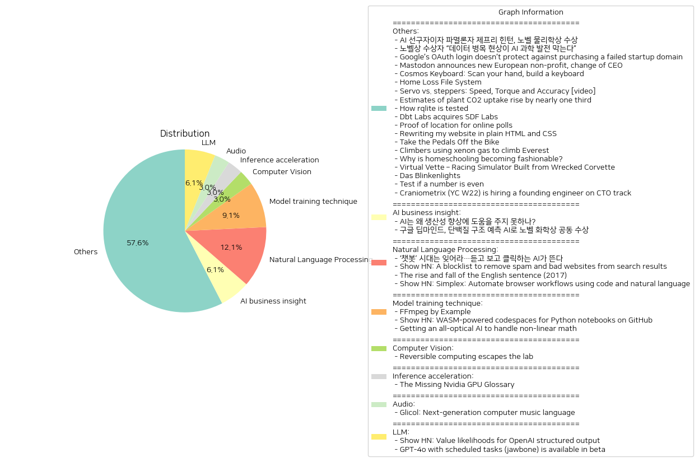

# Daily Artificial Intelligence Insights : News

## Others

**요약:**

**요약 보고서**

**1. 주요 주제**

다음은 여러 뉴스 기사에서 추출한 주요 주제입니다.

* 인공지능(AI) 및 기술 발전
* 과학 및 환경
* 교육 및 사회
* 경제 및 산업
* 기술 및 혁신

**2. 주요 사건**

다음은 각 뉴스 기사에서 추출한 주요 사건입니다.

* 제프리 힌턴 교수가 노벨 물리학상을 수상했습니다.
* AI를 과학적 발견의 도구로 사용하려면 고품질 데이터가 필요합니다.
* 구글의 OAuth 로그인 시스템에 취약점이 발견되었습니다.
* 마스토돈이 새로운 유럽 비영리 단체로 전환했습니다.
* 코스모스 키보드가 출시되었습니다.
* 집 손실 복구 시스템이 개발되었습니다.
* 식물이 이산화탄소를 흡수하는 속도가 예상보다 높습니다.
* rqlite의 테스트 방법이 공개되었습니다.
* dbt Labs가 SDF Labs를 인수했습니다.
* 온라인 투표를 위한 위치 증명 방법이 개발되었습니다.
* 사용자가 자신의 웹사이트를 평범한 HTML과 CSS로 다시 작성했습니다.
* 자전거 타는 방법에 대한 새로운 접근법이 제시되었습니다.
* 에베레스트 등반을 위한 제논 가스가 사용되고 있습니다.
* 홈스쿨링이 인기가 증가하고 있습니다.
* 가상 코르벳 레이싱 시뮬레이터가 개발되었습니다.
* 라즈베리 파이 NAS 서버용 LED 디스플레이가 개발되었습니다.
* 숫자가 짝수인지 확인하는 방법에 대한 비교가 이루어졌습니다.
* 크라니오메트릭스에서 창립 엔지니어를 모집하고 있습니다.

**3. 영향 분석**

다음은 각 뉴스 기사에서 추출한 주요 사건의 영향 분석입니다.

* 인공지능(AI) 및 기술 발전: AI 기술의 발전은 과학 및 산업에 큰 영향을 미칠 것입니다.
* 과학 및 환경: 식물이 이산화탄소를 흡수하는 속도가 예상보다 높다는 사실은 기후 변화에 대한 이해를 높일 것입니다.
* 교육 및 사회: 홈스쿨링의 인기는 교육 시스템에 대한 새로운 접근법을 제시할 것입니다.
* 경제 및 산업: 기술 및 혁신은 경제 및 산업에 큰 영향을 미칠 것입니다.
* 기술 및 혁신: 새로운 기술 및 혁신은 다양한 분야에 큰 영향을 미칠 것입니다.

**4. 최종 요약**

다음은 뉴스 기사에서 추출한 주요 주제 및 사건의 최종 요약입니다.

* 인공지능(AI) 및 기술 발전은 과학 및 산업에 큰 영향을 미칠 것입니다.
* 과학 및 환경에 대한 이해는 기후 변화에 대한 대응을 높일 것입니다.
* 교육 및 사회에 대한 새로운 접근법은 교육 시스템에 큰 영향을 미칠 것입니다.
* 기술 및 혁신은 경제 및 산업에 큰 영향을 미칠 것입니다.
* 새로운 기술 및 혁신은 다양한 분야에 큰 영향을 미칠 것입니다.

미래를 위한 전망:

* 인공지능(AI) 및 기술 발전은 계속해서 발전할 것입니다.
* 과학 및 환경에 대한 이해는 기후 변화에 대한 대응을 높일 것입니다.
* 교육 및 사회에 대한 새로운 접근법은 교육 시스템에 큰 영향을 미칠 것입니다.
* 기술 및 혁신은 경제 및 산업에 큰 영향을 미칠 것입니다.
* 새로운 기술 및 혁신은 다양한 분야에 큰 영향을 미칠 것입니다.

**출처:**

 - AI 선구자이자 파멸론자 제프리 힌턴, 노벨 물리학상 수상 (https://www.technologyreview.kr/ai-%ec%84%a0%ea%b5%ac%ec%9e%90%ec%9d%b4%ec%9e%90-%ed%8c%8c%eb%a9%b8%eb%a1%a0%ec%9e%90-%ec%a0%9c%ed%94%84%eb%a6%ac-%ed%9e%8c%ed%84%b4-%eb%85%b8%eb%b2%a8-%eb%ac%bc%eb%a6%ac%ed%95%99%ec%83%81-%ec%88%98/)
 - 노벨상 수상자 “데이터 병목 현상이 AI 과학 발전 막는다” (https://www.technologyreview.kr/%eb%85%b8%eb%b2%a8%ec%83%81-%ec%88%98%ec%83%81%ec%9e%90-%eb%8d%b0%ec%9d%b4%ed%84%b0-%eb%b3%91%eb%aa%a9-%ed%98%84%ec%83%81%ec%9d%b4-ai-%ea%b3%bc%ed%95%99-%eb%b0%9c%ec%a0%84-%eb%a7%89%eb%8a%94/)
 - Google’s OAuth login doesn’t protect against purchasing a failed startup domain (https://trufflesecurity.com/blog/millions-at-risk-due-to-google-s-oauth-flaw)
 - Mastodon announces new European non-profit, change of CEO (https://blog.joinmastodon.org/2025/01/the-people-should-own-the-town-square/)
 - Cosmos Keyboard: Scan your hand, build a keyboard (https://ryanis.cool/cosmos/)
 - Home Loss File System (https://docs.google.com/spreadsheets/d/1TPeJzW5pa-BiJZjuEa1yGSFs7ZJetbnxf2gjMvv4tkc/htmlview#gid=1160377357)
 - Servo vs. steppers: Speed, Torque and Accuracy [video] (https://www.youtube.com/watch?v=H-nO1F-AO9I)
 - Estimates of plant CO2 uptake rise by nearly one third (https://www.ornl.gov/news/plant-co2-uptake-rises-nearly-one-third-new-global-estimates)
 - How rqlite is tested (https://philipotoole.com/how-is-rqlite-tested/)
 - Dbt Labs acquires SDF Labs (https://www.getdbt.com/blog/dbt-labs-acquires-sdf-labs)
 - Proof of location for online polls (https://ip-vote.com/geolocation_via_latency.html)
 - Rewriting my website in plain HTML and CSS (https://www.vijayp.dev/blog/rewrite-plain-html/)
 - Take the Pedals Off the Bike (https://www.fortressofdoors.com/take-the-pedals-off-the-bike/)
 - Climbers using xenon gas to climb Everest (https://gripped.com/profiles/climbers-using-xenon-gas-which-is-banned-in-sports-to-climb-everest/)
 - Why is homeschooling becoming fashionable? (https://newsletter.goodtechthings.com/p/why-are-tech-people-suddenly-so-into)
 - Virtual Vette – Racing Simulator Built from Wrecked Corvette (https://www.instructables.com/Virtual-Vette-Racing-Simulator-Built-From-Wrecked-/)
 - Das Blinkenlights (https://rodyne.com/?p=1674)
 - Test if a number is even (https://ubuntuincident.wordpress.com/2025/01/11/test-if-a-number-is-even/)
 - Craniometrix (YC W22) is hiring a founding engineer on CTO track (https://www.ycombinator.com/companies/craniometrix/jobs/5Ucqf0Q-founding-full-stack-engineer-cto-track)

## AI business insight

**요약:**

**요약 보고서**

**1. 주요 주제**

인공지능(AI)의 발전과 그 응용 분야가 주요 주제로 나타났습니다. 특히, AI의 생산성 향상에 대한 기대와 한계, 그리고 AI의 과학적 응용 분야에서 보여준 성과가 주요 주제로 등장했습니다.

**2. 주요 사건**

* 인공지능(AI)은 우리 경제 발전을 이끌어줄 유망한 기술로 기대되지만, AI가 생산성 개선 면에서 유의미한 성과를 내게 만들려면 몇 가지 중대한 개선이 필요하다는 것이 밝혀졌습니다.
* 구글 딥마인드의 데미스 허사비스와 존 점퍼는 AI를 사용하여 단백질 접힘 예측 문제를 해결한 공로로 노벨 화학상을 공동 수상했습니다.

**3. 영향 분석**

* 경제: AI의 생산성 향상에 대한 기대는 경제 발전을 이끌어갈 수 있는 잠재력을 가지고 있지만, 현재의 한계를 극복해야 합니다.
* 과학: AI의 과학적 응용 분야에서 보여준 성과는 새로운 기술 개발과 과학적 발견을 이끌어갈 수 있는 잠재력을 가지고 있습니다.
* 사회: AI의 발전은 사회 전반에 걸쳐 영향을 미칠 수 있습니다. 특히, 교육과 직업 시장에서 AI의 역할이 중요해질 수 있습니다.

**4. 최종 요약**

인공지능(AI)의 발전은 우리 경제와 사회에 큰 영향을 미칠 수 있는 잠재력을 가지고 있습니다. 그러나, AI의 생산성 향상에 대한 기대는 현재의 한계를 극복해야 합니다. 구글 딥마인드의 노벨 화학상 수상은 AI의 과학적 응용 분야에서 보여준 성과를 보여주고 있습니다. 앞으로 AI의 발전이 어떻게 우리 사회에 영향을 미칠지 지켜보아야 할 것입니다. 특히, AI의 교육과 직업 시장에서의 역할이 중요해질 수 있습니다.

**출처:**

 - AI는 왜 생산성 향상에 도움을 주지 못하나? (https://www.technologyreview.kr/ai%eb%8a%94-%ec%99%9c-%ec%83%9d%ec%82%b0%ec%84%b1-%ed%96%a5%ec%83%81%ec%97%90-%eb%8f%84%ec%9b%80%ec%9d%84-%ec%a3%bc%ec%a7%80-%eb%aa%bb%ed%95%98%eb%82%98/)
 - 구글 딥마인드, 단백질 구조 예측 AI로 노벨 화학상 공동 수상 (https://www.technologyreview.kr/%ea%b5%ac%ea%b8%80-%eb%94%a5%eb%a7%88%ec%9d%b8%eb%93%9c-%eb%8b%a8%eb%b0%b1%ec%a7%88-%ea%b5%ac%ec%a1%b0-%ec%98%88%ec%b8%a1-ai%eb%a1%9c-%eb%85%b8%eb%b2%a8-%ed%99%94%ed%95%99%ec%83%81-%ea%b3%b5%eb%8f%99/)

## Natural Language Processing

**요약:**

**요약 보고서**

**1. 주요 주제**

다음은 여러 뉴스 기사에서 추출한 주요 주제입니다.

* 인공지능(AI)의 발전과 적용
* 언어의 진화와 변화
* 웹 브라우저 자동화와 자연어 처리
* 검색 결과의 품질 향상

이러한 주제들은 기술의 발전과 언어의 변화가 사회와 경제에 미치는 영향에 대한 관심을 보여줍니다.

**2. 주요 사건**

다음은 각 뉴스 기사에서 추출한 주요 사건입니다.

* 텍스트 기반 AI 챗봇 시대는 저물고 음성과 영상 생성 기능을 갖춘 AI 시대가 열리고 있습니다.
* Show HN은 스팸과 나쁜 웹사이트를 검색 결과에서 제거하는 블록리스트를 제공합니다.
* 영어 문장의 복잡성은 상대적으로 최근의 발전이며, 언어의 진화와 변화에 따라 문장의 복잡성이 감소할 수 있습니다.
* Simplex는 개발자가 자연어를 사용하여 웹 브라우저를 자동화할 수 있는 도구를 제공합니다.

**3. 영향 분석**

다음은 이러한 사건들이 경제, 정치, 환경, 사회 등 다양한 분야에 미치는 영향을 분석한 결과입니다.

* 인공지능의 발전은 경제에 긍정적인 영향을 미칠 수 있습니다. 예를 들어, 자동화된 고객 서비스는 비용을 절감하고 효율성을 높일 수 있습니다.
* 언어의 진화는 사회에 영향을 미칠 수 있습니다. 예를 들어, 문장의 복잡성이 감소하면 의사소통이 더 쉬워질 수 있습니다.
* 웹 브라우저 자동화는 개발자에게 편리함을 제공할 수 있습니다. 예를 들어, 자연어를 사용하여 웹 브라우저를 자동화하면 개발자가 더 효율적으로 작업할 수 있습니다.
* 검색 결과의 품질 향상은 사용자에게 편리함을 제공할 수 있습니다. 예를 들어, 스팸과 나쁜 웹사이트를 제거하면 사용자가 더 신뢰할 수 있는 정보를 찾을 수 있습니다.

**4. 최종 요약**

다음은 뉴스 기사에서 추출한 정보를 기반으로 한 최종 요약입니다.

인공지능의 발전과 언어의 진화는 사회와 경제에 긍정적인 영향을 미칠 수 있습니다. 웹 브라우저 자동화와 검색 결과의 품질 향상은 사용자에게 편리함을 제공할 수 있습니다. 이러한 기술의 발전은 앞으로도 지속될 것으로 예상되며, 개발자와 사용자는 이러한 기술을 활용하여 더 효율적으로 작업하고 더 신뢰할 수 있는 정보를 찾을 수 있을 것입니다.

미래를 위한 주요 관찰 항목은 다음과 같습니다.

* 인공지능의 발전과 적용
* 언어의 진화와 변화
* 웹 브라우저 자동화와 자연어 처리
* 검색 결과의 품질 향상

이러한 기술의 발전은 앞으로도 지속될 것으로 예상되며, 개발자와 사용자는 이러한 기술을 활용하여 더 효율적으로 작업하고 더 신뢰할 수 있는 정보를 찾을 수 있을 것입니다.

**출처:**

 - ‘챗봇’ 시대는 잊어라…듣고 보고 클릭하는 AI가 뜬다 (https://www.technologyreview.kr/%ec%b1%97%eb%b4%87-%ec%8b%9c%eb%8c%80%eb%8a%94-%ec%9e%8a%ec%96%b4%eb%9d%bc-%eb%93%a3%ea%b3%a0-%eb%b3%b4%ea%b3%a0-%ed%81%b4%eb%a6%ad%ed%95%98%eb%8a%94-ai%ea%b0%80-%eb%9c%ac%eb%8b%a4/)
 - Show HN: A blocklist to remove spam and bad websites from search results (https://github.com/popcar2/BadWebsiteBlocklist)
 - The rise and fall of the English sentence (2017) (https://nautil.us/the-rise-and-fall-of-the-english-sentence-236880/)
 - Show HN: Simplex: Automate browser workflows using code and natural language (https://www.simplex.sh/playground)

## Computer Vision

**요약:**

**1. 주요 주제 (Key Themes)**

- 컴퓨팅 기술의 발전 (Advancements in Computing Technology)
- 에너지 효율성 향상 (Energy Efficiency Improvement)
- 기술 산업의 새로운 동향 (New Trends in the Tech Industry)

**2. 주요 사건 (Major Events)**

- 샌디아 국립 연구소의 마이클 프랭크 박사가 Vaire Computing에 합류하여 가역 컴퓨팅 기술 개발에 참여
- Vaire Computing의 첫 번째 프로토タイプ가 산술 회로에서 사용된 에너지를 회수할 것으로 예상됨
- 2027년에는 더 발전된 칩이 개발될 예정

**3. 영향 분석 (Impact Analysis)**

- 경제: 가역 컴퓨팅 기술의 발전은 에너지 효율성을 크게 향상시킬 것으로 예상되어, 데이터 센터와 클라우드 컴퓨팅 비용을 절감할 수 있을 것으로 기대됨
- 정치: 가역 컴퓨팅 기술의 발전은 국가의 에너지 정책과 기술 산업의 발전에 영향을 미칠 수 있음
- 환경: 에너지 효율성이 향상되면 데이터 센터와 클라우드 컴퓨팅의 에너지 소비를 줄일 수 있어, 환경에 긍정적인 영향을 미칠 수 있음
- 사회: 가역 컴퓨팅 기술의 발전은 기술 산업의 새로운 동향을 만들고, 새로운 직업과 기회를 창출할 수 있음

**4. 최종 요약 (Final Summary)**

최근 컴퓨팅 기술의 발전은 에너지 효율성을 크게 향상시킬 것으로 예상되어, 데이터 센터와 클라우드 컴퓨팅 비용을 절감할 수 있을 것으로 기대됨. Vaire Computing의 가역 컴퓨팅 기술은 이 분야에서 새로운 동향을 만들고, 기술 산업의 발전에 영향을 미칠 수 있음. 향후 가역 컴퓨팅 기술의 발전과 그에 따른 경제, 정치, 환경, 사회적 영향에 주목할 필요가 있음.

**출처:**

 - Reversible computing escapes the lab (https://spectrum.ieee.org/reversible-computing)

## Inference acceleration

**요약:**

**1. 주요 주제 (Key Themes)**:
다음은 뉴스 기사에서 나타나는 주요 주제입니다.

* 기술 발전 (Technological Advancements)
* 그래픽 처리 장치 (GPU) 문서화 개선
* 정보 접근성 향상

**2. 주요 사건 (Major Events)**:
다음은 뉴스 기사에서 나타나는 주요 사건입니다.

* 엔비디아(Nvidia) GPU 용어집이 만들어졌습니다. 이는 분산된 GPU 문서 개념을 연결하기 위한 목적으로 만들어졌습니다.
* 용어집은 하이퍼텍스트 문서로 구성되어 있으며, 링크된 페이지를 통해 쉽게 탐색하고 이해할 수 있습니다.

**3. 영향 분석 (Impact Analysis)**:
다음은 주요 사건의 영향 분석입니다.

* 기술 발전: 엔비디아 GPU 용어집의 제작은 기술 발전을 촉진할 수 있습니다. 이는 개발자와 사용자가 더 쉽게 GPU 기술을 이해하고 활용할 수 있도록 도와주기 때문입니다.
* 경제: 엔비디아 GPU 용어집의 제작은 엔비디아의 시장 경쟁력을 강화할 수 있습니다. 이는 엔비디아의 제품을 더 쉽게 이해하고 활용할 수 있도록 도와주기 때문입니다.
* 사회: 엔비디아 GPU 용어집의 제작은 기술 교육과 연구를 촉진할 수 있습니다. 이는 개발자와 사용자가 더 쉽게 GPU 기술을 이해하고 활용할 수 있도록 도와주기 때문입니다.

**4. 최종 요약 (Final Summary)**:
엔비디아 GPU 용어집의 제작은 기술 발전을 촉진하고 시장 경쟁력을 강화할 수 있습니다. 이는 개발자와 사용자가 더 쉽게 GPU 기술을 이해하고 활용할 수 있도록 도와주기 때문입니다. 향후에는 엔비디아의 제품을 더 쉽게 이해하고 활용할 수 있도록 도와주는 기술 발전을 기대할 수 있습니다.

**출처:**

 - The Missing Nvidia GPU Glossary (https://modal.com/gpu-glossary/readme)

## Audio

**요약:**

**1. 주요 주제 (Key Themes)**:
컴퓨터 음악 언어의 발전과 미래에 대한 기대

다음 세대의 컴퓨터 음악 언어인 Glicol에 대한 소식은 음악 기술의 발전과 미래에 대한 기대감을 높이고 있습니다. 이 언어는 음악 제작과 편집을 위한 새로운 표준을 제시할 것으로 보입니다.

**2. 주요 사건 (Major Events)**:
Glicol은 컴퓨터 음악 언어의 새로운 표준을 제시할 것으로 보입니다. 이 언어는 음악 제작과 편집을 위한 새로운 기능과 도구를 제공할 것으로 예상됩니다.

**3. 영향 분석 (Impact Analysis)**:
Glicol의 등장은 음악 산업에 큰 영향을 미칠 것으로 보입니다. 음악 제작과 편집이 더 쉽고 효율적으로 이루어질 수 있을 것으로 예상되며, 이는 음악 산업의 발전에 기여할 것입니다. 또한, Glicol은 음악 교육과 연구에도 큰 영향을 미칠 것으로 보입니다.

**4. 최종 요약 (Final Summary)**:
Glicol은 컴퓨터 음악 언어의 새로운 표준을 제시할 것으로 보입니다. 이 언어는 음악 제작과 편집을 위한 새로운 기능과 도구를 제공할 것으로 예상되며, 이는 음악 산업의 발전에 기여할 것입니다. 또한, Glicol은 음악 교육과 연구에도 큰 영향을 미칠 것으로 보입니다. 미래에는 Glicol을 기반으로 한 새로운 음악 기술과 서비스가 등장할 것으로 예상됩니다.

**출처:**

 - Glicol: Next-generation computer music language (https://glicol.org/)

## LLM

**요약:**

**1. 주요 주제 (Key Themes)**

다음은 여러 뉴스 기사에서 추출한 주요 주제입니다.

* 인공지능(AI) 기술의 발전
* 언어 모델(LLM)의 개선
* 오픈소스 라이브러리 및 도구의 개발

**2. 주요 사건 (Major Events)**

다음은 각 뉴스 기사에서 추출한 주요 사건입니다.

* 'structured-logprobs'라는 파이썬 라이브러리가 개발되어 오픈AI의 구조화된 출력에 대한 세부 토큰 로그 확률을 제공합니다. 이는 LLM 출력의 신뢰성을 높이고 오픈AI의 구조화된 출력 기능과 호환됩니다.
* GPT-4o가 스케줄링된 작업(jawbone)을 지원하는 베타 버전이 출시되었습니다.

**3. 영향 분석 (Impact Analysis)**

다음은 각 뉴스 기사에서 추출한 주요 사건의 영향 분석입니다.

* 인공지능 기술의 발전은 다양한 산업 분야에서 자동화 및 효율성을 높일 수 있습니다. 그러나 이는 일자리 감소 및 사회적 불평등의 문제를 야기할 수 있습니다.
* 언어 모델의 개선은 자연어 처리 및 기계 번역의 정확성을 높일 수 있습니다. 이는 글로벌 커뮤니케이션 및 협력을 증진할 수 있습니다.
* 오픈소스 라이브러리 및 도구의 개발은 개발자 커뮤니티의 협력을 촉진하고 새로운 기술의 발전을 가속화할 수 있습니다.

**4. 최종 요약 (Final Summary)**

다음은 뉴스 기사에서 추출한 주요 정보를 요약한 것입니다.

최근 인공지능 기술의 발전이 가속화되고 있습니다. 오픈AI의 구조화된 출력 기능을 개선하는 'structured-logprobs' 라이브러리와 GPT-4o의 베타 버전 출시 등이 대표적입니다. 이러한 기술의 발전은 다양한 산업 분야에서 자동화 및 효율성을 높일 수 있지만, 일자리 감소 및 사회적 불평등의 문제를 야기할 수 있습니다. 따라서 이러한 기술의 발전을 주시하고, 사회적 책임을 고려한 기술 개발이 필요합니다.

**출처:**

 - Show HN: Value likelihoods for OpenAI structured output (https://arena-ai.github.io/structured-logprobs/)
 - GPT-4o with scheduled tasks (jawbone) is available in beta (https://chatgpt.com/?model=gpt-4o-jawbone)

