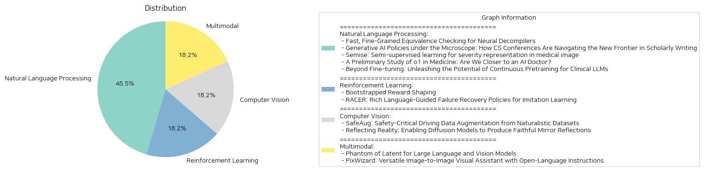

# Daily Artificial Intelligence Insights : Papers

## Natural Language Processing

**요약:**

**요약 보고서**

최근 인공지능(AI) 및 기계 학습(ML) 분야에서 다양한 연구가 진행되고 있습니다. 이 보고서는 5개의 논문에 대한 요약을 제공하며, 각 논문은 인공지능 및 기계 학습의 새로운 기술과 응용에 대한 내용을 다룹니다.

**1. 신경망 디컴파일러의 빠른 등가성 검사**

첫 번째 논문은 신경망 디컴파일러의 등가성 검사에 대한 새로운 기술을 제시합니다. 기존의 등가성 검사 방법은 신경망 디컴파일러의 예측 결과의 정확성을 평가하는 데 한계가 있었습니다. 이 논문에서는 codealign라는 새로운 기술을 제시하여 신경망 디컴파일러의 예측 결과의 정확성을 평가하는 데 도움이 됩니다.

**2. 컴퓨터 과학 학회에서 생성적 AI 정책**

두 번째 논문은 컴퓨터 과학 학회에서 생성적 AI 정책에 대한 현황을 조사하고 정책 수립을 위한 지침을 제공합니다. 생성적 AI는 학술 논문 작성에 새로운 가능성을 열어주고 있지만, 이를 위한 정책이 필요합니다.

**3. 의료 이미지에서 중간 학습을 위한 SEMISE**

세 번째 논문은 의료 이미지에서 중간 학습을 위한 새로운 방법을 제시합니다. SEMISE는 자기 지도 학습과 지도 학습을 결합하여 데이터 부족 문제를 해결하고, 인코더의 기능을 향상시킵니다. 이 방법은 분류와 분할 작업에서 기존 방법보다 우수한 성능을 보여주었습니다.

**4. 의료 분야에서 o1의 잠재력**

네 번째 논문은 의료 분야에서 o1의 잠재력을 조사합니다. o1은 내부화된 사고 체인 기술을 사용하여 강화 학습 전략을 구현한 첫 번째 대형 언어 모델입니다. 이 논문에서는 o1의 의료 분야에서의 성능을 평가하고, 이해, 추론, 다국어 능력 등 3가지 측면에서 분석합니다.

**5. 임상용 대형 언어 모델의 지속적인 사전 훈련**

다섯 번째 논문은 임상용 대형 언어 모델의 지속적인 사전 훈련에 대한 연구를 제공합니다. 이 논문에서는 4가지 기술을 사용하여 대형 언어 모델을 임상용으로 적응시키는 방법을 평가합니다. 지속적인 사전 훈련은 대형 언어 모델의 성능을 향상시키는 데 도움이 됩니다.

**결론**

이 보고서는 인공지능 및 기계 학습 분야에서 다양한 연구를 요약합니다. 각 논문은 새로운 기술과 응용에 대한 내용을 다룹니다. 이 연구들은 인공지능 및 기계 학습의 잠재력을 보여주고, 의료 분야와 같은 다양한 분야에서 응용될 수 있습니다. 그러나 이러한 기술의 개발과 응용에는まだ 많은 과제가 남아 있습니다.

**출처:**

 - Fast, Fine-Grained Equivalence Checking for Neural Decompilers (https://deeplearn.org/arxiv/566267/fast,-fine-grained-equivalence-checking-for-neural-decompilers)
 - Generative AI Policies under the Microscope: How CS Conferences Are Navigating the New Frontier in Scholarly Writing (https://deeplearn.org/arxiv/566273/generative-ai-policies-under-the-microscope:-how-cs-conferences-are-navigating-the-new-frontier-in-scholarly-writing)
 - Semise: Semi-supervised learning for severity representation in medical image (https://deeplearn.org/arxiv/565418/semise:-semi-supervised-learning-for-severity-representation-in-medical-image)
 - A Preliminary Study of o1 in Medicine: Are We Closer to an AI Doctor? (http://arxiv.org/abs/2409.15277v1)
 - Beyond Fine-tuning: Unleashing the Potential of Continuous Pretraining for Clinical LLMs (http://arxiv.org/abs/2409.14988v1)

## Reinforcement Learning

**요약:**

**요약 보고서**

**강화 학습 및 로봇 제어 분야의 최근 연구 동향**

최근 강화 학습 및 로봇 제어 분야에서 두 가지 중요한 연구가 발표되었습니다. 이 보고서는 두 연구의 주요 내용을 요약하고, 그에 따른 영향과 향후 발전 가능성을 분석합니다.

**1. Bootstrapped Reward Shaping**

첫 번째 연구는 "Bootstrapped Reward Shaping"이라는 제목으로, 강화 학습에서 희박한 보상 환경에서 보상 정보를 관찰하기 위한 새로운 방법을 제안합니다. 기존의 "Potential-Based Reward Shaping" (PBRS) 방법은 보상 정보를 더 자주 관찰할 수 있도록 해주지만, 이는 작업에 따라 달라지는 잠재 함수를 설계해야 하는 문제가 있습니다. 이 연구에서는 "Bootstrapped" 방법을 제안하여, 에이전트의 현재 상태-가치 함수를 잠재 함수로 사용합니다. 이 방법은 표 형태의 환경에서 수렴을 보장하며, 심층 강화 학습에서 훈련 동작에 대한 통찰력을 제공합니다. 또한, Atari 게임에서 훈련 속도를 개선하는 것으로 나타났습니다.

**2. RACER: Rich Language-Guided Failure Recovery Policies for Imitation Learning**

두 번째 연구는 "RACER: Rich Language-Guided Failure Recovery Policies for Imitation Learning"이라는 제목으로, 로봇 제어에서 실패 복구를 위한 새로운 방법을 제안합니다. 기존의 방법은 실패 복구를 위한 자체 메커니즘이 부족하고, 언어 지시가 제한적이라는 문제가 있습니다. 이 연구에서는 실패 복구 데이터와 세부적인 언어 주석을 자동으로 생성하는 파이프라인을 제안합니다. 또한, Rich languAge-guided failure reCovERy (RACER)라는 프레임워크를 제안하여, 실패 복구 데이터와 언어 설명을 결합하여 로봇 제어를 향상합니다. RACER는 시각-언어 모델 (VLM)과 언어 조건부 시각-운동 정책을 사용하여, 오류 수정과 작업 실행을 위한 언어 지시를 제공합니다. 실험 결과, RACER는 기존의 Robotic View Transformer (RVT)보다 RLbench에서 다양한 평가 환경에서 우수한 성능을 보였습니다.

**결론 및 향후 발전 가능성**

두 연구는 강화 학습 및 로봇 제어 분야에서 새로운 방법을 제안하여, 보상 정보를 관찰하고 실패 복구를 위한 자체 메커니즘을 제공합니다. 이러한 방법은 훈련 속도와 성능을 개선할 수 있으며, 향후 로봇 제어와 강화 학습 분야에서 중요한 역할을 할 것으로 예상됩니다. 또한, 이러한 연구는 인간-로봇 상호 작용과 언어 지시를 위한 새로운 가능성을 열어주며, 향후 연구에서 이러한 주제를 더 깊이 탐구할 수 있을 것입니다.

**출처:**

 - Bootstrapped Reward Shaping (https://deeplearn.org/arxiv/564048/bootstrapped-reward-shaping)
 - RACER: Rich Language-Guided Failure Recovery Policies for Imitation Learning (http://arxiv.org/abs/2409.14674v1)

## Computer Vision

**요약:**

**요약 보고서**

최근에 발표된 두 개의 논문은 컴퓨터 비전과 인공지능 분야에서 중요한 문제를 해결하기 위한 새로운 접근 방식을 제시하고 있습니다. 이 보고서는 두 논문의 주요 내용을 요약하고, 추출된 정보를 분석하여 주요 주제와 패턴을 식별하고, 향후 발전 방향을 제시합니다.

**주제 1: 안전한 자율 주행 데이터 증강**

첫 번째 논문은 자율 주행 알고리즘 개발을 위한 안전한 주행 데이터 증강 방법을 제시합니다. 현재의 접근 방식은 시뮬레이션 또는 인공적으로 생성된 이미지에 의존하지만, 이러한 이미지들은 자연스러운 데이터와의 차이를 보입니다. 이 논문에서는 자연스러운 데이터셋에서 안전한 주행 데이터를 증강하기 위한 새로운 프레임워크를 제안합니다. 이 프레임워크는 YOLOv5를 사용하여 차량을 감지하고, 깊이 추정과 3D 변환을 통해 차량의 근접성과 위험한 상황을 시뮬레이션합니다. 이러한 방법은 안전한 주행 데이터를 생성할 수 있으며, 이미지의 진실성을 유지할 수 있습니다.

**주제 2: 미러 리플렉션 생성**

두 번째 논문은 미러 리플렉션 생성 문제를 해결하기 위한 새로운 접근 방식을 제시합니다. 이 논문에서는 미러 리플렉션 생성을 이미지 인페인팅 문제로 정의하고, 사용자가 미러의 위치를 제어할 수 있도록 합니다. 이를 위해 SynMirror라는 대규모 데이터셋을 생성하였으며, 이 데이터셋은 다양한 합성 장면과 객체를 포함합니다. 이 논문에서는 MirrorFusion이라는 새로운 방법을 제안하여, 입력 이미지와 미러 영역을 표시하는 마스크를 사용하여 고품질의 미러 리플렉션을 생성할 수 있습니다.

**추출된 정보**

두 논문에서 추출된 주요 정보는 다음과 같습니다.

* 안전한 자율 주행 데이터 증강 방법
* 미러 리플렉션 생성 방법
* 이미지 인페인팅 문제 정의
* 대규모 데이터셋 생성
* 고품질의 미러 리플렉션 생성

**패턴과 주제**

두 논문에서 식별된 주요 패턴과 주제는 다음과 같습니다.

* 컴퓨터 비전과 인공지능 분야에서 데이터 증강과 생성의 중요성
* 안전한 자율 주행 알고리즘 개발을 위한 데이터의 필요성
* 미러 리플렉션 생성의 중요성과 어려움
* 대규모 데이터셋의 필요성

**향후 발전 방향**

두 논문에서 제시된 방법과 결과를 바탕으로, 향후 발전 방향은 다음과 같습니다.

* 안전한 자율 주행 데이터 증강 방법의 확장과 응용
* 미러 리플렉션 생성 방법의 확장과 응용
* 대규모 데이터셋의 생성과 활용
* 컴퓨터 비전과 인공지능 분야에서 데이터 증강과 생성의 중요성에 대한 연구의 지속

**결론**

두 논문은 컴퓨터 비전과 인공지능 분야에서 중요한 문제를 해결하기 위한 새로운 접근 방식을 제시하고 있습니다. 이 보고서는 두 논문의 주요 내용을 요약하고, 추출된 정보를 분석하여 주요 주제와 패턴을 식별하고, 향후 발전 방향을 제시합니다.

**출처:**

 - SafeAug: Safety-Critical Driving Data Augmentation from Naturalistic Datasets (https://deeplearn.org/arxiv/565284/safeaug:-safety-critical-driving-data-augmentation-from-naturalistic-datasets)
 - Reflecting Reality: Enabling Diffusion Models to Produce Faithful Mirror Reflections (http://arxiv.org/abs/2409.14677v1)

## Multimodal

**요약:**

**요약 보고서**

최근 대규모 언어 및 비전 모델(LLVMs)의 발전은 시각적 지시 튜닝의 성공에 힘입어 가속화되고 있습니다. 이러한 모델의 크기는 26B, 34B, 80B 파라미터에 이르기까지 크게 증가했으며, 이는 상당한 성능 향상을 가져왔습니다. 그러나 이러한 모델의 크기는 하드웨어 자원에 대한 요구를 크게 증가시켰습니다. 따라서 효율적인 LLVMs의 필요성이 대두되었습니다.

이러한 필요성을 충족하기 위해, 새로운 효율적인 LLVM 패밀리인 Phantom을 제시했습니다. Phantom은 0.5B, 1.8B, 3.8B, 7B 파라미터의 모델 크기를 가지며, 제한된 구조 내에서 학습 능력을 크게 향상시킵니다. Phantom은 다중 헤드 셀프 어텐션(MHSA)에서 잠재적 은닉 차원을 일시적으로 증가시켜, LLVMs가 더 많은 비전-언어 지식을 학습할 수 있도록 합니다.

또한, PixWizard라는 이미지-이미지 비주얼 어시스턴트를 제시했습니다. PixWizard는 자유로운 언어 지시를 기반으로 이미지 생성, 조작, 번역을 수행할 수 있습니다. 이를 위해, 다양한 비전 작업을 통합된 이미지-텍스트-이미지 생성 프레임워크로 다루고, Omni Pixel-to-Pixel Instruction-Tuning Dataset을 구축했습니다. PixWizard는 Diffusion Transformers(DiT)를 기반 모델로 사용하고, 유연한 해상도 메커니즘을 추가하여 모델이 입력 이미지의 비율에 따라 동적으로 처리할 수 있도록 했습니다.

이러한 모델들은 효율적인 LLVMs의 새로운 표준을 제시하며, 다양한 비전 작업에서 우수한 성능을 보여주었습니다. 이러한 모델의 발전은 미래의 비전-언어 모델 개발에 큰 영향을 미칠 것으로 예상됩니다.

**주요 키워드**

* 대규모 언어 및 비전 모델(LLVMs)
* 효율적인 LLVMs
* Phantom
* PixWizard
* 시각적 지시 튜닝
* 다중 헤드 셀프 어텐션(MHSA)
* Diffusion Transformers(DiT)

**결론**

최근 대규모 언어 및 비전 모델(LLVMs)의 발전은 시각적 지시 튜닝의 성공에 힘입어 가속화되고 있습니다. 이러한 모델의 크기는 크게 증가했으며, 이는 상당한 성능 향상을 가져왔습니다. 그러나 이러한 모델의 크기는 하드웨어 자원에 대한 요구를 크게 증가시켰습니다. 따라서 효율적인 LLVMs의 필요성이 대두되었습니다. Phantom과 PixWizard는 이러한 필요성을 충족하기 위해 제시된 새로운 효율적인 LLVM 패밀리입니다. 이러한 모델들은 효율적인 LLVMs의 새로운 표준을 제시하며, 다양한 비전 작업에서 우수한 성능을 보여주었습니다. 이러한 모델의 발전은 미래의 비전-언어 모델 개발에 큰 영향을 미칠 것으로 예상됩니다.

**출처:**

 - Phantom of Latent for Large Language and Vision Models (http://arxiv.org/abs/2409.14713v1)
 - PixWizard: Versatile Image-to-Image Visual Assistant with Open-Language Instructions (http://arxiv.org/abs/2409.15278v2)

