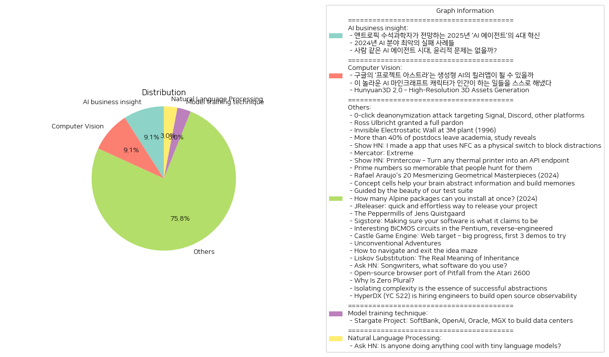

# Daily Artificial Intelligence Insights : News

## AI business insight

**요약:**

**요약 보고서**

**1. 주요 주제**

최근의 뉴스 기사들을 분석한 결과, 인공지능(AI) 기술의 발전과 그에 따른 사회적 영향이 주요 주제로 나타났습니다. 특히, AI 에이전트의 발전과 그에 따른 윤리적 문제, AI 기술의 실패 사례 등이 주요 주제로 등장했습니다.

**2. 주요 사건**

* 2025년 AI 에이전트의 4대 혁신: 앤트로픽 수석과학자가 전망하는 2025년 AI 에이전트의 발전은 산업 전반에 걸쳐 유용성과 영향력을 확대해 나갈 전망입니다.
* 2024년 AI 분야 최악의 실패 사례: 불법적인 조언을 제공하는 챗봇부터 AI가 생성한 엉터리 검색 결과까지, 2024년 한 해 동안 AI 분야에서 벌어졌던 최악의 실패 사례를 살펴보았습니다.
* 사람 같은 AI 에이전트 시대: AI가 인간의 성격을 흉내 내고 대신해서 행동까지 할 수 있는 시대가 다가오고 있습니다. 그 전에 논의해야 할 윤리적인 문제들을 짚어보았습니다.

**3. 영향 분석**

* 경제: AI 기술의 발전은 산업 전반에 걸쳐 효율성을 높이고 생산성을 향상시킬 수 있습니다. 그러나 AI 기술의 실패 사례는 경제적 손실을 초래할 수 있습니다.
* 정치: AI 기술의 발전은 정치 분야에서도 영향을 미칠 수 있습니다. 예를 들어, AI를 활용한 선거 캠페인이 정치 현안에 영향을 미칠 수 있습니다.
* 사회: AI 기술의 발전은 사회 전반에 걸쳐 영향을 미칠 수 있습니다. 예를 들어, AI를 활용한 교육 시스템은 교육의 질을 향상시킬 수 있습니다. 그러나 AI 기술의 실패 사례는 사회적 문제를 초래할 수 있습니다.
* 환경: AI 기술의 발전은 환경 분야에서도 영향을 미칠 수 있습니다. 예를 들어, AI를 활용한 에너지 관리 시스템은 에너지 효율성을 향상시킬 수 있습니다.

**4. 최종 요약**

최근의 뉴스 기사들을 분석한 결과, AI 기술의 발전과 그에 따른 사회적 영향이 주요 주제로 나타났습니다. AI 에이전트의 발전과 그에 따른 윤리적 문제, AI 기술의 실패 사례 등이 주요 주제로 등장했습니다. 이러한 기술의 발전은 경제, 정치, 사회, 환경 등 다양한 분야에 영향을 미칠 수 있습니다. 따라서, 이러한 기술의 발전을 주시하고, 그에 따른 사회적 영향에 대한 논의가 필요합니다. 또한, 이러한 기술의 발전을 통해 사회적 문제를 해결하고, 인간의 삶의 질을 향상시키는 데에 기여할 수 있습니다.

**출처:**

 - 앤트로픽 수석과학자가 전망하는 2025년 ‘AI 에이전트’의 4대 혁신 (https://www.technologyreview.kr/%ec%95%a4%ed%8a%b8%eb%a1%9c%ed%94%bd-%ec%88%98%ec%84%9d%ea%b3%bc%ed%95%99%ec%9e%90%ea%b0%80-%ec%a0%84%eb%a7%9d%ed%95%98%eb%8a%94-2025%eb%85%84-ai-%ec%97%90%ec%9d%b4%ec%a0%84%ed%8a%b8/)
 - 2024년 AI 분야 최악의 실패 사례들 (https://www.technologyreview.kr/2024%eb%85%84-ai-%eb%b6%84%ec%95%bc-%ec%b5%9c%ec%95%85%ec%9d%98-%ec%8b%a4%ed%8c%a8-%ec%82%ac%eb%a1%80%eb%93%a4/)
 - 사람 같은 AI 에이전트 시대, 윤리적 문제는 없을까? (https://www.technologyreview.kr/%ec%82%ac%eb%9e%8c-%ea%b0%99%ec%9d%80-ai-%ec%97%90%ec%9d%b4%ec%a0%84%ed%8a%b8-%ec%8b%9c%eb%8c%80-%ec%9c%a4%eb%a6%ac%ec%a0%81-%eb%ac%b8%ec%a0%9c%eb%8a%94-%ec%97%86%ec%9d%84%ea%b9%8c/)

## Computer Vision

**요약:**

**요약 보고서**

**1. 주요 주제**

다음은 여러 뉴스 기사에서 추출한 주요 주제입니다.

* 인공지능(AI)의 발전과 응용
* 생성형 AI의 가능성과 잠재력
* AI 기술의 다양한 분야에서의 적용 (예: 게임, 그래픽스 등)

**2. 주요 사건**

다음은 각 뉴스 기사에서 추출한 주요 사건입니다.

* 구글 딥마인드의 제미나이 2.0 출시: AI 에이전트의 신세계를 열어줄 것으로 기대되는 신제품
* 마인크래프트 내에서 진행된 실험: 대형언어모델 기반의 AI 에이전트 수백 개가 자발적으로 친구를 사귀고, 직업을 만들고, 종교를 전파했다
* Hunyuan3D 2.0 출시: 고해상도 3D 자산 생성 시스템

**3. 영향 분석**

다음은 이러한 사건의 영향을 분석한 결과입니다.

* 경제: AI 기술의 발전은 다양한 산업에서 자동화와 효율성을 높일 수 있을 것으로 기대됨. 이는 새로운 비즈니스 모델과 기회를 창출할 수 있을 것입니다.
* 정치: AI 기술의 발전은 사회적 및 정치적 문제를 해결하는 데 사용될 수 있을 것입니다. 예를 들어, AI를 사용하여 의사결정을 지원하거나, 사회적 문제를 예측하고 해결하는 데 사용할 수 있습니다.
* 환경: AI 기술의 발전은 환경 문제를 해결하는 데 사용될 수 있을 것입니다. 예를 들어, AI를 사용하여 에너지 소비를 줄이거나, 재활용을 증가시키는 데 사용할 수 있습니다.
* 사회: AI 기술의 발전은 사회적 문제를 해결하는 데 사용될 수 있을 것입니다. 예를 들어, AI를 사용하여 교육을 개선하거나, 의료 서비스를 향상시키는 데 사용할 수 있습니다.

**4. 최종 요약**

최근의 뉴스 기사에서 AI 기술의 발전과 응용에 대한 다양한 주제가 다루어졌습니다. 구글 딥마인드의 제미나이 2.0 출시, 마인크래프트 내에서 진행된 실험, Hunyuan3D 2.0 출시 등이 이러한 주제를 대표합니다. 이러한 사건의 영향은 경제, 정치, 환경, 사회 등 다양한 분야에서 나타날 수 있을 것으로 기대됩니다. 향후 이러한 기술의 발전을 주시하고, 다양한 분야에서 적용될 수 있는 잠재력을 탐색하는 것이 중요할 것입니다.

**출처:**

 - 구글의 ‘프로젝트 아스트라’는 생성형 AI의 킬러앱이 될 수 있을까 (https://www.technologyreview.kr/%ea%b5%ac%ea%b8%80%ec%9d%98-%ed%94%84%eb%a1%9c%ec%a0%9d%ed%8a%b8-%ec%95%84%ec%8a%a4%ed%8a%b8%eb%9d%bc%eb%8a%94-%ec%83%9d%ec%84%b1%ed%98%95-ai%ec%9d%98-%ed%82%ac%eb%9f%ac%ec%95%b1%ec%9d%b4/)
 - 이 놀라운 AI 마인크래프트 캐릭터가 인간이 하는 일들을 스스로 해냈다 (https://www.technologyreview.kr/ai-%eb%a7%88%ec%9d%b8%ed%81%ac%eb%9e%98%ed%94%84%ed%8a%b8-%ec%ba%90%eb%a6%ad%ed%84%b0%ea%b0%80-%ec%9d%b8%ea%b0%84%ec%9d%b4-%ed%95%98%eb%8a%94-%ec%9d%bc%eb%93%a4%ec%9d%84-%ec%8a%a4%ec%8a%a4%eb%a1%9c/)
 - Hunyuan3D 2.0 – High-Resolution 3D Assets Generation (https://github.com/Tencent/Hunyuan3D-2)

## Model training technique

**요약:**

**1. 주요 주제 (Key Themes)**

- 인공지능 (AI) 기반 데이터 센터 구축
- 미국의 AI 인프라 투자
- 글로벌 기업의 협력 및 투자
- 기술 발전과 경제 성장

**2. 주요 사건 (Major Events)**

- 트럼프 대통령은 오픈AI, 오라클, 소프트뱅크와 함께 스타게이트 프로젝트를 발표하였습니다. 이 프로젝트는 미국 텍사스에 데이터 센터와 전력 발전소를 건설하기 위해 최대 500억 달러를 투자할 계획입니다. 초기 투자는 100억 달러로 예정되어 있습니다.

**3. 영향 분석 (Impact Analysis)**

- **경제**: 스타게이트 프로젝트는 미국의 AI 인프라를 강화하고, 새로운 일자리를 창출하며, 경제 성장을 촉진할 것으로 예상됩니다. 또한, 이 프로젝트는 미국의 기술 산업을 선도하는 글로벌 기업들의 투자를 유치할 것으로 기대됩니다.
- **정치**: 이 프로젝트는 미국 정부의 AI 기술 개발과 투자에 대한 강한 의지를 보여줍니다. 이는 미국의 기술 경쟁력 강화와 경제 성장에 긍정적인 영향을 미칠 것으로 예상됩니다.
- **사회**: 스타게이트 프로젝트는 미국의 기술 산업 발전에 기여할 것으로 기대됩니다. 또한, 이 프로젝트는 새로운 일자리 창출과 지역 경제 활성화에 긍정적인 영향을 미칠 것으로 예상됩니다.
- **환경**: 데이터 센터와 전력 발전소의 건설은 환경에 미치는 영향을 고려해야 합니다. 이 프로젝트는 환경에 미치는 영향을 최소화하기 위한 적절한 대책을 마련해야 할 것입니다.

**4. 최종 요약 (Final Summary)**

스타게이트 프로젝트는 미국의 AI 인프라를 강화하고, 기술 산업 발전에 기여할 것으로 기대됩니다. 이 프로젝트는 미국의 경제 성장과 기술 경쟁력 강화에 긍정적인 영향을 미칠 것으로 예상됩니다. 그러나, 이 프로젝트는 환경에 미치는 영향을 고려해야 하며, 적절한 대책을 마련해야 할 것입니다. 향후, 이 프로젝트의 진행 상황과 결과를 주시해야 할 것입니다.

**출처:**

 - Stargate Project: SoftBank, OpenAI, Oracle, MGX to build data centers (https://apnews.com/article/trump-ai-openai-oracle-softbank-son-altman-ellison-be261f8a8ee07a0623d4170397348c41)

## Natural Language Processing

**요약:**

**요약 보고서**

**1. 주요 주제**

다음은 여러 뉴스 기사에서 추출한 주요 주제입니다.

* 인공지능 및 언어 모델의 발전
* 코드 작성 및 자동화
* 인공지능의 다양한 응용 분야

**2. 주요 사건**

다음은 뉴스 기사에서 추출한 주요 사건입니다.

* 사용자는 대형 언어 모델을 코드 작성에 활용하고 있으며, Llama 3.2와 Llama 3.3를 사용하여 코드 익명화를 수행하고 있습니다.
* 사용자는 또한 작은 언어 모델을 bash 명령어 생성에 활용하고 있습니다.

**3. 영향 분석**

다음은 주요 사건의 영향 분석입니다.

* 경제: 인공지능 및 언어 모델의 발전은 자동화 및 효율성 향상을 통해 경제에 긍정적인 영향을 미칠 수 있습니다.
* 정치: 인공지능의 발전은 개인 정보 보호 및 보안에 대한 우려를 증가시킬 수 있습니다.
* 환경: 인공지능의 발전은 에너지 소비 및 환경에 미치는 영향에 대한 연구가 필요합니다.
* 사회: 인공지능의 발전은 직업 시장 및 사회 구조에 영향을 미칠 수 있습니다.

**4. 최종 요약**

인공지능 및 언어 모델의 발전은 다양한 분야에서 긍정적인 영향을 미칠 수 있습니다. 그러나 개인 정보 보호 및 보안에 대한 우려도 증가하고 있습니다. 인공지능의 발전은 직업 시장 및 사회 구조에 영향을 미칠 수 있으므로, 이러한 기술의 발전을 주시하고 적절한 대책을 마련해야 합니다. 또한, 인공지능의 발전은 에너지 소비 및 환경에 미치는 영향에 대한 연구가 필요합니다.

**출처:**

 - Ask HN: Is anyone doing anything cool with tiny language models? (https://news.ycombinator.com/item?id=42784365)

