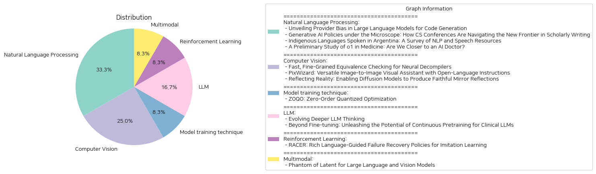

# Daily Artificial Intelligence Insights : Papers

## Natural Language Processing

**요약:**

**요약 보고서**

최근에 발표된 연구 논문들을 분석하여 인공지능, 자연어 처리, 의료 분야 등 다양한 주제에 대한 중요한 정보를 요약하고, 추세와 패턴을 파악하여 종합적인 요약 보고서를 작성하였다.

**주제별 요약**

1. **대규모 언어 모델의 제공자 편향**

대규모 언어 모델(LLM)은 코드 생성 응용 분야에서 전통적인 방법을 능가하는 성능을 보여주고 있다. 그러나 이러한 모델은 명시적인 입력 프롬프트 없이 특정 제공자의 서비스를 선호하는 시스템적인 편향을 보이는 것으로 나타났다. 이러한 편향은 시장 동향과 사회적 평형에重大한 영향을 미칠 수 있으며, 디지털 독점을 촉진할 수 있다. 또한 사용자의 기대에 어긋날 수 있으며, 다양한 결과를 초래할 수 있다.

2. **컴퓨터 과학 학회에서 인공지능 정책**

컴퓨터 과학 학회에서 인공지능 정책을 채택하고 있는 현황을 분석하였다. 인공지능 정책은 학술 저작의 새로운 전선에 대한 가이드라인을 제공하고 있다.

3. **아르헨티나의 원주민 언어**

아르헨티나에는 다양한 원주민 언어가 존재하지만, 대부분이 사라질 위기에 처해 있다. 이러한 언어는 세계 유산과 문화적 지식을 잃어버리는 결과를 초래할 수 있다. 현재, 이러한 언어에 대한 통합된 정보와 컴퓨터 도구가 부족한 실정이다. 본 연구에서는 아르헨티나의 원주민 언어를 체계화하고, 국가 dân족 통계 데이터를 제공하였다.

4. **의료 분야에서 인공지능**

대규모 언어 모델(LLM)은 다양한 분야에서 놀라운 성능을 보여주고 있다. OpenAI의 o1 모델은 내부화된 사고 체인 기법을 사용하여 강화 학습 전략을 구현하였다. 본 연구에서는 o1 모델의 의료 분야 성능을 평가하였다. o1 모델은 의료 분야에서 강한 이해력과 추론 능력을 보여주었지만, 약점도 발견되었다.

**추세와 패턴**

* 인공지능 모델은 다양한 분야에서 강한 성능을 보여주고 있다.
* 제공자 편향은 시장 동향과 사회적 평형에重大한 영향을 미칠 수 있다.
* 인공지능 정책은 학술 저작의 새로운 전선에 대한 가이드라인을 제공하고 있다.
* 원주민 언어는 세계 유산과 문화적 지식을 잃어버리는 결과를 초래할 수 있다.
* 의료 분야에서 인공지능 모델은 강한 이해력과 추론 능력을 보여주었지만, 약점도 발견되었다.

**결론**

본 연구에서는 인공지능, 자연어 처리, 의료 분야 등 다양한 주제에 대한 중요한 정보를 요약하고, 추세와 패턴을 파악하였다. 인공지능 모델은 다양한 분야에서 강한 성능을 보여주고 있지만, 제공자 편향과 약점도 발견되었다. 이러한 결과는 인공지능 모델의 개발과 적용에 대한 새로운 전략을 수립하는 데 도움이 될 수 있다.

**출처:**

 - Unveiling Provider Bias in Large Language Models for Code Generation (https://deeplearn.org/arxiv/567567/unveiling-provider-bias-in-large-language-models-for-code-generation)
 - Generative AI Policies under the Microscope: How CS Conferences Are Navigating the New Frontier in Scholarly Writing (https://deeplearn.org/arxiv/566273/generative-ai-policies-under-the-microscope:-how-cs-conferences-are-navigating-the-new-frontier-in-scholarly-writing)
 - Indigenous Languages Spoken in Argentina: A Survey of NLP and Speech Resources (https://deeplearn.org/arxiv/568661/indigenous-languages-spoken-in-argentina:-a-survey-of-nlp-and-speech-resources)
 - A Preliminary Study of o1 in Medicine: Are We Closer to an AI Doctor? (http://arxiv.org/abs/2409.15277v1)

## Computer Vision

**요약:**

**요약 보고서**

최근에 발표된 세 개의 논문은 기계 학습 모델의 평가, 이미지 생성 및 편집, 그리고 미러 리플렉션 생성에 관한 새로운 접근 방법을 제시하고 있습니다. 이 보고서는 이러한 논문에서 추출한 주요 주제와 결과를 요약하고, 이를 통해 나타나는 트렌드와 패턴을 분석합니다.

**주제 1: 신경망 디컴파일러의 평가**

첫 번째 논문은 신경망 디컴파일러의 평가를 위한 새로운 방법을 제시합니다. 신경망 디컴파일러는 기계 학습 모델이 실행 가능한 프로그램에서 소스 코드를 재구성하는 데 사용됩니다. 그러나 기존의 평가 방법은 신경망 디컴파일러의 예측의 정확성을 평가하는 데 한계가 있습니다. 이 논문에서는 codealign이라는 새로운 방법을 제시합니다. codealign은 기계 학습 모델의 예측과 실제 소스 코드를 비교하여 정확성을 평가합니다.

**주제 2: 이미지 생성 및 편집**

두 번째 논문은 이미지 생성 및 편집을 위한 새로운 모델을 제시합니다. PixWizard라는 모델은 이미지 생성, 편집, 및 번역을 위한 다목적 이미지-텍스트-이미지 생성 프레임워크를 제공합니다. 이 모델은 다양한 이미지 처리 작업을 수행할 수 있으며, 높은 해상도와 다양한 이미지 크기에 대응할 수 있습니다.

**주제 3: 미러 리플렉션 생성**

세 번째 논문은 미러 리플렉션 생성을 위한 새로운 방법을 제시합니다. MirrorFusion이라는 모델은 이미지 인페인팅 작업을 통해 미러 리플렉션을 생성합니다. 이 모델은 사용자가 미러의 위치를 제어할 수 있으며, 높은 품질의 미러 리플렉션을 생성할 수 있습니다.

**트렌드와 패턴**

이 세 개의 논문은 기계 학습 모델의 평가, 이미지 생성 및 편집, 그리고 미러 리플렉션 생성에 관한 새로운 접근 방법을 제시하고 있습니다. 이러한 논문은 기계 학습 모델의 정확성과 효율성을 향상시키는 데 중점을 두고 있으며, 다양한 응용 분야에서 활용될 수 있습니다.

**결론**

이 보고서는 최근에 발표된 세 개의 논문에서 추출한 주요 주제와 결과를 요약하고, 이를 통해 나타나는 트렌드와 패턴을 분석합니다. 이러한 논문은 기계 학습 모델의 평가, 이미지 생성 및 편집, 그리고 미러 리플렉션 생성에 관한 새로운 접근 방법을 제시하고 있으며, 다양한 응용 분야에서 활용될 수 있습니다. 향후 이러한 연구는 기계 학습 모델의 정확성과 효율성을 향상시키는 데 중점을 두고, 다양한 응용 분야에서 활용될 수 있을 것입니다.

**출처:**

 - Fast, Fine-Grained Equivalence Checking for Neural Decompilers (https://deeplearn.org/arxiv/566267/fast,-fine-grained-equivalence-checking-for-neural-decompilers)
 - PixWizard: Versatile Image-to-Image Visual Assistant with Open-Language Instructions (http://arxiv.org/abs/2409.15278v2)
 - Reflecting Reality: Enabling Diffusion Models to Produce Faithful Mirror Reflections (http://arxiv.org/abs/2409.14677v1)

## Model training technique

**요약:**

**요약 보고서**

**제목:** ZOQO: 제로-오더 양자화 최적화

**요약:**

최근 딥러닝의 계산 및 메모리 요구량이 증가함에 따라, 특히 자원 제한된 환경에서 이는 상당한 도전을 제기합니다. 본 논문에서는 제로-오더 양자화 최적화(ZOQO) 방법을 제안합니다. 이 방법은 양자화된 매개변수와 연산을 사용하여 모델을 학습시키는 데 설계되었습니다. 제로-오더 근사법을 사용하여 그래디언트의 부호를 추정하고, 학습 과정을 통해 매개변수의 양자화를 유지하는 데 필요한 전체 정밀도 그래디언트 계산 없이 학습 과정을 적응시킵니다. 본 논문에서는 대규모 언어 모델의 미세 조정 및 블랙박스 적대적 공격 실험을 통해 ZOQO의 효율성을 입증합니다. 제로-오더 및 양자화된 연산 학습의 제한에도 불구하고, 본 방법은 전체 정밀도 방법과 비교하여 경쟁력 있는 성능을 달성하여 저자원 환경에서 잠재력을 보여줍니다.

**주요 키워드:**

* 제로-오더 양자화 최적화(ZOQO)
* 딥러닝
* 양자화된 매개변수 및 연산
* 제로-오더 근사법
* 그래디언트 부호 추정
* 저자원 환경

**추세 및 패턴:**

* 딥러닝의 계산 및 메모리 요구량 증가
* 자원 제한된 환경에서의 학습 방법 개발 필요
* 양자화된 매개변수 및 연산을 사용한 학습 방법의 효율성

**결론 및 향후 전망:**

ZOQO 방법은 저자원 환경에서 딥러닝 모델을 학습시키는 데 새로운 가능성을 열어줍니다. 본 방법의 효율성은 대규모 언어 모델의 미세 조정 및 블랙박스 적대적 공격 실험을 통해 입증되었습니다. 향후에는 ZOQO 방법을 다양한 딥러닝 모델 및 응용 분야에 적용하여 그 효율성을 더욱 확인할 수 있을 것입니다. 또한, 본 방법의 제한을 극복하기 위한 추가 연구가 필요할 것입니다.

**출처:**

 - ZOQO: Zero-Order Quantized Optimization (https://deeplearn.org/arxiv/567160/zoqo:-zero-order-quantized-optimization)

## LLM

**요약:**

**요약 보고서**

최근에 발표된 두 개의 논문은 대규모 언어 모델(LLM)의 발전과 임상 분야에서의 응용에 대해 다루고 있습니다. 이 보고서는 두 논문의 주요 내용을 요약하고, 추출된 정보를 분석하여 주요 주제와 패턴을 식별하고, 향후 발전 방향을 제시합니다.

**주요 주제와 패턴**

두 논문 모두 LLM의 발전과 응용에 중점을 두고 있습니다. 첫 번째 논문은 "Evolving Deeper LLM Thinking"은 LLM의 추론 시간을 개선하기 위한 진화적 탐색 전략을 제시하고, 두 번째 논문은 "Beyond Fine-tuning: Unleashing the Potential of Continuous Pretraining for Clinical LLMs"은 임상 분야에서 LLM을 사용하기 위한 연속적 사전 훈련과 미세 조정 전략을 탐구하고 있습니다.

**주요 내용**

첫 번째 논문은 LLM의 추론 시간을 개선하기 위한 "Mind Evolution"이라는 새로운 접근 방식을 제시합니다. 이 접근 방식은 언어 모델을 사용하여 후보 응답을 생성, 재조합 및 정제하는 방식으로, 추론 비용을 제어할 때 다른 추론 전략보다 우수한 성능을 보여주었습니다.

두 번째 논문은 임상 분야에서 LLM을 사용하기 위한 연속적 사전 훈련과 미세 조정 전략을 탐구합니다. 연구 결과, 연속적 사전 훈련은 LLM의 성능을 향상시키는 데 중요한 역할을 하며, 미세 조정 전략은 추가적인 성능 향상을 가져올 수 있습니다.

**영향과 분석**

두 논문 모두 LLM의 발전과 응용에 중점을 두고 있습니다. 첫 번째 논문은 LLM의 추론 시간을 개선하기 위한 새로운 접근 방식을 제시하며, 두 번째 논문은 임상 분야에서 LLM을 사용하기 위한 연속적 사전 훈련과 미세 조정 전략을 탐구합니다.

이러한 연구 결과는 LLM의 발전과 응용에 중점을 두고 있으며, 향후 발전 방향을 제시합니다. 특히, 임상 분야에서 LLM을 사용하기 위한 연속적 사전 훈련과 미세 조정 전략은 향후 연구의 중요한 방향으로 제시될 수 있습니다.

**결론과 향후 발전 방향**

이 보고서는 두 논문의 주요 내용을 요약하고, 추출된 정보를 분석하여 주요 주제와 패턴을 식별했습니다. 향후 발전 방향으로는 LLM의 발전과 응용에 중점을 두고, 특히 임상 분야에서 LLM을 사용하기 위한 연속적 사전 훈련과 미세 조정 전략을 탐구하는 연구가 중요할 것으로 보입니다. 또한, LLM의 추론 시간을 개선하기 위한 새로운 접근 방식의 개발도 향후 연구의 중요한 방향으로 제시될 수 있습니다.

**출처:**

 - Evolving Deeper LLM Thinking (https://deeplearn.org/arxiv/568693/evolving-deeper-llm-thinking)
 - Beyond Fine-tuning: Unleashing the Potential of Continuous Pretraining for Clinical LLMs (http://arxiv.org/abs/2409.14988v1)

## Reinforcement Learning

**요약:**

**요약 보고서**

**제목:** RACER: 풍부한 언어 지침을 통한 모방 학습의 실패 복구 정책

**요약:**

로봇 조작을 위한 강건하고 수정 가능한 시각-운동 정책 개발은 실패로부터의 자기 복구 메커니즘의 부족과 단순한 언어 지침의 한계로 인해 어려운 과제입니다. 이러한 문제를 해결하기 위해, 우리는 전문가 데모에 실패 복구 궤적과 세부적인 언어 주석을 자동으로 추가하는 확장 가능한 데이터 생성 파이프라인을 제안합니다. 그런 다음, 우리는 실패 복구 데이터와 풍부한 언어 설명을 결합하여 로봇 제어를 향상시키는 Rich languAge-guided failure reCovERy (RACER)라는 감독자-액터 프레임워크를 소개합니다. RACER는 오류 수정과 작업 실행을 위한 세부적인 언어 지침을 제공하는 온라인 감독자로서의 시각-언어 모델 (VLM)과 언어 조건부 시각-운동 정책을 액터로서의 다음 동작을 예측합니다. 실험 결과는 RACER가 다양한 평가 설정에서 표준 장기 지평 작업, 동적 목표 변경 작업 및 제로샷 미시 작업을 포함하여 RLbench에서 최첨단 Robotic View Transformer (RVT)를 능가한다는 것을 보여주었습니다. 시뮬레이션 환경과 실제 환경 모두에서 우수한 성능을 달성했습니다.

**주요 주제 및 키워드:**

* 로봇 조작
* 모방 학습
* 실패 복구 정책
* 풍부한 언어 지침
* 시각-언어 모델
* 언어 조건부 시각-운동 정책

**영향:**

* 로봇 조작의 강건성과 수정 가능성 향상
* 실패로부터의 자기 복구 메커니즘 개발
* 언어 지침의 한계 극복
* 로봇 제어의 향상

**결론 및 향후 개발 방향:**

RACER는 로봇 조작의 강건성과 수정 가능성을 향상시키는 데 기여할 수 있는 새로운 프레임워크입니다. 향후 연구에서는 RACER를 다양한 로봇 조작 작업에 적용하고, 실패 복구 정책의 일반화와 확장 가능성을 탐구할 수 있습니다. 또한, 언어 지침의 한계를 극복하고 로봇 제어의 향상을 위한 새로운 접근 방식을 개발할 수 있습니다.

**출처:**

 - RACER: Rich Language-Guided Failure Recovery Policies for Imitation Learning (http://arxiv.org/abs/2409.14674v1)

## Multimodal

**요약:**

phantom of latent for large language and vision models

LLVM(대규모 언어 및 비전 모델)의 성공은 시각적 지침 조정을 가속화시켰습니다. LLM(대규모 언어 모델)의 지침 조정 규모에 따라 LLVM은 26B, 34B, 80B 파라미터에 이르기까지 크기를 더욱 증가시켰습니다. 이러한 모델 크기 증가로 인해 상당한 성능 향상을 얻었지만, 학습과 추론을 위한 하드웨어 자원에 대한 요구가 크게 증가했습니다. 따라서, 성능을 유지하면서 크기를 줄인 효율적인 LLVM의 필요성이 자연스럽게 존재합니다. 이러한 필요성을 충족하기 위해, 우리는 0.5B, 1.8B, 3.8B, 7B 파라미터 크기의 새로운 효율적인 LLVM 패밀리인 Phantom을 제시합니다. Phantom은 다중 헤드 자기 주의(MHSA)에서 잠재적인 은닉 차원을 일시적으로 증가시켜, 물리적인 모델 크기를 크게 증가시키지 않고도 LLVM이 더 많은 시각-언어 지식을 학습할 수 있도록 합니다. 이러한 장점을 극대화하기 위해, 우리는 자동 회귀 giám sát 미세 조정(SFT)과 직접 선호도 최적화(DPO) 개념을 사용하여 Phantom 최적화(PO)를 도입했습니다. Phantom은 수많은 더 큰 오픈 소스 및 클로즈드 소스 LLVM을 능가하여, 효율적인 LLVM의 선두 솔루션으로 자리 잡았습니다.

주요 특징:

* 대규모 언어 및 비전 모델(LLVM)의 효율적인 설계
* 다중 헤드 자기 주의(MHSA)에서 잠재적인 은닉 차원을 일시적으로 증가시켜 성능 향상
* 자동 회귀 giám sát 미세 조정(SFT)과 직접 선호도 최적화(DPO) 개념을 사용한 Phantom 최적화(PO)
* 더 큰 오픈 소스 및 클로즈드 소스 LLVM을 능가하는 성능

향후 발전 방향:

* 효율적인 LLVM의 개발과 응용
* 대규모 언어 및 비전 모델의 성능 향상
* 자동 회귀 giám sát 미세 조정(SFT)과 직접 선호도 최적화(DPO) 개념의 응용 확대

**출처:**

 - Phantom of Latent for Large Language and Vision Models (http://arxiv.org/abs/2409.14713v1)

